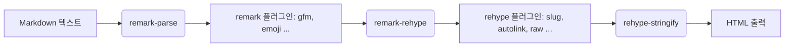
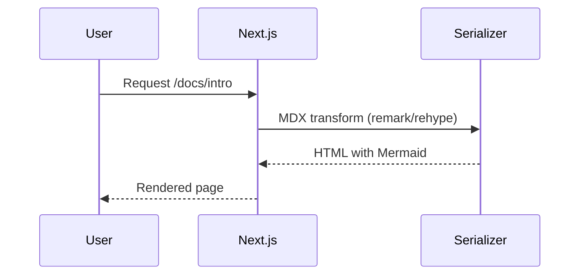

# justin-book 

#### 🧑‍💻 Author **정인근 (Justin)**  
📧 [justin-j@naver.com](mailto:justin-j@naver.com)  
🧾 [note](https://justin-jig.github.io/justin-book)
🏠 [git Profile](https://github.com/justin-jig)

---


#####  패키지 ↔ 역할 요약표

| 그룹          | 패키지                                                                                                                                                                       | 역할                        |
| ----------- | ------------------------------------------------------------------------------------------------------------------------------------------------------------------------- | ------------------------- |
| 타입          | `typescript`, `@types/node`, `@types/react`, `@types/react-dom`                                                                                                           | TS 컴파일 & 타입 정의            |
| 린트          | `eslint`, `@eslint/eslintrc`, `eslint-config-next`                                                                                                                        | 코드 품질/규칙(Next 최적화)        |
| MDX-Next    | `@next/mdx`, `@mdx-js/loader`, `next-mdx-remote`                                                                                                                          | Next에서 MDX 로드/직렬화         |
| Markdown 체인 | `unified`, `remark-parse`, `remark-rehype`, `rehype-stringify`, `unist-util-visit`, `rehype-raw`, `remark-gfm`, `remark-emoji`, `rehype-slug`, `rehype-autolink-headings` | Markdown→HTML 파이프라인/기능 보강 |
| 코드 하이라이트(1) | `rehype-highlight`, `highlight.js`                                                                                                                                        | 간편한 하이라이팅                 |
| 코드 하이라이트(2) | `shiki`, `@leafac/rehype-shiki`                                                                                                                                           | VS Code 테마 기반 고품질 하이라이트   |
| 다이어그램       | `remark-mermaidjs`, `mermaid`                                                                                                                                             | Mermaid 다이어그램 렌더          |
| 메타데이터       | `gray-matter`                                                                                                                                                             | Front-Matter 파싱           |
| 스타일         | `sass`                                                                                                                                                                    | SCSS/Sass                 |
| 테스트         | `playwright`                                                                                                                                                              | E2E 브라우저 테스트              |

---

#### 1) 타입스크립트 & 타입 정의

* **typescript**: TS 컴파일러.
* **@types/node**, **@types/react**, **@types/react-dom**: Node/React 타입 정의.

> 📌 왜?
> Next.js + MDX 환경에서 에디터/빌드 오류를 줄이고, 서버/클라이언트 경계를 타입으로 명확히 하기 위함.

**예시(tsconfig.json 최소값)**

```json
{
  "compilerOptions": {
    "target": "ES2022",
    "module": "ESNext",
    "jsx": "preserve",
    "moduleResolution": "Bundler",
    "strict": true,
    "noEmit": true,
    "types": ["node", "react", "react-dom"]
  }
}
```

---


#### 2) 린팅(ESLint) & Next 룰셋

* **eslint**, **@eslint/eslintrc**: ESLint 코어 및 설정 로더.
* **eslint-config-next**: Next.js 권장 룰 프리셋(React/JSX/Next 규칙 포함).

> 📌 왜?
> MDX/React/Next 코드를 일관되게 유지하고, 빌드 전에 잠재 오류를 잡아줌.

**예시(.eslintrc.js)**

```js
module.exports = {
  root: true,
  extends: ["next/core-web-vitals"],
};
```

---

####  3) MDX 파이프라인(Next 연동 포함)

* **@next/mdx**: Next.js에서 MDX 로더를 연결하는 플러그인.
* **@mdx-js/loader**: Webpack용 MDX 로더.
* **next-mdx-remote**: 파일 시스템/외부 소스의 MDX 문자열을 **서버에서 파싱해 props로 전달**할 때 사용(라우팅/데이터 패칭 유연).

> 📌 왜?
> 문서/블로그/가이드 페이지를 **MDX(마크다운 + JSX)** 로 작성하고, Next(파일/앱 라우터)에서 자연스럽게 소비하기 위해.

**예시(next.config.mjs, App Router 가정)**

```js
import createMDX from "@next/mdx";

const withMDX = createMDX({
  extension: /\.mdx?$/,
});

export default withMDX({
  pageExtensions: ["ts", "tsx", "md", "mdx"],
});
```

**예시(next-mdx-remote 서버 파싱)**

```ts
import { serialize } from "next-mdx-remote/serialize";
import remarkGfm from "remark-gfm";
import rehypeSlug from "rehype-slug";

export async function getMdxSource(md: string) {
  return serialize(md, {
    mdxOptions: {
      remarkPlugins: [remarkGfm],
      rehypePlugins: [rehypeSlug],
    },
  });
}
```

---


#### 4) Markdown → HTML 변환 체인(unified/remark/rehype)

* **unified**: 파서/트랜스포머 파이프라인 프레임워크.
* **remark-parse**: Markdown → mdast 파서.
* **remark-rehype**: mdast(Markdown AST) → hast(HTML AST) 변환.
* **rehype-stringify**: hast → HTML 문자열.
* **unist-util-visit**: AST 순회 유틸(커스텀 트랜스폼 제작 시 사용).
* **rehype-raw**: HTML을 Markdown 내부에서 허용할 때 사용(신뢰된 소스에서만!).
* **rehype-slug**: 헤딩에 id 추가(#앵커 링크용).
* **rehype-autolink-headings**: 헤딩에 자동 앵커 링크(아이콘/텍스트) 삽입.
* **remark-gfm**: GitHub Flavored Markdown(표/체크박스/스트라이크 등).
* **remark-emoji**: `:smile:` 같은 이모지 shortcodes 처리.

> 📌 왜?
> Markdown을 정교하게 HTML로 바꾸고, **헤딩 앵커/이모지/GFM** 등 문서 친화 기능을 쉽게 더하기 위해.

**파이프라인 개념도(mermaid)**



**예시(직접 unified로 처리할 때)**

```ts
import { unified } from "unified";
import remarkParse from "remark-parse";
import remarkGfm from "remark-gfm";
import remarkEmoji from "remark-emoji";
import remarkRehype from "remark-rehype";
import rehypeSlug from "rehype-slug";
import rehypeAutolinkHeadings from "rehype-autolink-headings";
import rehypeStringify from "rehype-stringify";

export async function mdToHtml(md: string) {
  const file = await unified()
    .use(remarkParse)
    .use(remarkGfm)
    .use(remarkEmoji)
    .use(remarkRehype, { allowDangerousHtml: true })
    .use(rehypeSlug)
    .use(rehypeAutolinkHeadings)
    .use(rehypeStringify, { allowDangerousHtml: true })
    .process(md);
  return String(file);
}
```

---


#### 5) 코드 하이라이트(두 가지 계열)

* **rehype-highlight** + **highlight.js**: **클라이언트/서버 모두 간편**. 언어 자동 감지 가능. 설정이 단순.
* **shiki** + **@leafac/rehype-shiki**: VS Code 테마 기반, **정확한 토크나이징**과 예쁜 결과. 빌드 타임 렌더(SSR 친화).

> 📌 선택 가이드
>
> * **간단/빠름**: `rehype-highlight`
> * **품질/일관 테마**: `shiki`(다크/라이트 동시 테마도 가능)

**예시(rehype-highlight)**

```ts
import rehypeHighlight from "rehype-highlight";
...
rehypePlugins: [rehypeHighlight],
```

**예시(Shiki, 라이트/다크 테마 동시, @leafac/rehype-shiki)**

```ts
import rehypeShiki from "@leafac/rehype-shiki";
import { getHighlighter } from "shiki";

const highlighter = await getHighlighter({
  themes: ["github-light", "github-dark"],
  langs: ["ts", "js", "bash", "json"]
});

rehypePlugins: [
  [rehypeShiki, { highlighter, theme: { light: "github-light", dark: "github-dark" } }]
]
```

---


#### 6) Mermaid 다이어그램

* **remark-mermaidjs**: Markdown 코드블록 `mermaid … `을 HTML/SVG로 변환.
* **mermaid**: 실제 렌더러(런타임 또는 빌드 시 사용).

> 📌 왜?
> 시스템 아키텍처/플로우차트를 **문서 내에** 바로 그려 유지관리 용이.

**예시(MDX에서 mermaid 블록)**

<pre>

</pre>

---

#### 7) 프론트매터 파싱

* **gray-matter**: MD/MDX 파일 상단의 Front-Matter(`---`) 파싱(title/date/tags 등).

> 📌 왜?
> 문서 메타데이터를 목록/필터/SEO에 활용.

**예시**

```ts
import matter from "gray-matter";
const { content, data } = matter(source); // data: { title, date, tags ... }
```

---

#### 8) 스타일 전처리

* **sass**: SCSS/Sass 지원. 컴포넌트 단위 스타일 커스텀 시 유용.

**예시(컴포넌트에서 사용)**

```tsx
import "./doc.scss";

export default function Doc() {
  return <div className="doc">Hello</div>;
}
```

---

#### 9) 테스트 & 브라우저 자동화

* **playwright**: E2E 테스트(다중 브라우저), 스냅샷/접근성 체크 등.

**예시(기본 테스트)**

```ts
import { test, expect } from "@playwright/test";

test("home loads", async ({ page }) => {
  await page.goto("http://localhost:3000");
  await expect(page).toHaveTitle(/Next/);
});
```

---

#### 10) 기타 유틸

* **unified** / **unist-util-visit**: 위에서 설명했듯 **AST 파이프라인/트래버스**에 핵심.

---
