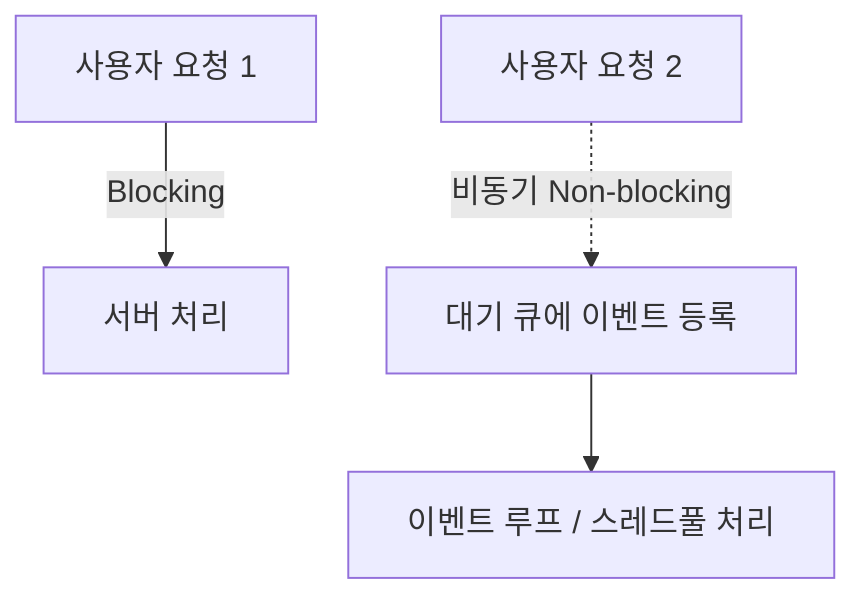
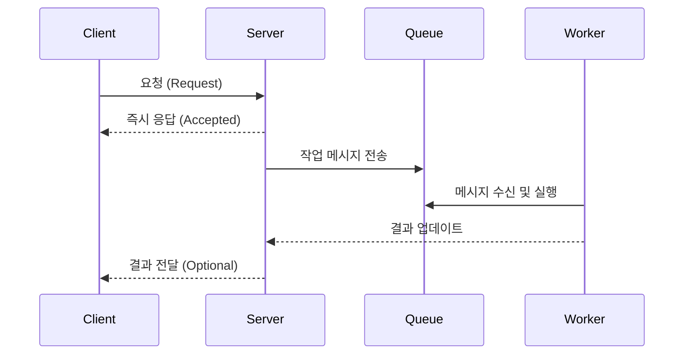

#### 요약

- **비동기(Asynchronous)** 처리는 요청-응답 흐름을 **동기적(Sequential)** 으로 차단하지 않고,  
  **작업을 병렬 혹은 지연 처리(Non-blocking)** 하여 시스템의 처리량(Throughput)을 높이는 기법이다.  
- 대표적인 구현 방식:  
  1. **이벤트 루프(Event Loop)** 기반 (Node.js, FastAPI)  
  2. **스레드 풀(Thread Pool)** 기반 (Spring Boot)  
  3. **코루틴(Coroutine)** 기반 (Python asyncio)
- **공통 목표:** I/O 대기 최소화 + 동시성 확보  
- **운영 포인트:** 에러 전파, 모니터링, 트랜잭션 일관성 유지  
- **언어별 차이:** 런타임 모델(Event Loop, ThreadPool, Coroutine)  
- **추천 조합:**  
  - Express → `Worker Threads`, `Promise.all`  
  - NestJS → `BullMQ`, `RxJS`  
  - Spring Boot → `@Async`, `TaskExecutor`  
  - FastAPI → `asyncio.gather`, `TaskGroup`  

> 비동기 프로그래밍은 단순한 속도 향상이 아니라,  
> “**리소스 효율 + 서비스 확장성 + 사용자 경험**”을 동시에 달성하기 위한 핵심 기술이다.  
> 각 언어는 방식은 다르지만, 목표는 동일하다 —  
> **“한정된 리소스로 최대 처리량을 얻는 것.”**

---

##### 참고자료

- [MDN Web Docs - Asynchronous Programming](https://developer.mozilla.org/en-US/docs/Learn/JavaScript/Asynchronous)  
- [Spring Framework - @Async 사용법](https://docs.spring.io/spring-framework/docs/current/reference/html/integration.html#async)  
- [Python asyncio 공식문서](https://docs.python.org/3/library/asyncio.html)

---

#### 1. 비동기 개념 정의

| 구분 | 설명 |
|------|------|
| **동기(Synchronous)** | 요청이 끝날 때까지 다음 작업 대기 |
| **비동기(Asynchronous)** | 요청을 보낸 뒤 결과를 기다리지 않고 다음 작업 실행 |
| **병렬(Parallel)** | 여러 CPU 코어에서 동시에 실행 (물리적 병렬) |
| **동시성(Concurrency)** | 하나의 CPU가 여러 작업을 번갈아 처리 (논리적 병렬) |



> 💡 **핵심:**
> 동기(Blocking) = “기다림”,
> 비동기(Non-blocking) = “위임 후 다음 작업 실행”.

---

#### 2. 주요 언어별 비동기 모델

| 언어              | 실행 모델          | 대표 기술 스택                                      |
| --------------- | -------------- | --------------------------------------------- |
| **Express.js**  | Event Loop 기반  | `Promise`, `async/await`, `Worker Threads`    |
| **NestJS**      | Reactive 기반    | `RxJS`, `EventEmitter`, `BullMQ`              |
| **Spring Boot** | Thread Pool 기반 | `@Async`, `CompletableFuture`, `TaskExecutor` |
| **FastAPI**     | Coroutine 기반   | `asyncio`, `httpx`, `asyncpg`                 |

---

#### 3. 공통 비동기 처리 흐름



> **요약:**
> 1️⃣ 요청은 바로 응답
> 2️⃣ 실제 작업은 Queue/Worker가 처리
> 3️⃣ 필요 시 후속 응답/알림 전송

---

#### 4. 장점 및 주의사항

| 항목     | 장점                        | 주의점                 |
| ------ | ------------------------- | ------------------- |
| 성능     | 요청 처리량 향상                 | CPU-bound 작업은 효과 낮음 |
| 사용자 경험 | 빠른 응답, UI 지연 최소화          | 비동기 로직 실패 시 추적 어려움  |
| 확장성    | Queue·Worker 구조로 수평 확장 가능 | 트랜잭션 일관성 유지 필요      |
| 운영     | 비동기 로깅/모니터링으로 장애 대응 향상    | 이벤트 순서 보장 어려움       |

```

