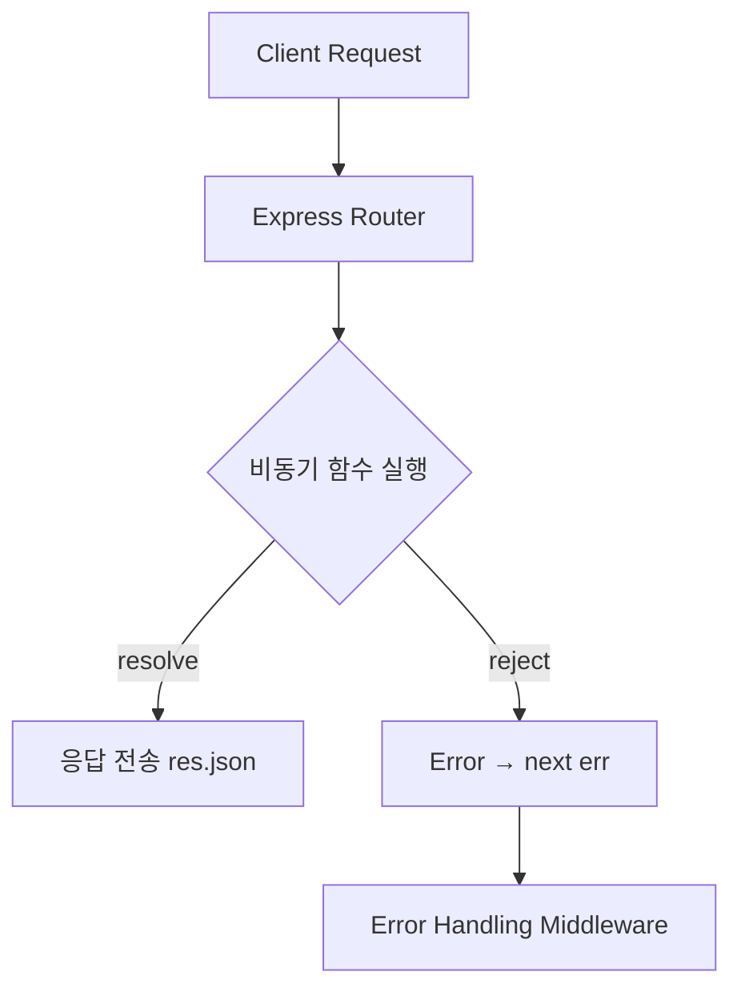

**version: 1.0.0**

---

#### 요약

- **Express.js**는 Node.js의 **이벤트 루프(Event Loop)** 구조를 기반으로,  
  모든 요청을 **Non-blocking 방식**으로 처리하는 대표적인 비동기(Asynchronous) 웹 프레임워크이다.  
- 주요 비동기 처리 방식은 다음과 같다:
  1. **Promise / async·await** — I/O 비동기 처리의 기본 단위  
  2. **미들웨어 기반 흐름 제어** — 비동기 핸들러에서 오류 전파 (`next(err)`)  
  3. **Worker Threads** — CPU 연산이 긴 작업 분리 처리  
- Express의 비동기 흐름은 **콜백 지옥 → Promise → async/await** 으로 진화하며,  
  현재는 `async/await` 패턴이 가장 일반적이다.

> Express는 Node.js의 **Event Loop 기반 비동기 서버**로,
> 단순히 `async/await`을 사용하는 것 이상으로
> **에러 전파, 병렬 실행, 워커 분리, 로깅 체계**가 필수적이다.
> 이를 적절히 결합하면 “가볍지만 고성능인 비동기 서버”를 구현할 수 있다.
> Express의 비동기 프로그래밍은 단순히 `await`으로 끝나지 않는다.  
> 에러 전파, 병렬 처리, 워커 분리 등 구조적 접근이 필요하며,  
> 이를 통해 **“이벤트 루프를 차단하지 않는 안정적인 서버”** 를 구현할 수 있다.

---

##### 참고자료

- [Express.js 공식 문서](https://expressjs.com/en/guide/using-middleware.html)  
- [Node.js Event Loop Guide](https://nodejs.org/en/docs/guides/event-loop-timers-and-nexttick/)  
- [Worker Threads API](https://nodejs.org/api/worker_threads.html)

---

#### 1. 비동기 요청 처리의 기본 원리

| 개념 | 설명 |
|------|------|
| **Event Loop** | 요청을 큐에 넣고, 비동기 I/O 완료 시 콜백으로 응답 |
| **Non-blocking I/O** | DB·파일 등 I/O 작업을 기다리지 않고 다른 요청 처리 |
| **Promise / async·await** | 콜백 대신 직관적인 비동기 흐름 표현 |
| **에러 전파(next)** | `try/catch` 외에도 Express의 `next(err)`로 미들웨어 간 오류 전달 |



---

#### 2. 기본 비동기 핸들러 예시

```javascript
// routes/user.js
import express from "express";
const router = express.Router();

// ✅ 기본 async/await 비동기 핸들러
router.get("/:id", async (req, res, next) => {
  try {
    const user = await UserModel.findById(req.params.id); // DB 호출 (비동기)
    if (!user) throw new Error("User not found");
    res.json({ success: true, data: user });
  } catch (err) {
    next(err); // 오류 전파
  }
});

export default router;
```

> 💡 **포인트:**
>
> * `try/catch`로 명시적 에러 처리
> * Express는 비동기 함수 내부 예외를 자동으로 처리하지 않으므로
>   **명시적으로 `next(err)` 호출** 필요

---

#### 3. 병렬 처리 (Promise.all)

```javascript
router.get("/stats", async (req, res, next) => {
  try {
    const [users, posts, comments] = await Promise.all([
      UserModel.countDocuments(),
      PostModel.countDocuments(),
      CommentModel.countDocuments(),
    ]);

    res.json({ users, posts, comments });
  } catch (err) {
    next(err);
  }
});
```

| 항목                   | 설명                            |
| -------------------- | ----------------------------- |
| `Promise.all`        | 여러 비동기 작업을 병렬로 실행             |
| `Promise.allSettled` | 실패 여부와 관계없이 모든 결과 반환          |
| 사용 이유                | 비동기 요청이 서로 의존하지 않을 때 처리 속도 단축 |

---

#### 4. 에러 핸들링 미들웨어

```javascript
// app.js
app.use((err, req, res, next) => {
  console.error("[AsyncError]", err.message);
  res.status(500).json({
    success: false,
    message: err.message || "Internal Server Error",
  });
});
```

> 💡 **핵심 포인트:**
>
> * 비동기 함수의 예외는 반드시 `next(err)`로 넘겨야 Express가 감지
> * 미들웨어 체인의 마지막에 에러 핸들러 등록 필수
> * 실제 운영에서는 에러 로깅 + 모니터링(Axiom, Sentry 등)과 결합

---

#### 5. CPU-bound 작업 분리 (Worker Threads)

```javascript
// worker/calc.js
import { parentPort } from "worker_threads";

parentPort.on("message", (n) => {
  let result = 0;
  for (let i = 0; i < n; i++) result += i; // CPU 연산
  parentPort.postMessage(result);
});
```

```javascript
// routes/heavy.js
import express from "express";
import { Worker } from "worker_threads";
const router = express.Router();

router.get("/sum", async (req, res) => {
  const worker = new Worker("./worker/calc.js");
  worker.postMessage(1e8);

  worker.once("message", (result) => {
    res.json({ result });
  });
});
```

| 항목                 | 설명                          |
| ------------------ | --------------------------- |
| **Worker Threads** | Node.js 내장 멀티스레드 모듈         |
| **용도**             | CPU 집중 연산 분리 (이벤트 루프 차단 방지) |
| **주의점**            | I/O보다는 계산 중심 로직에만 사용        |

---

#### 6. 실무 운영 팁

| 항목            | 권장 설정 / 방법                   | 설명                |
| ------------- | ---------------------------- | ----------------- |
| **비동기 오류 처리** | `express-async-errors` 모듈 사용 | try/catch 누락 방지   |
| **성능 모니터링**   | APM 도입 (Elastic, Datadog 등)  | 병목 구간 탐지          |
| **Queue 분리**  | BullMQ + Redis 사용            | Heavy 작업 백그라운드 처리 |
| **로깅**        | Winston + Morgan             | 요청 흐름 추적          |
| **테스트**       | `supertest` 기반 async 테스트     | 비동기 응답 시간 검증      |

---

