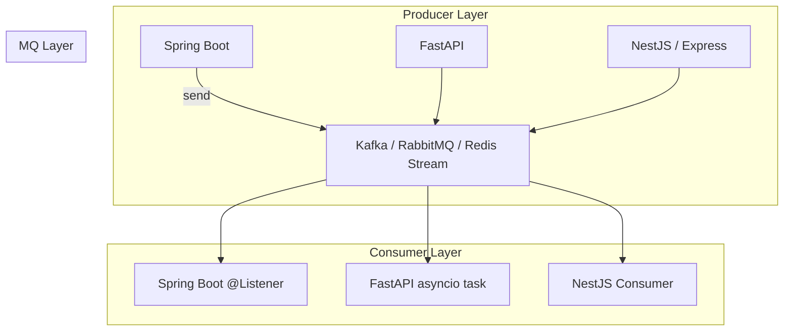

#### 요약

- 본 문서는 **Kafka / RabbitMQ / Redis Stream** 세 가지 메시지 브로커의  
  **비동기 처리 방식, 구조, 사용 목적, 운영 관점**을 비교 분석한다.  
- 각 메시지 브로커는 비슷해 보이지만 내부 목적이 다르다:
  1. **Kafka** — 대규모 스트리밍·로그 기반 데이터 파이프라인  
  2. **RabbitMQ** — 안정적 큐잉·메시지 전달 보장 중심  
  3. **Redis Stream** — 초저지연 실시간 이벤트 처리  

**Outbox 패턴**
- 목적:
메시지 브로커와 DB 간의 데이터 일관성 보장
- 문제 상황:
DB에는 성공적으로 저장됐지만, 메시지 브로커에는 메시지가 전송되지 않으면 데이터 불일치 발생
- 해결 방법:
메시지를 직접 브로커에 보내지 않고,
DB 트랜잭션 내에 메시지를 Outbox 테이블에 함께 저장
→ 이후 별도 프로세스가 메시지를 브로커로 전송
✅ 즉, Outbox는 메시지 전송의 안정성을 위한 패턴

> * **Kafka** → 대규모 스트림·로그 기반 파이프라인에 최적
> * **RabbitMQ** → 안정적 큐 기반 워크로드 처리에 적합
> * **Redis Stream** → 실시간·경량 이벤트 처리에 강점
>
> 따라서 **대규모 데이터 스트리밍은 Kafka**,
> **작업 단위 큐는 RabbitMQ**,
> **실시간 알림/IoT는 Redis Stream** 을 선택하는 것이
> **비동기 아키텍처의 균형 잡힌 구성 전략**이다. 
> 세 기술 모두 “비동기 통신”을 기반으로 하지만,  
> **Kafka는 데이터 스트림**, **RabbitMQ는 작업 큐**, **Redis Stream은 실시간 처리**에 초점을 둔다.  
> 사용 목적과 워크로드 특성에 따라 선택이 달라진다.
> 모든 프레임워크는 MQ를 중심으로 **비동기 이벤트 버스(Event Bus)** 형태로 통합 가능하다.
> Kafka는 데이터 스트림, RabbitMQ는 트랜잭션 워크, Redis Stream은 실시간 채널에 최적화되어 있다.

##### 선택 요약표

| 조건                             | 추천             |
| ------------------------------ | -------------- |
| **“대용량, 순차 보존, 재처리 필요”**       | ✅ Kafka        |
| **“신뢰성, Ack, Routing Key 필요”** | ✅ RabbitMQ     |
| **“초저지연, 실시간 이벤트 중심”**         | ✅ Redis Stream |
| **“단일 Redis 인프라 내 통합 운영”**     | ✅ Redis Stream |
| **“데이터 CDC / Event Sourcing”** | ✅ Kafka        |
| **“Worker Queue 기반 Job 처리”**   | ✅ RabbitMQ     |

---

##### 참고자료

- [Apache Kafka Docs](https://kafka.apache.org/documentation/)
- [RabbitMQ Docs](https://www.rabbitmq.com/tutorials/)
- [Redis Stream Docs](https://redis.io/docs/latest/data-types/streams/)
- [Enterprise Integration Patterns](https://www.enterpriseintegrationpatterns.com/)

---

## 1. 기술 개요 비교

| 항목 | Kafka | RabbitMQ | Redis Stream |
|------|--------|-----------|--------------|
| **주요 역할** | 이벤트 스트리밍 / 로그 파이프라인 | 작업 큐 / 비동기 메시지 라우팅 | 실시간 이벤트 스트림 |
| **전달 모델** | Pub/Sub (Topic-Partition) | Exchange-Queue (Routing Key) | Stream + Consumer Group |
| **저장 구조** | Append-only Log (디스크) | 메모리 + Ack Queue | Append-only (인메모리 + 디스크 Snapshot) |
| **처리 성능** | 매우 높음 (수백만 msg/s) | 중간 (짧은 지연) | 높음 (저지연) |
| **메시지 보존** | 영속적 (Log Segment) | 선택적 (TTL/ACK 기반) | Trim 가능 (XTRIM) |
| **전송 보장** | At-least / Exactly Once | At-most / At-least Once | At-least Once |
| **확장성** | 클러스터 기반 | 브로커 수평 확장 | 단일 노드 / 클러스터 가능 |
| **복잡도** | 높음 (운영/토픽관리 필요) | 중간 (AMQP 표준) | 낮음 (명령형 접근) |

---

## 2. 언어별 구현 비교

| 언어 | Kafka | RabbitMQ | Redis Stream |
|------|--------|-----------|--------------|
| **Spring Boot (Gradle)** | `spring-kafka` — @KafkaListener 기반 | `spring-amqp` — @RabbitListener 기반 | `spring-data-redis` — Stream API |
| **FastAPI (Python)** | `aiokafka` — asyncio 기반 | `aio-pika` — 비동기 AMQP | `redis.asyncio` — XREADGROUP |
| **Express / NestJS (Node.js)** | `kafkajs` — Promise 기반 | `amqplib` — Channel 기반 | `node-redis` — Stream Command 기반 |

> ✅ 공통점  
> - 모든 언어에서 **Producer / Consumer 구조** 동일  
> - `Ack`(확인 응답) 및 `Group`(소비자 그룹) 개념 존재  
> - 에러 처리는 **DLQ(Dead Letter Queue)** 또는 **Retry Queue**로 구현 가능  

---

## 3. 메시징 패턴 비교

| 패턴 | Kafka | RabbitMQ | Redis Stream |
|------|--------|-----------|--------------|
| **Pub/Sub** | ✅ | ✅ | ✅ |
| **Work Queue** | 🚫 | ✅ | ✅ |
| **Request/Reply** | 🚫 | ✅ | ⚙️ (XADD/XREAD 조합) |
| **Event Sourcing** | ✅ | 🚫 | ⚙️ (제한적) |
| **Retry/DLQ 지원** | ✅ | ✅ | ✅ (XPENDING/XCLAIM) |
| **Transaction Outbox** | ✅ | 🚫 | ⚙️ (Custom 구현) |

> 💡 **요약:**  
> - Kafka → **이벤트 중심 서비스 간 데이터 파이프라인**  
> - RabbitMQ → **작업 단위 분리 및 안정적 큐잉**  
> - Redis Stream → **초경량 실시간 이벤트 스트림 처리**

---

## 4. 선택 가이드 (Use Case 기준)

| 사용 시나리오 | 권장 브로커 | 설명 |
|----------------|--------------|------|
| **대규모 로그 수집 / 스트리밍 분석** | **Kafka** | 파티션 기반 대용량 처리 |
| **MSA 간 비동기 명령 전달** | **RabbitMQ** | 큐/라우팅/리트라이 구조 |
| **실시간 알림 / 채팅 / IoT 이벤트** | **Redis Stream** | 초저지연 처리 |
| **트랜잭션 이벤트 저장 + CDC** | **Kafka** | Outbox + Debezium 연계 |
| **AI/ML 모델 태스크 분산 처리** | **RabbitMQ** | Worker Queue + DLX |
| **경량 API Gateway 캐싱 이벤트** | **Redis Stream** | XADD/XREAD 기반 스트림 처리 |

---

## 5. 통합 운영 전략

| 전략 | 설명 | 구현 예시 |
|------|------|-----------|
| **Outbox + CDC** | DB 트랜잭션과 MQ 발행을 분리하지 않고 일관성 유지 | Kafka + Debezium |
| **DLQ 관리** | 처리 실패 메시지 별도 큐로 이동 | Kafka DLQ Topic / RabbitMQ DLX |
| **지표 수집** | 메시지 Lag, 처리량, 오류율 모니터링 | Prometheus + Grafana |
| **표준 로그 통합** | 각 MQ 메시지를 중앙 로깅 | ELK Stack / Loki |
| **알림 자동화** | DLQ Overflow 시 Slack / PagerDuty 통합 | MQ Exporter + Webhook |

---

## 6. 장단점 비교 요약

| 항목 | Kafka | RabbitMQ | Redis Stream |
|------|--------|-----------|--------------|
| **장점** | 고성능, 확장성, 복원력, 이벤트 중심 | 간단한 구조, 안정성, AMQP 호환 | 초저지연, 경량성, 단일 인프라 활용 |
| **단점** | 복잡한 설정 및 운영 | 처리량 제한, Broker 부하 | 데이터 휘발 가능성, 한계적 확장성 |
| **주요 용도** | 데이터 파이프라인, 로그 | MSA 간 명령, 비동기 작업 | 알림, 채팅, IoT 스트림 |

---

