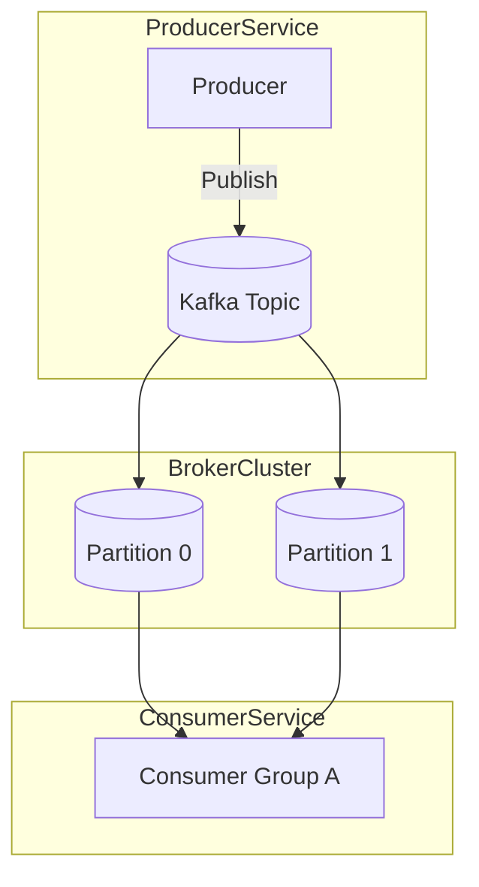
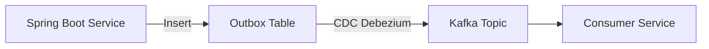

#### 요약

- **Apache Kafka**는 고성능 분산 메시징 플랫폼으로,  
  마이크로서비스 간 **비동기 이벤트 스트리밍**을 지원한다.  
- Kafka는 **토픽(Topic)** 을 중심으로 메시지를 파티션 단위로 저장하고,  
  **Producer-Consumer 모델**을 통해 데이터를 **비동기적으로 송수신**한다.  
- 주요 목적:
  1. 서비스 간 결합도 감소 (Decoupling)  
  2. 장애 복원력 향상 (Replay, Partition Replication)  
  3. 대량 데이터 비동기 처리 (Stream Processing)
- 이 문서는 언어별 Kafka 활용 구조를 통합 비교한다:
  - **Spring Boot (Java)** — Spring Kafka 기반 비동기 메시징  
  - **FastAPI (Python)** — aiokafka 기반 논블로킹 이벤트 처리  
  - **Express / NestJS (Node.js)** — kafkajs 기반 비동기 Producer/Consumer 구조

> Kafka는 언어에 상관없이 **비동기 이벤트 중심 아키텍처의 핵심 축**이다.
> Spring Boot는 트랜잭션 안정성과 운영성,
> FastAPI는 순수 비동기 처리와 경량성,
> Express/NestJS는 확장성과 속도를 강점으로 가진다.
> 즉, Kafka는 **모든 백엔드 언어를 하나의 비동기 스트림으로 연결하는 공통 기반**이다.
> Kafka는 “이벤트 중심(Event-driven)” 아키텍처를 구현하기 위한 핵심 메시지 브로커이며,  
> 언어별 클라이언트 SDK를 통해 동일한 Pub/Sub 모델을 제공한다.

##### 프레임워크별 비교표

| 항목              | Spring Boot           | FastAPI              | Express / NestJS     |
| --------------- | --------------------- | -------------------- | -------------------- |
| **언어**          | Java                  | Python               | Node.js / TypeScript |
| **클라이언트 라이브러리** | `spring-kafka`        | `aiokafka`           | `kafkajs`            |
| **실행 모델**       | Thread Pool + Reactor | asyncio (Event Loop) | Event Loop (Node.js) |
| **주요 강점**       | 트랜잭션 연동, 안정성          | 비동기 순수 구조, 경량성       | 빠른 개발, 서버리스 적합       |
| **권장 용도**       | 마이크로서비스 이벤트 버스        | AI/데이터 파이프라인         | Gateway / 실시간 알림     |


---

##### 참고자료

- [Apache Kafka Docs](https://kafka.apache.org/documentation/)
- [Spring for Apache Kafka](https://docs.spring.io/spring-kafka/reference/html/)
- [aiokafka (Python)](https://aiokafka.readthedocs.io/en/stable/)
- [KafkaJS (Node.js)](https://kafka.js.org/docs/getting-started)

---

### 1. Kafka 아키텍처 개요



| 구성요소               | 설명                        |
| ------------------ | ------------------------- |
| **Producer**       | 이벤트(메시지)를 발행하는 서비스        |
| **Broker**         | 메시지를 저장·분배하는 Kafka 서버     |
| **Topic**          | 메시지가 기록되는 논리적 채널          |
| **Partition**      | 병렬 처리를 위한 Topic 내부 단위     |
| **Consumer Group** | 메시지를 병렬로 처리하는 Consumer 묶음 |

---

## 2. Spring Boot — `spring-kafka`

### 2.1 설정

```xml
<!-- pom.xml -->
<dependency>
  <groupId>org.springframework.kafka</groupId>
  <artifactId>spring-kafka</artifactId>
</dependency>
```

```yaml
# application.yml
spring:
  kafka:
    bootstrap-servers: localhost:9092
    consumer:
      group-id: user-service
      key-deserializer: org.apache.kafka.common.serialization.StringDeserializer
      value-deserializer: org.apache.kafka.common.serialization.StringDeserializer
    producer:
      key-serializer: org.apache.kafka.common.serialization.StringSerializer
      value-serializer: org.apache.kafka.common.serialization.StringSerializer
```

---

### 2.2 Producer

```java
@Service
@RequiredArgsConstructor
public class KafkaProducerService {

    private final KafkaTemplate<String, String> kafkaTemplate;

    public void send(String topic, String message) {
        kafkaTemplate.send(topic, message)
            .thenAccept(result -> System.out.println("✅ Sent: " + message))
            .exceptionally(ex -> { 
                System.err.println("❌ Send error: " + ex.getMessage());
                return null;
            });
    }
}
```

---

### 2.3 Consumer

```java
@Service
public class KafkaConsumerService {

    @KafkaListener(topics = "user-topic", groupId = "user-service")
    public void consume(String message, Acknowledgment ack) {
        System.out.println("📥 Received: " + message);
        ack.acknowledge();
    }
}
```

> 💡 **특징**
>
> * `@KafkaListener` 기반 Consumer 구성
> * `Acknowledgment`로 수동 커밋 가능
> * Outbox + DLQ 패턴과 결합 시 고신뢰성 구조 완성

---


## 2. Spring Boot (Gradle 기반) — `spring-kafka`

### 2.1 Gradle 설정

```kotlin
// build.gradle.kts
plugins {
    id("org.springframework.boot") version "3.3.4"
    id("io.spring.dependency-management") version "1.1.5"
    kotlin("jvm") version "1.9.25"
    kotlin("plugin.spring") version "1.9.25"
}

group = "com.example.kafka"
version = "1.0.0"
java.sourceCompatibility = JavaVersion.VERSION_17

repositories {
    mavenCentral()
}

dependencies {
    implementation("org.springframework.boot:spring-boot-starter-web")
    implementation("org.springframework.kafka:spring-kafka")
    testImplementation("org.springframework.boot:spring-boot-starter-test")
    testImplementation("org.springframework.kafka:spring-kafka-test")
}
```

> 💡 **설명**
>
> * `spring-kafka` : Kafka Producer/Consumer 구현체
> * `spring-kafka-test` : 테스트 컨슈머 시뮬레이션
> * `Java 17` 기반 최신 Gradle 환경 대응

---

### 2.2 Kafka 설정 (YAML)

```yaml
# application.yml
spring:
  kafka:
    bootstrap-servers: localhost:9092
    consumer:
      group-id: user-service
      auto-offset-reset: earliest
      key-deserializer: org.apache.kafka.common.serialization.StringDeserializer
      value-deserializer: org.apache.kafka.common.serialization.StringDeserializer
    producer:
      key-serializer: org.apache.kafka.common.serialization.StringSerializer
      value-serializer: org.apache.kafka.common.serialization.StringSerializer
    listener:
      ack-mode: manual
```

---

### 2.3 Producer

```kotlin
// KafkaProducerService.kt
package com.example.kafka.service

import org.springframework.kafka.core.KafkaTemplate
import org.springframework.stereotype.Service

@Service
class KafkaProducerService(
    private val kafkaTemplate: KafkaTemplate<String, String>
) {
    fun send(topic: String, message: String) {
        kafkaTemplate.send(topic, message)
            .thenAccept { println("📨 Sent: $message") }
            .exceptionally { ex ->
                println("❌ Send failed: ${ex.message}")
                null
            }
    }
}
```

---

### 2.4 Consumer

```kotlin
// KafkaConsumerService.kt
package com.example.kafka.service

import org.springframework.kafka.annotation.KafkaListener
import org.springframework.kafka.support.Acknowledgment
import org.springframework.stereotype.Service

@Service
class KafkaConsumerService {

    @KafkaListener(topics = ["user-topic"], groupId = "user-service")
    fun consume(message: String, ack: Acknowledgment) {
        println("📥 Received: $message")
        ack.acknowledge() // 수동 오프셋 커밋
    }
}
```

> ✅ **핵심 요약**
>
> * `KafkaTemplate` → 비동기 메시지 발행
> * `@KafkaListener` → 자동 Consumer 등록
> * `Acknowledgment` → 커밋 제어로 안정성 확보

---

### 2.5 트랜잭션 Outbox 패턴



```sql
CREATE TABLE outbox_event (
  id UUID PRIMARY KEY,
  event_type VARCHAR(255),
  payload JSONB,
  created_at TIMESTAMP DEFAULT NOW()
);
```

> 💡 **핵심 포인트**
>
> * DB 트랜잭션과 Kafka 메시지 발행을 분리하지 않고 일관성 유지
> * Debezium 또는 Kafka Connect CDC를 이용해 Outbox 데이터를 자동 발행

---

### 2.6 DLQ 구성 및 모니터링

```kotlin
// KafkaErrorHandler.kt
package com.example.kafka.config

import org.springframework.kafka.listener.DeadLetterPublishingRecoverer
import org.springframework.stereotype.Component

@Component
class KafkaErrorHandler : DeadLetterPublishingRecoverer() {
    override fun accept(record: org.apache.kafka.clients.consumer.ConsumerRecord<*, *>, ex: Exception) {
        println("💀 DLQ message: ${record.value()} | error: ${ex.message}")
    }
}
```

| 항목                           | 설명                 |
| ---------------------------- | ------------------ |
| **DLQ (Dead Letter Queue)**  | 처리 실패 메시지 전용 토픽    |
| **운영 활용**                    | 실패 메시지 재처리 및 장애 분석 |
| **Kafka Streams / Debezium** | CDC와 DLQ를 함께 운영 가능 |

---

### 2.7 운영 및 관찰 지표

| 항목           | 도구 / 방법                     | 설명               |
| ------------ | --------------------------- | ---------------- |
| **Lag 모니터링** | Prometheus + Kafka Exporter | Consumer Lag 시각화 |
| **토픽 관리**    | `kafka-topics.sh` CLI       | 파티션 및 리플리카 확인    |
| **스키마 관리**   | Confluent Schema Registry   | Avro/JSON 스키마 검증 |
| **로그 수집**    | ELK Stack / Loki            | 장애 분석용 로그 중앙화    |

---

> ✅ **Spring Boot 결론 요약:**
> Gradle 환경의 Spring Boot는 `spring-kafka`를 통해
> **@KafkaListener + KafkaTemplate** 조합으로 비동기 이벤트 파이프라인을 구성한다.
> Outbox + DLQ 구조를 병행하면 **신뢰성 있는 이벤트 스트림 아키텍처**를 완성할 수 있다.

---


## 3. FastAPI — `aiokafka`

### 3.1 설치 및 구성

```bash
pip install aiokafka
```

```python
# kafka_config.py
from aiokafka import AIOKafkaProducer, AIOKafkaConsumer
from asyncio import get_event_loop

loop = get_event_loop()
producer = AIOKafkaProducer(loop=loop, bootstrap_servers="localhost:9092")
consumer = AIOKafkaConsumer("user-topic", group_id="user-service", loop=loop, bootstrap_servers="localhost:9092")
```

---

### 3.2 Producer

```python
import asyncio, json
from fastapi import FastAPI
from kafka_config import producer

app = FastAPI()

@app.on_event("startup")
async def startup_event():
    await producer.start()

@app.on_event("shutdown")
async def shutdown_event():
    await producer.stop()

@app.post("/publish")
async def publish_message(data: dict):
    await producer.send_and_wait("user-topic", json.dumps(data).encode("utf-8"))
    return {"status": "sent"}
```

---

### 3.3 Consumer

```python
@app.on_event("startup")
async def consume():
    asyncio.create_task(consume_messages())

async def consume_messages():
    from kafka_config import consumer
    await consumer.start()
    try:
        async for msg in consumer:
            print(f"📥 Received: {msg.value.decode()}")
    finally:
        await consumer.stop()
```

> 💡 **특징**
>
> * 완전한 `asyncio` 기반 논블로킹 이벤트 루프
> * `send_and_wait()`로 프로듀서 결과 확인
> * FastAPI의 ASGI 이벤트 루프와 자연스럽게 통합

---

## 4. Express / NestJS — `kafkajs`

### 4.1 설치 및 구성

```bash
npm install kafkajs
```

```typescript
// kafka.ts
import { Kafka } from "kafkajs";

export const kafka = new Kafka({
  clientId: "user-service",
  brokers: ["localhost:9092"],
});
export const producer = kafka.producer();
export const consumer = kafka.consumer({ groupId: "user-service" });
```

---

### 4.2 Producer (Express 예시)

```typescript
// producer.js
import express from "express";
import { producer } from "./kafka.js";

const app = express();
app.use(express.json());

app.post("/publish", async (req, res) => {
  await producer.connect();
  await producer.send({
    topic: "user-topic",
    messages: [{ value: JSON.stringify(req.body) }],
  });
  await producer.disconnect();
  res.json({ status: "sent" });
});

app.listen(3000, () => console.log("🚀 Express Kafka Producer running"));
```

---

### 4.3 Consumer (NestJS 예시)

```typescript
// kafka.consumer.ts
import { Injectable, OnModuleInit } from "@nestjs/common";
import { consumer } from "./kafka";

@Injectable()
export class KafkaConsumer implements OnModuleInit {
  async onModuleInit() {
    await consumer.connect();
    await consumer.subscribe({ topic: "user-topic", fromBeginning: true });

    await consumer.run({
      eachMessage: async ({ topic, partition, message }) => {
        console.log(`📥 [${topic}] ${message.value?.toString()}`);
      },
    });
  }
}
```

> 💡 **특징**
>
> * Node.js 런타임에서 가장 안정적인 Kafka 클라이언트 (`kafkajs`)
> * NestJS의 DI 구조와 결합 시 대규모 이벤트 기반 서비스에 적합
> * 메시지 재처리(`fromBeginning`), DLQ 처리 등 모두 지원

---

## 5. Outbox + DLQ + 모니터링 공통 전략

| 전략                          | 설명                           | 언어별 구현 위치                                                |
| --------------------------- | ---------------------------- | -------------------------------------------------------- |
| **Outbox Pattern**          | DB 트랜잭션과 Kafka 발행을 일관성 있게 연결 | Spring Boot: JPA Event / FastAPI: SQLAlchemy Commit Hook |
| **DLQ (Dead Letter Queue)** | 처리 실패 메시지를 별도 토픽에 저장         | Kafka DLQ Topic 공통                                       |
| **Consumer Lag 모니터링**       | 메시지 지연률 확인                   | Prometheus + Kafka Exporter                              |
| **Schema Registry**         | 메시지 스키마 관리                   | Avro / JSON Schema (Confluent)                           |

---

