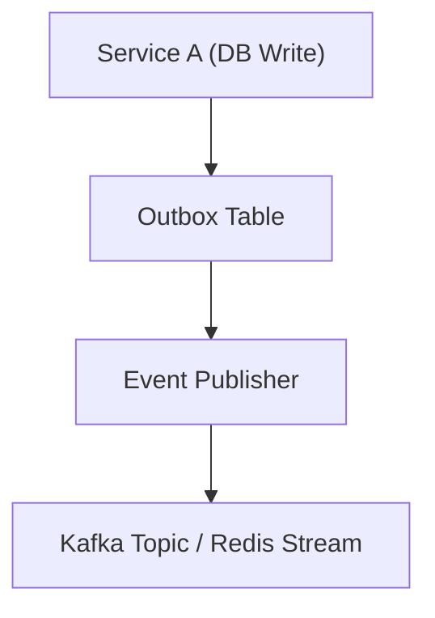

**version: NestJS v10.x / PostgreSQL + Kafka 기반**

---

#### 요약

Outbox 패턴은 **데이터 변경과 이벤트 발행을 원자적으로 처리**하기 위한 트랜잭션 설계 기법이다.  
DB와 메시지 브로커 간 “이벤트 손실 문제”를 해결한다.

Outbox는 “이벤트 발행의 신뢰성”을 보장하는 핵심 패턴이다.
DB commit과 메시지 전송이 완벽히 분리되어 있어 장애 상황에서도 **데이터 유실이 없다.**

> *“Outbox는 이벤트의 블랙박스다 — 장애 후에도 메시지는 남는다.”*

---

##### 참고자료
- [Outbox Pattern Overview](https://microservices.io/patterns/data/transactional-outbox.html)

---

#### 1. 구조 개요



> 애플리케이션은 DB에 이벤트를 먼저 저장하고, 별도 Worker가 메시지를 발행한다.

---

#### 2. 예시 코드

`outbox.entity.ts`

```ts
@Entity()
export class OutboxEvent {
  @PrimaryGeneratedColumn() id: number;
  @Column() eventType: string;
  @Column({ type: 'jsonb' }) payload: any;
  @Column({ default: false }) published: boolean;
}
```

`outbox.publisher.ts`

```ts
const events = await this.repo.find({ where: { published: false } });
for (const e of events) {
  await kafkaProducer.send({ topic: e.eventType, messages: [{ value: e.payload }] });
  e.published = true;
  await this.repo.save(e);
}
```
---

