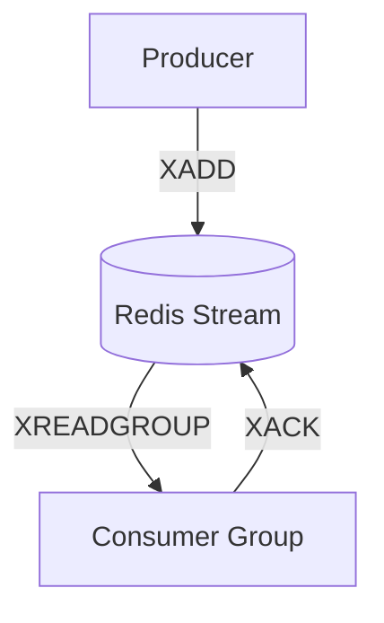

#### 요약

- **Redis Stream**은 Redis 5.0 이후 추가된 **이벤트 스트리밍 데이터 구조**로,  
  Kafka·RabbitMQ처럼 **비동기 메시지 큐** 역할을 수행할 수 있다.  
- 주요 특징:
  1. **Append-only 구조 (XADD)**  
  2. **Consumer Group 기반 병렬 처리**  
  3. **Ack 기반 신뢰성 전달 (XACK)**  
  4. **메모리 중심 초고속 처리 속도**
- Redis Stream은 **실시간 이벤트, 로그, 알림 처리** 등에 적합하며  
  **저지연 비동기 파이프라인** 구축에 매우 효과적이다.

> Redis Stream은 메모리 기반의 초저지연 비동기 메시지 큐로,
> Kafka보다 가볍고 RabbitMQ보다 빠르며,
> **단일 Redis 인프라 내에서 이벤트 스트림·큐·캐시를 통합 운영할 수 있는 장점**이 있다.
> 각 언어는 Redis Stream의 단순 명령(XADD, XREADGROUP, XACK)을 통해
> 동일한 비동기 통신 구조를 쉽게 구현할 수 있다.
> Redis Stream은 Redis의 인메모리 특성과 Kafka의 이벤트 스트림 모델을 결합한 구조로,  
> 빠른 응답과 실시간 처리가 필요한 환경에서 비동기 메시징 솔루션으로 사용된다.

#### 프레임워크별 비교표

| 항목        | Spring Boot          | FastAPI          | Express / NestJS           |
| --------- | -------------------- | ---------------- | -------------------------- |
| **언어**    | Kotlin / Java        | Python           | Node.js / TypeScript       |
| **라이브러리** | spring-data-redis    | aioredis         | node-redis                 |
| **처리 방식** | Polling / @Scheduled | async event loop | while-loop with xReadGroup |
| **장점**    | 안정적 통합 / 설정 간결       | 경량 / 완전 비동기      | 빠른 실행 / 실시간 대응             |
| **권장 용도** | 데이터 파이프라인 / 로그 수집    | 실시간 알림 / IoT     | Gateway / 실시간 채팅           |


##### 참고자료

- [Redis Stream 공식 문서](https://redis.io/docs/latest/data-types/streams/)
- [Spring Data Redis Stream](https://docs.spring.io/spring-data/redis/docs/current/reference/html/#redis.streams)
- [aioredis Docs](https://aioredis.readthedocs.io/)
- [node-redis Streams](https://github.com/redis/node-redis)

---

### 1. Redis Stream 기본 아키텍처



| 명령             | 설명                           |
| -------------- | ---------------------------- |
| **XADD**       | Stream에 메시지 추가               |
| **XREADGROUP** | Consumer Group 단위로 메시지 읽기    |
| **XACK**       | 메시지 처리 완료 후 확인 (acknowledge) |
| **XGROUP**     | Consumer Group 생성            |
| **XDEL**       | 처리된 메시지 삭제                   |

---

##  2. Spring Boot (Gradle 기반) — `spring-data-redis`

### 2.1 Gradle 설정

```kotlin
// build.gradle.kts
plugins {
    id("org.springframework.boot") version "3.3.4"
    id("io.spring.dependency-management") version "1.1.5"
    kotlin("jvm") version "1.9.25"
    kotlin("plugin.spring") version "1.9.25"
}

dependencies {
    implementation("org.springframework.boot:spring-boot-starter-data-redis")
    implementation("org.springframework.boot:spring-boot-starter-web")
}
```

---

### 2.2 Redis Stream 구성

```kotlin
// RedisStreamConfig.kt
@Configuration
class RedisStreamConfig {
    @Bean
    fun redisTemplate(factory: RedisConnectionFactory): RedisTemplate<String, Any> {
        val template = RedisTemplate<String, Any>()
        template.setConnectionFactory(factory)
        return template
    }
}
```

---

### 2.3 Producer

```kotlin
// StreamProducer.kt
@Service
class StreamProducer(private val redisTemplate: RedisTemplate<String, Any>) {
    fun publish(stream: String, message: String) {
        val record = MapRecord.create(stream, "message", message)
        redisTemplate.opsForStream<String, String>().add(record)
        println("📨 Published: $message")
    }
}
```

---

### 2.4 Consumer

```kotlin
// StreamConsumer.kt
@Component
class StreamConsumer(private val redisTemplate: RedisTemplate<String, Any>) {

    @Scheduled(fixedDelay = 2000)
    fun consume() {
        val records = redisTemplate.opsForStream<String, String>()
            .read(StreamReadOptions.empty().count(10),
                  StreamOffset.create("user-stream", ReadOffset.lastConsumed()))
        records?.forEach {
            println("📥 Consumed: ${it.value["message"]}")
        }
    }
}
```

> ✅ **특징**
>
> * `opsForStream()` API로 XADD/XREADGROUP 기능 구현
> * `@Scheduled`로 주기적 Pull 방식 처리
> * Spring Boot 3.x에서 `StreamListener` 대체 구조 지원

---

## 3. FastAPI — `aioredis`

### 3.1 설치 및 설정

```bash
pip install redis
```

```python
from fastapi import FastAPI
import asyncio
import redis.asyncio as aioredis

app = FastAPI()
redis = aioredis.from_url("redis://localhost")
```

---

### 3.2 Producer

```python
@app.post("/publish")
async def publish_message(payload: dict):
    msg_id = await redis.xadd("user-stream", {"data": str(payload)})
    return {"id": msg_id}
```

---

### 3.3 Consumer

```python
@app.on_event("startup")
async def consume_stream():
    asyncio.create_task(read_stream())

async def read_stream():
    group, consumer = "user-group", "consumer-1"
    try:
        await redis.xgroup_create("user-stream", group, id="$", mkstream=True)
    except Exception:
        pass  # 그룹이 이미 있으면 생략

    while True:
        resp = await redis.xreadgroup(group, consumer, {"user-stream": ">"}, count=1, block=5000)
        if resp:
            for _, messages in resp:
                for msg_id, msg in messages:
                    print(f"📥 Received: {msg}")
                    await redis.xack("user-stream", group, msg_id)
```

> 💡 **핵심 요약**
>
> * `xgroup_create` : Consumer Group 생성
> * `xreadgroup` : 메시지 읽기 (블록 대기 지원)
> * `xack` : 성공 처리 후 메시지 제거

---

## 4. Express / NestJS — `node-redis`

### 4.1 설치 및 설정

```bash
npm install redis
```

```typescript
// redis-client.ts
import { createClient } from "redis";
export const redis = createClient({ url: "redis://localhost:6379" });
redis.connect();
```

---

### 4.2 Producer (Express 예시)

```typescript
// producer.ts
import express from "express";
import { redis } from "./redis-client.js";

const app = express();
app.use(express.json());

app.post("/publish", async (req, res) => {
  const id = await redis.xAdd("user-stream", "*", { data: JSON.stringify(req.body) });
  res.json({ id });
});

app.listen(3000, () => console.log("🚀 Redis Stream Producer running"));
```

---

### 4.3 Consumer (NestJS 예시)

```typescript
// redis.consumer.ts
import { Injectable, OnModuleInit } from "@nestjs/common";
import { redis } from "./redis-client";

@Injectable()
export class RedisStreamConsumer implements OnModuleInit {
  async onModuleInit() {
    const group = "user-group";
    try {
      await redis.xGroupCreate("user-stream", group, "$", { MKSTREAM: true });
    } catch {}
    this.listen(group);
  }

  async listen(group: string) {
    while (true) {
      const response = await redis.xReadGroup(group, "consumer-1", {
        key: "user-stream",
        id: ">",
        COUNT: 1,
        BLOCK: 5000,
      });
      if (response) {
        for (const stream of response) {
          for (const message of stream.messages) {
            console.log("📥 Received:", message.message);
            await redis.xAck("user-stream", group, message.id);
          }
        }
      }
    }
  }
}
```

> ✅ **특징**
>
> * `xReadGroup`으로 실시간 스트림 소비
> * NestJS의 의존성 주입(DI)과 결합
> * Consumer Group 기반 멀티 워커 구성 가능

---

## 5. 운영 / 모니터링 전략

| 항목                     | 설명                     | 도구                             |
| ---------------------- | ---------------------- | ------------------------------ |
| **백프레셔(Backpressure)** | 소비자 속도가 느릴 때 스트림 크기 제어 | `XTRIM`                        |
| **Retry / DLQ**        | 처리 실패 메시지 재처리          | `XPENDING`, `XCLAIM`           |
| **Stream 모니터링**        | 메시지 수, 소비자 상태 확인       | `XINFO STREAM`, `XINFO GROUPS` |
| **모니터링 도구**            | RedisInsight, Grafana  | 시각적 관리                         |
| **성능 지표**              | 처리율, 지연 시간             | Prometheus + Redis Exporter    |

---


