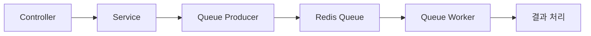

**version: NestJS v10.x / BullMQ v4.x / Redis v7.x 기준**

---

#### 요약

BullMQ는 **Redis 기반의 Job Queue 시스템**으로,  
시간이 오래 걸리는 작업(메일 발송, 로그 집계, 파일 처리 등)을 백그라운드에서 실행하여  
**요청/응답을 분리**하고 서버 부하를 줄인다.

BullMQ는 **NestJS 비동기 처리의 핵심**이다.
API 요청과 실제 연산을 분리함으로써 응답 속도를 향상시키고,
대규모 트래픽에서도 안정적인 백엔드 구조를 유지한다.

> *“Sync는 반응이고, Async는 구조다.”*
---

##### 참고자료
- [NestJS 공식 BullMQ 가이드](https://docs.nestjs.com/techniques/queues)
- [BullMQ 공식 문서](https://docs.bullmq.io/)

---

#### 1. 개요



> BullMQ는 Producer–Worker 구조로 동작하며, Redis를 중앙 메시지 브로커로 사용한다.

---

#### 2. 설치 및 기본 설정

```bash
pnpm add @nestjs/bullmq bullmq ioredis
```

`queue.module.ts`

```ts
@Module({
  imports: [
    BullModule.forRoot({
      connection: { host: 'localhost', port: 6379 },
    }),
    BullModule.registerQueue({ name: 'email' }),
  ],
})
export class QueueModule {}
```

---

#### 3. Producer (작업 생성)

```ts
@Injectable()
export class EmailService {
  constructor(@InjectQueue('email') private readonly emailQueue: Queue) {}

  async sendEmail(data: any) {
    await this.emailQueue.add('send', data, { delay: 5000 });
  }
}
```

> Queue에 Job을 등록하면, Redis에 작업이 적재되고 Worker가 순차적으로 처리한다.

---

#### 4. Worker (작업 처리)

```ts
@Processor('email')
export class EmailProcessor {
  @Process('send')
  async handleSend(job: Job) {
    console.log('📩 Sending email:', job.data);
  }
}
```

> Processor는 백그라운드 스레드로 동작하며, 메인 API 처리 흐름과 완전히 분리된다.

---
