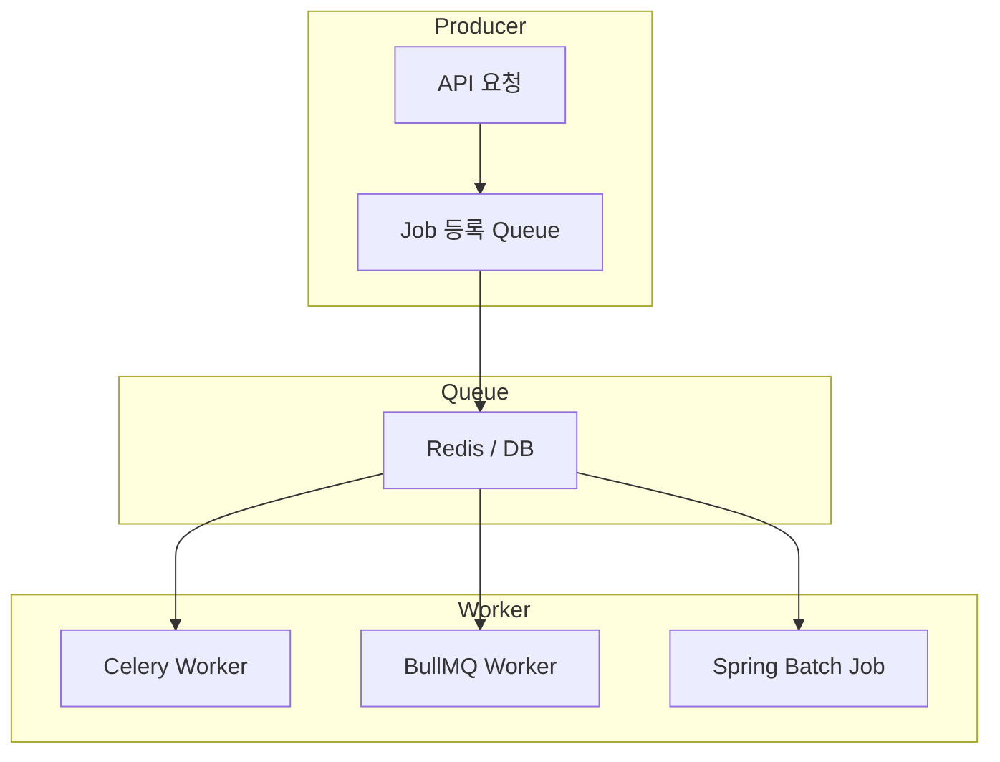
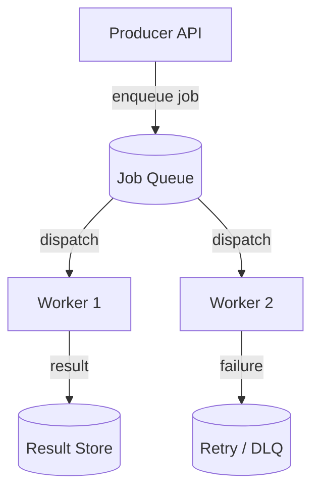

#### 요약

- **Job Queue**는 비동기적으로 처리해야 하는 대기성 작업(예: 이미지 변환, 이메일 발송, 데이터 수집)을  
  **메시지 큐 기반으로 스케줄링 및 분산 처리**하기 위한 구조이다.  
- MQ가 "이벤트 전달"에 초점을 둔다면,  
  Job Queue는 "작업 실행 및 재시도 관리"에 초점을 둔다.  
- 주요 기능:
  1. 작업 대기열(Queue) 생성 및 관리  
  2. Retry / Delay / Priority / Cron Scheduling 지원  
  3. Worker 프로세스 분리로 시스템 부하 제어  
  4. 모니터링 UI 및 실패 복구 지원  

> Job Queue는 단순한 “작업 대기열”이 아닌,
> **시스템의 부하를 제어하고, 신뢰성 있는 비동기 워크플로우를 유지하는 핵심 구성 요소**이다.
>
> * **Spring Batch** → 대규모 배치 및 스케줄링 중심
> * **Celery** → 안정적 분산 Task 처리
> * **BullMQ** → 실시간 웹·마이크로서비스 환경에 최적
>
> 세 가지 모두 “**메시지 큐 + Worker 패턴**”을 통해
> 비동기 처리의 확장성과 복원력을 극대화한다.
> Job Queue는 애플리케이션의 **비즈니스 로직과 백그라운드 처리 로직을 분리**시켜,  
> 서비스의 응답 속도와 안정성을 동시에 확보하는 핵심 아키텍처 패턴이다.

프레임워크별 구조 요약


---

##### 참고자료

- [BullMQ Docs (Node.js)](https://docs.bullmq.io/)
- [Celery Docs (Python)](https://docs.celeryq.dev/)
- [Spring Batch Docs (Java/Kotlin)](https://docs.spring.io/spring-batch/docs/current/reference/html/)
- [RQ (Redis Queue)](https://python-rq.org/)

---

### 1. Job Queue 아키텍처 개요



| 구성요소             | 설명                           |
| ---------------- | ---------------------------- |
| **Producer**     | 작업 요청을 생성하는 서비스              |
| **Queue**        | Job을 저장 및 분배하는 대기열           |
| **Worker**       | Queue에서 Job을 꺼내 실제 실행하는 프로세스 |
| **Result Store** | Job 처리 결과 저장소 (DB, Redis 등)  |
| **Scheduler**    | 주기적 작업 실행(Cron)              |

---

## 2. Spring Boot — `Spring Batch + Spring Scheduler`

### 2.1 Gradle 설정

```kotlin
// build.gradle.kts
plugins {
    id("org.springframework.boot") version "3.3.4"
    kotlin("plugin.spring") version "1.9.25"
}

dependencies {
    implementation("org.springframework.boot:spring-boot-starter-batch")
    implementation("org.springframework.boot:spring-boot-starter-quartz")
    runtimeOnly("org.hsqldb:hsqldb")
}
```

---

### 2.2 Job 정의

```kotlin
// BatchConfig.kt
@Configuration
@EnableBatchProcessing
class BatchConfig(val jobBuilderFactory: JobBuilderFactory, val stepBuilderFactory: StepBuilderFactory) {

    @Bean
    fun exampleJob(): Job = jobBuilderFactory.get("exampleJob")
        .start(exampleStep())
        .build()

    @Bean
    fun exampleStep(): Step = stepBuilderFactory.get("exampleStep")
        .tasklet { _, _ ->
            println("✅ Executing Batch Job...")
            RepeatStatus.FINISHED
        }.build()
}
```

---

### 2.3 스케줄러 설정

```kotlin
// SchedulerConfig.kt
@Configuration
@EnableScheduling
class SchedulerConfig(private val jobLauncher: JobLauncher, private val exampleJob: Job) {

    @Scheduled(cron = "0 0/1 * * * ?") // 매 1분마다 실행
    fun runJob() {
        val params = JobParametersBuilder()
            .addLong("timestamp", System.currentTimeMillis())
            .toJobParameters()
        jobLauncher.run(exampleJob, params)
    }
}
```

> 💡 **특징**
>
> * `Spring Batch`는 대량 데이터 처리, ETL, 정기 보고서 생성 등 배치 작업에 적합
> * `@Scheduled`와 연동해 **Cron 기반 자동 실행** 가능

---

## 3. FastAPI — `Celery + Redis`

### 3.1 설치 및 설정

```bash
pip install celery redis fastapi uvicorn
```

```python
# celery_app.py
from celery import Celery

celery = Celery(
    "worker",
    broker="redis://localhost:6379/0",
    backend="redis://localhost:6379/0",
)
```

---

### 3.2 Task 정의

```python
# tasks.py
from celery_app import celery

@celery.task(bind=True, max_retries=3)
def send_email(self, recipient):
    try:
        print(f"📨 Sending email to {recipient}")
    except Exception as exc:
        self.retry(exc=exc, countdown=10)
```

---

### 3.3 FastAPI 연동

```python
# main.py
from fastapi import FastAPI
from tasks import send_email

app = FastAPI()

@app.post("/email")
async def enqueue_email(recipient: str):
    send_email.delay(recipient)
    return {"status": "queued"}
```

> ✅ **특징**
>
> * `Celery`는 **Redis / RabbitMQ / SQS** 등 다양한 브로커 지원
> * `delay()` 호출로 작업을 큐에 비동기 등록
> * Retry / Countdown / ETA / Chain 지원

---

## 4. Express / NestJS — `BullMQ`

### 4.1 설치 및 설정

```bash
npm install bullmq ioredis
```

```typescript
// queue.ts
import { Queue } from "bullmq";
export const emailQueue = new Queue("emailQueue", { connection: { host: "localhost", port: 6379 } });
```

---

### 4.2 Producer (Express 예시)

```typescript
import express from "express";
import { emailQueue } from "./queue.js";

const app = express();
app.use(express.json());

app.post("/email", async (req, res) => {
  await emailQueue.add("sendEmail", req.body, { delay: 1000, attempts: 3 });
  res.json({ status: "queued" });
});

app.listen(3000, () => console.log("🚀 BullMQ Producer running"));
```

---

### 4.3 Worker (NestJS 예시)

```typescript
// email.worker.ts
import { Worker, Job } from "bullmq";

export const emailWorker = new Worker(
  "emailQueue",
  async (job: Job) => {
    console.log(`📥 Processing: ${job.name}`, job.data);
  },
  { connection: { host: "localhost", port: 6379 } }
);
```

> 💡 **BullMQ 특징**
>
> * Redis 기반 비동기 Job Queue
> * **delay**, **repeat(cron)**, **retry(attempts)** 옵션 지원
> * Dashboard(`bull-board`, `arena`)로 모니터링 가능

---

## 5. 공통 패턴 및 운영 전략

| 항목                | 설명                   | 적용 기술                          |
| ----------------- | -------------------- | ------------------------------ |
| **Retry / Delay** | 실패 시 재시도 및 일정 지연     | Celery, BullMQ                 |
| **Job Priority**  | 우선순위 작업 먼저 처리        | BullMQ, Celery                 |
| **Cron Schedule** | 주기적 배치 실행            | Spring Batch, BullMQ repeat    |
| **병렬 Worker 관리**  | 여러 Worker가 큐 분산 소비   | Celery, BullMQ                 |
| **모니터링**          | Queue 길이 / 실패 Job 확인 | Flower, Bull Board, Prometheus |

---

## 6. 기술 비교 요약

| 항목           | Spring Boot              | FastAPI          | Express / NestJS |
| ------------ | ------------------------ | ---------------- | ---------------- |
| **프레임워크**    | Spring Batch + Scheduler | Celery           | BullMQ           |
| **브로커**      | DB / Quartz              | Redis / RabbitMQ | Redis            |
| **비동기 실행**   | @Scheduled / Tasklet     | delay()          | Queue.add()      |
| **재시도 / 지연** | 제한적 (Custom)             | ✅                | ✅                |
| **모니터링**     | Spring Actuator          | Flower           | Bull Board       |
| **주요 강점**    | 대규모 데이터 처리               | 간단 / 안정적         | 실시간 / 고속         |

---

## 7. 선택 가이드

| 시나리오                           | 권장 기술        | 이유                   |
| ------------------------------ | ------------ | -------------------- |
| **대용량 ETL, 정기 리포트, DB 마이그레이션** | Spring Batch | 강력한 Step/Job 관리      |
| **메일, 알림, 백그라운드 연산**           | Celery       | 간단한 분산 Task 관리       |
| **실시간 알림, 서버리스 Job 처리**        | BullMQ       | 고속 처리 및 Dashboard 지원 |
| **Python 기반 AI 파이프라인 태스크**     | Celery       | GPU Worker 확장 용이     |
| **Node 기반 API 후처리**            | BullMQ       | Webhook/Event 처리 간편  |

---
