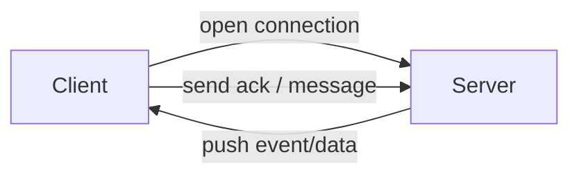

#### 요약

- **Socket / Stream 기반 비동기 통신**은 서버와 클라이언트 간 **지속적인 연결 상태에서 이벤트를 실시간으로 주고받는 구조**이다.  
- 대표 기술:
  1. **WebSocket** — 양방향 통신 (Client ↔ Server)
  2. **SSE (Server-Sent Events)** — 단방향 실시간 푸시 (Server → Client)
  3. **gRPC Stream** — 프로토콜 버퍼 기반 양방향 데이터 스트리밍
- 실시간 알림, 대시보드, 채팅, IoT, 데이터 피드 등에서 사용된다.

> 실시간 비동기 통신은 “지속 연결”을 기반으로 데이터 흐름을 관리한다.
>
> * **WebSocket** → 실시간 양방향 통신 (채팅, 협업, 알림 등)
> * **SSE** → 단방향 푸시, 단순 대시보드형 서비스
> * **gRPC Stream** → 고성능, 구조적 서비스 간 데이터 스트림
>
> 각 프레임워크는 이 세 가지 기술을 모두 지원하며,
> 목적에 맞는 통신 방식을 선택하면 **지속 연결 기반의 안정적인 비동기 시스템**을 구현할 수 있다.
> REST API는 요청/응답 모델에 한정되지만,  
> **Socket & Stream** 구조는 연결을 유지한 채 데이터 변화를 “즉시 푸시”할 수 있어  
> **저지연 실시간 서비스** 구현에 최적화되어 있다.

---

##### 참고자료

- [WebSocket RFC 6455](https://datatracker.ietf.org/doc/html/rfc6455)
- [Server-Sent Events (MDN)](https://developer.mozilla.org/en-US/docs/Web/API/Server-sent_events)
- [gRPC Streaming](https://grpc.io/docs/what-is-grpc/core-concepts/)
- [Spring WebSocket Docs](https://docs.spring.io/spring-framework/reference/web/websocket.html)
- [FastAPI WebSocket Docs](https://fastapi.tiangolo.com/advanced/websockets/)
- [NestJS WebSocket](https://docs.nestjs.com/websockets/gateways)

---

### 1. 실시간 비동기 통신 구조 개요



| 기술              | 연결 유지 방식         | 방향성                | 특징              |
| --------------- | ---------------- | ------------------ | --------------- |
| **WebSocket**   | TCP 양방향 채널       | 양방향                | 채팅·게임·협업툴       |
| **SSE**         | HTTP 단일 연결       | 단방향(Server→Client) | 알림·대시보드·로그 스트림  |
| **gRPC Stream** | HTTP/2 기반 지속 스트림 | 양방향 / 단방향          | 고성능·바이너리 기반·IoT |

---

## 2. Spring Boot — `WebSocket / SSE / gRPC Stream`

### 2.1 Gradle 설정

```kotlin
// build.gradle.kts
dependencies {
    implementation("org.springframework.boot:spring-boot-starter-websocket")
    implementation("org.springframework.boot:spring-boot-starter-webflux")
    implementation("net.devh:grpc-server-spring-boot-starter:3.0.0")
}
```

---

### 2.2 WebSocket 구현

```kotlin
// WebSocketConfig.kt
@Configuration
@EnableWebSocket
class WebSocketConfig : WebSocketConfigurer {
    override fun registerWebSocketHandlers(registry: WebSocketHandlerRegistry) {
        registry.addHandler(ChatHandler(), "/ws/chat").setAllowedOrigins("*")
    }
}

// ChatHandler.kt
class ChatHandler : TextWebSocketHandler() {
    override fun handleTextMessage(session: WebSocketSession, message: TextMessage) {
        println("📨 Received: ${message.payload}")
        session.sendMessage(TextMessage("Echo: ${message.payload}"))
    }
}
```

---

### 2.3 Server-Sent Events (SSE)

```kotlin
@RestController
@RequestMapping("/sse")
class SseController {
    @GetMapping("/stream", produces = [MediaType.TEXT_EVENT_STREAM_VALUE])
    fun stream(): Flux<String> {
        return Flux.interval(Duration.ofSeconds(1))
            .map { "data: heartbeat-${System.currentTimeMillis()}\n\n" }
    }
}
```

> ✅ **특징:**
>
> * HTTP 연결을 유지하며 서버가 클라이언트로 데이터를 지속 전송
> * 별도의 라이브러리 없이 Spring WebFlux로 구현 가능
> * 브라우저 기본 지원(EventSource API)

---

### 2.4 gRPC Stream 예시

```proto
// chat.proto
syntax = "proto3";
service ChatService {
  rpc Chat(stream ChatMessage) returns (stream ChatMessage);
}
message ChatMessage {
  string user = 1;
  string message = 2;
}
```

> ⚙️ Spring Boot에서 `net.devh.grpc` Starter를 사용하면
> gRPC 서버/클라이언트 설정을 간단히 통합 가능.

---

## 3. FastAPI — `WebSocket / SSE`

### 3.1 WebSocket

```python
from fastapi import FastAPI, WebSocket

app = FastAPI()

@app.websocket("/ws/chat")
async def chat(websocket: WebSocket):
    await websocket.accept()
    while True:
        data = await websocket.receive_text()
        await websocket.send_text(f"Echo: {data}")
```

---

### 3.2 Server-Sent Events

```python
from fastapi.responses import StreamingResponse
import asyncio

@app.get("/sse")
async def sse():
    async def event_stream():
        while True:
            yield f"data: heartbeat-{int(asyncio.get_event_loop().time())}\n\n"
            await asyncio.sleep(1)
    return StreamingResponse(event_stream(), media_type="text/event-stream")
```

> 💡 **특징:**
> FastAPI는 ASGI 기반이므로 WebSocket과 SSE 모두 비동기 루프에서 안정적으로 동작한다.

---

## 4. Express / NestJS — `socket.io / ws / SSE`

### 4.1 Express WebSocket (ws)

```bash
npm install ws
```

```javascript
// server.js
import { WebSocketServer } from "ws";

const wss = new WebSocketServer({ port: 8080 });
wss.on("connection", (ws) => {
  console.log("🔗 Connected");
  ws.on("message", (msg) => ws.send(`Echo: ${msg}`));
});
```

---

### 4.2 Express SSE

```javascript
import express from "express";
const app = express();

app.get("/sse", (req, res) => {
  res.setHeader("Content-Type", "text/event-stream");
  res.setHeader("Cache-Control", "no-cache");

  const interval = setInterval(() => {
    res.write(`data: ${Date.now()}\n\n`);
  }, 1000);

  req.on("close", () => clearInterval(interval));
});

app.listen(3000, () => console.log("🚀 SSE Server running"));
```

---

### 4.3 NestJS WebSocket Gateway

```typescript
import {
  WebSocketGateway,
  SubscribeMessage,
  MessageBody,
  WebSocketServer,
} from "@nestjs/websockets";
import { Server } from "socket.io";

@WebSocketGateway({ cors: true })
export class ChatGateway {
  @WebSocketServer() server: Server;

  @SubscribeMessage("message")
  handleMessage(@MessageBody() message: string) {
    console.log("📨", message);
    this.server.emit("message", `Echo: ${message}`);
  }
}
```

> ✅ **특징:**
>
> * `socket.io` 기반으로 WebSocket + fallback(HTTP long-polling) 모두 지원
> * NestJS의 DI 컨텍스트와 결합되어 모듈 단위 관리 용이

---

## 5. 비교 및 운영 전략

| 항목         | WebSocket            | SSE                | gRPC Stream                  |
| ---------- | -------------------- | ------------------ | ---------------------------- |
| **연결 방향**  | 양방향                  | 단방향(Server→Client) | 양방향                          |
| **프로토콜**   | TCP / WS             | HTTP               | HTTP/2                       |
| **데이터 포맷** | Text / JSON          | Text               | Binary (protobuf)            |
| **지원 환경**  | Browser, Mobile, IoT | Browser 중심         | Microservice / Native Client |
| **장점**     | 빠른 응답, 쌍방향           | 간단, 브라우저 내장        | 효율적, 고성능                     |
| **단점**     | 연결 관리 복잡             | 클라이언트→서버 전송 불가     | 설정 복잡, 디버깅 어려움               |
| **적용 사례**  | 채팅, 게임, 협업           | 대시보드, 알림           | IoT, ML 모델 스트림               |

---

## 6. 선택 가이드

| 시나리오                      | 권장 기술           | 이유              |
| ------------------------- | --------------- | --------------- |
| **양방향 통신(채팅, 협업툴)**       | WebSocket       | 실시간 메시지 양방향     |
| **대시보드 / 알림 푸시**          | SSE             | 단방향, 저부하        |
| **ML/IoT 데이터 스트림**        | gRPC Stream     | Binary 고속 전송    |
| **서버-클라이언트 이벤트 브로드캐스트**   | SSE / socket.io | 단순 푸시 중심        |
| **Microservice 간 실시간 통신** | gRPC Stream     | 프로토콜 통합 및 성능 우수 |

---

### 📊 프레임워크별 지원 현황

| Framework            | WebSocket          | SSE         | gRPC Stream       |
| -------------------- | ------------------ | ----------- | ----------------- |
| **Spring Boot**      | ✅                  | ✅ (WebFlux) | ✅ (net.devh.grpc) |
| **FastAPI**          | ✅                  | ✅           | ⚙️ (grpc.aio)     |
| **Express / NestJS** | ✅ (socket.io / ws) | ✅           | ⚙️ (grpc-js)      |

---

### 운영 모니터링 팁

| 항목            | 설명                            | 도구                                  |
| ------------- | ----------------------------- | ----------------------------------- |
| **연결 수 모니터링** | WebSocket 세션 카운트 / SSE 연결 유지율 | Prometheus + Custom Metrics         |
| **메시지 처리량**   | 초당 송수신 이벤트                    | Grafana Dashboard                   |
| **에러 추적**     | 연결 끊김, Ping/Pong 실패           | Loki / ELK Stack                    |
| **스케일링**      | Sticky Session 필요 (WebSocket) | Nginx / HAProxy / Socket.io Adapter |

---
