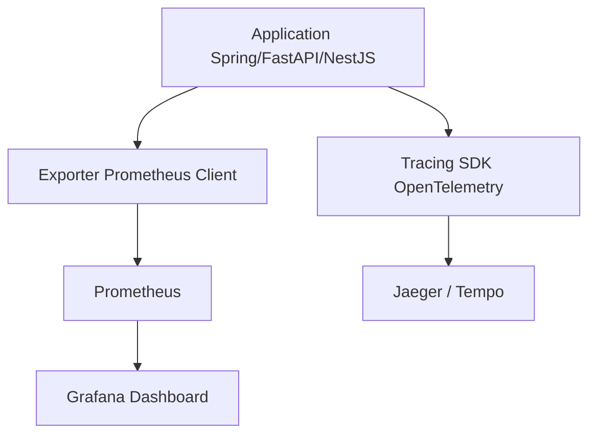

#### 요약

- 비동기 시스템(Async System)은 I/O 병렬성과 이벤트 루프를 활용해 고성능을 구현하지만,  
  **적절한 모니터링·지표 관리·자원 튜닝** 없이는 병목과 리소스 낭비가 발생할 수 있다.  
- 본 문서는 **Prometheus / Grafana / OpenTelemetry** 기반으로  
  비동기 서비스의 **성능 추적(Tracing)** 및 **자원 사용 최적화(Tuning)** 방법을 설명한다.  

> 비동기 시스템의 핵심은 단순 “비동기 호출”이 아니라,
> **자원 제어 + 관찰성(Observability)** 이다.
> Prometheus와 Grafana를 통해 지표를 수집하고,
> OpenTelemetry + Jaeger로 호출 경로를 시각화하면
> **성능 병목, 부하 분산, 이벤트 루프 병해 구간**을 정량적으로 분석할 수 있다.
>
> 즉, **비동기 시스템의 완성은 모니터링까지 포함된 상태에서 비로소 이뤄진다.**
> 모니터링은 단순한 상태 확인이 아니라,  
> **비동기 아키텍처의 병목·스레드풀·이벤트 루프 성능을 실시간 가시화하는 핵심 도구**이다.  
> 로그·메트릭·트레이스를 통합하면 시스템의 전체 흐름을 한눈에 파악할 수 있다.

---

##### 참고자료

- [Prometheus Docs](https://prometheus.io/docs/introduction/overview/)
- [Grafana Observability Guide](https://grafana.com/docs/grafana/latest/)
- [OpenTelemetry](https://opentelemetry.io/)
- [Jaeger Tracing](https://www.jaegertracing.io/docs/)
- [Micrometer Metrics](https://micrometer.io/)

---

### 1. 모니터링 아키텍처 개요



| 구성요소                              | 역할                     |
| --------------------------------- | ---------------------- |
| **Prometheus**                    | 애플리케이션의 지표(Metrics) 수집 |
| **Grafana**                       | 메트릭 시각화 및 알림 관리        |
| **OpenTelemetry (OTel)**          | 분산 트레이싱, 로그 연동         |
| **Jaeger / Tempo**                | 트레이스 저장 및 탐색           |
| **Micrometer / client libraries** | 언어별 지표 수집 어댑터          |

---

## 2. Spring Boot — `Micrometer + Prometheus`

### 2.1 Gradle 설정

```kotlin
// build.gradle.kts
dependencies {
    implementation("org.springframework.boot:spring-boot-starter-actuator")
    implementation("io.micrometer:micrometer-registry-prometheus")
}
```

---

### 2.2 Prometheus 설정

```yaml
# application.yml
management:
  endpoints:
    web:
      exposure:
        include: ["prometheus", "health"]
  metrics:
    tags:
      application: async-service
```

> 📍 `/actuator/prometheus` 엔드포인트가 자동 노출됨

---

### 2.3 주요 지표

| 메트릭                                     | 설명                    |
| --------------------------------------- | --------------------- |
| `jvm_threads_live_threads`              | JVM 스레드 수             |
| `http_server_requests_seconds_count`    | 요청 수                  |
| `http_server_requests_seconds_max`      | 요청 처리 시간 (최대)         |
| `spring.data.source.connections.active` | DB 커넥션 수              |
| `executor.active`                       | ThreadPoolExecutor 상태 |

---

### 2.4 Grafana 대시보드 예시

| 패널                             | 설명              |
| ------------------------------ | --------------- |
| **Request Rate (RPS)**         | 초당 요청 처리량       |
| **ThreadPool Usage**           | 활성 스레드 수 / 큐 대기 |
| **Response Latency (p95/p99)** | 응답 지연시간         |
| **Heap / GC Activity**         | JVM 메모리 사용 추이   |

---

### 2.5 Thread Pool 튜닝 가이드

| 설정 항목                | 권장값          | 설명        |
| -------------------- | ------------ | --------- |
| `core-pool-size`     | CPU 코어 수 × 2 | 기본 워커 스레드 |
| `max-pool-size`      | CPU 코어 수 × 4 | Burst 대응  |
| `queue-capacity`     | 100~500      | 큐 대기 제한   |
| `keep-alive-seconds` | 30           | 유휴 스레드 해제 |

> ⚙️ **실제 적용:**
> `ThreadPoolTaskExecutor` 또는 `@Async` 기반 비동기 호출 시
> 위 설정을 사용해 **CPU 효율과 동시성 안정성**을 확보.

---

## 3. FastAPI — `Prometheus + OpenTelemetry`

### 3.1 설치

```bash
pip install prometheus-fastapi-instrumentator opentelemetry-api opentelemetry-sdk opentelemetry-exporter-otlp
```

---

### 3.2 Prometheus Metrics

```python
from fastapi import FastAPI
from prometheus_fastapi_instrumentator import Instrumentator

app = FastAPI()
Instrumentator().instrument(app).expose(app)
```

> 📍 `/metrics` 엔드포인트 자동 노출
> 지표: `http_request_duration_seconds`, `process_cpu_seconds_total`, `asyncio_tasks_total` 등

---

### 3.3 OpenTelemetry Tracing

```python
from opentelemetry import trace
from opentelemetry.sdk.trace import TracerProvider
from opentelemetry.sdk.trace.export import BatchSpanProcessor, ConsoleSpanExporter

provider = TracerProvider()
processor = BatchSpanProcessor(ConsoleSpanExporter())
provider.add_span_processor(processor)
trace.set_tracer_provider(provider)

tracer = trace.get_tracer(__name__)

@app.get("/task")
async def async_task():
    with tracer.start_as_current_span("async_task_span"):
        return {"status": "ok"}
```

> ✅ 비동기 루프 내에서도 Trace Context 자동 전파
> Jaeger나 Tempo로 OTLP 전송 시 분산 추적 가능

---

## 4. Express / NestJS — `Prometheus + OpenTelemetry`

### 4.1 설치 및 설정

```bash
npm install prom-client @opentelemetry/api @opentelemetry/sdk-node
```

```typescript
// metrics.ts
import client from "prom-client";
client.collectDefaultMetrics();

export const httpRequestDuration = new client.Histogram({
  name: "http_request_duration_seconds",
  help: "Request duration histogram",
  buckets: [0.1, 0.3, 0.5, 1, 3, 5],
});
```

```typescript
// server.ts
import express from "express";
import { httpRequestDuration } from "./metrics.js";

const app = express();
app.get("/metrics", async (_, res) => res.end(await client.register.metrics()));
app.get("/", async (_, res) => {
  const end = httpRequestDuration.startTimer();
  res.json({ status: "ok" });
  end();
});

app.listen(3000, () => console.log("🚀 Express Prometheus metrics enabled"));
```

---

### 4.2 NestJS + OpenTelemetry

```typescript
import { Controller, Get } from "@nestjs/common";
import { trace } from "@opentelemetry/api";

@Controller()
export class AppController {
  @Get("/trace")
  async traceExample() {
    const span = trace.getTracer("default").startSpan("traceExample");
    span.end();
    return { trace: "recorded" };
  }
}
```

> ✅ NestJS는 `@opentelemetry/instrumentation-nestjs-core` 패키지로
> 서비스 간 트레이싱을 자동 연계할 수 있다.

---

## 5. 공통 모니터링 전략

| 항목                  | 목적              | 주요 기술                         |
| ------------------- | --------------- | ----------------------------- |
| **Metrics (수치 지표)** | 자원 사용량, 처리량 가시화 | Prometheus + Grafana          |
| **Tracing (분산 추적)** | 요청 경로 추적, 병목 식별 | OpenTelemetry + Jaeger        |
| **Logging (로그 통합)** | 서비스별 로그 수집 및 상관 | Loki / ELK Stack              |
| **Alerting (경보)**   | 장애 감지 및 알림 전송   | Grafana Alert / Slack Webhook |
| **Visualization**   | 시스템 상태 대시보드화    | Grafana Panels                |

---

## 6. 비동기 성능 튜닝 핵심 포인트

| 항목                     | 개선 전략                             | 적용 예시                                  |
| ---------------------- | --------------------------------- | -------------------------------------- |
| **I/O 대기**             | 비동기 I/O 사용 (non-blocking DB/HTTP) | async/await, WebClient, Axios          |
| **Thread Pool 관리**     | CPU 대비 워커 수 조정                    | @Async / Executor 설정                   |
| **DB Connection Pool** | max/min 크기 최적화                    | HikariCP, SQLAlchemy pool              |
| **Caching 전략**         | Redis / Memory Cache 활용           | FastAPI Cache, Spring Cache            |
| **Queue 병렬도 조정**       | Worker 수 병렬화                      | Celery concurrency, BullMQ concurrency |
| **지연 모니터링**            | p95, p99 추적                       | Prometheus Histogram, Grafana panel    |
| **GC 튜닝 (JVM)**        | Heap 사이즈 및 GC 방식 최적화              | G1GC / ZGC 설정                          |

---

### 모니터링 예시 대시보드 구조

| 영역              | 주요 패널                    | 단위         |
| --------------- | ------------------------ | ---------- |
| **API 성능**      | 요청 수, 에러율, 응답시간(p95/p99) | req/s, ms  |
| **Async Queue** | 대기 Job 수, 처리 성공/실패율      | count      |
| **Worker 자원**   | CPU, 메모리, 이벤트 루프 상태      | %          |
| **네트워크**        | Throughput, Latency      | MB/s       |
| **Tracing**     | 서비스별 트랜잭션 플로우            | span count |

---


