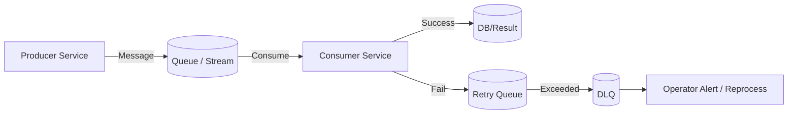
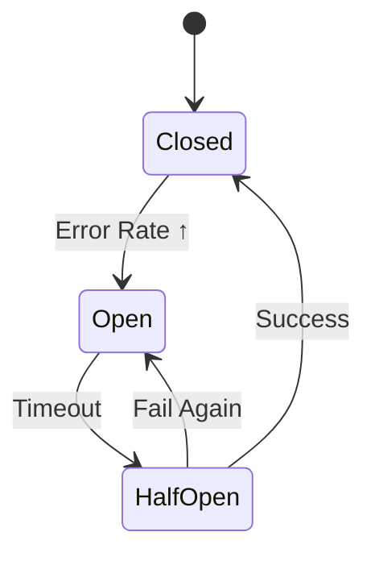
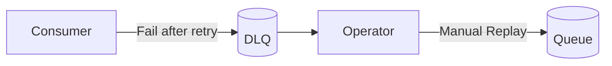
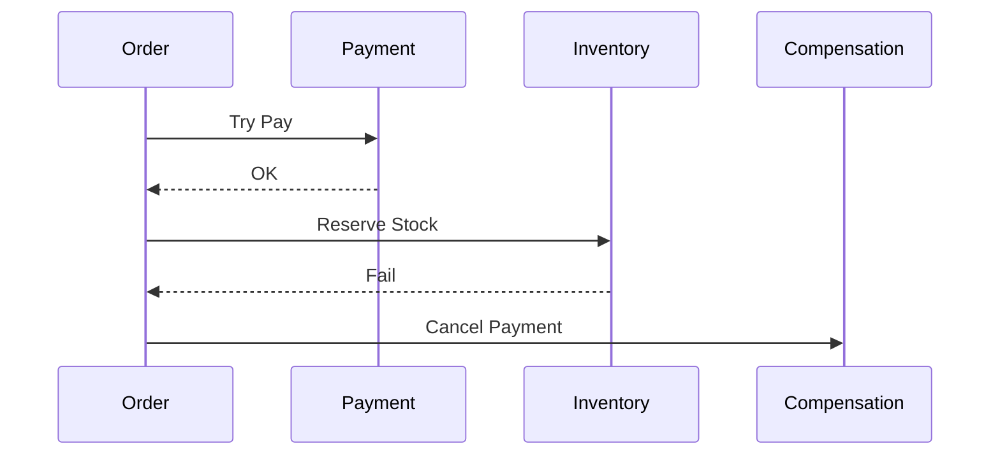

**version: 1.0.0**

#### 요약

- 비동기 시스템은 병렬성과 확장성은 높지만,  
  메시지 손실·중복 처리·트랜잭션 불일치 등의 오류가 발생하기 쉽다.  
- 본 문서는 비동기 시스템에서의 **오류 감지, 재시도, 장애 격리, 복구 설계 패턴**을 정리한다.  
- 주요 복구 전략:
  1. Retry / Delay Queue 기반 재처리  
  2. Circuit Breaker(회로 차단기)  
  3. DLQ(Dead Letter Queue)  
  4. 보상 트랜잭션(Saga Pattern)  

> 비동기 시스템의 회복력(Resilience)은 단일 서비스가 아닌 **시스템 전체의 복원 경로 설계**로 완성된다.
>
> * **Retry / Backoff** → 일시 장애 복구
> * **Circuit Breaker** → 시스템 보호
> * **DLQ / Replay** → 데이터 손실 방지
> * **Saga Compensation** → 트랜잭션 일관성 복원
>
> 즉, “**장애를 피하는 시스템**”이 아닌 “**장애에서 돌아올 수 있는 시스템**”이 진정한 고가용성 비동기 아키텍처이다.
 
> 복원력(Resilience)은 단순 예외 처리 코드가 아니라  
> **시스템이 장애를 감지하고 스스로 복구할 수 있는 구조적 능력**이다.  
> 즉, 장애 발생을 완전히 막는 것이 아니라 “정상으로 되돌아올 수 있게 하는 것”이 핵심이다.

---

##### 참고자료

- [Resilience4j Docs](https://resilience4j.readme.io/)
- [AWS Fault Tolerance Patterns](https://aws.amazon.com/architecture/)
- [Enterprise Integration Patterns](https://www.enterpriseintegrationpatterns.com/)
- [Google SRE Workbook - Handling Failures](https://sre.google/workbook/)

---

### 1. 에러 복구 아키텍처 개요



| 구성요소                        | 역할                          |
| --------------------------- | --------------------------- |
| **Retry Queue**             | 일시적 장애 발생 시 재처리를 위한 임시 큐    |
| **DLQ (Dead Letter Queue)** | 반복 실패 메시지 보관                |
| **Circuit Breaker**         | 장애 구간의 호출 중단                |
| **Saga Orchestrator**       | 보상 트랜잭션 수행                  |
| **Alert System**            | 관리자 알림 (Slack, PagerDuty 등) |

---

##  2. Retry 전략

### 2.1 Retry 기본 개념

| 항목                      | 설명                             |
| ----------------------- | ------------------------------ |
| **Fixed Retry**         | 일정 간격으로 재시도 (예: 3회, 5초 간격)     |
| **Exponential Backoff** | 시도할수록 간격을 늘림 (2s → 4s → 8s)    |
| **Jitter**              | Backoff 간격에 랜덤성을 추가해 트래픽 집중 완화 |
| **Circuit Trigger**     | 반복 실패 시 회로 차단으로 서비스 보호         |

---

### 2.2 Spring Boot — `@Retryable` / Resilience4j

```kotlin
@Service
class PaymentService {

    @Retryable(
        value = [IOException::class],
        maxAttempts = 3,
        backoff = Backoff(delay = 2000, multiplier = 2.0)
    )
    fun processPayment() {
        println("💳 Processing payment...")
        if (Math.random() < 0.7) throw IOException("Temporary failure")
        println("✅ Payment success")
    }

    @Recover
    fun recover(ex: IOException) {
        println("🚨 Payment failed after retries: ${ex.message}")
    }
}
```

> ✅ `@Retryable`은 Spring Retry의 기본 제공 기능이며,
> `Resilience4j` 라이브러리로 CircuitBreaker, RateLimiter와 함께 통합 가능.

---

### 2.3 Node.js (BullMQ) Retry

```typescript
await queue.add("job", data, {
  attempts: 3,
  backoff: { type: "exponential", delay: 1000 },
});
```

> ⚙️ **BullMQ의 Retry**
>
> * `attempts`로 최대 재시도 횟수 지정
> * `backoff`로 지연 증가율 설정
> * 실패 시 `Failed Event` 트리거 발생

---

## 🟩 3. Circuit Breaker (회로 차단기)

### 3.1 개념 요약

| 상태            | 설명                 |
| ------------- | ------------------ |
| **Closed**    | 정상 상태, 요청 통과       |
| **Open**      | 장애 감지 후 요청 차단      |
| **Half-Open** | 복구 시도 중 (일부 요청 허용) |



---

### 3.2 Spring Boot — Resilience4j CircuitBreaker

```yaml
resilience4j.circuitbreaker:
  instances:
    asyncService:
      slidingWindowSize: 10
      failureRateThreshold: 50
      waitDurationInOpenState: 10s
```

```kotlin
@Service
class AsyncClient {
    @CircuitBreaker(name = "asyncService", fallbackMethod = "fallback")
    fun callExternal() {
        println("🔗 External call")
        if (Math.random() < 0.5) throw RuntimeException("Failure")
    }

    fun fallback(ex: Throwable) {
        println("⚠️ Circuit fallback: ${ex.message}")
    }
}
```

> ✅ 장애 구간을 자동으로 감지하고 회복되기 전까지 트래픽 차단

---

### 3.3 Node.js — Opossum Circuit Breaker

```bash
npm install opossum
```

```javascript
import CircuitBreaker from "opossum";

async function unstableRequest() {
  if (Math.random() < 0.5) throw new Error("Fail");
  return "Success";
}

const breaker = new CircuitBreaker(unstableRequest, { timeout: 3000, errorThresholdPercentage: 50 });
breaker.fallback(() => "Fallback result");
breaker.on("open", () => console.log("⚡ Circuit opened"));
breaker.on("close", () => console.log("✅ Circuit closed"));
```

---

## 🟨 4. DLQ (Dead Letter Queue) & 보상 트랜잭션 (Saga)

### 4.1 DLQ 처리 흐름



| 항목         | 설명                                              |
| ---------- | ----------------------------------------------- |
| **DLQ 목적** | 처리 실패 메시지 격리 및 분석                               |
| **Replay** | 수동 재처리 혹은 자동 재전송                                |
| **구현 위치**  | Kafka DLQ Topic / RabbitMQ Dead-Letter Exchange |

---

### 4.2 RabbitMQ DLX 예시

```kotlin
@Bean
fun dlxQueue(): Queue = Queue("order.dlx.queue")

@Bean
fun dlxExchange(): DirectExchange = DirectExchange("order.dlx.exchange")

@Bean
fun dlxBinding(): Binding =
    BindingBuilder.bind(dlxQueue()).to(dlxExchange()).with("order.dlx.key")
```

---

### 4.3 보상 트랜잭션 (Saga Pattern)



> ✅ **Saga 핵심:**
> 트랜잭션 실패 시 “보상(Compensating)” 작업으로 시스템 일관성 유지.
> 예: 결제 성공 → 재고 실패 → 결제 취소

---

## 🧩 5. 장애 탐지 및 운영 전략

| 항목              | 도구 / 방법                     | 설명                    |
| --------------- | --------------------------- | --------------------- |
| **에러율 모니터링**    | Prometheus + Grafana        | 요청 실패율, Circuit 상태 지표 |
| **DLQ 처리 모니터링** | Kafka UI / RabbitMQ Console | 메시지 누적 감시             |
| **Retry 로그 추적** | Loki / ELK Stack            | 재시도 히스토리 분석           |
| **Alert 연동**    | Slack / PagerDuty           | 장애 시 관리자 즉시 알림        |
| **자동 복구**       | Cron Replay Script          | DLQ → 원본 큐 복원         |

---

## 🧠 6. 프레임워크별 복원 전략 비교

| 항목                  | Spring Boot                 | FastAPI                     | Express / NestJS         |
| ------------------- | --------------------------- | --------------------------- | ------------------------ |
| **Retry**           | `@Retryable` / Resilience4j | Retry middleware            | BullMQ attempts/backoff  |
| **Circuit Breaker** | Resilience4j                | aiohttp CircuitHandler      | Opossum                  |
| **DLQ 지원**          | Kafka / RabbitMQ DLX        | Celery Retry / DLQ          | BullMQ DLQ Queue         |
| **Saga 보상 트랜잭션**    | StateMachine / Choreography | Celery Chain + Compensation | EventEmitter / CQRS Saga |

---

### 📊 장애 대응 시나리오 요약

| 시나리오            | 대응 전략                 |
| --------------- | --------------------- |
| **일시적 네트워크 실패** | Retry + Backoff       |
| **외부 API 과부하**  | Circuit Breaker       |
| **영구적 데이터 오류**  | DLQ 격리 후 수동 복구        |
| **트랜잭션 불일치**    | Saga Compensation     |
| **장애 패턴 반복 발생** | Alert → Root Cause 분석 |

---
