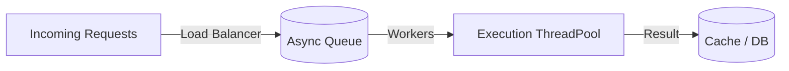
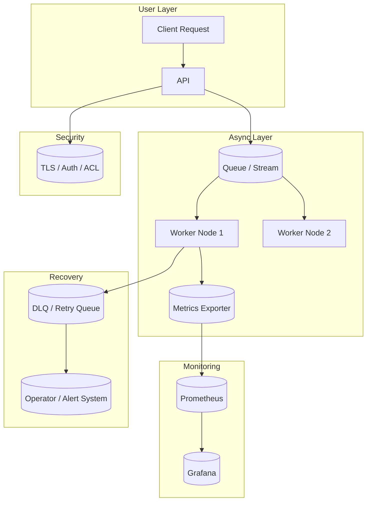

#### 요약

- 비동기 시스템은 **확장성(Scalability)**, **복원력(Resilience)**, **고성능(Performance)** 이라는 세 가지 핵심 목표를 가진다.  
- 그러나 높은 병렬성과 분산 구조는 **보안, 데이터 일관성, 관찰성 부족** 문제로 이어질 수 있다.  
- 본 문서는 Spring Boot / FastAPI / Express / NestJS 환경에서  
  비동기 시스템을 안정적으로 운영하기 위한 **보안·성능·운영 모범 사례 10대 원칙**을 제시한다.

> “비동기”는 단순한 비동기 호출이 아니라,  
> **확장 가능한 아키텍처·안정적인 운영·지속적인 관찰성**을 포함한 종합적 기술 체계이다.
> 비동기 시스템의 성공은 “성능”보다 “예측 가능성”에 달려 있다.
>
> * 성능은 **스케일링**으로 해결할 수 있지만,
> * **일관성·복원력·보안**은 설계 단계에서부터 반영해야 한다.
>
> 즉, “빠른 시스템”이 아니라 “**문제가 생겨도 무너지지 않는 시스템**”이
> 진정한 비동기 백엔드의 완성형이다.

##### 안정적 비동기 아키텍처의 3대 원칙

| 원칙                          | 설명                             |
| --------------------------- | ------------------------------ |
| **1️⃣ 견고성 (Resilience)**    | 장애가 발생해도 시스템이 자동 복구 가능해야 함     |
| **2️⃣ 가시성 (Observability)** | 병목·오류·리소스 상태를 실시간으로 추적 가능해야 함  |
| **3️⃣ 일관성 (Consistency)**   | 메시지, 트랜잭션, 데이터 상태 간 불일치가 없어야 함 |


##### 참고자료

- [OWASP ASYNC SECURITY GUIDE](https://owasp.org/)
- [Google SRE Handbook](https://sre.google/books/)
- [CNCF Observability Whitepaper](https://tag-observability.cncf.io/)
- [Netflix Chaos Engineering Blog](https://netflixtechblog.com/)

---

## 1. 비동기 시스템 10대 운영 원칙

| 원칙 | 설명 |
|------|------|
| **1️⃣ 최소 결합(Loose Coupling)** | 서비스 간 직접 의존 대신 메시징/이벤트 기반 통신 활용 |
| **2️⃣ 백프레셔 제어(Backpressure Control)** | 생산자 속도 > 소비자 속도일 때 큐/버퍼 제한 |
| **3️⃣ 멱등성(Idempotency)** | 동일 요청 반복 시 동일 결과 유지 |
| **4️⃣ 관찰성(Observability)** | 로그·메트릭·트레이스 3대 축 확보 |
| **5️⃣ 장애 격리(Fault Isolation)** | 개별 서비스 장애가 전체로 확산되지 않도록 Circuit Breaker 적용 |
| **6️⃣ 데이터 일관성(Data Consistency)** | Outbox / Saga / Compensation 패턴 활용 |
| **7️⃣ 보안(Security)** | 인증·암호화·민감정보 보호 강화 |
| **8️⃣ 오토스케일링(Auto Scaling)** | 부하에 따른 Worker 자동 확장 |
| **9️⃣ 배포 일관성(Deployment Consistency)** | Canary / Blue-Green / Rolling 배포 적용 |
| **🔟 운영 자동화(Operational Automation)** | 모니터링 기반 자동 대응 및 Alert 통합 |

---

## 2. 보안 모범 사례 (Security Hardening)

| 영역 | 모범사례 | 적용 방법 |
|------|-----------|-----------|
| **전송 계층** | TLS(HTTPS/WSS) 암호화 | Let's Encrypt / Nginx Reverse Proxy |
| **API 인증** | JWT / OAuth2 / API Key | Spring Security, FastAPI OAuth2, NestJS Guards |
| **비밀 관리** | Secrets Manager 사용 | Docker Secret / Vault / AWS Secrets |
| **MQ 접근 제어** | Topic / Queue ACL | Kafka ACL, RabbitMQ VHost, Redis Auth |
| **로그 보호** | 민감정보 필터링 | JSON masking / PII filter |
| **모니터링 접근 제한** | Dashboard 인증 | Grafana Auth, RBAC |
| **에러 노출 방지** | 표준 에러 응답 통일 | CustomExceptionHandler |

```yaml
# 예시: Spring Boot actuator 보안
management:
  endpoints:
    web:
      exposure:
        include: ["prometheus"]
  endpoint:
    health:
      show-details: "never"
```

> ✅ 보안은 설정(Configuration)으로 시작되고,
> 인증(Authentication)과 권한(Authorization)으로 완성된다.

---

## 3. 성능 및 확장성 튜닝

| 항목                     | 개선 전략                | 예시                                       |
| ---------------------- | -------------------- | ---------------------------------------- |
| **Thread Pool**        | CPU 코어 × 2~4         | Spring TaskExecutor / Celery concurrency |
| **Async Queue Size**   | 대기 Job 제한            | BullMQ concurrency / Kafka partitions    |
| **I/O 비동기화**           | Non-blocking HTTP/DB | WebClient, Async SQLAlchemy              |
| **Batch Size 조정**      | Stream Fetch 크기 최적화  | Kafka Consumer batch.size                |
| **Connection Pool 관리** | DB Pool / Redis Pool | HikariCP / aioredis pool                 |
| **GC 튜닝(JVM)**         | G1GC / ZGC 설정        | `-XX:+UseG1GC`                           |
| **메모리 캐싱**             | Hot data 캐싱          | Redis / Caffeine                         |
| **HTTP KeepAlive**     | 연결 재활용               | ConnectionPool 설정                        |



---

## 4. 모니터링 및 알림 체계

| 항목                | 설명                | 도구                            |
| ----------------- | ----------------- | ----------------------------- |
| **Metrics**       | 처리량, 대기열, 실패율 수집  | Prometheus + Micrometer       |
| **Logs**          | 구조화 로그(JSON) + 수집 | Loki / ELK                    |
| **Tracing**       | 호출 경로 추적          | OpenTelemetry + Jaeger        |
| **Alerting**      | 임계값 기반 자동 알림      | Grafana Alert / Slack Webhook |
| **Chaos Testing** | 장애 주입으로 복원력 검증    | Gremlin / Litmus              |

```yaml
# 예시: Grafana Alert Rule
apiVersion: 1
groups:
  - name: async-service-alerts
    rules:
      - alert: HighFailureRate
        expr: rate(http_requests_total{status="500"}[5m]) > 0.05
        for: 2m
        labels:
          severity: critical
```

---

## 5. 배포 및 운영 전략

| 방식                           | 특징              | 권장 상황                     |
| ---------------------------- | --------------- | ------------------------- |
| **Rolling Update**           | 점진적 교체, 다운타임 없음 | 일반 서비스 배포                 |
| **Blue-Green**               | 완전 분리 환경 전환     | MQ/Stream 변경 시            |
| **Canary Deployment**        | 일부 트래픽만 신규 버전   | 성능 검증 단계                  |
| **Immutable Infrastructure** | 컨테이너 기반 버전 고정   | Kubernetes / Docker 기반 운영 |

> ⚙️ **실무 팁:**
> 비동기 시스템 배포 시에는
>
> * **메시지 포맷 변경 전**: Producer/Consumer 버전 호환성 점검
> * **스키마 변경 시**: Schema Registry 사용

---

## 6. 코드 품질 및 예외 처리 가이드

| 항목                           | 모범 사례                     | 예시                                                      |
| ---------------------------- | ------------------------- | ------------------------------------------------------- |
| **Idempotency**              | 동일 요청 반복 시 동일 결과 보장       | Request ID 기반 Dedup                                     |
| **Graceful Shutdown**        | 종료 시 Queue 소비 중단 후 Commit | SIGTERM Hook                                            |
| **Global Exception Handler** | 표준 에러 포맷 통일               | Spring `@ControllerAdvice`, FastAPI `exception_handler` |
| **Retry Logging**            | 재시도 로그 분리 관리              | Log Level: WARN                                         |
| **DLQ Tagging**              | 실패 메시지에 원인 태그 추가          | DLX Header                                              |

---

## 7. 프레임워크별 베스트 프랙티스 요약

| 항목            | Spring Boot           | FastAPI               | Express / NestJS     |
| ------------- | --------------------- | --------------------- | -------------------- |
| **비동기 처리**    | @Async / WebFlux      | asyncio / Celery      | Promise / BullMQ     |
| **로깅 / 모니터링** | Micrometer / Actuator | prometheus-fastapi    | prom-client          |
| **보안 구성**     | Spring Security       | OAuth2Middleware      | Guards / JWT         |
| **오토스케일링**    | HPA + Metrics Adapter | KEDA (Redis / Celery) | KEDA (BullMQ)        |
| **배포 방식**     | Helm + ArgoCD         | Docker + FastAPI      | Docker Compose / K8s |

---

### 운영 전반 요약 다이어그램



---


