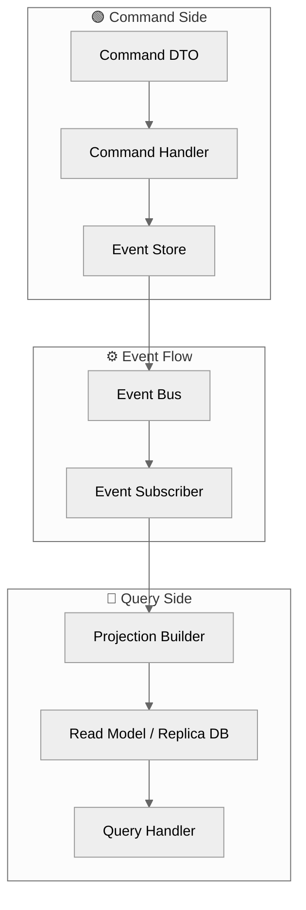
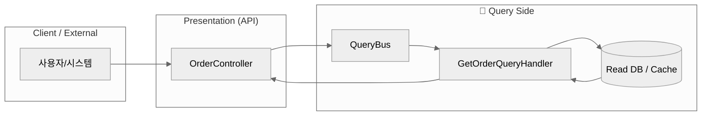
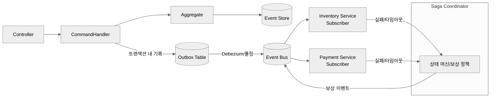

#### 요약

- **CQRS (Command Query Responsibility Segregation)** 는  
  명령(Command)과 조회(Query)를 분리하여 서비스 확장성과 일관성을 높이는 아키텍처 패턴이다.  
- **Event Sourcing** 은 엔티티의 “상태”가 아닌,  
  **상태 변화를 일으킨 이벤트들의 흐름(Event Stream)** 을 저장하는 방식이다.  
- 두 패턴을 결합하면, 데이터 정합성과 복구 능력을 모두 확보할 수 있다.

CQRS와 Event Sourcing은 **대규모 트랜잭션 시스템에서의 유연성, 확장성, 복구력**을 확보하기 위한 설계 전략이다.
Command는 “변화”, Event는 “기록”, Projection은 “현재 상태”를 담당한다.
이 세 축이 분리되어야만 복원 가능한 시스템이 된다.

| 구분 | CQRS       | Event Sourcing       |
| -- | ---------- | -------------------- |
| 초점 | 읽기/쓰기 분리   | 상태 변화 기록             |
| 장점 | 확장성, 독립 배포 | 감사 로그, 복원            |
| 단점 | 구조 복잡      | 스토리지 관리 필요           |
| 궁합 | 👍 매우 높음   | 👍 CQRS와 함께 사용 시 이상적 |

---

##### 참고자료
- [11.1 DDD Patterns](./11.1-ddd-patterns.md)
- [11.3 Saga Transaction](./11.3-saga-transaction.md)
- [Microsoft — CQRS Pattern](https://learn.microsoft.com/en-us/azure/architecture/patterns/cqrs)
- [Martin Fowler — Event Sourcing](https://martinfowler.com/eaaDev/EventSourcing.html)
- [Axon Framework Docs](https://docs.axoniq.io/)

---

## 1. CQRS 개념

> 명령(Command)과 조회(Query)의 책임을 분리하여 독립적인 모델로 처리하는 구조

| 구분 | Command | Query |
|------|----------|--------|
| 목적 | 상태 변경(Create, Update, Delete) | 데이터 조회(Read Only) |
| 데이터 저장소 | Master DB, Event Store | Read Replica, Cache |
| 트랜잭션 | 강한 일관성 (ACID) | 최종 일관성 (Eventually Consistent) |
| 인터페이스 | CommandHandler | QueryHandler |

###  왜 CQRS와 Event Sourcing을 사용하는가?

#### 1. **복잡한 도메인 로직 분리 (Scalability of Responsibility)**

* 대규모 시스템에서는 “읽기(read)”와 “쓰기(write)”의 비율이 다르고 복잡도도 다릅니다.
  예: 조회 95%, 변경 5%
* CQRS는 이 두 영역을 **물리적으로 분리**하여,

  * 쓰기(명령): 비즈니스 규칙, 트랜잭션 무결성
  * 읽기(조회): 성능, 캐시, 복제(Read Replica)
    → **각기 다른 확장 전략**을 적용할 수 있게 만듭니다.

#### 2. **성능 및 확장성 확보**

* Command는 Master DB, Query는 Cache·ElasticSearch·Replica DB를 사용 가능
* 읽기 모델(Read Model)은 별도 Projection으로 관리되어 **읽기 부하 분산**
* 대규모 트래픽 환경에서 **DB 락·I/O 병목을 회피** 가능

#### 3. **트랜잭션 일관성과 복원력 강화**

* Event Sourcing은 데이터 변경을 이벤트 로그로 기록하므로
  장애나 데이터 손상 시에도 **Event Replay**를 통해 상태 복구 가능
* "무엇이 일어났는가"를 모두 보존하므로 **감사 추적(Audit)** 및 **이력 관리** 용이

#### 4. **비동기 처리·이벤트 기반 확장**

* 이벤트 발행(Event Publish) 기반으로 마이크로서비스·이벤트 파이프라인 구성 가능
* 결제 완료 → 배송 준비 → 포인트 적립 등 **도메인 간 비동기 협업**
* Saga / Outbox와 결합 시 **분산 트랜잭션 보상** 구조로 확장 가능

#### 5. **데이터 모델의 자유도**

* 읽기 모델은 성능 중심으로 설계 가능 (denormalized view, 캐시 포함)
* 쓰기 모델은 무결성 중심의 도메인 모델 유지
  → 서로 다른 최적화 기준을 독립적으로 적용 가능

#### 6. **미래 확장과 감사(Audit) 대비**

* “현재 상태”가 아니라 “어떻게 변화했는가”를 기록하므로,
  회계·금융·물류 같은 변경 추적이 필요한 시스템에서 강력한 감사 기능 제공
* ML 모델 학습용 “이벤트 데이터셋”으로도 활용 가능

#### 예시 (Spring Boot)

```java
// Command Handler
@Service
public class OrderCommandService {
    public void createOrder(CreateOrderCommand command) {
        // 1. 검증
        // 2. 도메인 이벤트 생성
        // 3. Event Store에 저장
    }
}

// Query Handler
@Service
public class OrderQueryService {
    public List<OrderView> getOrdersByUser(Long userId) {
        return orderRepository.findByUserId(userId);
    }
}
```

---

## 2. CQRS 디렉토리 구조 (Java / Spring Boot 기준)

> DDD + CQRS 기반 구조. Command/Query/Event/Projection을 명확히 분리.

#### 📂 디렉토리 트리

```
src/
└── main/
    ├── java/
    │   └── com/example/order/
    │       ├── command/                        // Command(쓰기) 관련 로직
    │       │   ├── command/                    // Command 객체 정의 (DTO)
    │       │   │   ├── CreateOrderCommand.java
    │       │   │   └── CancelOrderCommand.java
    │       │   ├── handler/                    // Command 처리 로직
    │       │   │   ├── CreateOrderHandler.java
    │       │   │   └── CancelOrderHandler.java
    │       │   ├── service/                    // CommandService (비즈니스 처리)
    │       │   │   └── OrderCommandService.java
    │       │   └── bus/                        // CommandBus (명령 디스패치)
    │       │       └── CommandBus.java
    │       │
    │       ├── query/                          // Query(읽기) 관련 로직
    │       │   ├── query/                      // Query 객체 정의
    │       │   │   ├── GetOrderByIdQuery.java
    │       │   │   └── GetOrdersByUserQuery.java
    │       │   ├── handler/                    // Query 처리 로직
    │       │   │   ├── GetOrderByIdHandler.java
    │       │   │   └── GetOrdersByUserHandler.java
    │       │   ├── service/                    // QueryService (조회용 비즈니스 로직)
    │       │   │   └── OrderQueryService.java
    │       │   └── bus/                        // QueryBus (조회 디스패치)
    │       │       └── QueryBus.java
    │       │
    │       ├── event/                          // Event 발행 및 처리
    │       │   ├── domain/                     // 도메인 이벤트 정의
    │       │   │   ├── OrderCreatedEvent.java
    │       │   │   └── OrderCancelledEvent.java
    │       │   ├── publisher/                  // 이벤트 발행
    │       │   │   └── EventPublisher.java
    │       │   ├── subscriber/                 // 이벤트 구독
    │       │   │   └── EventSubscriber.java
    │       │   ├── store/                      // 이벤트 저장소 (Event Store)
    │       │   │   └── EventStore.java
    │       │   └── bus/                        // 이벤트 버스
    │       │       └── EventBus.java
    │       │
    │       ├── projection/                     // Projection: 읽기 모델 생성
    │       │   ├── OrderProjection.java        // 이벤트 기반 Read Model
    │       │   └── ProjectionHandler.java      // Projection 빌더
    │       │
    │       └── controller/                     // API 진입점 (REST Controller)
    │           └── OrderController.java
    │
    └── resources/
        └── application.yml
```

---

## 3. CQRS + Event Sourcing 구조도



✅ **특징**

* Command, Query, Event, Projection이 완전히 분리
* 도메인 이벤트 기반의 “비동기 데이터 반영” 구조
* 읽기 모델(Read Model)은 Projection으로 구성되어 고속 조회에 적합

---

## 4. Event Sourcing 핵심 로직 예시

```java
@Component
public class EventStore {

    private final List<DomainEvent> events = new ArrayList<>();

    public void append(DomainEvent event) {
        events.add(event); // Append-only 방식으로 저장
    }

    public List<DomainEvent> getAll() {
        return new ArrayList<>(events);
    }

    public Object replay() {
        Object state = new Object();
        for (DomainEvent e : events) {
            // apply() 메서드로 상태 복원
            state = apply(state, e);
        }
        return state;
    }

    private Object apply(Object state, DomainEvent event) {
        // 이벤트 타입별 상태 변화 로직
        return state;
    }
}
```
---

## 5. 운영 및 모니터링 포인트

| 항목                    | 설명                              |
| --------------------- | ------------------------------- |
| **Event Lag**         | Command 이벤트와 Projection 반영 간 지연 |
| **Replay 성능**         | 장애 복구 시 Event 재생 속도             |
| **Dead Letter Queue** | 실패 이벤트 재처리                      |
| **Version Drift**     | 이벤트 버전 호환성 관리                   |

---

### 1) 쓰기 흐름 (Command → Event Store → Event Bus → Projection)

```mermaid
%%{init: {"theme": "neutral","flowchart": {"curve": "basis"}, "themeVariables": {"fontSize":"15px"}}}%%
flowchart LR
  subgraph Client["Client / External"]
    U[사용자/시스템]
  end

  subgraph API["Presentation (API)"]
    Ctl[OrderController]
  end

  subgraph CMD["🟢 Command Side"]
    CB[CommandBus]
    CH[CreateOrderHandler]
    AGG[Aggregate Root<br/>OrderAggregate]
    ES[(Event Store)]
  end

  subgraph BUS["⚙️ Event Flow"]
    EB[(Event Bus)]
  end

  subgraph READ["🔵 Read Side / Projection"]
    SUB[EventSubscriber]
    PROJ[ProjectionBuilder]
    RDB[(Read DB / Cache)]
  end

  U --> Ctl --> CB --> CH --> AGG
  AGG -- DomainEvent 발생 --> ES
  ES -- Publish --> EB
  EB --> SUB --> PROJ --> RDB
```



> 설명
>
> 1. `Controller` → `CommandBus` → `Handler` → `Aggregate` 에서 도메인 규칙 검증 후 이벤트 생성
> 2. `Event Store`에 Append-Only로 저장 → `Event Bus` 퍼블리시
> 3. `Subscriber`가 수신하여 `Projection` 반영 → `Read DB/Cache` 최신화

---

### 2) 읽기 흐름 (Query → Read Model)



> 설명
> `Query`는 **쓰기 경로와 분리**되어 `Read DB/Cache`만을 조회 → 고성능/수평확장에 유리

---

### 3) 장애 복구 & 리플레이 (Event Replay → Projection 재구성)

```mermaid
%%{init: {"theme":"neutral","flowchart":{"curve":"monotoneX"}, "themeVariables": {"fontSize":"15px"}}}%%
flowchart TB
  ES[(Event Store<br/>Append-Only Log)]
  REPLAY[Replay Engine<br/>(Batch / On-demand)]
  PROJ[ProjectionBuilder]
  SNAP[(Snapshot<br/>(선택))]
  RDB[(Read DB / View Model)]

  ES --> REPLAY --> PROJ --> RDB
  PROJ -. 주기적 저장 .-> SNAP
  SNAP -. 빠른 재생성 .-> PROJ
```

> 설명
>
> * **Event Store**의 로그를 순서대로 재생(Replay)하여 **Projection/Read Model**을 재구성
> * 대용량 시 **Snapshot**으로 체크포인트를 남겨 **재생 시간 단축**

---

### (옵션) Outbox + Saga 보상 흐름 포함 버전



> 설명
>
> * **Outbox 패턴**: DB 트랜잭션과 이벤트 발행의 원자성 보장
> * **Saga**: 하위 서비스 실패 시 보상 트랜잭션 실행

---

