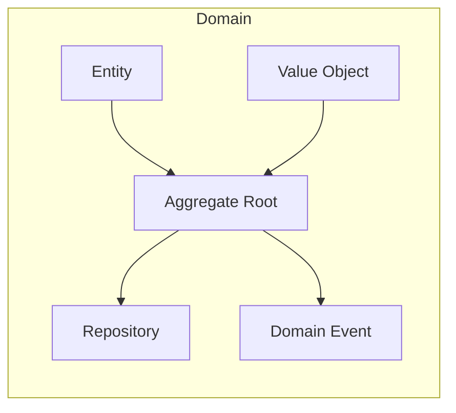
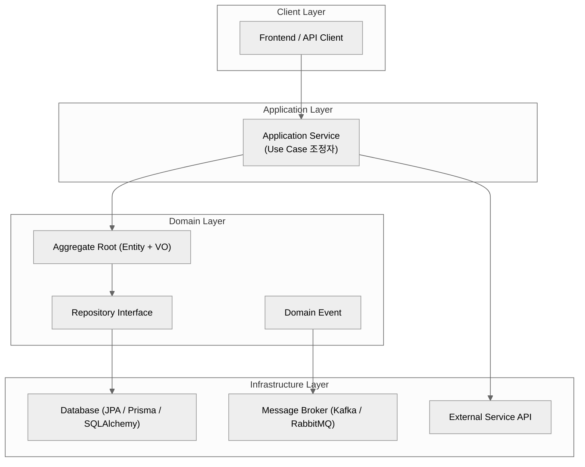

#### 요약

- DDD(Domain-Driven Design, 도메인 주도 설계)는 **비즈니스 규칙을 코드의 중심에 두는 설계 방식**이다.  
- 시스템의 복잡도가 증가할수록 도메인 중심 설계는 **일관성, 확장성, 협업 효율성**을 높인다.  
- 전술 패턴(`Entity`, `Value Object`, `Aggregate`, `Repository`, `Domain Event`)을 활용하면 **도메인 모델의 응집력**을 유지하면서 **유연한 아키텍처 설계**가 가능하다.  
- 각 패턴은 **Spring Boot (Java/Kotlin)**, **NestJS (TypeScript)**, **FastAPI (Python)**, **Express (Node.js)** 환경에서 모두 적용 가능하다.  


####  언어별 활용 포인트

| 언어/프레임워크                      | 활용 방식                                    | 특징           |
| ----------------------------- | ---------------------------------------- | ------------ |
| **Spring Boot (Java/Kotlin)** | JPA 기반 Entity + VO, @DomainEventListener | 안정적 트랜잭션 관리  |
| **NestJS (TypeScript)**       | TypeORM + CQRS + EventEmitter2 조합        | 구조적 모듈화 용이   |
| **FastAPI (Python)**          | SQLAlchemy + Pydantic VO                 | 데이터 모델 명확    |
| **Express (Node.js)**         | Prisma + Event-Driven 구조                 | 경량, 빠른 개발 적합 |


DDD는 단순한 설계 패턴이 아니라,
**“비즈니스 복잡성을 제어하는 구조적 언어”**다.

* 로직의 응집도는 높이고,
* 계층 간 의존도는 낮추며,
* 변화에 유연한 구조를 만든다.

> “DDD는 기술이 아니라, 코드를 통해 비즈니스를 표현하는 철학이다.”

```quote
"복잡함을 줄이는 것이 아니라,  
복잡함을 통제할 수 있게 만드는 것 — 그것이 DDD의 핵심이다."
– Vaughn Vernon
```

##### 참고자료
- Spring Data / TypeORM / Pydantic 공식 문서
- MS Docs — [Domain Model Pattern](https://learn.microsoft.com/en-us/azure/architecture/patterns/domain-model)

---

#### 1. DDD란 무엇인가?

> “도메인(업무 규칙)이 시스템의 중심이 되어야 한다.”

DDD는 기술보다 **업무의 개념과 규칙**을 중심으로 코드를 구조화하는 접근이다.  
즉, 테이블이나 API가 아니라 **‘비즈니스 의미’**가 코드의 기준이 된다.

| 구분 | 설명 |
|------|------|
| **전통적 설계** | 데이터 중심(CRUD) 설계 — 비즈니스 규칙이 분산됨 |
| **DDD 설계** | 도메인 중심 설계 — 규칙을 모델 내부로 이동시킴 |

---

#### 2. 왜 DDD를 사용하는가?

| 문제 | DDD가 해결하는 방식 |
|------|--------------------|
| 규칙이 여러 레이어에 흩어짐 | 규칙을 Aggregate 내부로 이동 |
| 유지보수 어려움 | 비즈니스 로직과 데이터 접근 분리 |
| 협업 혼란 | 도메인 용어(Ubiquitous Language) 통일 |
| 테스트 복잡 | 도메인 단위 테스트 가능 |

---

#### 3. DDD 전술 패턴 개요

| 패턴 | 핵심 역할 | 예시 |
|------|------------|------|
| **Entity** | 식별자(ID)로 구분되는 개체 | 주문(Order), 사용자(User) |
| **Value Object** | 불변 값으로 비교되는 객체 | Money, Address, Coordinate |
| **Aggregate** | 일관성 경계를 가진 도메인 집합 | Order + OrderLine |
| **Repository** | 도메인 단위 영속화 추상화 | `orderRepository.save()` |
| **Domain Event** | 비즈니스 사실 발생 통지 | `OrderCreatedEvent` |



---

#### 4. DDD 기반 백엔드 프로젝트 파일 구조

아래는 **DDD 전술 패턴을 적용한 표준 디렉터리 구조 예시**이다.
(Spring Boot / NestJS / FastAPI / Express 공통 패턴)


```plaintext
backend/
├── application/                                # 유즈케이스 계층 (서비스, 트랜잭션, 이벤트 조정)
│   ├── service/                                # 도메인 로직을 조합하여 Use Case 수행
│   │   ├── OrderService.java                   # 주문 생성, 결제 등 핵심 Use Case
│   │   └── PaymentService.java                 # 결제 승인/취소 등 트랜잭션 관리
│   ├── dto/                                    # 외부 입력/출력용 데이터 객체
│   │   └── OrderRequestDto.java                # Controller <-> Service 간 데이터 전달용 DTO
│   └── event/                                  # 도메인 이벤트 핸들러 계층
│       └── OrderEventHandler.java              # DomainEvent 구독 및 후속 처리 (@TransactionalEventListener)
│
├── domain/                                     # 핵심 비즈니스 규칙(모델) 계층
│   ├── order/                                  # 주문 도메인
│   │   ├── entity/                             # 식별 가능한 엔티티
│   │   │   ├── Order.java                      # 주문 루트 엔티티 (Aggregate Root)
│   │   │   └── OrderLine.java                  # 주문 상세 항목 엔티티
│   │   ├── value_object/                       # 값으로 비교되는 불변 객체
│   │   │   └── Money.java                      # 금액 VO (불변 + equals/hashCode)
│   │   ├── aggregate/                          # 일관성 경계(트랜잭션 단위)
│   │   │   └── OrderAggregate.java             # Order + OrderLine 집합 관리
│   │   ├── repository/                         # 도메인 단위 DB 추상화 인터페이스
│   │   │   └── OrderRepository.java            # Order 저장/조회 정의 (interface)
│   │   └── event/                              # 도메인 내부 이벤트 정의
│   │       └── OrderCreatedEvent.java          # 주문 생성 이벤트 (도메인 사실 표현)
│   └── user/                                   # 사용자 도메인
│       ├── entity/                             # User 엔티티
│       └── repository/                         # UserRepository 인터페이스
│
├── infrastructure/                             # 기술 구현 계층 (DB, 메시징, 외부 API)
│   ├── persistence/                            # DB 영속성 구현체
│   │   ├── jpa/                                # JPA 환경설정
│   │   │   └── JpaConfig.java                  # @EnableJpaRepositories, EntityScan 등
│   │   └── OrderRepositoryImpl.java            # Repository 구현체 (Spring Data JPA)
│   ├── messaging/                              # 메시지 브로커 연동
│   │   └── KafkaProducer.java                  # KafkaTemplate 기반 이벤트 발행
│   └── external/                               # 외부 시스템 연동
│       └── PaymentGatewayClient.java           # 외부 결제 API 연동 (RestTemplate/WebClient)
│
├── interfaces/                                 # 외부 입출력 계층 (API, CLI, Scheduler 등)
│   ├── rest/                                   # REST API 엔드포인트
│   │   ├── OrderController.java                # 주문 API (POST /orders 등)
│   │   └── UserController.java                 # 사용자 API
│   ├── scheduler/                              # 배치/Scheduler 처리
│   │   └── OrderSyncJob.java                   # 주문 동기화 작업 (@Scheduled)
│   └── cli/                                    # 명령형 실행 CLI
│       └── MaintenanceCommand.java             # 운영용 커맨드 (CommandLineRunner)
│
├── shared/                                     # 공통 유틸 / 예외 / 이벤트 버스
│   ├── exception/                              # 전역 예외 처리
│   │   └── BusinessException.java              # 비즈니스 예외 정의
│   ├── event_bus/                              # 도메인 이벤트 발행기
│   │   └── DomainEventPublisher.java           # ApplicationEventPublisher 래퍼
│   └── utils/                                  # 공용 유틸 함수 모음
│       └── DateUtils.java                      # 날짜 포맷 등 헬퍼
│
└── Application.java                            # 진입점 (@SpringBootApplication)
                                                # Bean 스캔 및 애플리케이션 부트스트랩

```


| 계층                   | 주요 책임                         | 포함 요소                                                               | Spring 주요 어노테이션 / 키워드                                                |
| -------------------- | ----------------------------- | ------------------------------------------------------------------- | -------------------------------------------------------------------- |
| **interfaces**       | 외부 인터페이스(API, Scheduler, CLI) | Controller, Job, CLI                                                | `@RestController`, `@Scheduled`, `CommandLineRunner`                 |
| **application**      | 유즈케이스 조정 / 트랜잭션 관리 / 이벤트 발행   | Service, DTO, Event Handler                                         | `@Service`, `@Transactional`, `@EventListener`                       |
| **domain**           | 비즈니스 규칙과 상태의 중심               | Entity, Value Object, Aggregate, Repository Interface, Domain Event | `@Entity`, `@Embeddable`, `interface Repository`, `ApplicationEvent` |
| **infrastructure**   | 기술 구현 (DB, MQ, 외부 API 등)      | RepositoryImpl, Kafka, RestTemplate                                 | `@Repository`, `KafkaTemplate`, `@Component`                         |
| **shared**           | 공통 유틸 / 예외 / 이벤트 버스           | Exception, Utils, Event Bus                                         | Custom Class, `@Component`, `@Configuration`                         |
| **Application.java** | 실행 진입점 / Bean 스캔              | Main 클래스                                                            | `@SpringBootApplication`                                             |


---


#### 5. 실무 예시 코드 스니펫

**Entity & VO**

```java
@Entity
class Order {
  @Id @GeneratedValue
  Long id;
  @Embedded Money total;

  public void add(Money value) {
    this.total = total.add(value);
  }
}

@Embeddable
class Money {
  BigDecimal amount;
  String currency;
}
```

---

**Repository Interface**

```java
public interface OrderRepository {
  Optional<Order> findById(Long id);
  void save(Order order);
}
```

---

**Domain Event + Outbox 패턴**

```java
record OrderCreatedEvent(Long orderId, BigDecimal total) {}

@Component
@RequiredArgsConstructor
public class OutboxPublisher {
  private final KafkaTemplate<String, String> kafka;

  @Scheduled(fixedDelay = 1000)
  public void publishPendingEvents() {
    // Outbox 테이블 조회 → Kafka 전송
  }
}
```

---

#### 6. DDD 아키텍처 다이어그램



**해석**

* **Application Layer** → 유즈케이스 조정, 트랜잭션 관리
* **Domain Layer** → 비즈니스 규칙과 상태 관리의 핵심
* **Infrastructure Layer** → 기술적 세부 구현(DB, MQ 등)
* **Client Layer** → 외부 요청 진입점(API, Web, CLI 등)

---
