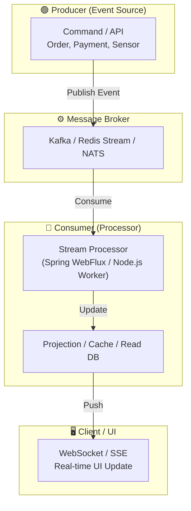

#### 요약

- **실시간 트랜잭션(Real-time Transaction)** 은 이벤트 발생 즉시 처리·전달·동기화를 수행하는 구조로,  
  데이터 일관성뿐 아니라 **응답 지연(latency)** 과 **사용자 경험(UX)** 을 극대화하는 목적을 가진다.  
- 이를 위해 **Event-driven Architecture(EDA)**, **Streaming Pipeline**, **WebSocket / Kafka / Redis Stream** 같은 기술이 사용된다.  
- CQRS / Saga / Idempotency 와 결합하면 **“실시간으로 일관성 있는 트랜잭션 처리”** 를 구현할 수 있다.

실시간 트랜잭션은 **데이터 일관성과 반응 속도를 동시에 확보**하기 위한 현대적 아키텍처이다.
Kafka, Redis Stream, WebSocket 같은 이벤트 중심 기술을 사용해
사용자·서비스·데이터 간 **즉시성(Real-time)** 을 달성한다.

CQRS, Saga, Idempotency, Distributed Lock과 결합하면
“정합성과 응답성”을 동시에 보장하는 **Reactive MSA 구조**를 완성할 수 있다.

> 💡 **핵심 키워드**: Event-driven Architecture, Stream Processing, Reactive System, Real-time Data Sync

##### 언제 사용해야 하는가

✅ **적합한 경우**

* 금융/결제/주문 시스템에서 실시간 반응 필요할 때
* 채팅, 모니터링 대시보드, IoT 센서 데이터 스트림
* CQRS / Saga 아키텍처의 이벤트 흐름을 실시간으로 반영할 때

❌ **부적합한 경우**

* 처리량이 적거나 실시간성이 불필요한 단순 배치 작업
* 데이터 정합성이 최우선인 동기식 거래 시스템(은행 정산 등)


##### 참고자료 (내부 링크 포함)
- Kafka Docs — [Streams and Exactly Once Processing](https://kafka.apache.org/documentation/streams/)
- Redis Streams — [Redis Stream Consumer Groups](https://redis.io/docs/latest/develop/data-types/streams/)
- Spring — [WebFlux & Reactive Streams](https://docs.spring.io/spring-framework/reference/web/webflux.html)

---

## 1. 왜 사용하는가 (Why Real-time Transaction)

| 문제 상황 | 기존 구조의 한계 | 실시간 구조의 장점 |
|------------|------------------|--------------------|
| 대량 요청 시 큐 적체 | 동기식 요청/응답 구조 | 비동기 스트림 처리로 부하 분산 |
| 상태 변화 알림 지연 | 배치 기반 갱신 | 실시간 이벤트 브로드캐스팅 |
| 다중 클라이언트 데이터 동기화 | Polling 비용 과다 | Pub/Sub or WebSocket 기반 푸시 |
| 트랜잭션 간 데이터 레이스 | 순차 처리 지연 | 이벤트 순서 기반 일관성 확보 |

✅ **핵심 요약**
- “요청 기반 시스템” → “이벤트 기반 시스템” 으로 전환  
- 성능, 확장성, 응답속도, 데이터 일관성을 모두 만족시키는 **비동기 스트림 파이프라인**

---

## 2. 어떤 언어·프레임워크에서 사용하는가

| 언어 / 런타임 | 대표 프레임워크 / 기술 | 특징 |
|----------------|------------------------|------|
| **Java (Spring Boot)** | Kafka Streams, Spring WebFlux, Reactor | Reactive 기반 실시간 트랜잭션 파이프라인 |
| **Node.js (NestJS / Express)** | WebSocket, Socket.IO, KafkaJS, BullMQ | 비동기 이벤트 처리에 강함 |
| **Python (FastAPI)** | asyncio, Redis Stream, Celery | 비동기 메시징 기반 실시간 처리 |
| **Go** | NATS / Kafka / gRPC Stream | 고성능 네트워크 I/O 처리에 강함 |

---

## 3. 구조 개념 (Concept)



✅ **핵심 흐름**

1. Command가 Event를 브로커로 퍼블리시
2. Consumer가 이벤트를 스트림으로 수신
3. Projection(Read Model) 갱신
4. 실시간 UI 또는 외부 서비스로 브로드캐스팅

---

## 4. 주요 처리 모델

| 모델                              | 설명                     | 예시                              |
| ------------------------------- | ---------------------- | ------------------------------- |
| **Pub/Sub (Publish-Subscribe)** | 이벤트를 다수 구독자에게 전달       | Kafka, Redis Pub/Sub            |
| **Stream Processing**           | 지속적인 이벤트 흐름 처리         | Kafka Streams, Flink            |
| **Event-driven API**            | REST 대신 이벤트 기반 비동기 API | WebSocket, GraphQL Subscription |
| **Reactive Programming**        | 비동기 논블로킹 구조로 트랜잭션 처리   | Spring WebFlux, RxJS            |

---

## 5. Java (Spring Boot / WebFlux) 예시

```java
@RestController
@RequiredArgsConstructor
public class TransactionStreamController {

    private final Sinks.Many<TransactionEvent> sink = Sinks.many().multicast().onBackpressureBuffer();

    @PostMapping("/transactions")
    public Mono<ResponseEntity<String>> create(@RequestBody TransactionRequest req) {
        TransactionEvent event = new TransactionEvent(req.getUserId(), req.getAmount());
        sink.tryEmitNext(event);
        return Mono.just(ResponseEntity.ok("Transaction Event Published"));
    }

    @GetMapping(value = "/stream", produces = MediaType.TEXT_EVENT_STREAM_VALUE)
    public Flux<TransactionEvent> stream() {
        return sink.asFlux(); // SSE 방식 스트림 전송
    }
}
```

> ✅ `Sinks.Many`를 이용해 이벤트를 스트림으로 송출
> ✅ `/stream` API를 통해 클라이언트가 실시간 데이터 수신 (SSE / WebSocket)

---

## 6. Node.js (NestJS + WebSocket) 예시

```typescript
@WebSocketGateway()
export class TransactionGateway {
  @WebSocketServer()
  server: Server;

  handleTransactionEvent(event: any) {
    this.server.emit('transaction_update', event);
  }
}

@Injectable()
export class TransactionService {
  constructor(private gateway: TransactionGateway) {}

  async processTransaction(data: any) {
    // 비즈니스 로직
    this.gateway.handleTransactionEvent({ userId: data.userId, amount: data.amount });
  }
}
```

> ✅ 클라이언트는 `transaction_update` 이벤트를 실시간 수신
> ✅ React 등 프론트엔드에서 즉시 상태 반영 가능

---

## 7. Python (FastAPI + Redis Stream) 예시

```python
import aioredis, asyncio
from fastapi import FastAPI

app = FastAPI()
redis = asyncio.run(aioredis.from_url("redis://localhost"))

@app.post("/publish")
async def publish(event: dict):
    await redis.xadd("tx_stream", event)
    return {"status": "ok"}

@app.get("/consume")
async def consume():
    async for msg in redis.xread({"tx_stream": "$"}, block=0):
        print("Received:", msg)
```

> ✅ Redis Streams를 이용한 간단한 Producer/Consumer 모델
> ✅ Consumer Group으로 병렬 처리 가능

---

## 8. 아키텍처 디렉토리 예시 (Java 기준)

```
src/
└── main/
    ├── java/
    │   └── com/example/realtime/
    │       ├── config/
    │       │   └── KafkaConfig.java            // Kafka Producer/Consumer 설정
    │       ├── controller/
    │       │   └── TransactionStreamController.java
    │       ├── event/
    │       │   ├── TransactionEvent.java
    │       │   └── EventPublisher.java
    │       ├── consumer/
    │       │   └── TransactionConsumer.java
    │       ├── service/
    │       │   └── TransactionService.java
    │       └── websocket/
    │           └── WebSocketHandler.java
    │
    └── resources/
        └── application.yml
```

---

## 9. 트랜잭션 일관성 확보 전략

| 기술 요소                | 역할             | 설명                               |
| -------------------- | -------------- | -------------------------------- |
| **Idempotency Key**  | 중복 이벤트 방지      | 이벤트 재처리 시 안전                     |
| **Offset 관리**        | 순서 보장          | Kafka offset commit / Redis XACK |
| **Distributed Lock** | 동시 업데이트 제어     | 동일 리소스 중복 접근 방지                  |
| **Outbox + Poller**  | 트랜잭션 내 이벤트 일관성 | DB 트랜잭션 + 비동기 전송 결합              |
| **Retry / DLQ**      | 실패 재처리         | Dead Letter Queue로 분리            |

---

## 10. 모니터링 및 운영

| 항목                   | 설명                                         |
| -------------------- | ------------------------------------------ |
| **Lag 모니터링**         | Kafka Consumer Lag / Redis Pending Entries |
| **Event Throughput** | 초당 이벤트 처리량 TPS                             |
| **Latency 추적**       | end-to-end 트랜잭션 지연 측정                      |
| **Alerting**         | DLQ 적체, Consumer 실패 감지                     |
| **Observability**    | OpenTelemetry Trace 연동 (Event Chain 추적)    |

---

