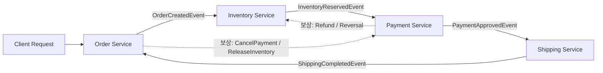
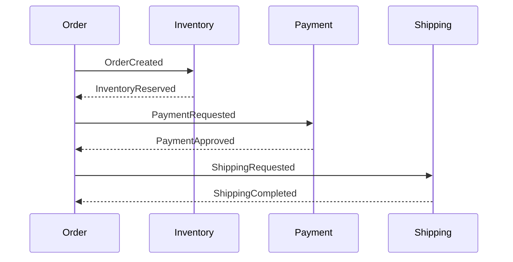
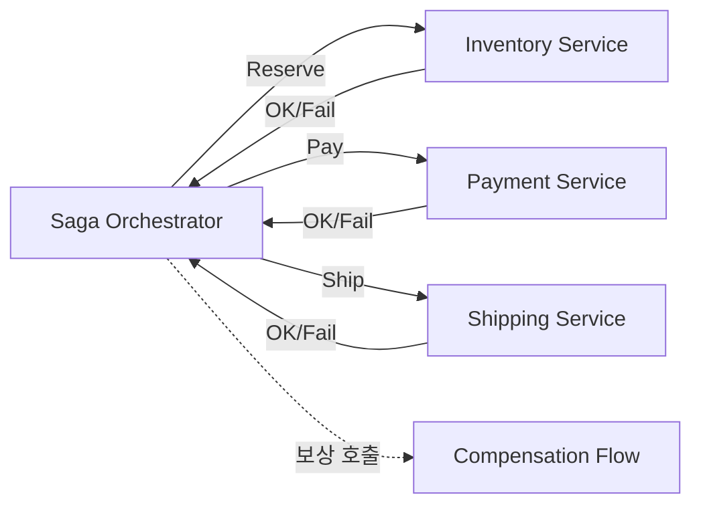

#### 요약

- **Saga 패턴**은 분산 환경에서 **2PC(2-Phase Commit)** 없이  
  여러 로컬 트랜잭션을 **이벤트 시퀀스 형태로 연결**하고,  
  실패 시 **보상(Compensation) 트랜잭션**을 수행해 일관성을 유지하는 방법이다.
- **“로컬 트랜잭션 단위의 Eventually Consistent System”** 을 만드는 핵심 설계 패턴이다.
- **코레오그래피(Choreography)** 와 **오케스트레이션(Orchestration)** 두 가지 구현 방식이 있다.

Saga는 **2PC의 한계를 넘은 분산 트랜잭션의 현실적 해법**이다.
각 서비스가 독립적으로 로컬 트랜잭션을 수행하면서,
실패 시 “보상 이벤트”로 이전 상태를 복구한다.

이로써 시스템은 **Eventually Consistent** 하며,
**확장성과 내고장성, 그리고 트랜잭션 복원력**을 모두 확보할 수 있다.

CQRS / Event Sourcing과 함께 사용할 때
**일관성·복구성·추적성·확장성**을 모두 만족하는 완성형 아키텍처를 구축할 수 있다.

**Outbox 패턴이란?**
- 문제 상황:
트랜잭션 처리 중 DB에는 성공적으로 저장됐지만, 메시지 브로커(Kafka, RabbitMQ 등)에는 메시지가 전송되지 않거나 실패하면 데이터 불일치가 발생함
- 해결 방법:
메시지를 직접 브로커에 보내는 대신, DB에 메시지를 함께 저장하고,
별도 프로세스가 메시지를 브로커로 전송하는 방식

관계: Outbox는 Saga의 메시지 전송을 안전하게 하기 위해 사용됨
- Saga는 각 단계에서 이벤트를 발행해야 함
- 이 이벤트를 안전하게 브로커에 보내기 위해 Outbox 패턴을 활용
- → Saga + Outbox 조합은 마이크로서비스에서 매우 흔한 구조

##### 언제 사용해야 하는가

✅ **적합한 경우**

* 하나의 비즈니스 프로세스가 **여러 서비스(DB)** 를 거칠 때
* 강한 일관성 대신 **Eventually Consistency** 로도 충분한 경우
* 복잡한 결제/주문/예약/정산/배송 등 멀티 서비스 연동
* **CQRS / Event Sourcing / Outbox** 를 이미 사용하는 환경

❌ **부적합한 경우**

* 단일 DB 내 트랜잭션으로 충분할 때
* 보상 불가능한 작업(예: 외부 송금, 즉시 irreversible API)
* 실시간 강한 일관성이 절대적으로 필요한 경우

---

##### 참고자료
- [Microservices Patterns - Chris Richardson](https://microservices.io/patterns/data/saga.html)

---

## 1. 왜 Saga 패턴을 사용하는가

> “분산 환경에서도 **트랜잭션 일관성**을 유지하면서,  
> 시스템의 **확장성과 복원력**을 동시에 확보하기 위해.”

| 문제 | Saga의 해결 방향 |
|------|----------------|
| 2PC(2-Phase Commit) 복잡도 | 단일 서비스 수준 로컬 트랜잭션만 유지 |
| 부분 실패 시 롤백 불가 | **보상(Compensation)** 을 통한 논리적 롤백 |
| 네트워크/서비스 장애 | **비동기 이벤트 기반** 복원 메커니즘 |
| 마이크로서비스 간 결합도 증가 | 느슨한 결합(이벤트 기반 협력) 구조 |
| 운영 추적 어려움 | 상태 기반 오케스트레이터 도입 (Saga State Machine) |

✅ **핵심 이점**
1. **2PC보다 단순한 분산 트랜잭션 처리**  
2. **실패 내성(Fault Tolerance)** 및 **Eventually Consistent 보장**  
3. **서비스 간 독립 배포와 복구 용이성 확보**  
4. **CQRS / Event Sourcing과 자연스러운 통합**

---

## 2. 어떤 언어와 프레임워크에서 사용하는가

| 언어 / 런타임 | 대표 프레임워크 / 구현 방식 | 특징 |
|----------------|------------------------------|------|
| **Java (Spring Boot)** | [Axon Framework](https://axoniq.io/), [Camunda](https://camunda.com/), Spring StateMachine | 오케스트레이션 기반 Saga 구현 용이, JPA/Outbox 통합 |
| **Node.js (NestJS / Express)** | [NestJS CQRS Module](https://docs.nestjs.com/recipes/cqrs), Kafka / BullMQ | 이벤트 기반 코레오그래피 구현에 유리 |
| **Python (FastAPI)** | Celery / Dramatiq + Redis / RabbitMQ | 비동기 태스크 기반 보상 트랜잭션 설계 |
| **Go (Go-kit / Temporal.io)** | [Temporal.io Saga API](https://temporal.io/) | 강력한 워크플로우 오케스트레이터 기반 |
| **.NET (C#)** | MassTransit / NServiceBus | 메시지 기반 Saga 오케스트레이션 내장 지원 |

> 💡 대부분의 현대 MSA 환경에서는 Kafka, RabbitMQ, Redis Stream 등  
> **메시징 기반 이벤트 브로커**와 함께 사용된다.

---

## 3. 구조 개요



> 각 단계는 **자신의 로컬 트랜잭션**을 수행하고,
> 성공 시 **다음 단계 이벤트**를 발행하며, 실패 시 **보상 트랜잭션**을 수행한다.

---

## 4. 두 가지 구현 방식

| 방식                          | 설명                           | 장점         | 단점               |
| --------------------------- | ---------------------------- | ---------- | ---------------- |
| **코레오그래피 (Choreography)**   | 서비스 간 이벤트로 자연스럽게 연결          | 단순, 느슨한 결합 | 흐름 추적 어려움        |
| **오케스트레이션 (Orchestration)** | 중앙 **Orchestrator**가 단계별로 지휘 | 제어·관찰성 높음  | 중앙 집중 구조, 복잡도 증가 |

---

### 4.1 코레오그래피 (Choreography)



> ✅ 간단한 워크플로우에 적합 (3~4단계 이하)

---

### 4.2 오케스트레이션 (Orchestration)



> ✅ 복잡한 비즈니스 플로우에 적합
> (Camunda, Temporal, Axon, Spring StateMachine 기반으로 구성)

---

## 5. 보상 트랜잭션 설계 원칙

| 단계 | Do (정방향)          | Undo (보상)         |
| -- | ----------------- | ----------------- |
| 재고 | reserve(quantity) | release(quantity) |
| 결제 | authorize(amount) | refund(amount)    |
| 배송 | prepare(shipment) | cancel(shipment)  |

> 💡 “보상 트랜잭션은 성공 단계의 역순(스택 순서)”으로 실행해야 한다.

---

## 6. Java / Spring Boot 디렉토리 구조 예시

```
src/
└── main/
    ├── java/
    │   └── com/example/order/
    │       ├── saga/
    │       │   ├── orchestrator/
    │       │   │   ├── OrderSagaOrchestrator.java   // 전체 Saga 상태 관리
    │       │   │   └── SagaState.java               // 진행 상태 Enum
    │       │   ├── command/                         // Saga Command 정의
    │       │   │   ├── ReserveInventoryCommand.java
    │       │   │   └── AuthorizePaymentCommand.java
    │       │   ├── event/                           // Saga Event 정의
    │       │   │   ├── InventoryReserved.java
    │       │   │   └── PaymentAuthorized.java
    │       │   ├── compensation/                    // 보상 로직
    │       │   │   ├── CancelPaymentCommand.java
    │       │   │   └── ReleaseInventoryCommand.java
    │       │   └── listener/                        // 이벤트 수신기
    │       │       └── SagaEventListener.java
    │       │
    │       ├── outbox/                              // Outbox 패턴
    │       │   ├── OutboxEntity.java
    │       │   └── OutboxRelay.java
    │       │
    │       ├── domain/
    │       │   ├── entity/
    │       │   └── event/
    │       └── presentation/
    │           └── OrderController.java
    │
    └── resources/
        └── application.yml
```
---

## 7. 모니터링 및 테스트 전략

| 영역                | 방법                                      |
| ----------------- | --------------------------------------- |
| **Saga 상태 추적**    | 상태머신 기반 대시보드 (Camunda / Axon Server)    |
| **E2E 테스트**       | Testcontainers + Kafka / RabbitMQ 시뮬레이션 |
| **회귀 테스트**        | 보상 시나리오/타임아웃/중복 이벤트 재현                  |
| **Observability** | OpenTelemetry Trace ID로 각 스텝 추적         |

---
