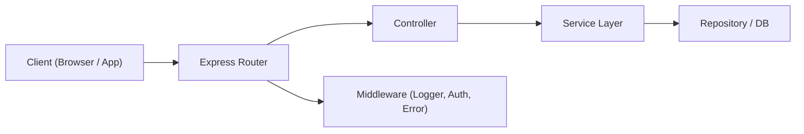

**version**  
Node.js 22.x / Express 5.x / TypeScript 5.x

---

### 요약  
RESTful API는 클라이언트와 서버 간 통신을 구조화하기 위한 표준 아키텍처 스타일이다.  
Express는 REST API 설계에 적합한 라우팅 중심 구조를 제공하며,  
일관된 URI, HTTP 메서드, 응답 규격 설계가 핵심이다.  

RESTful API 설계는 단순히 URI를 정의하는 것이 아니라,
HTTP 메서드·상태코드·응답 포맷·버전 관리까지 포함한 **표준 구조 설계**이다.
Express는 이를 구현하기 위한 유연한 라우팅 시스템을 제공하며,
Controller–Service–Repository 계층화를 통해 유지보수성과 확장성을 확보할 수 있다.
일관된 규약을 지키는 것이 API 품질을 결정하는 가장 중요한 요소이다.

핵심 내용은 다음과 같다.  
- RESTful API의 개념 및 설계 원칙  
- Express 라우팅 구조 설계 패턴  
- 컨트롤러·서비스·라우터 계층 분리  
- 응답 규격 및 에러 핸들링 구조  
- API 버저닝 및 유지보수 전략  

---

##### 참고자료  
- [RESTful API Design Guidelines – Microsoft](https://learn.microsoft.com/en-us/azure/architecture/best-practices/api-design)  
- [Express Routing Docs](https://expressjs.com/en/guide/routing.html)  
- [JSON:API Specification](https://jsonapi.org/)  

---

#### 1. RESTful API의 핵심 개념  

| 구성 요소 | 설명 | 예시 |
|-------------|------|------|
| **Resource** | 데이터를 추상화한 엔터티 | `/users`, `/posts` |
| **HTTP Method** | 행위 정의 | GET, POST, PUT, DELETE |
| **URI** | 리소스 경로 표현 | `/api/v1/users/:id` |
| **Representation** | 리소스의 표현 방식 | JSON (기본 응답 포맷) |

REST는 “무상태(Stateless)” 특성을 가지며,  
각 요청은 완전한 정보를 포함해야 한다 (세션 의존 금지).  

---

#### 2. RESTful 설계 원칙  

| 원칙 | 설명 |
|------|------|
| **자원(Resource) 중심 URI** | `/api/v1/users`처럼 명사 기반으로 정의 |
| **HTTP Method 일관성** | CRUD 연산과 메서드 일치 (GET/POST/PUT/DELETE) |
| **표준화된 상태코드 사용** | 200, 201, 400, 401, 404, 500 등 |
| **표현 독립성** | JSON, XML, HTML 등 포맷에 의존하지 않음 |
| **무상태성(Stateless)** | 요청 간 상태 공유 금지 |
| **계층화(Layered System)** | 클라이언트는 API 내부 구조를 모름 |

---

#### 3. Express 기반 API 구조  

Express는 `Router` 단위를 이용하여 API를 모듈화할 수 있다.  

```typescript
// src/routes/user.route.ts
import { Router } from "express";
import * as userController from "../controllers/user.controller";

const router = Router();

router.get("/", userController.getUsers);
router.get("/:id", userController.getUserById);
router.post("/", userController.createUser);
router.put("/:id", userController.updateUser);
router.delete("/:id", userController.deleteUser);

export default router;
```

메인 서버 엔트리에서 등록한다.

```typescript
// src/server.ts
import express from "express";
import userRouter from "./routes/user.route";

const app = express();
app.use(express.json());
app.use("/api/v1/users", userRouter);

app.listen(3000, () => console.log("🚀 API Server running"));
```

---

#### 4. 계층형 구조 설계 (Controller / Service / Repository)

Express 프로젝트는 **단일 책임 원칙(SRP)**을 위해 계층형으로 구성한다.

```plaintext
src/
├── controllers/
│   └── user.controller.ts
├── services/
│   └── user.service.ts
├── repositories/
│   └── user.repository.ts
├── routes/
│   └── user.route.ts
└── server.ts
```

* **Controller**: 요청/응답 처리
* **Service**: 비즈니스 로직 처리
* **Repository**: DB 접근 계층

```typescript
// user.controller.ts
import * as userService from "../services/user.service";

export const getUsers = async (req, res) => {
  const users = await userService.findAll();
  res.json({ success: true, data: users });
};
```

---

#### 5. 응답 규격(표준 JSON 포맷)

모든 API 응답은 일정한 형태를 유지해야 한다.

```json
{
  "success": true,
  "data": { "id": 1, "email": "user@example.com" },
  "error": null
}
```

| 필드          | 설명                |
| ----------- | ----------------- |
| **success** | 요청 성공 여부          |
| **data**    | 결과 데이터 (객체 또는 배열) |
| **error**   | 실패 시 오류 메시지 / 코드  |

실패 시 응답 예시:

```json
{
  "success": false,
  "data": null,
  "error": { "message": "User not found", "code": 404 }
}
```

---

#### 6. 에러 핸들링 구조

Express는 기본적으로 미들웨어 기반 에러 처리를 지원한다.

```typescript
// src/middlewares/error-handler.ts
import { Request, Response, NextFunction } from "express";

export const errorHandler = (err: any, req: Request, res: Response, next: NextFunction) => {
  console.error(`[ERROR] ${err.message}`);
  res.status(err.status || 500).json({
    success: false,
    error: { message: err.message, code: err.status || 500 },
  });
};
```

```typescript
// server.ts
import { errorHandler } from "./middlewares/error-handler";
app.use(errorHandler);
```

---

#### 7. API 버저닝 전략

버전은 URI에 명시하거나, 헤더 기반으로 관리할 수 있다.

| 방식          | 예시                                             | 특징              |
| ----------- | ---------------------------------------------- | --------------- |
| **URI 버저닝** | `/api/v1/users`                                | 단순, 명확          |
| **헤더 버저닝**  | `Accept: application/vnd.api+json;version=1.0` | 유연, 클라이언트 제어 가능 |

대규모 시스템에서는 `/api/v1` → `/api/v2` 식의 점진적 버전 이행 전략을 추천한다.

---

#### 8. Express API 설계 다이어그램



이 구조는 요청이 라우터 → 컨트롤러 → 서비스 → DB 순으로 흐르며,
모든 응답은 공통 포맷을 유지한다.

---

#### 9. REST API 명명 규칙 요약

| 동작        | 메서드    | URI 예시              | 설명        |
| --------- | ------ | ------------------- | --------- |
| 조회 (List) | GET    | `/api/v1/users`     | 전체 목록     |
| 조회 (단건)   | GET    | `/api/v1/users/:id` | 특정 항목     |
| 생성        | POST   | `/api/v1/users`     | 새 리소스 추가  |
| 수정        | PUT    | `/api/v1/users/:id` | 리소스 전체 수정 |
| 부분 수정     | PATCH  | `/api/v1/users/:id` | 일부 필드 수정  |
| 삭제        | DELETE | `/api/v1/users/:id` | 리소스 제거    |

---


