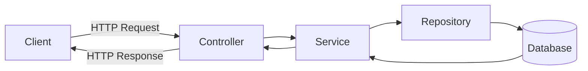

#### 요약

- RESTful API의 기본 원칙 및 계층 구조 설계
- 공통 응답 포맷(success/data/error)과 전역 예외 처리 전략
- Swagger / OpenAPI 기반 자동 문서화와 인증(JWT/OAuth2) 예시
- FastAPI / Spring Boot / Express / NestJS 공용 표준 구조 제시

> 백엔드 실무의 출발점이자, 모든 프레임워크에서 일관된 API 아키텍처를 설계하기 위한 기준 문서

| 구분             | 핵심 내용                 | 실무 효과            |
| -------------- | --------------------- | ---------------- |
| **REST 원칙**    | 일관된 HTTP 인터페이스 유지     | API 재사용성 증가      |
| **응답 포맷 표준화**  | success/data/error 구조 | Front-Back 통합 용이 |
| **전역 에러 핸들러**  | 공통 오류 처리              | 안정적 예외 응답        |
| **Swagger 통합** | 자동 문서화 및 테스트          | 협업 생산성 향상        |
| **JWT 인증 구조**  | 세션리스 인증 방식            | 확장성 높은 인증 구조     |


---

##### 참고자료
- [FastAPI 공식 문서](https://fastapi.tiangolo.com/)
- [Spring Boot REST Docs](https://springdoc.org/)
- [Express Swagger](https://www.npmjs.com/package/swagger-ui-express)
- [NestJS OpenAPI](https://docs.nestjs.com/openapi/introduction)
- [RFC7807 - Problem Details for HTTP APIs](https://datatracker.ietf.org/doc/html/rfc7807)

---

#### 1. RESTful API 설계 원칙

| 항목 | 설명 |
|------|------|
| **리소스(Resource)** | 명사형 URI `/users`, `/orders` 사용 |
| **HTTP 메서드** | `GET`, `POST`, `PUT`, `PATCH`, `DELETE` |
| **상태 코드** | 200(OK), 201(Created), 400(Bad Request), 404(Not Found) |
| **버전 관리** | `/api/v1/users`, `/api/v2/orders` |
| **HATEOAS (선택)** | 응답 내 `_links` 필드 제공으로 탐색성 확보 |



---

#### 2. 계층 구조 (Controller–Service–Repository)

| 계층             | 역할                    |
| -------------- | --------------------- |
| **Controller** | 요청 파싱 및 검증, 응답 변환     |
| **Service**    | 비즈니스 로직 수행            |
| **Repository** | 데이터 접근 계층 (ORM / SQL) |

##### FastAPI 예시

```python
# app/main.py
from fastapi import FastAPI, HTTPException
from app.services.user_service import get_user_by_id

app = FastAPI()

@app.get("/users/{user_id}")
def get_user(user_id: int):
    user = get_user_by_id(user_id)
    if not user:
        raise HTTPException(status_code=404, detail="User not found")
    return {"success": True, "data": user}
```

##### Spring Boot 예시

```java
@RestController
@RequestMapping("/users")
@RequiredArgsConstructor
public class UserController {
    private final UserService userService;

    @GetMapping("/{id}")
    public ResponseEntity<ApiResponse<User>> getUser(@PathVariable Long id) {
        User user = userService.findById(id);
        return ResponseEntity.ok(ApiResponse.success(user));
    }
}
```

##### Express 예시

```javascript
import express from "express";
import { getUserById } from "./services/userService.js";
const app = express();

app.get("/users/:id", async (req, res, next) => {
  try {
    const user = await getUserById(req.params.id);
    if (!user) return res.status(404).json({ success: false, error: "Not Found" });
    res.json({ success: true, data: user });
  } catch (err) {
    next(err);
  }
});
```

##### NestJS 예시

```typescript
@Controller('users')
export class UserController {
  constructor(private readonly userService: UserService) {}

  @Get(':id')
  async getUser(@Param('id') id: string) {
    const user = await this.userService.findById(+id);
    return { success: true, data: user };
  }
}
```

---

#### 3. 응답 표준화 (Response Format)

> 모든 프레임워크 공통으로 동일한 JSON 응답 포맷 사용
> `success`, `data`, `error` 구조를 유지하여 일관성 확보

```json
{
  "success": true,
  "data": {
    "userId": 1,
    "name": "Ingeun Jeong"
  },
  "error": null
}
```

> 오류 응답은 [RFC7807](https://datatracker.ietf.org/doc/html/rfc7807) 기반 구조 사용 권장

---

#### 4. 전역 에러 핸들링 (Global Error Handling)

| Framework       | 방식                                        |
| --------------- | ----------------------------------------- |
| **FastAPI**     | `@app.exception_handler` 등록               |
| **Spring Boot** | `@ControllerAdvice` + `@ExceptionHandler` |
| **Express**     | `app.use(errorHandler)`                   |
| **NestJS**      | `GlobalExceptionFilter`                   |

##### FastAPI

```python
from fastapi import Request
from fastapi.responses import JSONResponse

@app.exception_handler(Exception)
def global_exception_handler(request: Request, exc: Exception):
    return JSONResponse(status_code=500, content={"success": False, "error": str(exc)})
```

##### Spring Boot

```java
@RestControllerAdvice
public class GlobalExceptionHandler {
    @ExceptionHandler(Exception.class)
    public ResponseEntity<ApiResponse<Void>> handle(Exception e) {
        return ResponseEntity.status(HttpStatus.INTERNAL_SERVER_ERROR)
                .body(ApiResponse.failure(e.getMessage()));
    }
}
```

##### Express

```javascript
app.use((err, req, res, next) => {
  res.status(500).json({
    success: false,
    error: err.message || "Internal Server Error"
  });
});
```

##### NestJS

```typescript
@Catch()
export class AllExceptionsFilter implements ExceptionFilter {
  catch(exception: any, host: ArgumentsHost) {
    const ctx = host.switchToHttp();
    const response = ctx.getResponse<Response>();
    const status = exception.getStatus ? exception.getStatus() : 500;
    response.status(status).json({
      success: false,
      error: exception.message || 'Internal Server Error',
    });
  }
}
```

---

#### 5. Swagger / OpenAPI 문서화

| Framework       | 구성 방식                                  |
| --------------- | -------------------------------------- |
| **FastAPI**     | 내장 `/docs` 자동 생성                       |
| **Spring Boot** | SpringDoc OpenAPI, Swagger UI          |
| **Express**     | `swagger-jsdoc` + `swagger-ui-express` |
| **NestJS**      | `@nestjs/swagger`                      |

##### Express 예시

```javascript
import swaggerUi from "swagger-ui-express";
import swaggerJsdoc from "swagger-jsdoc";

const specs = swaggerJsdoc({
  definition: {
    openapi: "3.0.0",
    info: { title: "Backend API", version: "1.0.0" },
  },
  apis: ["./routes/*.js"],
});

app.use("/docs", swaggerUi.serve, swaggerUi.setup(specs));
```

---

#### 6. 인증 구조 (JWT / OAuth2)

| 항목                   | 설명                                               |
| -------------------- | ------------------------------------------------ |
| **JWT**              | 세션리스 인증, 클라이언트가 토큰을 보관                           |
| **OAuth2**           | 외부 인증 제공자 연동 (Google, Kakao 등)                   |
| **Rate Limit**       | 요청 단위 제한(`express-rate-limit`, `ThrottlerGuard`) |
| **Input Validation** | `pydantic`, `class-validator`, `Joi`             |

##### FastAPI 예시

```python
from fastapi_jwt_auth import AuthJWT

@app.post("/login")
def login(user: UserSchema, Authorize: AuthJWT = Depends()):
    access_token = Authorize.create_access_token(subject=user.email)
    return {"access_token": access_token}
```

##### NestJS 예시

```typescript
async login(user: User): Promise<{ access_token: string }> {
  const payload = { username: user.email, sub: user.id };
  return { access_token: this.jwtService.sign(payload) };
}
```

---
