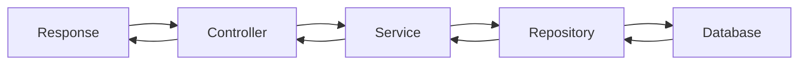

**version**  
Node.js 22.x / Express 5.x / TypeScript 5.x / Prisma 6.x / TypeORM 0.3.x

---

### 요약  
Controller–Service–Repository 패턴은 Express 기반 애플리케이션에서  
역할을 명확히 분리하여 유지보수성과 테스트 효율을 높이는 구조적 설계 방식이다.  

Controller–Service–Repository 패턴은 Express 애플리케이션의 구조적 표준으로,
각 계층의 책임을 분리함으로써 코드의 재사용성, 테스트 용이성, 유지보수성을 높인다.
ORM을 활용한 Repository 계층은 데이터 접근 일관성을 보장하며,
Service 계층은 비즈니스 로직 중심으로 구성된다.
이 계층형 설계는 대규모 API 시스템에서 가장 확장성 높은 접근 방식이다.


핵심 내용은 다음과 같다.  
- Controller / Service / Repository 계층의 역할 구분  
- Express에서 계층형 구조 설계 패턴  
- Prisma 및 TypeORM 연동 예시  
- 단위 테스트 및 확장성 고려 구조  
- 서비스 간 의존성 최소화 원칙  

---

##### 참고자료  
- [Clean Architecture by Robert C. Martin](https://8thlight.com/blog/uncle-bob/2012/08/13/the-clean-architecture.html)  
- [Prisma Service Layer Pattern](https://www.prisma.io/docs/guides/orm/prisma-client/advanced-patterns/service-layer)  
- [TypeORM Repository API](https://typeorm.io/#/working-with-repository)  

---

#### 1. 계층형 설계의 필요성  

Express 프로젝트는 초기에는 단일 파일(`server.js`) 구조로 시작하지만,  
비즈니스 로직이 커질수록 코드가 복잡해지고 테스트가 어려워진다.  
이를 방지하기 위해 **Controller–Service–Repository** 계층을 도입한다.

```plaintext
src/
├── controllers/
│   └── user.controller.ts
├── services/
│   └── user.service.ts
├── repositories/
│   └── user.repository.ts
├── routes/
│   └── user.route.ts
└── server.ts
```

---

#### 2. 각 계층의 역할 정의

| 계층             | 역할                               | 주요 책임                 |
| -------------- | -------------------------------- | --------------------- |
| **Controller** | 요청(Request) 처리 및 응답(Response) 반환 | HTTP 메서드 매핑, 상태 코드 지정 |
| **Service**    | 비즈니스 로직 구현                       | 데이터 검증, 트랜잭션 처리       |
| **Repository** | 데이터 접근 계층                        | ORM 쿼리, DB CRUD 수행    |

---

#### 3. 데이터 흐름 구조



이 구조는 Controller가 직접 DB에 접근하지 않고,
모든 데이터 처리는 Repository 계층을 통해 수행한다.

---

#### 4. Controller 구현 예시

```typescript
// src/controllers/user.controller.ts
import * as userService from "../services/user.service";
import { Request, Response } from "express";

export const getUsers = async (req: Request, res: Response) => {
  const users = await userService.getAllUsers();
  res.status(200).json({ success: true, data: users });
};

export const getUserById = async (req: Request, res: Response) => {
  const user = await userService.getUserById(Number(req.params.id));
  if (!user) return res.status(404).json({ success: false, message: "User not found" });
  res.status(200).json({ success: true, data: user });
};
```

---

#### 5. Service 구현 예시

```typescript
// src/services/user.service.ts
import * as userRepository from "../repositories/user.repository";

export const getAllUsers = async () => {
  return await userRepository.findAll();
};

export const getUserById = async (id: number) => {
  if (isNaN(id)) throw new Error("Invalid ID format");
  return await userRepository.findById(id);
};
```

Service 계층은 입력 검증, 로깅, 트랜잭션 등
비즈니스 로직을 담당한다.

---

#### 6. Repository 구현 (Prisma 예시)

```typescript
// src/repositories/user.repository.ts
import { prisma } from "../prisma/client";

export const findAll = async () => {
  return await prisma.user.findMany();
};

export const findById = async (id: number) => {
  return await prisma.user.findUnique({ where: { id } });
};
```

---

#### 7. Repository 구현 (TypeORM 예시)

```typescript
// src/repositories/user.repository.ts
import { AppDataSource } from "../config/data-source";
import { User } from "../entities/User";

const userRepo = AppDataSource.getRepository(User);

export const findAll = async () => await userRepo.find();
export const findById = async (id: number) => await userRepo.findOneBy({ id });
```

ORM을 통해 SQL을 직접 작성하지 않고도
데이터 접근 계층을 일관되게 유지할 수 있다.

---

#### 8. 공통 에러 핸들링 구조

각 계층에서 발생한 에러는 미들웨어를 통해 처리한다.

```typescript
// src/middlewares/error-handler.ts
export const errorHandler = (err, req, res, next) => {
  console.error(err);
  res.status(500).json({ success: false, error: err.message });
};
```

```typescript
// src/server.ts
import { errorHandler } from "./middlewares/error-handler";
app.use(errorHandler);
```

---

#### 9. 단위 테스트 전략

Service 및 Repository 계층은 단위 테스트를 통해 검증 가능하다.

```typescript
// tests/user.service.test.ts
import * as userService from "../src/services/user.service";
import * as userRepository from "../src/repositories/user.repository";

jest.mock("../src/repositories/user.repository");

test("getUserById returns user", async () => {
  userRepository.findById.mockResolvedValue({ id: 1, name: "John" });
  const user = await userService.getUserById(1);
  expect(user.name).toBe("John");
});
```

이 구조는 Controller–Service–Repository 간 결합도를 낮춰,
테스트와 교체(Replaceability)에 유리하다.

---

#### 10. 계층별 의존성 최소화 원칙

* Controller는 Service만 의존한다.
* Service는 Repository 인터페이스만 의존한다.
* Repository는 ORM 또는 DB 클라이언트만 의존한다.

이를 통해 ORM을 Prisma → TypeORM으로 교체하더라도
Service 계층 로직은 수정 없이 유지할 수 있다.

---


