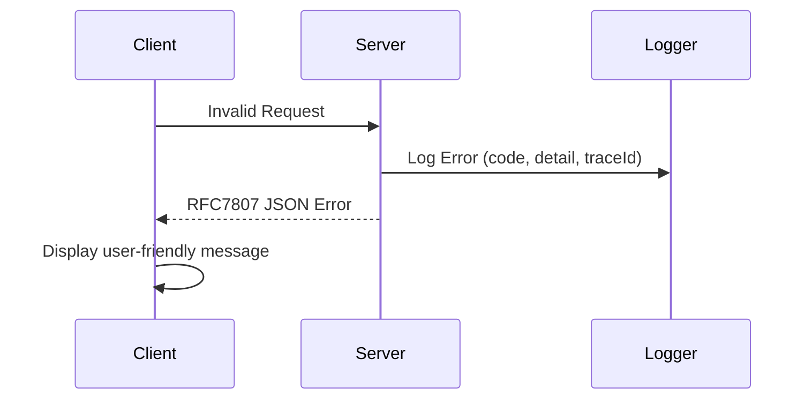

#### 요약

- API 에러를 표현하는 표준 형식을 정의하여, 클라이언트와 서버 간 예외 처리를 일관성 있게 유지함.  
- RFC 7807 (“Problem Details for HTTP APIs”)를 기반으로 에러 구조를 정의하고,  
  각 언어별 전역 핸들러에서 공통 JSON 형식을 반환하는 방법을 제시함.  
- **FastAPI / Spring Boot / Express / NestJS** 전용 예시를 포함함.

> 일관된 에러 표현은 **API의 품질을 결정짓는 핵심 요소**이다.
>
> 에러는 사용자에게 “문제를 설명하는 문장”이 아닌,
> **문제를 해결할 수 있는 구조화된 데이터**로 표현되어야 한다.
>
> RFC 7807 기반 표준을 도입하면
>
> * API 문서화 자동화(Swagger 연동)
> * 클라이언트 핸들링 통합
> * 로그/모니터링 연계
>   를 한 번에 달성할 수 있다.


> 에러는 단순 메시지가 아니라, **클라이언트가 조치 가능한 정보**로 표현되어야 한다.

---

##### 참고자료

- [RFC 7807 - Problem Details for HTTP APIs](https://datatracker.ietf.org/doc/html/rfc7807)
- [MDN HTTP 상태 코드 정리](https://developer.mozilla.org/ko/docs/Web/HTTP/Status)
- [Spring Boot Error Handling](https://docs.spring.io/spring-boot/docs/current/reference/htmlsingle/#features.developing-web-applications.error-handling)
- [NestJS Exception Filters](https://docs.nestjs.com/exception-filters)
- [FastAPI Exception Handling](https://fastapi.tiangolo.com/tutorial/handling-errors/)

---

#### 1. 에러 응답의 필요성

에러 표현의 목적은 단순히 “실패를 알리는 것”이 아니라,  
**문제의 원인, 위치, 해결 방향**을 클라이언트가 이해할 수 있게 만드는 것이다.

| 구분 | 잘못된 예시 | 올바른 예시 |
|------|--------------|--------------|
| **비표준 응답** | `"Something went wrong"` | ✅ `"InvalidParameter: username is required"` |
| **불명확한 구조** | `500 Internal Server Error` | ✅ 구조화된 `type`, `title`, `detail`, `instance` 필드 |

---

#### 2. RFC 7807 기반 표준 구조

RFC 7807은 HTTP API 에러를 **표준 JSON 형식**으로 표현하는 방법을 정의한다.

##### ✅ 표준 JSON 구조

```json
{
  "type": "https://api.example.com/errors/invalid-parameter",
  "title": "Invalid Parameter",
  "status": 400,
  "detail": "The field 'email' is required.",
  "instance": "/api/v1/users"
}
```

| 필드           | 설명                       |
| ------------ | ------------------------ |
| **type**     | 에러 유형의 고유 URL (문서 링크 가능) |
| **title**    | 간단한 에러 요약                |
| **status**   | HTTP 상태 코드               |
| **detail**   | 구체적인 원인 설명               |
| **instance** | 에러가 발생한 리소스나 경로          |

---

#### 3. 프레임워크별 전역 에러 표현 예시

---

##### 🐍 FastAPI

```python
from fastapi import FastAPI, Request
from fastapi.responses import JSONResponse

app = FastAPI()

@app.exception_handler(Exception)
async def global_exception_handler(request: Request, exc: Exception):
    return JSONResponse(
        status_code=500,
        content={
            "type": "about:blank",
            "title": "Internal Server Error",
            "status": 500,
            "detail": str(exc),
            "instance": str(request.url)
        }
    )
```

---

##### ☕ Spring Boot

```java
@RestControllerAdvice
public class GlobalExceptionHandler {

    @ExceptionHandler(CustomException.class)
    public ResponseEntity<Map<String, Object>> handleCustomException(CustomException e, HttpServletRequest req) {
        Map<String, Object> body = new HashMap<>();
        body.put("type", "https://api.example.com/errors/" + e.getCode());
        body.put("title", e.getMessage());
        body.put("status", e.getStatus());
        body.put("detail", e.getDetail());
        body.put("instance", req.getRequestURI());
        return new ResponseEntity<>(body, HttpStatus.valueOf(e.getStatus()));
    }
}
```

```java
public class CustomException extends RuntimeException {
    private final int status;
    private final String code;
    private final String detail;
    // getters, constructors
}
```

---

##### 🟦 Express

```javascript
app.use((err, req, res, next) => {
  res.status(err.status || 500).json({
    type: "https://api.example.com/errors/" + (err.code || "internal"),
    title: err.name || "Server Error",
    status: err.status || 500,
    detail: err.message || "Unexpected server error occurred",
    instance: req.originalUrl
  });
});
```

---

##### 🧱 NestJS

```typescript
@Catch()
export class AllExceptionsFilter implements ExceptionFilter {
  catch(exception: any, host: ArgumentsHost) {
    const ctx = host.switchToHttp();
    const response = ctx.getResponse<Response>();
    const request = ctx.getRequest<Request>();

    const status = exception.getStatus ? exception.getStatus() : 500;
    const message = exception.message || 'Unexpected Error';

    response.status(status).json({
      type: `https://api.example.com/errors/${status}`,
      title: exception.name || 'Error',
      status,
      detail: message,
      instance: request.url,
    });
  }
}
```

---

#### 4. 에러 코드 체계 설계

| 범주         | 예시 코드                                 | 설명                 |
| ---------- | ------------------------------------- | ------------------ |
| **인증 관련**  | `AUTH_INVALID_TOKEN`, `AUTH_EXPIRED`  | 토큰 불일치 또는 만료       |
| **입력 검증**  | `VALIDATION_ERROR`, `MISSING_FIELD`   | 필드 누락, 타입 불일치      |
| **권한 부족**  | `FORBIDDEN`, `ROLE_NOT_ALLOWED`       | 접근 권한 없음           |
| **리소스 관련** | `NOT_FOUND`, `ALREADY_EXISTS`         | 존재하지 않거나 중복        |
| **서버 오류**  | `INTERNAL_ERROR`, `DEPENDENCY_FAILED` | 내부 처리 실패, 외부 연동 실패 |

> 모든 에러 코드는 **문자열 기반 상수**로 관리하며,
> 서버 로그에서는 `code` + `traceId` + `timestamp`를 함께 남긴다.

---

#### 5. 에러 흐름 (Flow)



---

#### 6. 응답 비교 예시

| 구분        | 비표준 방식        | 표준화 방식 (RFC 7807)       |
| --------- | ------------- | ----------------------- |
| **형태**    | 문자열 `"Error"` | JSON 구조화                |
| **확장성**   | 낮음            | type/title/detail 확장 가능 |
| **로그 매핑** | 어려움           | code, traceId 기반 추적     |
| **UX 대응** | 어려움           | 클라이언트에서 오류 메시지 세분화 가능   |

---

#### 7. 실무 적용 가이드

1. **공통 응답 포맷 정의:**
   `success`, `data`, `error` 구조를 모든 API 응답에 적용
2. **RFC7807 기반 표준화:**
   `type`, `title`, `status`, `detail`, `instance` 필드 포함
3. **중앙 핸들러 구성:**
   각 프레임워크의 전역 예외 처리기에서 자동 변환
4. **에러 코드 일관성 유지:**
   공통 Enum / Constant 파일에서 관리
5. **로깅 연동:**
   traceId / errorCode / stackTrace를 JSON 로그로 기록

---

