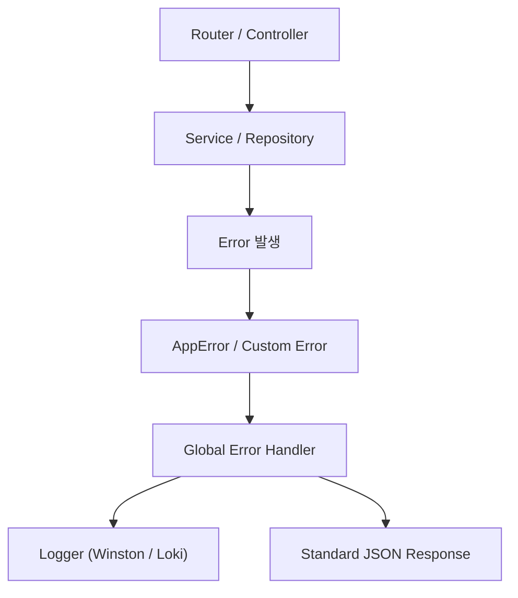

**version**  
Node.js 22.x / Express 5.x / TypeScript 5.x

---

### 요약  
Express 애플리케이션의 품질은 “에러를 어떻게 다루는가”에 따라 결정된다.  
전역 에러 핸들러를 통해 예외 상황을 통제하면,  
일관된 응답 포맷과 로깅 구조를 유지하면서 디버깅과 운영 효율성을 높일 수 있다.  

전역 에러 핸들러는 Express 애플리케이션의 일관성과 안정성을 보장한다.
AppError 클래스를 중심으로 예외를 구조화하면,
모든 오류가 동일한 포맷으로 기록되고 응답된다.
이 방식은 디버깅 효율뿐 아니라 API 신뢰성을 높이는 핵심 요소다.

핵심 내용은 다음과 같다.  
- Express 에러 처리 기본 원리  
- 중앙집중식(Global) 에러 핸들러 구성  
- 사용자 정의 예외 클래스 설계  
- 에러 로그 및 응답 포맷 표준화  
- 비동기 핸들러 오류 처리 유틸리티  

---

##### 참고자료  
- [Express Error Handling Docs](https://expressjs.com/en/guide/error-handling.html)  
- [OWASP API Security Guidelines](https://owasp.org/www-project-api-security/)  
- [RFC 7807: Problem Details for HTTP APIs](https://datatracker.ietf.org/doc/html/rfc7807)  

---

#### 1. Express 에러 처리 기본 구조  

Express는 미들웨어 체인 마지막에 에러 처리 미들웨어를 정의하여  
모든 예외를 중앙에서 처리할 수 있다.  

```typescript
// server.ts
import express from "express";
import { errorHandler } from "./middlewares/error-handler";

const app = express();
app.use(express.json());

// 일반 라우터
app.get("/", (req, res) => {
  throw new Error("Unexpected error occurred");
});

// 전역 에러 핸들러 등록
app.use(errorHandler);

app.listen(3000, () => console.log("🚀 Server running"));
```

---

#### 2. 전역 에러 핸들러 구현

```typescript
// src/middlewares/error-handler.ts
import { Request, Response, NextFunction } from "express";

export const errorHandler = (
  err: any,
  req: Request,
  res: Response,
  next: NextFunction
) => {
  const status = err.status || 500;
  const message = err.message || "Internal Server Error";

  console.error(`[${new Date().toISOString()}] ${req.method} ${req.url} → ${message}`);

  res.status(status).json({
    success: false,
    error: {
      message,
      code: status,
      timestamp: new Date().toISOString(),
      path: req.url,
    },
  });
};
```

모든 예외는 이 핸들러를 통해 처리되며,
로그는 서버 콘솔 또는 로깅 시스템으로 전송된다.

---

#### 3. 사용자 정의 예외 클래스 설계

비즈니스 로직에서 예외를 명확히 표현하기 위해
사용자 정의 에러 클래스를 정의할 수 있다.

```typescript
// src/utils/errors.ts
export class AppError extends Error {
  status: number;

  constructor(message: string, status: number = 500) {
    super(message);
    this.status = status;
  }
}

export class NotFoundError extends AppError {
  constructor(resource: string) {
    super(`${resource} not found`, 404);
  }
}

export class ValidationError extends AppError {
  constructor(message: string) {
    super(message, 400);
  }
}
```

---

#### 4. 컨트롤러에서의 에러 발생 처리

```typescript
// src/controllers/user.controller.ts
import { Request, Response, NextFunction } from "express";
import { NotFoundError } from "../utils/errors";
import * as userService from "../services/user.service";

export const getUserById = async (req: Request, res: Response, next: NextFunction) => {
  try {
    const user = await userService.getUserById(Number(req.params.id));
    if (!user) throw new NotFoundError("User");
    res.json({ success: true, data: user });
  } catch (err) {
    next(err); // 전역 핸들러로 전달
  }
};
```

Express에서는 `next(err)`를 호출하면
자동으로 마지막 error-handler 미들웨어가 실행된다.

---

#### 5. 비동기 에러 핸들링 유틸리티

비동기 라우터에서 `try-catch`를 반복하는 대신,
공통 래퍼 유틸을 사용해 간결하게 관리할 수 있다.

```typescript
// src/utils/async-handler.ts
import { Request, Response, NextFunction } from "express";

export const asyncHandler =
  (fn: Function) => (req: Request, res: Response, next: NextFunction) =>
    Promise.resolve(fn(req, res, next)).catch(next);
```

```typescript
// 적용 예시
router.get("/:id", asyncHandler(userController.getUserById));
```

---

#### 6. 표준 응답 구조

모든 API 응답은 다음 JSON 구조를 따라야 한다.

| 필드          | 설명     | 예시                                             |
| ----------- | ------ | ---------------------------------------------- |
| **success** | 성공 여부  | `true` / `false`                               |
| **data**    | 결과 데이터 | `{ "id": 1, "email": "user@example.com" }`     |
| **error**   | 오류 상세  | `{ "message": "User not found", "code": 404 }` |

예시 – 정상 응답:

```json
{
  "success": true,
  "data": { "id": 3, "name": "Ingeun" }
}
```

예시 – 에러 응답:

```json
{
  "success": false,
  "error": {
    "message": "Invalid input data",
    "code": 400,
    "timestamp": "2025-10-24T14:32:12.123Z",
    "path": "/api/v1/users"
  }
}
```

---

#### 7. 로깅 및 모니터링 연동

운영 환경에서는 단순 콘솔 출력 대신
로깅 시스템(Logstash, Winston, Pino, Loki 등)과 연동해야 한다.

```typescript
import winston from "winston";

export const logger = winston.createLogger({
  transports: [new winston.transports.Console()],
  format: winston.format.combine(
    winston.format.timestamp(),
    winston.format.json()
  ),
});
```

```typescript
logger.error({
  level: "error",
  message: err.message,
  status: err.status,
  url: req.url,
  stack: err.stack,
});
```

이를 통해 장애 분석, API 호출 추적, SLA 보고서 작성이 가능해진다.

---

#### 8. 에러 코드 분류 체계

| 코드      | 의미                    | 설명         |
| ------- | --------------------- | ---------- |
| **400** | Bad Request           | 요청 파라미터 오류 |
| **401** | Unauthorized          | 인증 실패      |
| **403** | Forbidden             | 접근 권한 없음   |
| **404** | Not Found             | 리소스 없음     |
| **409** | Conflict              | 중복 리소스 발생  |
| **500** | Internal Server Error | 서버 내부 오류   |

모든 에러는 AppError 기반으로 포맷 통일을 유지한다.

---

#### 9. 전체 구조 다이어그램



---


