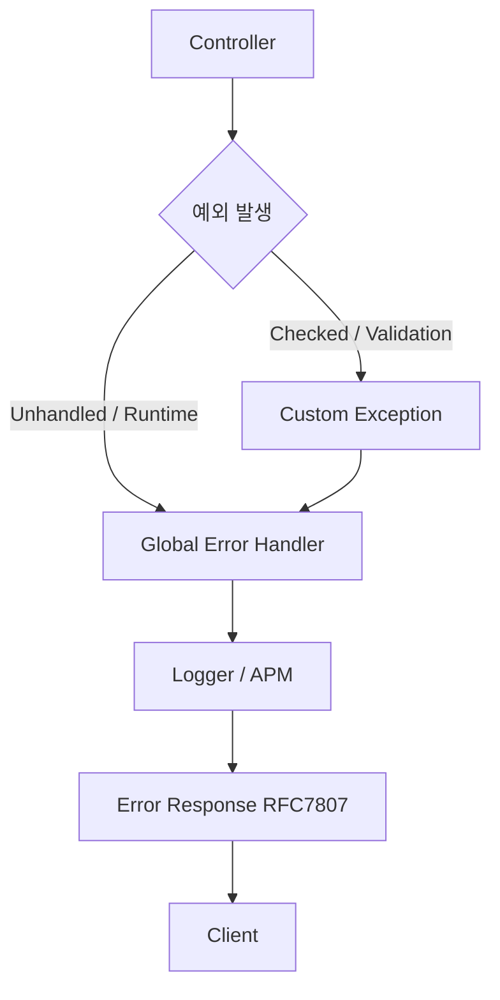

#### 요약

- 모든 예외(Exception)를 **단일 처리 지점(Global Handler)** 에서 관리하는 방법을 정의한다.  
- 프레임워크별로 공통된 처리 원칙(`예외 캡처 → 로깅 → 표준 응답 변환`)을 적용한다.  
- RFC 7807 기반의 에러 표현 구조와 `success/data/error` 응답 포맷을 통합한다.  
- **FastAPI / Spring Boot / Express / NestJS** 공용 실무 예시 포함.

> 전역 에러 핸들러는 “API의 최후 보루”이며,  
> 서비스 일관성과 안정성을 결정짓는 핵심 인프라 레벨 컴포넌트다.
> 전역 에러 핸들링은 API의 “마지막 방어선”으로,
> 모든 서비스 계층의 예외를 표준화된 응답 구조로 변환하는 핵심 컴포넌트다.
>
> FastAPI, Spring Boot, Express, NestJS 모두
> `Exception → Logging → RFC7807 JSON 응답` 구조를 일관되게 유지해야 한다.


| 요약         | 설명                                                                                        |
| ---------- | ----------------------------------------------------------------------------------------- |
| **핵심 목표**  | 예외 발생 시, 예측 가능한 JSON 구조로 클라이언트 응답                                                         |
| **핸들링 방식** | 프레임워크별 전역 핸들러 통합 (`@ControllerAdvice`, `ExceptionFilter`, `app.use`, `exception_handler`) |
| **효과**     | 서비스 안정성, 로깅 일관성, 클라이언트 처리 단순화                                                             |
| **확장성**    | Sentry / Prometheus / Grafana 연동 시 손쉬운 추적                                                 |
---

##### 참고자료
- [RFC 7807 - Problem Details for HTTP APIs](https://datatracker.ietf.org/doc/html/rfc7807)
- [Spring Boot @ControllerAdvice](https://docs.spring.io/spring-framework/docs/current/reference/html/web.html#mvc-ann-controller-advice)
- [FastAPI Exception Handling](https://fastapi.tiangolo.com/tutorial/handling-errors/)
- [NestJS Exception Filters](https://docs.nestjs.com/exception-filters)
- [Express Error Middleware Docs](https://expressjs.com/en/guide/error-handling.html)

---

#### 1. 에러 핸들링 계층 구조



| 단계          | 설명                                       |
| ----------- | ---------------------------------------- |
| ① 예외 발생     | Controller / Service / Repository 등에서 발생 |
| ② 예외 구분     | Validation, Business, System 예외 구분       |
| ③ 전역 핸들러 진입 | CustomException 외의 모든 에러 포함              |
| ④ 로깅 및 분석   | TraceID, 스택, 사용자 정보 로깅                   |
| ⑤ 일관된 응답 반환 | `success=false`, RFC7807 기반 JSON 변환      |

---

#### 2. 핵심 원칙

| 원칙                | 설명                             |
| ----------------- | ------------------------------ |
| **1. 중앙 집중 처리**   | 모든 에러를 단일 핸들러에서 처리             |
| **2. 표준 응답 포맷**   | `success / data / error` 구조 유지 |
| **3. 상태 코드 매핑**   | 예외 타입별 HTTP Status 일관성         |
| **4. 로깅/모니터링 연동** | Sentry, Grafana, ELK 등과 통합     |
| **5. 개발/운영 구분**   | DEBUG 모드일 때만 상세 스택 노출          |

---

#### 3. 언어별 전역 에러 핸들링 구현

---

##### 🐍 FastAPI

```python
from fastapi import FastAPI, Request, HTTPException
from fastapi.responses import JSONResponse

app = FastAPI()

@app.exception_handler(Exception)
async def global_exception_handler(request: Request, exc: Exception):
    status_code = getattr(exc, "status_code", 500)
    error_response = {
        "success": False,
        "data": None,
        "error": {
            "type": "about:blank",
            "title": "Internal Server Error" if status_code == 500 else str(exc.__class__.__name__),
            "status": status_code,
            "detail": str(exc),
            "instance": str(request.url)
        }
    }
    return JSONResponse(status_code=status_code, content=error_response)
```

> ✅ `@app.exception_handler(Exception)`
> → 모든 예외를 포착해 구조화된 JSON 반환
> → 로그 수집기(Loguru, Sentry 등)와 연계 가능

---

##### ☕ Spring Boot

```java
@RestControllerAdvice
public class GlobalExceptionHandler {

    @ExceptionHandler(CustomException.class)
    public ResponseEntity<ApiResponse<Void>> handleCustom(CustomException e) {
        var error = Map.of(
            "type", "https://api.example.com/errors/" + e.getCode(),
            "title", e.getMessage(),
            "status", e.getStatus(),
            "detail", e.getDetail()
        );
        return ResponseEntity.status(e.getStatus())
            .body(ApiResponse.failure(error));
    }

    @ExceptionHandler(Exception.class)
    public ResponseEntity<ApiResponse<Void>> handleGeneral(Exception e) {
        var error = Map.of(
            "type", "about:blank",
            "title", "Internal Server Error",
            "status", 500,
            "detail", e.getMessage()
        );
        return ResponseEntity.status(HttpStatus.INTERNAL_SERVER_ERROR)
            .body(ApiResponse.failure(error));
    }
}
```

> ✅ `@RestControllerAdvice`를 통해 전역 예외 처리
> ✅ `ApiResponse.failure()`로 응답 포맷 통일

---

##### 🟦 Express

```javascript
// app.js
app.use((err, req, res, next) => {
  console.error(err.stack);
  const status = err.status || 500;
  res.status(status).json({
    success: false,
    data: null,
    error: {
      type: `https://api.example.com/errors/${status}`,
      title: err.name || "ServerError",
      status,
      detail: err.message || "Internal Server Error",
      instance: req.originalUrl
    }
  });
});
```

> ✅ `app.use((err, req, res, next))` 미들웨어는 Express의 전역 에러 처리 포인트
> ✅ Error 객체 확장(`err.code`, `err.status`)으로 세분화 가능

---

##### 🧱 NestJS

```typescript
@Catch()
export class GlobalExceptionFilter implements ExceptionFilter {
  catch(exception: any, host: ArgumentsHost) {
    const ctx = host.switchToHttp();
    const response = ctx.getResponse<Response>();
    const request = ctx.getRequest<Request>();
    const status = exception.getStatus ? exception.getStatus() : 500;
    const message = exception.message || 'Unexpected Error';

    response.status(status).json({
      success: false,
      data: null,
      error: {
        type: `https://api.example.com/errors/${status}`,
        title: exception.name || 'Error',
        status,
        detail: message,
        instance: request.url,
      },
    });
  }
}
```

> ✅ NestJS는 `@Catch()` 데코레이터를 통해 ExceptionFilter 등록
> ✅ `main.ts`에서 `app.useGlobalFilters(new GlobalExceptionFilter())` 로 활성화

---

#### 4. 상태 코드 매핑 가이드

| 예외 유형                     | 설명         | HTTP Status |
| ------------------------- | ---------- | ----------- |
| `ValidationException`     | 필드 검증 실패   | 400         |
| `UnauthorizedException`   | 인증 실패      | 401         |
| `ForbiddenException`      | 권한 부족      | 403         |
| `EntityNotFoundException` | 리소스 없음     | 404         |
| `ConflictException`       | 데이터 충돌     | 409         |
| `TimeoutException`        | 외부 호출 타임아웃 | 504         |
| `RuntimeException`        | 시스템 오류     | 500         |

---

#### 5. 로그 및 트레이싱 연동

> 전역 핸들러는 모든 예외 발생 시 **로그 파이프라인의 시작점**이 된다.

##### 권장 로깅 필드

| 필드          | 설명                   |
| ----------- | -------------------- |
| `timestamp` | 발생 시각                |
| `traceId`   | 요청별 고유 식별자 (APM 연동용) |
| `path`      | 요청 URI               |
| `status`    | HTTP 상태 코드           |
| `errorCode` | 내부 에러 코드             |
| `detail`    | 에러 상세 메시지            |

##### 로그 예시 (JSON)

```json
{
  "timestamp": "2025-10-25T13:00:00Z",
  "traceId": "9a32fd",
  "path": "/api/v1/users",
  "status": 404,
  "errorCode": "USER_NOT_FOUND",
  "detail": "User with ID=99 not found"
}
```

---

#### 6. 개발/운영 모드 분리

| 모드            | 출력 내용                   | 설명         |
| ------------- | ----------------------- | ---------- |
| **개발(DEV)**   | 에러 스택, 원문 메시지 표시        | 디버깅 중심     |
| **운영(PROD)**  | 사용자 친화적 메시지, traceId 표시 | 보안 중심      |
| **테스트(TEST)** | 모의 데이터 / 단위 테스트용 예외     | 자동화 테스트 활용 |

> `.env` 또는 `application.yml` 등 환경 변수를 통해
> `APP_ENV=dev / prod / test` 로 제어

---

#### 7. 실무 적용 예시 (FastAPI 기준)

```python
import logging
logger = logging.getLogger("uvicorn.error")

@app.exception_handler(Exception)
async def handler(request: Request, exc: Exception):
    trace_id = str(uuid4())
    logger.error(f"[{trace_id}] {request.url} - {exc}")
    return JSONResponse(
        status_code=500,
        content={
            "success": False,
            "data": None,
            "error": {
                "type": "about:blank",
                "title": "Internal Server Error",
                "status": 500,
                "detail": str(exc),
                "traceId": trace_id,
                "instance": str(request.url)
            }
        }
    )
```

> ✅ 로그와 traceId를 연동하여 운영 환경에서도 추적 가능
> ✅ Sentry, Datadog, ELK 연계 시 `traceId` 기반 추적 가능

---

