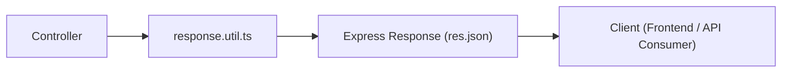

**version**  
Node.js 22.x / Express 5.x / TypeScript 5.x

---

### 요약  
API 응답 형식은 프런트엔드·모바일·외부 연동 시스템과의 통신 신뢰도를 결정한다.  
Express 애플리케이션에서는 성공·실패·경고 등 모든 응답을  
하나의 공통 포맷으로 표준화하여 유지보수성과 가독성을 확보해야 한다.  


API 응답을 표준화하면 프런트엔드·모바일·외부 시스템 간 연동의 일관성이 향상된다.
`response.util.ts`를 통한 성공/실패 응답 통합 관리와
상수화된 메시지·상태 코드를 사용하면 유지보수성이 높아진다.
Express 전역에 응답 래퍼를 적용하면 모든 컨트롤러가
공통 인터페이스(`res.success`, `res.failure`)를 통해 일관된 응답을 제공할 수 있다.

핵심 내용은 다음과 같다.  
- 성공·실패 응답의 표준 JSON 구조  
- Express 환경에서의 응답 유틸리티 구성  
- 상태 코드 / 메시지 일관성 유지 원칙  
- 페이징, 메타데이터, 경고 응답 처리  
- 글로벌 표준 응답 적용 패턴  

##### API 응답 흐름 다이어그램



이 구조를 통해 응답 포맷은 항상 동일하게 유지된다.

---

##### 참고자료  
- [JSON:API Specification](https://jsonapi.org/)  
- [RFC 7807 – Problem Details for HTTP APIs](https://datatracker.ietf.org/doc/html/rfc7807)  
- [OWASP API Response Security](https://owasp.org/www-project-api-security/)  

---

#### 1. 응답 포맷의 표준화  

모든 API는 다음의 기본 구조를 따라야 한다.  

```json
{
  "success": true,
  "message": "요청이 성공적으로 처리되었습니다.",
  "data": { "id": 1, "name": "Ingeun" },
  "meta": null,
  "error": null
}
```

에러 발생 시에는 아래 형식을 따른다.

```json
{
  "success": false,
  "message": "리소스를 찾을 수 없습니다.",
  "data": null,
  "meta": null,
  "error": { "code": 404, "details": "User not found" }
}
```

| 필드          | 설명                  |
| ----------- | ------------------- |
| **success** | 요청 성공 여부            |
| **message** | 상태 메시지              |
| **data**    | API 응답 데이터          |
| **meta**    | 페이지네이션 / 부가정보       |
| **error**   | 오류 상세 정보 (코드, 설명 등) |

---

#### 2. 응답 유틸리티 구성

```typescript
// src/utils/response.util.ts
import { Response } from "express";

export const success = (
  res: Response,
  data: any = null,
  message = "요청이 성공적으로 처리되었습니다.",
  meta: any = null
) => {
  return res.status(200).json({
    success: true,
    message,
    data,
    meta,
    error: null,
  });
};

export const created = (
  res: Response,
  data: any = null,
  message = "리소스가 성공적으로 생성되었습니다."
) => {
  return res.status(201).json({
    success: true,
    message,
    data,
    meta: null,
    error: null,
  });
};

export const failure = (
  res: Response,
  code = 400,
  message = "요청 처리 중 오류가 발생했습니다.",
  details: any = null
) => {
  return res.status(code).json({
    success: false,
    message,
    data: null,
    meta: null,
    error: { code, details },
  });
};
```

이 유틸을 통해 Controller 코드가 간결해지고,
응답 형식이 일관되게 유지된다.

---

#### 3. 컨트롤러 적용 예시

```typescript
// src/controllers/user.controller.ts
import { success, failure } from "../utils/response.util";
import * as userService from "../services/user.service";

export const getUserById = async (req, res) => {
  try {
    const user = await userService.getUserById(Number(req.params.id));
    if (!user) return failure(res, 404, "사용자를 찾을 수 없습니다.");
    return success(res, user);
  } catch (err) {
    return failure(res, 500, "서버 오류가 발생했습니다.", err.message);
  }
};
```

---

#### 4. 페이지네이션(Pagination) 응답 예시

```typescript
// src/controllers/user.controller.ts
import { success } from "../utils/response.util";

export const getUsers = async (req, res) => {
  const page = Number(req.query.page) || 1;
  const limit = Number(req.query.limit) || 10;

  const { data, total } = await userService.getPagedUsers(page, limit);
  const meta = { page, limit, total, totalPages: Math.ceil(total / limit) };

  return success(res, data, "사용자 목록 조회 성공", meta);
};
```

응답 예시:

```json
{
  "success": true,
  "message": "사용자 목록 조회 성공",
  "data": [{ "id": 1, "name": "Ingeun" }],
  "meta": { "page": 1, "limit": 10, "total": 35, "totalPages": 4 },
  "error": null
}
```

---

#### 5. 표준 메시지 및 상태 코드 정의

```typescript
// src/constants/http-status.ts
export const HttpStatus = {
  OK: 200,
  CREATED: 201,
  BAD_REQUEST: 400,
  UNAUTHORIZED: 401,
  FORBIDDEN: 403,
  NOT_FOUND: 404,
  CONFLICT: 409,
  INTERNAL_SERVER_ERROR: 500,
};

// src/constants/response-messages.ts
export const ResponseMessage = {
  SUCCESS: "요청이 성공적으로 처리되었습니다.",
  CREATED: "리소스가 성공적으로 생성되었습니다.",
  UPDATED: "리소스가 수정되었습니다.",
  DELETED: "리소스가 삭제되었습니다.",
  NOT_FOUND: "요청한 리소스를 찾을 수 없습니다.",
  SERVER_ERROR: "서버 오류가 발생했습니다.",
};
```

Controller에서는 상수만 호출하면 된다.

```typescript
import { HttpStatus, ResponseMessage } from "../constants";
return failure(res, HttpStatus.NOT_FOUND, ResponseMessage.NOT_FOUND);
```

---

#### 6. 글로벌 응답 미들웨어 (선택 적용)

전역적으로 응답 형식을 감싸려면,
`res.success`, `res.failure` 메서드를 커스터마이징할 수 있다.

```typescript
// src/middlewares/response-wrapper.ts
import { Request, Response, NextFunction } from "express";
import * as responseUtil from "../utils/response.util";

export const responseWrapper = (req: Request, res: Response, next: NextFunction) => {
  res.success = (data: any, message?: string, meta?: any) =>
    responseUtil.success(res, data, message, meta);
  res.failure = (code: number, message?: string, details?: any) =>
    responseUtil.failure(res, code, message, details);
  next();
};
```

```typescript
// server.ts
app.use(responseWrapper);
```

이제 Controller에서는 `res.success()`만 호출하면 된다.

```typescript
res.success(user, "사용자 조회 성공");
```

---

