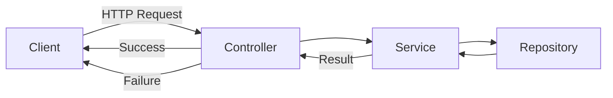

#### 요약

- API 응답의 일관성을 확보하기 위한 **표준 JSON 구조**를 정의한다.  
- 성공/실패 응답을 명확히 구분하고, `success / data / error` 구조를 모든 서비스에서 통일한다.  
- 각 언어별로 **표준 응답 래퍼(Wrapper)** 를 구현하여 Controller 단의 중복 로직을 최소화한다.  
- Swagger / OpenAPI 문서화 시 일관된 스키마를 자동 생성할 수 있다.

> “응답(Response)은 단순 데이터가 아니라, 시스템 신뢰성과 예측 가능성을 표현하는 인터페이스다.”

###### 응답 테스트 시나리오

| 케이스         | 요청               | 기대 결과                     |
| ----------- | ---------------- | ------------------------- |
| 정상 조회       | `GET /users/1`   | success=true, data 존재     |
| 잘못된 요청      | `GET /users/abc` | success=false, status=400 |
| 존재하지 않는 리소스 | `GET /users/999` | success=false, status=404 |
| 서버 오류       | DB 연결 실패         | success=false, status=500 |

---

> 응답 표현의 표준화는 단순한 개발 편의성을 넘어,
> 서비스 품질·신뢰도·API 유지보수성의 근간이 된다.
>
> **FastAPI / Spring Boot / Express / NestJS** 모두
> 이 구조(`success / data / error`)를 공통적으로 사용함으로써
> 통합된 응답 체계, 자동 문서화, 모니터링, 테스트 자동화가 가능하다.

---

##### 참고자료
- [RFC 7807 - Problem Details for HTTP APIs](https://datatracker.ietf.org/doc/html/rfc7807)
- [OpenAPI Specification](https://swagger.io/specification/)
- [FastAPI Response Model](https://fastapi.tiangolo.com/tutorial/response-model/)
- [Spring RESTful ResponseEntity](https://docs.spring.io/spring-framework/reference/web/webmvc/mvc-controller/ann-responseentity.html)
- [NestJS Response Mapping](https://docs.nestjs.com/controllers#request-object)
- [Express Response API](https://expressjs.com/en/4x/api.html#res)

---

#### 1. 응답 구조 설계 원칙

| 항목 | 설명 |
|------|------|
| **일관성 (Consistency)** | 모든 API는 동일한 형태의 JSON 응답을 반환해야 한다. |
| **명확성 (Clarity)** | 성공과 실패 응답은 명확히 구분되어야 한다. |
| **표준화 (Standardization)** | RFC 7807 / HTTP 상태 코드와의 일관성 유지 |
| **확장성 (Extensibility)** | 추가 메타데이터(`meta`, `traceId`, `timestamp`) 확장이 가능해야 한다. |

---

#### 2. 표준 응답 구조

#####  기본 구조

```json
{
  "success": true,
  "data": {},
  "error": null
}
```

| 필드          | 설명                                   |
| ----------- | ------------------------------------ |
| **success** | 요청 성공 여부 (Boolean)                   |
| **data**    | 실제 응답 데이터 (Object, Array, Primitive) |
| **error**   | 실패 시 에러 정보 (RFC7807 기반 JSON 객체)      |

##### 확장 구조 (추천)

```json
{
  "success": true,
  "data": {},
  "meta": {
    "traceId": "abc123",
    "timestamp": "2025-10-25T13:00:00Z"
  },
  "error": null
}
```

> `meta` 필드는 요청 추적 및 성능 측정(Log/Tracing)과 연동 가능
> (예: OpenTelemetry, ELK, Grafana 등)

---

#### 3. 성공 응답 (Success Response)

##### 예시: 단일 리소스 조회

```json
{
  "success": true,
  "data": {
    "id": 1,
    "name": "Ingeun Jeong"
  },
  "error": null
}
```

##### 예시: 목록 조회

```json
{
  "success": true,
  "data": {
    "items": [
      { "id": 1, "name": "Alice" },
      { "id": 2, "name": "Bob" }
    ],
    "total": 2
  },
  "meta": {
    "page": 1,
    "limit": 10
  },
  "error": null
}
```

---

#### 4. 실패 응답 (Error Response)

> 실패 응답은 `success: false`, `data: null`, `error` 필드에 RFC7807 기반 JSON을 포함한다.

```json
{
  "success": false,
  "data": null,
  "error": {
    "type": "https://api.example.com/errors/validation",
    "title": "Validation Error",
    "status": 400,
    "detail": "The field 'email' is required.",
    "instance": "/api/v1/users"
  }
}
```

---

#### 5. 언어별 응답 Wrapper 예시

##### 🐍 FastAPI

```python
from pydantic import BaseModel
from typing import Optional, Any

class ApiResponse(BaseModel):
    success: bool
    data: Optional[Any] = None
    error: Optional[Any] = None

# 사용 예시
@app.get("/users/{id}", response_model=ApiResponse)
def get_user(id: int):
    user = {"id": id, "name": "Ingeun"}
    return ApiResponse(success=True, data=user)
```

---

##### ☕ Spring Boot

```java
@Getter
@AllArgsConstructor(staticName = "of")
public class ApiResponse<T> {
    private final boolean success;
    private final T data;
    private final Object error;

    public static <T> ApiResponse<T> success(T data) {
        return new ApiResponse<>(true, data, null);
    }

    public static <T> ApiResponse<T> failure(Object error) {
        return new ApiResponse<>(false, null, error);
    }
}
```

```java
@GetMapping("/{id}")
public ResponseEntity<ApiResponse<User>> getUser(@PathVariable Long id) {
    User user = userService.findById(id);
    return ResponseEntity.ok(ApiResponse.success(user));
}
```

---

##### 🟦 Express

```javascript
const success = (data) => ({ success: true, data, error: null });
const failure = (err) => ({ success: false, data: null, error: err });

app.get("/users/:id", (req, res) => {
  const user = { id: req.params.id, name: "Ingeun" };
  res.json(success(user));
});
```

---

##### 🧱 NestJS

```typescript
export class ApiResponse<T> {
  constructor(
    public success: boolean,
    public data?: T,
    public error?: any,
  ) {}

  static ok<T>(data: T): ApiResponse<T> {
    return new ApiResponse(true, data);
  }

  static fail(error: any): ApiResponse<null> {
    return new ApiResponse(false, null, error);
  }
}
```

```typescript
@Get(':id')
async getUser(@Param('id') id: string) {
  const user = await this.userService.findById(+id);
  return ApiResponse.ok(user);
}
```

---

#### 6. 응답 흐름 다이어그램



---

#### 7. 응답 상태 코드 매핑

| 상태 코드                         | 의미             | 예시 응답                |
| ----------------------------- | -------------- | -------------------- |
| **200 OK**                    | 요청 성공          | `GET /users`         |
| **201 Created**               | 리소스 생성 완료      | `POST /users`        |
| **204 No Content**            | 성공했지만 응답 본문 없음 | `DELETE /users/{id}` |
| **400 Bad Request**           | 유효성 검증 실패      | 잘못된 필드 값             |
| **401 Unauthorized**          | 인증 실패          | 토큰 누락/만료             |
| **403 Forbidden**             | 권한 없음          | 접근 금지                |
| **404 Not Found**             | 리소스 없음         | 잘못된 ID               |
| **500 Internal Server Error** | 서버 내부 오류       | 예외 발생                |

---

#### 8. Swagger / OpenAPI 통합

##### 예시 (NestJS)

```typescript
@ApiOkResponse({ schema: { example: { success: true, data: {}, error: null } } })
@ApiBadRequestResponse({ schema: { example: { success: false, data: null, error: { title: "Bad Request" } } } })
```

##### 예시 (Spring Boot)

```java
@Operation(summary = "Get User", responses = {
  @ApiResponse(responseCode = "200", description = "Success",
    content = @Content(schema = @Schema(implementation = ApiResponse.class))),
  @ApiResponse(responseCode = "400", description = "Bad Request")
})
```

---


