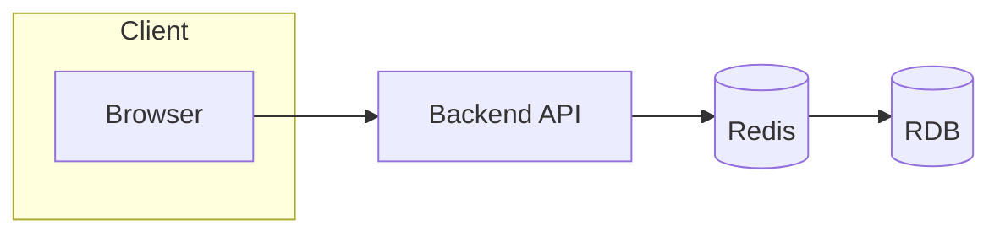

#### 요약

- 캐시(Cache)는 **속도와 부하 분산**을 위한 메모리 저장 계층  
- 세션(Session)은 **사용자 상태**를 관리하는 데이터 구조  
- 이 둘은 Redis를 중심으로 실무에서 함께 설계된다.  
- 주요 목표: **성능 향상 + 일관성 유지 + 확장성 확보**

- Redis는 **메모리 기반 Key-Value 저장소**로,  
  캐시·세션·Pub/Sub·Lock 등 다양한 용도로 사용된다.  
- 캐시의 핵심: TTL, Eviction Policy, Persistence(AOF/RDB)  
- 언어별 기본 연결 및 헬스체크 예시 포함.
  
---

##### 참고자료
- [Redis Documentation](https://redis.io/docs)
- [Spring Session](https://docs.spring.io/spring-session/reference/)
- [NestJS CacheModule Docs](https://docs.nestjs.com/techniques/caching)
- [connect-redis for Express](https://www.npmjs.com/package/connect-redis)

---

#### 1. 캐시와 세션의 역할

| 구분 | 설명 | 예시 |
|------|------|------|
| **Cache** | 자주 조회되는 데이터를 메모리에 저장 | 제품 목록, 사용자 프로필 |
| **Session** | 로그인 사용자 상태 관리 | 세션 쿠키, 토큰, 인증정보 |
| **공통점** | Redis 같은 인메모리 DB 사용 | 빠른 접근, TTL 만료 |

---

#### 2. Redis 도입 배경

* DB 부하 감소 (읽기 트래픽 분산)
* TTL 기반의 일시적 데이터 저장
* 분산 세션 / 메시지 큐(PubSub) / 캐시 일관성 지원

---

#### 3. 챕터 구성

| 파일                        | 설명                                     |
| ------------------------- | -------------------------------------- |
| **redis-basics.md**       | Redis 기본 구조, TTL, Eviction 정책          |
| **cache-strategies.md**   | Lazy / Write-through / Invalidation 전략 |
| **session-clustering.md** | 세션 저장소, Sticky/Shared 구조, 보안           |

> 이 세 문서는 하나의 “캐시-세션 관리 세트(Cache Layer Suite)”로 함께 운영된다.

