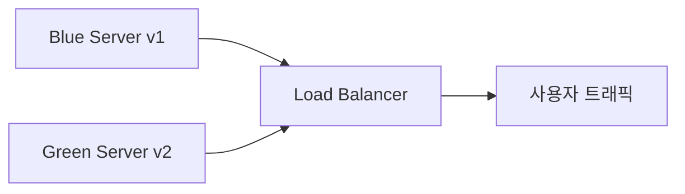

#### 요약
> Node.js 애플리케이션 배포는 단순한 코드 전달이 아니라,  
> **자동화·안정성·확장성**을 중심으로 구성되어야 한다.  
> Docker로 환경을 통합하고, PM2로 프로세스를 관리하며,  
> GitHub Actions나 Jenkins를 활용한 CI/CD로 무중단 배포를 구현한다.

- 배포 구성 요소: **빌드, 테스트, 배포 자동화**
- Docker + PM2 조합으로 안정적 운영
- Nginx Reverse Proxy로 HTTPS 및 라우팅 처리
- GitHub Actions 기반 CI/CD 파이프라인 예시 포함
  
> **요약:**
> Node.js 배포의 핵심은 “**반복 가능한 자동화 프로세스**”다.
> 수동 작업을 제거하고, 테스트 → 빌드 → 배포 → 모니터링이 하나의 흐름으로 이어지게 설계하라.


##### 참고자료
- [Docker Docs](https://docs.docker.com/)
- [PM2 공식 문서](https://pm2.keymetrics.io/)
- [GitHub Actions Docs](https://docs.github.com/en/actions)

---

#### 1. 배포 전략 개요

| 구성요소 | 역할 |
|-----------|------|
| **Build** | 코드를 실행 가능한 형태로 패키징 |
| **Test** | 코드 품질 및 기능 검증 |
| **Deploy** | 서버로 배포 및 실행 |
| **Monitor** | 실행 상태 및 성능 추적 |

```mermaid
flowchart LR
  A[Developer Push] --> B[CI Pipeline (Build/Test)]
  B --> C[CD Pipeline (Deploy)]
  C --> D[Production Server]
  D --> E[Monitoring & Alerts]
```

---

#### 2. 배포 환경 구성

Node.js 배포는 일반적으로 다음 두 가지 방식을 사용한다.

| 방식                | 설명               | 예시                 |
| ----------------- | ---------------- | ------------------ |
| **Bare-metal 배포** | 서버에 직접 설치        | PM2, systemd       |
| **Container 배포**  | Docker 기반 이미지 실행 | Docker, Kubernetes |

> **권장:** 개발/운영 환경이 다른 경우 Docker 기반으로 환경 일관성을 확보하는 것이 가장 효율적이다.

---

#### 3. Docker 기반 배포

##### 1) Dockerfile 예시

```dockerfile
FROM node:20-alpine

WORKDIR /usr/src/app
COPY package*.json ./
RUN npm install --production

COPY . .
EXPOSE 3000
CMD ["node", "dist/server.js"]
```

##### 2) docker-compose.yml 예시

```yaml
version: '3'
services:
  app:
    build: .
    container_name: node-api
    ports:
      - "3000:3000"
    environment:
      NODE_ENV: production
    restart: always
```

##### 3) 실행

```bash
$ docker-compose up -d --build
$ docker logs -f node-api
```

---

#### 4. PM2를 통한 무중단 프로세스 관리

PM2는 Node.js 애플리케이션을 프로덕션 환경에서 안정적으로 실행하기 위한 프로세스 매니저다.

##### 실행 명령

```bash
$ pm2 start dist/server.js -i max --name "node-api"
$ pm2 monit
```

##### 무중단 재배포

```bash
$ pm2 reload node-api
```

##### 로그 및 상태 확인

```bash
$ pm2 logs node-api
$ pm2 status
```

##### 설정 파일 (ecosystem.config.js)

```js
module.exports = {
  apps: [{
    name: "node-api",
    script: "./dist/server.js",
    instances: "max",
    exec_mode: "cluster",
    env_production: {
      NODE_ENV: "production"
    }
  }]
};
```

---

#### 5. Nginx를 이용한 Reverse Proxy 구성

##### 설정 예시 (/etc/nginx/sites-available/node-api.conf)

```nginx
server {
  listen 80;
  server_name example.com;

  location / {
    proxy_pass http://127.0.0.1:3000;
    proxy_http_version 1.1;
    proxy_set_header Upgrade $http_upgrade;
    proxy_set_header Connection 'upgrade';
    proxy_set_header Host $host;
    proxy_cache_bypass $http_upgrade;
  }
}
```

##### HTTPS 구성 (Let's Encrypt)

```bash
$ sudo certbot --nginx -d example.com
```

> Nginx는 Node.js 서버 앞단에서 SSL 종료, 로드 밸런싱, 캐싱을 수행한다.

---

#### 6. CI/CD 파이프라인 구축 (GitHub Actions)

##### Workflow 예시 (.github/workflows/deploy.yml)

```yaml
name: Node.js CI/CD

on:
  push:
    branches: [ "main" ]

jobs:
  build-and-deploy:
    runs-on: ubuntu-latest
    steps:
      - name: Checkout code
        uses: actions/checkout@v4

      - name: Setup Node
        uses: actions/setup-node@v4
        with:
          node-version: 20

      - name: Install dependencies
        run: npm ci

      - name: Run tests
        run: npm test

      - name: Build project
        run: npm run build

      - name: Deploy via SSH
        uses: appleboy/ssh-action@v1.0.0
        with:
          host: ${{ secrets.SERVER_HOST }}
          username: ${{ secrets.SERVER_USER }}
          key: ${{ secrets.SSH_PRIVATE_KEY }}
          script: |
            cd /var/www/node-api
            git pull origin main
            npm ci
            npm run build
            pm2 reload node-api
```

> **CI (Continuous Integration)** : 테스트 자동화
> **CD (Continuous Deployment)** : 코드 변경 즉시 배포 자동화

---

#### 7. 클러스터링 및 스케일링 전략

Node.js는 단일 스레드 구조이므로, CPU 코어별 병렬 실행을 통해 성능을 향상시킬 수 있다.

##### Cluster 모드 예시

```js
import cluster from 'cluster';
import os from 'os';
import express from 'express';

const numCPUs = os.cpus().length;

if (cluster.isPrimary) {
  console.log(`Master ${process.pid} is running`);
  for (let i = 0; i < numCPUs; i++) cluster.fork();
  cluster.on('exit', (worker) => console.log(`Worker ${worker.process.pid} died`));
} else {
  const app = express();
  app.get('/', (req, res) => res.send(`Worker ${process.pid} 응답`));
  app.listen(3000);
}
```

##### PM2로 클러스터 실행

```bash
$ pm2 start app.js -i max
```

> 💡 **Tip:** PM2의 클러스터 모드는 `os.cpus()` 기반으로 자동 코어 스케일링을 수행한다.

---

#### 8. 무중단 배포(Zero-Downtime Deployment)

| 방식                    | 설명                      |
| --------------------- | ----------------------- |
| **PM2 reload**        | 실행 중 프로세스를 중단 없이 교체     |
| **Blue-Green**        | 신규 버전 서버를 별도 구동 후 전환    |
| **Rolling Update**    | 트래픽을 점진적으로 신규 버전으로 이동   |
| **Canary Deployment** | 일부 사용자만 신규 버전 적용 후 모니터링 |

##### 예시: Blue-Green 구조



> 배포 시 로드 밸런서를 이용해 트래픽을 단계적으로 이전하면 서비스 중단을 최소화할 수 있다.

---

#### 9. 장애 복구 및 롤백 전략

| 시나리오       | 대응 절차                   |
| ---------- | ----------------------- |
| **빌드 실패**  | CI 파이프라인에서 중단, Slack 알림 |
| **배포 실패**  | 이전 Docker 이미지로 롤백       |
| **서버 장애**  | PM2 자동 재시작 또는 백업 서버 전환  |
| **데이터 손상** | 최근 백업본 복원 및 로그 검증       |

##### Docker 이미지 롤백

```bash
$ docker ps
$ docker image ls
$ docker run -d --name node-api-rollback <IMAGE_ID>
```

---

#### 10. 배포 체크리스트

| 항목        | 점검 내용                         | 상태    |
| --------- | ----------------------------- | ----- |
| 환경변수 설정   | `.env` 파일 / Secret Manager 확인 | ✅     |
| HTTPS 적용  | 인증서 만료일 확인                    | ✅     |
| 로그 경로     | `/var/log/` 권한 및 용량 확인        | ✅     |
| CI 테스트    | `npm test` 성공 여부              | ✅     |
| 배포 후 모니터링 | Grafana 지표 확인                 | ⚙️ 진행 |
| 백업        | 최신 백업 여부                      | ✅     |

---

#### 11. 결론

Node.js 배포는 **자동화(CI/CD)** 와 **무중단(Zero-Downtime)** 을 핵심으로 삼는다.
Docker, PM2, GitHub Actions, Nginx를 함께 구성하면
안정적이며 재현 가능한 배포 환경을 구축할 수 있다.
