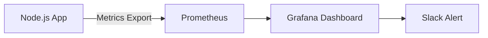

#### 요약
> Node.js 서비스 운영은 단순한 배포 이후의 관리가 아니라,  
> **성능·안정성·보안**을 유지하기 위한 지속적 모니터링과 정책 수립이 핵심이다.  
> 로그 관리, 버전 관리, 의존성 업데이트, 장애 대응 프로세스를 체계화해야 안정적 운영이 가능하다.

- 운영 구성요소: 로깅(Log), 모니터링(Monitoring), 알림(Alert)
- 버전 관리 및 LTS 정책 수립 필수
- 자동 업데이트 및 보안 패치 프로세스 정립
- 장애 복구 및 백업 정책 수립 필요

> **요약:**
> Node.js 운영은 “코드 이후의 품질 관리”다.
> 로그, 모니터링, 업데이트, 보안 정책이 하나의 **운영 시스템**으로 작동해야 한다.


##### 참고자료
- [Node.js LTS 정책](https://nodejs.org/en/about/releases)
- [PM2 공식 문서](https://pm2.keymetrics.io/)
- [Grafana & Prometheus Docs](https://grafana.com/docs/grafana/latest/getting-started/)

---

#### 1. 운영 환경 구성의 핵심 목표

| 영역 | 목표 | 예시 도구 |
|------|------|------------|
| **로깅(Log)** | 장애 분석 및 감사 추적 | Winston, Pino, Morgan |
| **모니터링(Metrics)** | 자원 사용, 응답시간 추적 | Prometheus, Grafana |
| **알림(Alert)** | 장애 실시간 통보 | Slack, PagerDuty |
| **보안(Security)** | 취약점 예방, 업데이트 자동화 | npm audit, Renovate |
| **백업(Backup)** | 데이터 복구 및 지속성 확보 | Cron, rsync, S3 |

> 운영 정책은 “관찰 가능성(Observability)”과 “복원력(Resilience)”을 중심으로 설계한다.

---

#### 2. 로깅(Log Management)

##### 1) Winston 로거 예시
```js
import winston from 'winston';

const logger = winston.createLogger({
  level: 'info',
  format: winston.format.combine(
    winston.format.timestamp(),
    winston.format.json()
  ),
  transports: [
    new winston.transports.Console(),
    new winston.transports.File({ filename: 'app.log' })
  ],
});

logger.info('서버 시작');
logger.error('에러 발생!');
```

##### 2) 로깅 분류

| 레벨      | 설명         | 예시           |
| ------- | ---------- | ------------ |
| `error` | 예외, 서비스 장애 | DB 연결 실패     |
| `warn`  | 경고, 위험 상황  | 메모리 과다 사용    |
| `info`  | 일반 실행 정보   | 서버 시작, 요청 처리 |
| `debug` | 개발용 상세 로그  | API 요청 파라미터  |

> **권장 정책:** 로그는 `stdout`(콘솔)과 파일 동시 출력,
> 프로덕션 환경에서는 중앙 수집 시스템(ELK, Loki 등)으로 전송한다.

---

#### 3. 모니터링(Monitoring) 구성

##### 1) Prometheus + Grafana 통합 구조



##### 2) 주요 지표(Metrics)

| 범주       | 예시 지표                           | 설명       |
| -------- | ------------------------------- | -------- |
| **성능**   | Response Time (p95), Throughput | 요청 처리 속도 |
| **리소스**  | CPU %, Memory, Disk I/O         | 시스템 상태   |
| **가용성**  | Error Rate, 5xx Count           | 서비스 안정성  |
| **네트워크** | Request Rate, RPS               | 요청량 모니터링 |

##### 3) Express에서 메트릭 노출

```js
import client from 'prom-client';
const collectDefaultMetrics = client.collectDefaultMetrics;
collectDefaultMetrics();

app.get('/metrics', async (req, res) => {
  res.set('Content-Type', client.register.contentType);
  res.end(await client.register.metrics());
});
```

> `/metrics` 엔드포인트를 Prometheus가 스크랩하여 지표를 수집한다.

---

#### 4. 프로세스 관리 (PM2)

PM2는 Node.js 프로세스 관리 및 모니터링 도구이다.

##### 설치 및 실행

```bash
$ npm install -g pm2
$ pm2 start app.js --name "my-api"
$ pm2 status
$ pm2 logs my-api
```

##### 주요 기능

| 기능          | 설명                           |
| ----------- | ---------------------------- |
| 프로세스 자동 재시작 | 장애 발생 시 즉시 복구                |
| 다중 인스턴스 실행  | CPU 코어 활용 (`-i max`)         |
| 로깅/모니터링 통합  | 실시간 로그 추적                    |
| JSON 설정 지원  | `ecosystem.config.js` 파일로 관리 |

##### 예시 설정 파일

```js
module.exports = {
  apps: [{
    name: "my-api",
    script: "./dist/server.js",
    instances: "max",
    exec_mode: "cluster",
    env_production: {
      NODE_ENV: "production"
    }
  }]
};
```

---

#### 5. 장애 대응 및 복구 프로세스

| 단계              | 내용                       | 담당               |
| --------------- | ------------------------ | ---------------- |
| **탐지(Detect)**  | 로그/모니터링에서 이상 감지          | Prometheus Alert |
| **대응(Respond)** | 담당자에게 Slack/PagerDuty 알림 | DevOps 팀         |
| **복구(Recover)** | PM2 재시작, 장애 원인 조사        | 운영팀              |
| **분석(Learn)**   | 장애 보고서 작성, 재발 방지 조치      | 기술 리더            |

> 💡 **핵심:** 장애 대응 매뉴얼을 문서화하여
> **“사람이 아닌 프로세스가 대응한다”**는 체계를 만든다.

---

#### 6. Node.js 버전 및 업데이트 정책

##### 1) LTS 정책 기반

| 구분                          | 주기             | 설명         |
| --------------------------- | -------------- | ---------- |
| **Current**                 | 6개월            | 최신 기능 포함   |
| **LTS (Long-Term Support)** | 30개월           | 운영 환경 권장   |
| **Maintenance**             | 종료 전 보안 패치만 제공 | 장기 유지 시스템용 |

##### 2) 버전 점검 및 업데이트

```bash
$ node -v
$ nvm ls
$ nvm install --lts
$ nvm alias default lts/*
```

##### 3) 의존성 자동 업데이트

```bash
$ npx npm-check-updates -u
$ npm install
```

> **보안 기준:** LTS 버전 유지 + 의존성 주간 점검(`npm audit`).

---

#### 7. 보안 정책 수립

| 범주             | 정책                        | 도구/방법                  |
| -------------- | ------------------------- | ---------------------- |
| **비밀번호 암호화**   | bcrypt / PBKDF2           | `bcrypt.hash()`        |
| **통신 보안**      | HTTPS / TLS               | `https.createServer()` |
| **환경 변수 보호**   | dotenv + Secret Manager   | `.env`, Vault          |
| **입력 검증**      | express-validator         | Joi / Zod              |
| **API Key 보호** | Header 기반 인증 + Rate Limit | Helmet / cors          |
| **취약점 점검**     | npm audit, snyk           | 자동 리포트 생성              |
| **로그 보존**      | 30~90일                    | CloudWatch, Loki 등     |

---

#### 8. 백업 및 데이터 보호 정책

##### 1) 주기적 백업 스케줄

```bash
# 매일 새벽 3시 DB 백업
0 3 * * * /usr/bin/mysqldump -u user -p'pass' mydb > /backup/db-$(date +\%F).sql
```

##### 2) 자동 압축 및 삭제

```bash
tar -czf /backup/db-$(date +\%F).tar.gz /backup/db-$(date +\%F).sql
find /backup -type f -mtime +30 -delete
```

> 💡 **원칙:** 백업은 **3-2-1 전략**을 따른다.
>
> * 3개의 백업 사본
> * 2개의 서로 다른 매체에 저장
> * 1개는 원격(클라우드) 보관

---

#### 9. 운영 점검 체크리스트

| 항목           | 주기    | 담당     | 상태    |
| ------------ | ----- | ------ | ----- |
| CPU/메모리 모니터링 | 실시간   | 운영팀    | ✅     |
| 로그 이상 감지     | 매일    | 개발팀    | ✅     |
| 취약점 점검       | 매주    | DevOps | ✅     |
| 의존성 업데이트     | 월 1회  | 개발팀    | ✅     |
| 백업 검증        | 주 1회  | DBA    | ✅     |
| 장애 대응 시뮬레이션  | 분기 1회 | 전체     | ⚙️ 진행 |

---

#### 10. 결론

Node.js 운영은 **가시성(Observability)**, **안정성(Resilience)**, **보안(Security)** 세 축 위에 세워져야 한다.
PM2, Prometheus, Grafana, Helmet, npm audit 등은 선택이 아닌 필수 구성요소이다.
지속적 점검과 정책 문서화를 통해 운영 품질을 자동화하는 것이 궁극적인 목표다.

