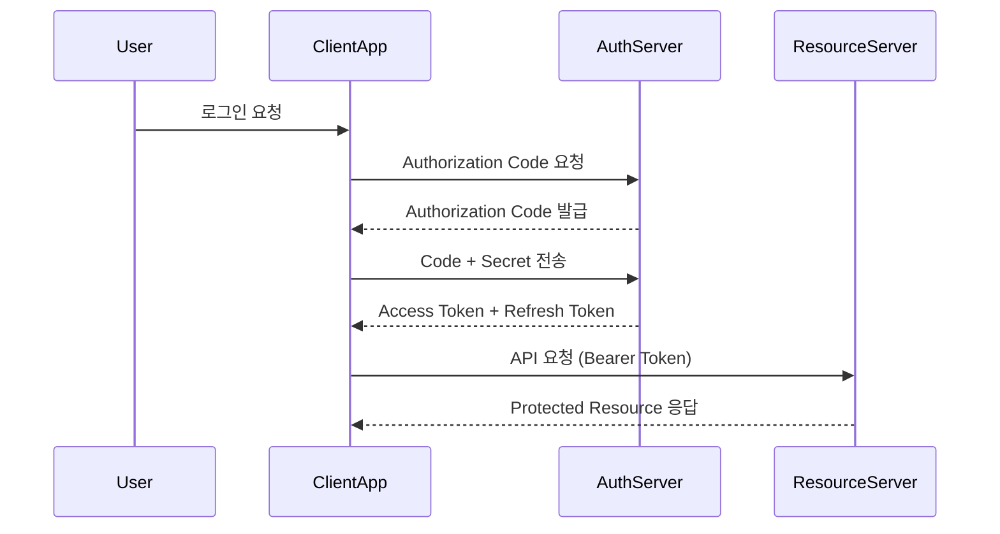
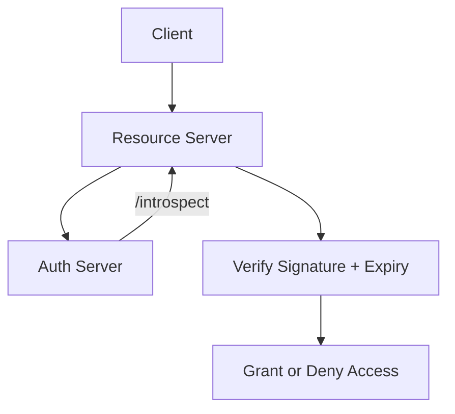

#### 요약

- **OAuth2**는 제3자 애플리케이션이 사용자의 자원(Resource)에 접근할 수 있도록 하는 **권한 위임(Delegation)** 프로토콜이다.  
- **OpenID Connect(OIDC)**는 OAuth2 위에 “인증(Authentication)” 기능을 확장한 프로토콜이다.  
- 실제 서비스에서는 **Access Token + ID Token + Refresh Token** 구조로 함께 사용된다.  
- Spring Boot, FastAPI, Express, NestJS 등 모든 백엔드 환경에서 **Keycloak, Google, GitHub OAuth Provider**와 통합 가능하다.

---

##### 참고자료
- [RFC 6749: The OAuth 2.0 Authorization Framework](https://datatracker.ietf.org/doc/html/rfc6749)
- [RFC 8252: OAuth 2.0 for Native Apps](https://datatracker.ietf.org/doc/html/rfc8252)
- [OpenID Connect Core 1.0](https://openid.net/specs/openid-connect-core-1_0.html)
- [Keycloak Documentation](https://www.keycloak.org/docs/latest/server_admin/)
- [Spring Security OAuth2 Guide](https://docs.spring.io/spring-security/reference/servlet/oauth2/index.html)
- [FastAPI OAuth2 Docs](https://fastapi.tiangolo.com/tutorial/security/oauth2-jwt/)
- [NestJS Passport OAuth2](https://docs.nestjs.com/security/authentication)

---

#### 1. OAuth2 개념 요약

OAuth2는 사용자의 비밀번호를 노출하지 않고,  
“승인된 제3자 애플리케이션”이 리소스 서버(API)에 접근하도록 허용하는 **권한 위임 프로토콜**이다.

| 구성요소 | 역할 |
|-----------|------|
| **Resource Owner** | 사용자 (데이터 소유자) |
| **Client (App)** | 사용자 자원에 접근하려는 애플리케이션 |
| **Authorization Server** | 인증/토큰 발급 담당 (예: Keycloak, Google) |
| **Resource Server** | 실제 API가 있는 서버 (Access Token 검증) |

---

#### 2. 주요 Grant Type (인증 플로우)

| Grant Type | 특징 | 주요 사용처 |
|-------------|------|-------------|
| **Authorization Code** | 가장 보안성이 높음. Redirect 기반 인증. | Web / Server |
| **Client Credentials** | 앱 간 인증 (서버 대 서버) | 내부 마이크로서비스 |
| **Password (Deprecated)** | 사용자 ID/PW 직접 제출 | ❌ 비권장 |
| **Implicit (Deprecated)** | SPA에 Token 직접 노출 | ❌ 비권장 |
| **Refresh Token** | Access Token 갱신용 | 장기 세션 유지 |

---

#### 3. OAuth2 Authorization Code Flow



> **Access Token**은 리소스 접근용,
> **Refresh Token**은 새로운 Access Token 재발급용.

---

#### 4. 실무 토큰 구조

| 토큰 종류               | 역할                  | 유효기간             | 저장 위치       |
| ------------------- | ------------------- | ---------------- | ----------- |
| **Access Token**    | API 요청 인증           | 짧음 (15~30분)      | 메모리 / Redis |
| **Refresh Token**   | Access Token 재발급    | 김 (7일~30일)       | DB / Redis  |
| **ID Token (OIDC)** | 사용자 정보 확인용 (JWT 형식) | Access Token과 동일 | 클라이언트 내부    |

---

#### 5. OpenID Connect (OIDC) 개념

OIDC는 OAuth2 기반에 **“ID Token”** 개념을 추가한 프로토콜이다.
즉, 단순 권한 위임이 아닌 “**사용자 인증(Authentication)**”까지 담당한다.

| 항목                    | 설명                     |
| --------------------- | ---------------------- |
| **Access Token**      | API 접근용                |
| **ID Token**          | 로그인한 사용자 식별용           |
| **UserInfo Endpoint** | 사용자 프로필 조회 API         |
| **Scope 예시**          | `openid profile email` |

---

##### 예시 — OIDC 기반 로그인 플로우

```mermaid
flowchart LR
  A[Client App] -->|Redirect| B[Authorization Server]
  B -->|Login + Consent| C[User]
  B --> A[Authorization Code 발급]
  A --> B[Code 교환 → Token 발급]
  A --> D[UserInfo API 호출]
  D --> A[ID Token (사용자 정보)]
```

---

#### 6. FastAPI OAuth2 예시

```python
from fastapi import Depends, HTTPException
from fastapi.security import OAuth2PasswordBearer
from jose import JWTError, jwt

oauth2_scheme = OAuth2PasswordBearer(tokenUrl="token")

@app.post("/token")
def login(form_data: OAuth2PasswordRequestForm = Depends()):
    user = authenticate(form_data.username, form_data.password)
    return {"access_token": create_token(user.username), "token_type": "bearer"}

@app.get("/users/me")
def read_users_me(token: str = Depends(oauth2_scheme)):
    payload = jwt.decode(token, SECRET, algorithms=["HS256"])
    return {"username": payload.get("sub")}
```

---

#### 7. Spring Boot OAuth2 Client 예시

```yaml
spring:
  security:
    oauth2:
      client:
        registration:
          google:
            client-id: ${GOOGLE_CLIENT_ID}
            client-secret: ${GOOGLE_CLIENT_SECRET}
            scope:
              - openid
              - profile
              - email
```

---

#### 8. Express + Passport OAuth2

```javascript
import passport from "passport";
import { Strategy as GoogleStrategy } from "passport-google-oauth20";

passport.use(new GoogleStrategy({
  clientID: process.env.GOOGLE_ID,
  clientSecret: process.env.GOOGLE_SECRET,
  callbackURL: "/auth/google/callback"
}, (accessToken, refreshToken, profile, done) => {
  done(null, profile);
}));
```

---

#### 9. NestJS — OAuth2 with Passport

```typescript
import { PassportStrategy } from '@nestjs/passport';
import { Strategy } from 'passport-google-oauth20';

@Injectable()
export class GoogleStrategy extends PassportStrategy(Strategy, 'google') {
  constructor() {
    super({
      clientID: process.env.GOOGLE_ID,
      clientSecret: process.env.GOOGLE_SECRET,
      callbackURL: '/auth/google/callback',
      scope: ['email', 'profile'],
    });
  }
  async validate(accessToken, refreshToken, profile) {
    return { profile };
  }
}
```

---

#### 10. Keycloak / OIDC Provider 연동

1. Keycloak Realm 생성
2. Client 등록 (`confidential`, Redirect URI 지정)
3. OpenID Connect Discovery URL 확인

   ```
   https://<keycloak-domain>/realms/<realm>/.well-known/openid-configuration
   ```
4. Access Token 및 ID Token 발급 확인

---

#### 11. 보안 고려사항

| 항목                                     | 설명                               |
| -------------------------------------- | -------------------------------- |
| **HTTPS 필수**                           | Redirect URI, Token 교환 모두 TLS 필요 |
| **State Parameter**                    | CSRF 방지용 랜덤 값                    |
| **PKCE (Proof Key for Code Exchange)** | SPA / Mobile 환경용 보안 코드 교환        |
| **Scope 최소화**                          | 필요한 최소 권한만 요청                    |
| **Refresh Token Rotation**             | 매 재발급 시 새 토큰으로 교체                |

---

#### 12. 토큰 검증 흐름 요약



---

#### 13. 결론

> OAuth2는 권한 위임의 표준이고,
> OIDC는 인증(Authentication)의 표준이다.
>
> 두 프로토콜을 함께 사용하면 **“로그인 + 접근 제어 + 신원 보증”**을
> 하나의 보안 흐름으로 통합할 수 있다.

```
