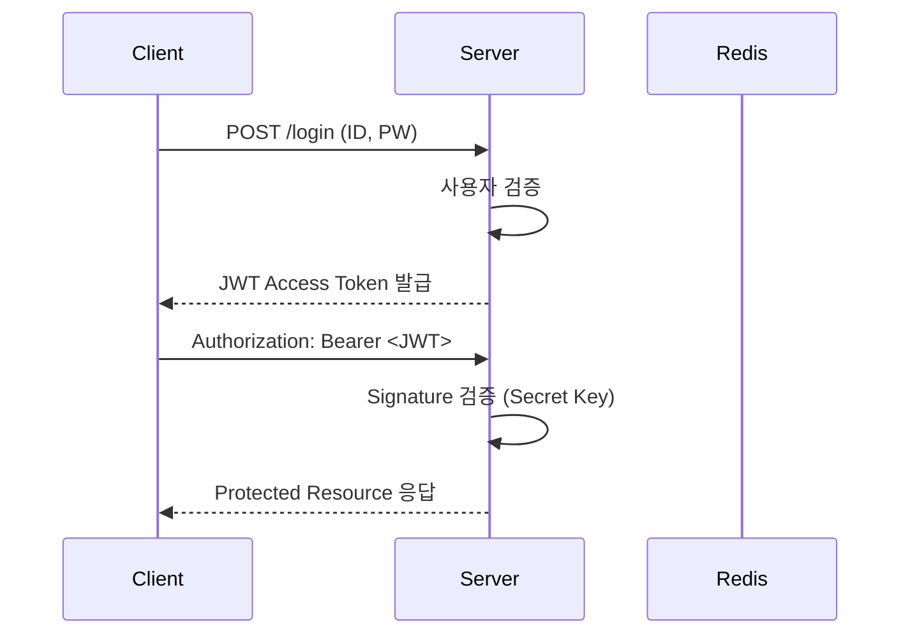

#### 1. JWT (JSON Web Token)

JWT(JSON Web Token)는 인증 정보를 **서버-클라이언트 간에 안전하게 전송하기 위한 토큰 형식**이다.  
서명(Signature)을 통해 **위변조 여부를 검증**할 수 있으며, 일반적으로 **HTTP Header의 `Authorization: Bearer <token>`** 형태로 전달된다.


#####  요약 정리

* JWT는 **Stateless 인증의 핵심 메커니즘**이다.
* 항상 **HTTPS 기반 전송**을 적용해야 하며,
  만료·폐기·서명키 관리 정책을 병행해야 안전하게 운용할 수 있다.

---

##### 🔹 구조 개요

JWT는 점(`.`)으로 구분된 세 부분으로 구성된다.

```
Header.Payload.Signature

```

| 구성 요소 | 설명 | 예시 |
|-----------|------|------|
| **Header** | 토큰의 타입(`JWT`)과 서명 알고리즘(`HS256`, `RS256`) | `{"alg": "HS256", "typ": "JWT"}` |
| **Payload** | 사용자 정보(Claims) — 주체, 권한, 만료시간 등 | `{"sub": "user123", "role": "admin", "exp": 1734567890}` |
| **Signature** | Header + Payload를 비밀키로 서명하여 위변조 방지 | `HMACSHA256(base64UrlEncode(header) + "." + base64UrlEncode(payload), secret)` |

---

##### 🔹 예시 (기본 Header)
```json
{
  "alg": "HS256",
  "typ": "JWT"
}
```

##### 🔹 예시 (Payload)

```json
{
  "sub": "user123",
  "name": "Ingeun",
  "role": "admin",
  "iat": 1734549000,
  "exp": 1734552600
}
```

이 토큰은 발급 시점(`iat`)과 만료 시간(`exp`)을 포함하고 있으며,
서버는 `exp` 값이 지나면 자동으로 “401 Unauthorized”를 반환하게 된다.

---

##### 🔹 동작 흐름



---

##### 🔹 JWT 장단점

| 구분      | 장점                                                                           | 단점                                                                       |
| ------- | ---------------------------------------------------------------------------- | ------------------------------------------------------------------------ |
| **장점**  | - 서버 세션 저장 불필요 (Stateless)<br>- 다양한 서비스 간 SSO 연동 가능<br>- 빠른 인증 처리            | - 토큰 탈취 시 만료 전까지 악용 가능<br>- Payload가 암호화되지 않아 노출 위험<br>- 만료 전 강제 무효화 어려움 |
| **보완책** | - HTTPS 전송 필수<br>- Refresh Token 도입<br>- 토큰 블랙리스트(Revocation) 또는 Redis 기반 검증 |                                                                          |

---

##### 🔹 HS256 vs RS256

| 알고리즘      | 특징                                    | 키 관리               |
| --------- | ------------------------------------- | ------------------ |
| **HS256** | 대칭키(HMAC) — 단일 Secret Key로 서명/검증      | 간단하지만 서버 간 공유 필요   |
| **RS256** | 비대칭키(RSA) — Private으로 서명, Public으로 검증 | 마이크로서비스 / OIDC에 적합 |

> ✅ **실무 권장**
>
> * 내부 단일 서비스: **HS256**
> * 외부 인증/SSO/OIDC 연동: **RS256**

---

##### 🔹 토큰 전달 방법

| 위치              | 예시                              | 주의사항             |
| --------------- | ------------------------------- | ---------------- |
| **HTTP Header** | `Authorization: Bearer <token>` | ✅ 표준 방식          |
| **Cookie**      | `token=<jwt>; HttpOnly; Secure` | CSRF 방어 필요       |
| **Query Param** | `?token=...`                    | ❌ 보안 취약 (URL 노출) |

---

##### 🔹 토큰 무효화 전략 (실무 예시)

1. **Redis 기반 Blacklist**

   * 로그아웃 시 토큰 JTI를 Redis에 저장 (`setex jti:<token_id>`)
   * 요청 시 블랙리스트 검증
2. **Access/Refresh Token 구조**

   * Access Token: 짧은 TTL (15분)
   * Refresh Token: 길게 유지 (7일~30일)
   * 재발급 시 이전 Access Token 폐기
3. **Key Rotation**

   * 서명용 Secret을 주기적으로 변경

---

##### 🔹 FastAPI / Express / NestJS / Spring Boot 비교

| 언어              | 주요 라이브러리                    | 핵심 메서드                                     |
| --------------- | --------------------------- | ------------------------------------------ |
| **FastAPI**     | `fastapi-jwt-auth`, `PyJWT` | `create_access_token()`, `jwt_required()`  |
| **Express**     | `jsonwebtoken`              | `jwt.sign()`, `jwt.verify()`               |
| **NestJS**      | `@nestjs/jwt`               | `JwtService.sign()`, `JwtService.verify()` |
| **Spring Boot** | `jjwt`, `Spring Security`   | `Jwts.builder()`, `Jwts.parserBuilder()`   |

---


```

---

이 버전은 단순 구조 설명을 넘어서  
- 토큰 구조 → 동작 흐름 → 알고리즘 비교 → 전송 방식 → 무효화 전략까지  
실무 운영 수준의 설명으로 확장된 형태입니다.  

원하신다면,  
다음으로 `OAuth2 + OIDC (토큰 교환 흐름)` 부분을  
이어서 같은 깊이로 만들어드릴까요?
```
