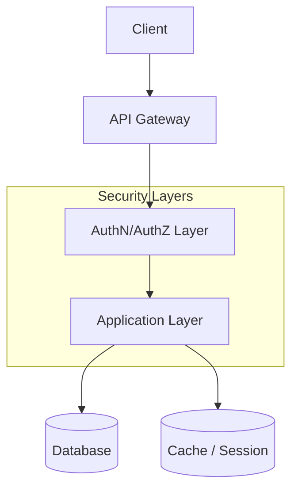

#### 요약

- API 보안은 **인증(Authentication)**, **인가(Authorization)**, **데이터 보호(Encryption)**, **전송 보안(TLS)** 로 구성된다.  
- 공격 벡터(XSS, CSRF, SQL Injection 등)는 코드·인프라 양쪽에서 방어해야 한다.  
- 모든 요청의 “입력 → 처리 → 응답” 구간에 일관된 보안 계층을 적용한다.

> “보안은 기능이 아니라 품질이다.”  
> 한 번의 누락이 전체 시스템의 신뢰도를 결정한다.

---

##### 참고자료
- [OWASP Top 10](https://owasp.org/www-project-top-ten/)
- [OAuth 2.1 RFC 6749](https://datatracker.ietf.org/doc/html/rfc6749)
- [OpenID Connect Core 1.0](https://openid.net/specs/openid-connect-core-1_0.html)
- [Spring Security Reference](https://docs.spring.io/spring-security/reference/)
- [FastAPI Security Docs](https://fastapi.tiangolo.com/advanced/security/oauth2-scopes/)
- [NestJS Guards & Interceptors](https://docs.nestjs.com/guards)

---

#### 1. 보안 4대 축

| 구분 | 설명 | 대표 기술 |
|------|------|------------|
| **인증(Authentication)** | 사용자가 누구인지 확인 | JWT, OAuth2, OIDC |
| **인가(Authorization)** | 사용자가 무엇을 할 수 있는지 판단 | RBAC, ABAC |
| **데이터 보호(Encryption)** | 평문을 암호화해 노출 방지 | AES, bcrypt, PBKDF2 |
| **전송 보안(TLS)** | 통신 구간 암호화 | HTTPS, HSTS, Certbot |

---

#### 2. 계층별 보안 구성

---

#### 3. 공격 벡터 및 방어 요약

| 공격 유형         | 설명              | 방어 방법                    |
| ------------- | --------------- | ------------------------ |
| XSS           | 클라이언트 스크립트 주입   | 출력 이스케이프, CSP            |
| CSRF          | 요청 위조           | CSRF 토큰, SameSite Cookie |
| SQL Injection | 쿼리 인젝션          | ORM / Prepared Statement |
| 세션 탈취         | 쿠키 탈취, Token 노출 | HttpOnly, Secure, Expiry |
| 무차별 대입        | 인증 시도 반복        | Rate Limiting, Captcha   |

---

#### 4. 보안 정책 수립 절차

1. 자원(Resource) 식별
2. 인증/인가 요구사항 정의
3. 키 관리/회전 정책 설정
4. 로깅 및 알림 체계 구축
5. 정기 보안 점검 및 펜테스트 수행

---

#### 5. 문서 구성

| 파일                            | 내용                     |
| ----------------------------- | ---------------------- |
| **authentication.md**         | 인증 (JWT, OAuth2, OIDC) |
| **authorization.md**          | 권한 제어 (RBAC, ABAC)     |
| **encryption-and-hashing.md** | 암호화 및 해시               |
| **secure-headers.md**         | 보안 헤더, CSP, HSTS       |
| **tls-configuration.md**      | HTTPS / TLS 구성         |

> 다음 문서들은 모든 언어 프레임워크에서 공통적으로 적용할 수 있는 실무 표준이다.
