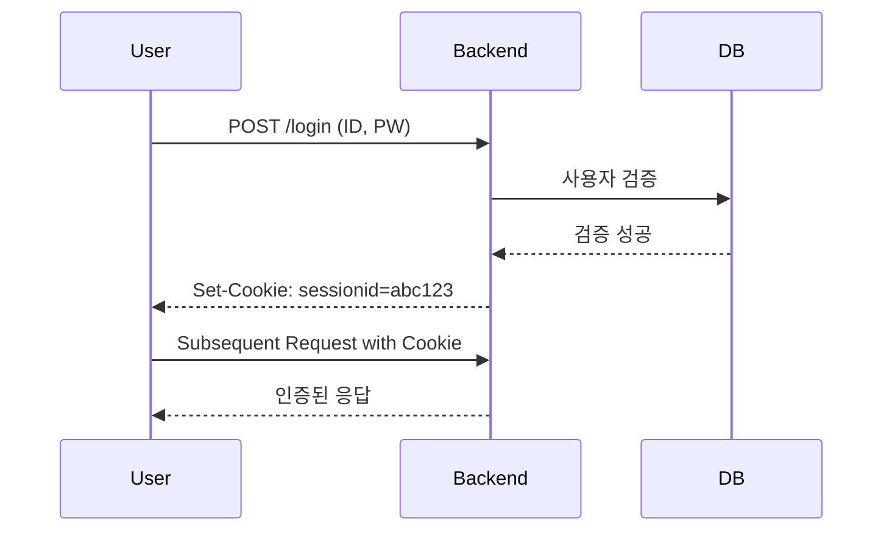

#### 요약

- 인증(Authentication)은 사용자가 “**누구인지 증명하는 과정**”이다.  
- 백엔드 서비스에서는 **세션(Session)**, **Basic 인증**, **API Key 인증**, **쿠키 기반 로그인** 등이 가장 기본적인 형태로 사용된다.  
- JWT나 OAuth2는 이 기본 인증 체계를 확장한 현대적인 방식이다.  
- 본 문서는 “Stateless 인증 이전 단계”의 전통적인 인증 모델을 다룬다.

* 세션 기반 인증은 **서버가 상태를 직접 관리하는 구조 (Stateful)**
* Basic / API Key는 **간단한 요청용 인증**으로, 보안성은 낮음
* 이후 JWT, OAuth2, OIDC는 이 구조를 **Stateless & 확장 가능한 형태**로 진화시킨 것
* 따라서 기본 인증 설계는 현대 인증의 **기초 계층(Fundamental Layer)** 이다.

---

##### 참고자료
- [RFC 7617: HTTP Basic Authentication](https://datatracker.ietf.org/doc/html/rfc7617)
- [OWASP Authentication Cheat Sheet](https://cheatsheetseries.owasp.org/cheatsheets/Authentication_Cheat_Sheet.html)
- [FastAPI Security Docs](https://fastapi.tiangolo.com/tutorial/security/)
- [Spring Security: Basic & Form Login](https://docs.spring.io/spring-security/reference/)
- [Express-session Docs](https://www.npmjs.com/package/express-session)
- [NestJS Guards Guide](https://docs.nestjs.com/guards)

---

#### 1. 인증(Authentication) 기본 원리

| 단계 | 설명 | 예시 |
|------|------|------|
| ① 로그인 요청 | 사용자가 아이디/비밀번호 전송 | `/login` API 호출 |
| ② 자격 증명 검증 | DB에 저장된 비밀번호 해시와 비교 | bcrypt 검증 |
| ③ 세션/토큰 발급 | 인증 성공 시 식별자 발급 | `session_id` 또는 `token` |
| ④ 상태 유지 | 클라이언트는 세션 쿠키를 통해 인증 유지 | `Set-Cookie: sessionid=...` |

---



---

#### 2. 세션(Session) 기반 인증

> 세션 기반 인증은 “서버가 로그인 상태를 직접 기억하는 구조”이다.

| 특징              | 설명                                  |
| --------------- | ----------------------------------- |
| **Stateful 구조** | 서버가 세션 상태(Session Store)를 유지        |
| **보관 위치**       | Redis, DB, Memory 등                 |
| **인증 흐름**       | 로그인 → 세션 ID 생성 → 쿠키에 저장 → 재요청 시 검증  |
| **장점**          | 단순하고 안정적                            |
| **단점**          | 서버 확장 시 Sticky Session / 공유 스토리지 필요 |

---

##### FastAPI 예시

```python
from fastapi import FastAPI, Request, Response

sessions = {}

@app.post("/login")
def login(request: Request):
    user = request.json().get("username")
    session_id = f"session-{user}"
    sessions[session_id] = user
    response = Response("logged in")
    response.set_cookie("session_id", session_id, httponly=True)
    return response

@app.get("/profile")
def profile(request: Request):
    session_id = request.cookies.get("session_id")
    return {"user": sessions.get(session_id, "anonymous")}
```

---

##### Express 예시

```javascript
import session from "express-session";

app.use(session({
  secret: process.env.SESSION_SECRET,
  resave: false,
  saveUninitialized: false
}));

app.post("/login", (req, res) => {
  req.session.user = { id: req.body.username };
  res.send("Logged in");
});
```

---

##### Spring Boot 예시

```java
@EnableWebSecurity
public class WebSecurityConfig extends WebSecurityConfigurerAdapter {
  @Override
  protected void configure(HttpSecurity http) throws Exception {
    http
      .formLogin()
      .and()
      .logout()
      .and()
      .authorizeRequests()
      .antMatchers("/login", "/css/**").permitAll()
      .anyRequest().authenticated();
  }
}
```

---

#### 3. Basic Authentication

> HTTP 헤더에 ID/PW를 Base64 인코딩해 포함하는 가장 단순한 인증 방식.
> `Authorization: Basic base64(username:password)`

| 항목  | 설명                             |
| --- | ------------------------------ |
| 장점  | 표준화, 간단한 API 통신에 유용            |
| 단점  | 매 요청마다 PW 노출 위험 → 반드시 HTTPS 필요 |
| 사용처 | 내부 API, 임시 관리자 인터페이스 등         |

##### FastAPI 예시

```python
from fastapi import Depends, HTTPException
from fastapi.security import HTTPBasic, HTTPBasicCredentials
security = HTTPBasic()

@app.get("/secure-data")
def secure(credentials: HTTPBasicCredentials = Depends(security)):
    if credentials.username != "admin" or credentials.password != "1234":
        raise HTTPException(status_code=401)
    return {"message": "Authenticated"}
```

##### Express 예시

```javascript
app.use("/admin", (req, res, next) => {
  const auth = req.headers.authorization;
  if (!auth || auth !== "Basic " + Buffer.from("admin:1234").toString("base64"))
    return res.status(401).send("Unauthorized");
  next();
});
```

---

#### 4. API Key 인증

> 클라이언트가 미리 발급받은 **고정 키(API Key)** 를 헤더나 쿼리로 전송하여 인증하는 방식.

| 항목    | 설명                                  |
| ----- | ----------------------------------- |
| 전달 방식 | `Authorization: ApiKey <key>`       |
| 장점    | 단순한 서버 간 인증 (CI/CD, 외부 연동)          |
| 단점    | 키 노출 시 무제한 접근 가능                    |
| 보완책   | IP 제한, 사용량 제한(Rate Limit), 만료/회전 정책 |

##### Express 예시

```javascript
app.use((req, res, next) => {
  const apiKey = req.headers["x-api-key"];
  if (apiKey !== process.env.VALID_API_KEY)
    return res.status(403).json({ error: "Invalid API Key" });
  next();
});
```

##### FastAPI 예시

```python
from fastapi import Header, HTTPException

@app.get("/service")
def read_service(x_api_key: str = Header(...)):
    if x_api_key != "SECRET123":
        raise HTTPException(status_code=403, detail="Invalid API Key")
    return {"status": "ok"}
```

---

#### 5. 쿠키 기반 로그인 흐름

| 단계                                       | 설명 |
| ---------------------------------------- | -- |
| ① 로그인 성공 시 서버가 `Set-Cookie` 헤더로 세션 쿠키 발급 |    |
| ② 브라우저는 자동으로 쿠키를 포함해 재요청                 |    |
| ③ 서버는 쿠키 값을 검증해 사용자 식별                   |    |
| ④ 로그아웃 시 쿠키 삭제(`Max-Age=0`)              |    |

##### Express 예시

```javascript
res.cookie("session", "abcd1234", { httpOnly: true, secure: true });
```

##### Spring Boot 예시

```java
@GetMapping("/logout")
public ResponseEntity<?> logout(HttpServletResponse response) {
    Cookie cookie = new Cookie("JSESSIONID", null);
    cookie.setMaxAge(0);
    response.addCookie(cookie);
    return ResponseEntity.ok("Logged out");
}
```

---

#### 6. 인증 실패 처리 (401 vs 403)

| 상태 코드                | 의미               | 예시           |
| -------------------- | ---------------- | ------------ |
| **401 Unauthorized** | 인증이 필요하거나 실패한 경우 | “로그인 필요”     |
| **403 Forbidden**    | 인증은 되었지만 권한 부족   | “관리자만 접근 가능” |

```json
{
  "error": {
    "code": 401,
    "message": "Unauthorized: invalid credentials"
  }
}
```

---

#### 7. 테스트 전략

* **로그인 플로우**: 올바른 사용자 / 잘못된 비밀번호 / 없는 사용자
* **세션 검증**: 로그인 후 쿠키 존재 확인
* **API Key**: 잘못된 키 / 만료된 키 테스트
* **401/403 응답**: 명확히 구분되는지 확인

##### Jest 예시 (Express)

```javascript
test("rejects invalid API key", async () => {
  const res = await request(app).get("/service").set("x-api-key", "wrong");
  expect(res.statusCode).toBe(403);
});
```

---


