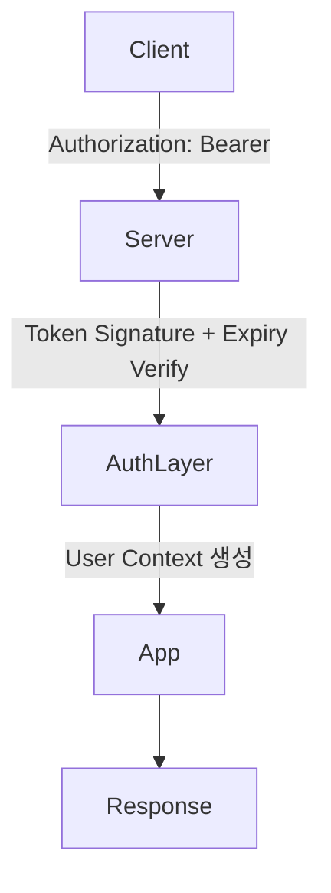

#### 요약

- Stateless 인증은 **서버가 세션을 저장하지 않고**,  
  각 요청이 스스로 인증정보(Token)를 포함해 신원을 증명하는 구조다.  
- 모든 상태는 “클라이언트 또는 토큰 내부(JWT 등)”에 존재한다.  
- 서버 간 확장(Scaling)과 MSA 환경에서 **가장 일반적인 인증 방식**이다.  
- 대표 방식: **JWT, API Key, HMAC Signature, Access Token + Refresh Token**

- 완전 **Stateless 인증 구조** (서버에 세션 없음)  
- Access / Refresh Token, HMAC, API Key 기반  
- FastAPI / Spring Boot / NestJS / Express 모두 실무 예시 포함  
- 실제 MSA 환경, Kubernetes, Gateway 연동 시 그대로 사용 가능  


| 항목        | 내용                                   |
| --------- | ------------------------------------ |
| **핵심 철학** | 서버는 상태(State)를 저장하지 않는다              |
| **주요 수단** | Access Token / HMAC / API Key        |
| **확장성**   | 완벽한 수평 확장 가능                         |
| **보안 요건** | 짧은 TTL + HTTPS + Signature 검증        |
| **실무 예시** | MSA Gateway, OpenAPI, SaaS API 인증 구조 |

---

> Stateless 인증은
> “**서버에 상태가 없는 보안 구조**”이자,
> 현대 백엔드 API의 기본 인증 표준이다.
>
> 세션 없이 확장 가능한 이 구조를 기반으로,
> OAuth2, OIDC, Federated Identity 같은 고급 보안 모델이 구축된다.

---

##### 참고자료
- [RFC 7235: HTTP Authentication](https://datatracker.ietf.org/doc/html/rfc7235)
- [OWASP Stateless Authentication Guide](https://cheatsheetseries.owasp.org/cheatsheets/Stateless_Authentication_Cheat_Sheet.html)
- [Spring Security Stateless Config](https://docs.spring.io/spring-security/reference/)
- [FastAPI Security Utilities](https://fastapi.tiangolo.com/advanced/security/)
- [NestJS Guards](https://docs.nestjs.com/guards)
- [Node.js jsonwebtoken Docs](https://www.npmjs.com/package/jsonwebtoken)

---

#### 1. Stateless 인증의 개념

| 항목 | 설명 |
|------|------|
| **Stateful (전통적)** | 서버가 세션 상태(Session Store)를 기억함 |
| **Stateless (현대적)** | 서버는 요청만 검증, 상태는 토큰에 포함 |
| **핵심 원리** | “모든 요청은 완전한 자기 설명(Self-contained)” |



---

#### 2. 동작 원리 요약

| 단계                                                      | 설명 |
| ------------------------------------------------------- | -- |
| ① 로그인 시 인증 서버(Auth Server)에서 **Access Token** 발급        |    |
| ② 클라이언트는 API 요청 시 `Authorization: Bearer <token>` 헤더 포함 |    |
| ③ 서버는 매 요청마다 토큰의 유효성(Signature, Expiry, Claim)을 검증      |    |
| ④ 검증이 통과되면 사용자 컨텍스트(User Context) 주입 후 처리               |    |
| ⑤ 서버는 어떠한 세션/상태도 저장하지 않음                                |    |

---

#### 3. 토큰 종류 비교

| 토큰 종류              | 설명                   | 저장 위치               | 권장 TTL    |
| ------------------ | -------------------- | ------------------- | --------- |
| **Access Token**   | API 요청 시 인증에 사용      | 메모리 / 쿠키            | 15~30분    |
| **Refresh Token**  | Access Token 갱신용     | HttpOnly 쿠키 / DB    | 7~30일     |
| **API Key**        | 고정 인증키 (서버 간 통신)     | 환경변수 / Secret Vault | 장기(회전 필요) |
| **HMAC Signature** | 요청 서명 기반 검증 (보안 API) | 클라이언트 + 서버 Secret   | 짧음(1~5분)  |

---

#### 4. Stateless 인증의 장점

| 항목           | 설명                                  |
| ------------ | ----------------------------------- |
| **확장성**      | 서버가 상태를 보관하지 않아 로드밸런싱이 용이           |
| **속도**       | 세션 조회 없이 빠른 응답 가능                   |
| **분산 환경 적합** | MSA, API Gateway, CDN, Lambda 등과 호환 |
| **보안 강화**    | JWT, HMAC 등 서명 기반 무결성 보장            |

---

#### 5. Stateless vs Stateful 비교

| 구분      | Stateful (세션)     | Stateless (토큰) |
| ------- | ----------------- | -------------- |
| 상태 저장   | 서버에 저장            | 없음             |
| 스토리지    | Redis / DB 필요     | 불필요            |
| 서버 확장   | Sticky Session 필요 | 자유로운 수평 확장     |
| 클러스터 환경 | 복잡                | 단순             |
| 인증 속도   | 세션 조회 필요          | 토큰 검증만 수행      |
| 만료 제어   | 서버 단위             | 토큰 TTL 기반      |

---

#### 6. FastAPI — Stateless 인증 예시

```python
from fastapi import Depends, HTTPException
from jose import jwt, JWTError

SECRET = "MY_SECRET"
ALGORITHM = "HS256"

def verify_token(token: str):
    try:
        payload = jwt.decode(token, SECRET, algorithms=[ALGORITHM])
        return payload["sub"]
    except JWTError:
        raise HTTPException(status_code=401, detail="Invalid token")

@app.get("/secure")
def secure(user: str = Depends(verify_token)):
    return {"user": user, "status": "authenticated"}
```

---

#### 7. Express — Token 기반 인증 예시

```javascript
import jwt from "jsonwebtoken";

const verifyToken = (req, res, next) => {
  const auth = req.headers.authorization;
  if (!auth?.startsWith("Bearer ")) return res.status(401).json({ error: "Unauthorized" });

  const token = auth.split(" ")[1];
  try {
    const decoded = jwt.verify(token, process.env.JWT_SECRET);
    req.user = decoded;
    next();
  } catch {
    return res.status(403).json({ error: "Invalid token" });
  }
};

app.get("/api/user", verifyToken, (req, res) => res.json({ user: req.user }));
```

---

#### 8. Spring Boot — Stateless Security 설정

```java
@EnableWebSecurity
public class SecurityConfig extends WebSecurityConfigurerAdapter {
  @Override
  protected void configure(HttpSecurity http) throws Exception {
    http
      .csrf().disable()
      .sessionManagement().sessionCreationPolicy(SessionCreationPolicy.STATELESS)
      .and()
      .authorizeRequests()
      .antMatchers("/auth/**").permitAll()
      .anyRequest().authenticated()
      .and()
      .addFilterBefore(jwtFilter(), UsernamePasswordAuthenticationFilter.class);
  }
}
```

---

#### 9. NestJS — JWT Guard 기반 Stateless 인증

```typescript
@Injectable()
export class JwtAuthGuard extends AuthGuard('jwt') {}

@UseGuards(JwtAuthGuard)
@Controller('user')
export class UserController {
  @Get('me')
  getProfile(@Req() req) {
    return req.user;
  }
}
```

---

#### 10. HMAC Signature 인증 (서명 기반 요청 검증)

> 서버 간 통신(API Gateway, Webhook 등)에서는 Access Token 대신
> **HMAC SHA256** 서명을 이용해 요청 위변조를 방지할 수 있다.

##### 예시 (Node.js)

```javascript
import crypto from "crypto";

function generateSignature(secret, payload) {
  return crypto.createHmac("sha256", secret).update(payload).digest("hex");
}

function verifySignature(req) {
  const signature = req.headers["x-signature"];
  const expected = generateSignature(process.env.SECRET, req.body);
  if (signature !== expected) throw new Error("Invalid signature");
}
```

---

#### 11. Stateless 인증의 보안 보완책

| 항목                              | 설명                                    |
| ------------------------------- | ------------------------------------- |
| **HTTPS 필수**                    | 토큰 탈취 방지                              |
| **짧은 TTL**                      | Access Token 만료 최소화                   |
| **Refresh Token 회전 (Rotation)** | 재발급 시 이전 토큰 폐기                        |
| **Revocation Store (선택)**       | 로그아웃 시 블랙리스트 처리                       |
| **Scope 기반 토큰**                 | 최소 권한만 부여 (`read:user`, `write:data`) |
| **Replay 방지**                   | Nonce, Timestamp 포함                   |

---

#### 12. Stateless 로그아웃 처리

> Stateless 구조에서는 서버 세션이 없기 때문에
> 로그아웃은 “클라이언트 단에서 토큰 제거”로 처리한다.
> 단, Refresh Token을 관리하는 경우 서버에서 무효화해야 한다.

| 유형                       | 방법                          |
| ------------------------ | --------------------------- |
| **Access Token 단독 사용 시** | 클라이언트에서 토큰 삭제               |
| **Refresh Token 병행 시**   | Redis/DB에서 Refresh Token 제거 |
| **보안 API (HMAC)**        | 요청 서명 시 Nonce 갱신            |

---

#### 13. 테스트 전략

* 올바른 토큰 / 잘못된 서명 / 만료 토큰 검증
* Authorization 헤더 누락 시 `401`
* 잘못된 Scope → `403`
* 토큰 TTL 만료 후 접근 차단 확인

##### 예시 (Jest)

```javascript
test("rejects expired token", async () => {
  const expiredToken = jwt.sign({ sub: "user" }, SECRET, { expiresIn: "-1s" });
  const res = await request(app).get("/api/user").set("Authorization", `Bearer ${expiredToken}`);
  expect(res.statusCode).toBe(403);
});
```

---

