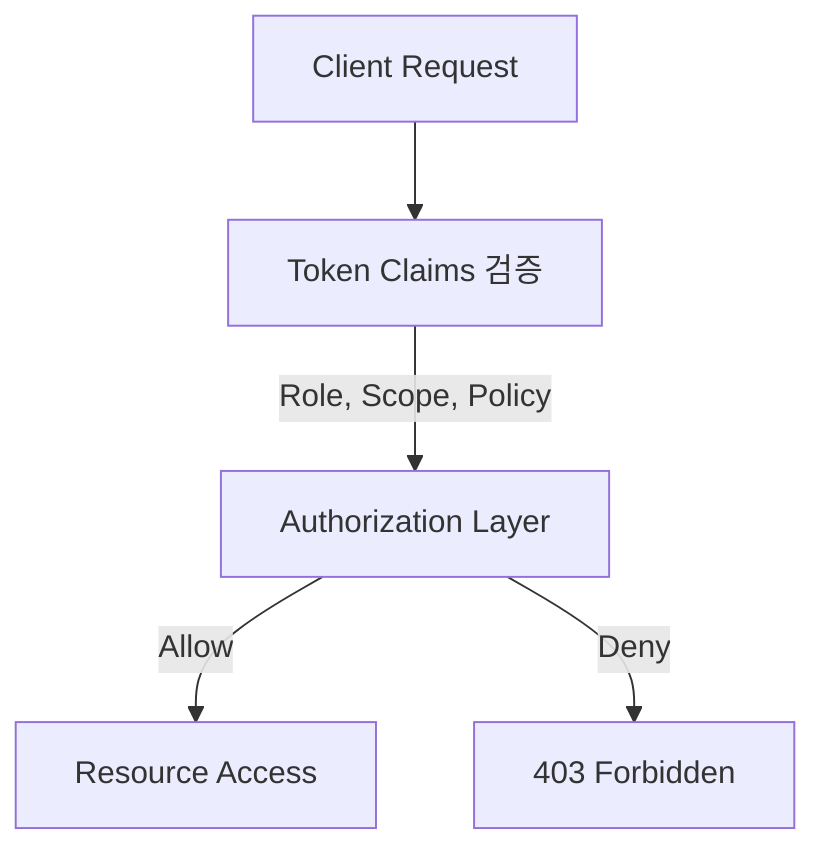
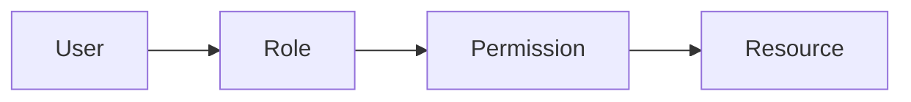

#### 요약

- **인증(Authentication)**이 “누구인가”를 확인하는 과정이라면,  
  **인가(Authorization)**는 “무엇을 할 수 있는가”를 결정하는 과정이다.  
- Stateless 환경에서는 세션 대신 **토큰 내부의 Claims 또는 외부 Policy 서버**를 기반으로 접근 권한을 제어한다.  
- 대표 접근 제어 방식: **RBAC(Role-Based Access Control)**, **ABAC(Attribute-Based Access Control)**, **Policy Engine(Keycloak, OPA, Casbin)**

> 인가는 인증보다 복잡하지만, 시스템의 신뢰성을 결정하는 마지막 관문이다.
>
> **RBAC**은 단순한 권한 관리,
> **ABAC**은 유연한 정책 기반 제어,
> **Policy Engine**은 중앙화된 거버넌스 모델이다.
>
> 모든 서비스는 규모에 따라 이 세 가지를 조합해
> **확장 가능한 권한 관리 체계**를 갖추어야 한다.

---

##### 참고자료
- [NIST RBAC Standard](https://csrc.nist.gov/projects/role-based-access-control)
- [ABAC (Attribute Based Access Control) NIST Guide](https://nvlpubs.nist.gov/nistpubs/specialpublications/nist.sp.800-162.pdf)
- [Casbin Authorization Library](https://casbin.org/)
- [OPA (Open Policy Agent)](https://www.openpolicyagent.org/)
- [Spring Security Method Security](https://docs.spring.io/spring-security/reference/servlet/authorization/method.html)
- [NestJS Guards & Interceptors](https://docs.nestjs.com/guards)

---

#### 1. 인가의 핵심 개념

| 항목 | 설명 | 예시 |
|------|------|------|
| **Authentication** | “누구인지” 증명 | 로그인, JWT 서명 검증 |
| **Authorization** | “무엇을 할 수 있는지” 결정 | `role=admin` → `/admin` 접근 허용 |
| **Access Control** | 특정 리소스에 대한 접근 제한 | “admin만 delete 가능” |



---

#### 2. Stateless 인가 구조

Stateless 환경에서는 서버가 세션 상태를 보관하지 않으므로,
**사용자 권한 정보는 토큰 내부 Claim 또는 외부 Policy 엔진에서 검증한다.**

| 방식                        | 설명                                   |
| ------------------------- | ------------------------------------ |
| **Claim 기반(Role, Scope)** | JWT 내부에 권한을 포함 (`role`, `scope`)     |
| **Policy 기반**             | 외부 정책 서버(OPA, Casbin, Keycloak)에서 검증 |
| **Hybrid**                | Claim → Policy 순서로 계층적 검증 수행         |

---

#### 3. RBAC (Role-Based Access Control)

> 역할(Role)에 따라 리소스 접근 권한을 부여하는 가장 일반적인 방식.

| 구성 요소          | 설명                                         |
| -------------- | ------------------------------------------ |
| **User**       | 사용자 계정                                     |
| **Role**       | 권한 집합 (예: `ADMIN`, `USER`)                 |
| **Permission** | 리소스별 접근 권한 (예: `read:user`, `delete:post`) |
| **Mapping**    | User ↔ Role ↔ Permission 연결                |



##### 예시 — RBAC Claim 기반 JWT

```json
{
  "sub": "user123",
  "role": ["admin"],
  "permissions": ["read:user", "delete:post"]
}
```

---

#### 4. FastAPI RBAC 예시

```python
from fastapi import Depends, HTTPException, Request

def require_role(role: str):
    def wrapper(request: Request):
        claims = request.state.user_claims
        if role not in claims.get("role", []):
            raise HTTPException(status_code=403, detail="Forbidden")
    return wrapper

@app.get("/admin", dependencies=[Depends(require_role("admin"))])
def admin_panel():
    return {"msg": "Admin access granted"}
```

---

#### 5. Spring Boot RBAC 예시

```java
@PreAuthorize("hasRole('ADMIN')")
@GetMapping("/admin")
public ResponseEntity<String> adminOnly() {
    return ResponseEntity.ok("Welcome, Admin!");
}
```

---

#### 6. NestJS RBAC (Guard 방식)

```typescript
@Injectable()
export class RolesGuard implements CanActivate {
  canActivate(context: ExecutionContext): boolean {
    const req = context.switchToHttp().getRequest();
    return req.user?.role?.includes('admin');
  }
}

@UseGuards(RolesGuard)
@Controller('admin')
export class AdminController {
  @Get()
  getAdminPanel() {
    return { message: 'Access granted to admin' };
  }
}
```

---

#### 7. ABAC (Attribute-Based Access Control)

> 사용자(User), 리소스(Resource), 환경(Environment) 속성에 기반한 동적 정책 제어.

| 속성                         | 예시                               |
| -------------------------- | -------------------------------- |
| **User Attributes**        | 부서, 직급, 나이, 조직                   |
| **Resource Attributes**    | 작성자, 공개 범위                       |
| **Environment Attributes** | 요청 IP, 시간대, 위치                   |
| **Policy 예시**              | “근무시간(9~18시) + 동일 부서 사용자만 수정 가능” |

##### Python (ABAC 예시)

```python
def can_edit(user, resource):
    return user["dept"] == resource["dept"] and 9 <= datetime.now().hour < 18
```

##### Casbin 정책 예시

```
p, admin, data1, read
p, hr_manager, data2, write
g, alice, admin
g, bob, hr_manager
```

---

#### 8. Policy Engine 기반 인가

> Policy Engine은 **인가 로직을 서비스 코드에서 분리**하여 중앙에서 관리하는 구조이다.

| 엔진                          | 특징                                  | 언어                   |
| --------------------------- | ----------------------------------- | -------------------- |
| **OPA (Open Policy Agent)** | Rego DSL 기반 정책 정의                   | Rego                 |
| **Casbin**                  | 다중 언어 SDK, Role/Policy 관리           | Policy Model (.conf) |
| **Keycloak**                | RBAC + Resource-based + REST API 제공 | JSON Policy          |

##### OPA 예시 (Rego)

```rego
package http.authz

default allow = false

allow {
  input.method == "GET"
  input.path == ["api", "users"]
  input.user.role == "admin"
}
```

---

#### 9. 권한 정책 적용 계층

| 계층                | 적용 방식                 | 예시                    |
| ----------------- | --------------------- | --------------------- |
| **Gateway**       | 공통 토큰 검증, Scope 기반 필터 | “read:api” 권한 체크      |
| **Service Layer** | Role / Policy 엔진 연동   | @PreAuthorize, Guards |
| **Database**      | Row-Level Security    | PostgreSQL RLS        |
| **UI/Client**     | 버튼, 메뉴 표시 제어          | React RoleContext     |

---

#### 10. Scope 기반 접근 제어

> OAuth2 / API Key 환경에서 사용되는 **권한 단위(Scopes)** 기반 제어 방식

| 예시 스코프       | 설명           |
| ------------ | ------------ |
| `read:user`  | 사용자 정보 조회 가능 |
| `write:post` | 게시물 작성 가능    |
| `admin:all`  | 관리자 전체 접근 가능 |

##### Express 예시

```javascript
function requireScope(scope) {
  return (req, res, next) => {
    const userScopes = req.user?.scope?.split(" ") || [];
    if (!userScopes.includes(scope)) return res.status(403).send("Forbidden");
    next();
  };
}

app.get("/users", requireScope("read:user"), (req, res) => res.send("ok"));
```

---

#### 11. 권한 거부 응답 표준 (RFC 7231 / 7807)

| 상태 코드                | 의미       | 설명               |
| -------------------- | -------- | ---------------- |
| **401 Unauthorized** | 인증 실패    | 토큰 누락/만료         |
| **403 Forbidden**    | 인가 실패    | 권한 없음            |
| **Problem+JSON 형식**  | 오류 명세 표준 | RFC7807 기반 응답 구조 |

##### 예시

```json
{
  "type": "https://api.example.com/errors/forbidden",
  "title": "Forbidden",
  "status": 403,
  "detail": "User does not have the required role: admin"
}
```

---

#### 12. 테스트 전략

| 테스트 항목            | 검증 내용        |
| ----------------- | ------------ |
| **권한 없는 요청**      | 403 응답 반환    |
| **Role Claim 누락** | 요청 차단        |
| **Scope 제한 요청**   | 특정 API 접근 차단 |
| **Policy 변경 반영**  | 실시간 업데이트 확인  |

##### Jest 예시

```javascript
test("rejects user without admin role", async () => {
  const res = await request(app).get("/admin").set("Authorization", `Bearer ${userToken}`);
  expect(res.statusCode).toBe(403);
});
```

---

