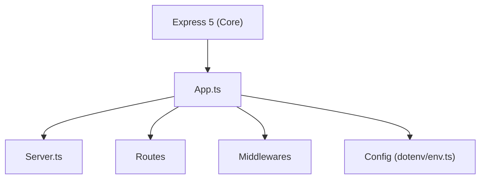

**version**  
Express v5.x / TypeScript 5.x

---

### 요약  
Express 5.x는 Node.js 백엔드 개발의 표준적인 프레임워크로,
비동기 라우터와 전역 에러 핸들러를 통해 안정적인 서버 구조를 제공한다.
TypeScript와 함께 사용할 경우 코드 안정성이 높아지고,
환경 변수 관리 및 디렉터리 구조를 명확히 하면 유지보수가 용이해진다.

핵심 내용은 다음과 같다.  
- Express 5.x 프로젝트 초기화 및 구조 설계  
- 환경 변수 및 서버 설정 관리  
- 라우팅 및 전역 에러 처리 방식  
- TypeScript 기반 실행 구조  
- 서버 실행 및 검증 절차  
---

##### 참고자료  
- [Express 공식 문서](https://expressjs.com/en/5x/api.html)  
- [TypeScript 핸드북](https://www.typescriptlang.org/docs/)  
- [Node.js API 레퍼런스](https://nodejs.org/api/)  

---

#### 1. Express 프로젝트 초기화  

다음 명령으로 Express와 TypeScript 개발 환경을 구성한다.  

```bash
pnpm add express dotenv
pnpm add -D typescript ts-node @types/express @types/node
npx tsc --init
```

프로젝트 구조 예시는 다음과 같다.

```
src/
 ├── app.ts
 ├── server.ts
 ├── routes/
 │    └── index.ts
 ├── middlewares/
 └── config/
      └── env.ts
```

---

#### 2. Express 서버 구성

서버는 `app.ts`에서 미들웨어와 라우터를 등록하고,
`server.ts`에서 실행 진입점을 정의한다.

```typescript
// src/app.ts
import express from "express";
import dotenv from "dotenv";
import router from "./routes";

dotenv.config();
const app = express();

// 미들웨어
app.use(express.json());
app.use(express.urlencoded({ extended: true }));

// 라우터
app.use("/api", router);

// 전역 에러 처리
app.use((err: any, req: any, res: any, next: any) => {
  console.error(err.stack);
  res.status(500).json({ message: "Internal Server Error" });
});

export default app;
```

```typescript
// src/server.ts
import app from "./app";
import { config } from "./config/env";

const PORT = config.port ?? 3000;

app.listen(PORT, () => {
  console.log(`🚀 Server running at http://localhost:${PORT}`);
});
```

---

#### 3. 환경 변수 관리

`.env` 파일을 사용하여 환경별 설정을 관리한다.

```bash
# .env
NODE_ENV=development
PORT=3000
LOG_LEVEL=info
```

```typescript
// src/config/env.ts
import dotenv from "dotenv";
dotenv.config();

export const config = {
  env: process.env.NODE_ENV ?? "development",
  port: Number(process.env.PORT ?? 3000),
  logLevel: process.env.LOG_LEVEL ?? "info",
};
```

환경에 따라 `.env.development` 또는 `.env.production` 파일을 별도로 관리할 수 있다.

---

#### 4. 라우터 구성

라우터는 요청 경로별로 분리하여 관리한다.

```typescript
// src/routes/index.ts
import { Router } from "express";
const router = Router();

router.get("/", (_, res) => {
  res.json({ message: "Hello Express 5!" });
});

export default router;
```

---

#### 5. 애플리케이션 구조



이 구조는 Express 애플리케이션의 주요 흐름을 나타낸다.
`App.ts`는 미들웨어, 라우터, 에러 핸들러를 등록하고,
`Server.ts`는 실행 엔트리 포인트 역할을 수행한다.
`Config` 폴더는 환경 변수 로딩을 담당하며,
`Routes` 폴더는 API 요청을 처리한다.

---

#### 6. 서버 실행 및 검증

설정이 완료되면 다음 명령으로 서버를 실행한다.

```bash
pnpm ts-node src/server.ts
```

브라우저에서 `http://localhost:3000/api`에 접속하면 다음과 같은 응답이 표시된다.

```json
{
  "message": "Hello Express 5!"
}
```

---

#### 7. 실행 환경 점검

```bash
node -v       # Node 버전
pnpm -v       # pnpm 버전
npx tsc --noEmit  # TypeScript 타입 검사
```

`--noEmit` 옵션은 실제 파일을 출력하지 않고 타입 검증만 수행한다.
모든 버전이 일치하는지 확인하면 Express 서버가 정상적으로 동작한다.

---

