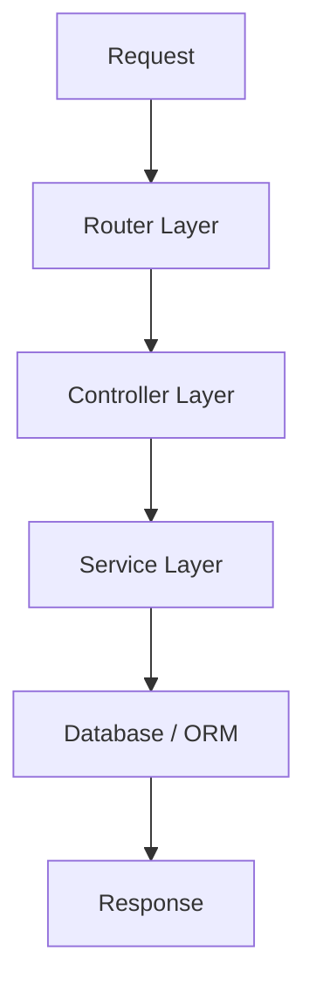

**version**  
Express 5.x / TypeScript 5.x

---

### 요약  
Express 기반 프로젝트는 명확한 계층 구조와 기능별 디렉터리 분리를 통해 유지보수성을 높일 수 있다.
`src/routes → controllers → services → config` 구조를 일관되게 유지하면 협업 효율이 향상된다.
또한 환경 변수와 빌드 경로를 명확히 분리하여 실행 환경별 일관성을 확보하는 것이 중요하다.

핵심 내용은 다음과 같다.  
- 프로젝트 디렉터리 구성 원칙  
- 모듈 단위 설계(App, Routes, Config 등)  
- 환경 구분을 위한 구성 파일 분리  
- 빌드/배포 환경에서의 폴더 구조 관리  

구조를 일관되게 유지하면 코드 탐색이 쉬워지고,  
개발자 간 협업 시 충돌이나 중복을 최소화할 수 있다.

---

##### 참고자료  
- [Express 공식 문서 – Application Structure](https://expressjs.com/en/guide/structure.html)  
- [TypeScript 프로젝트 구조 권장안](https://www.typescriptlang.org/docs/handbook/project-references.html)  

---

#### 1. 디렉터리 구성 개요  

아래는 Express + TypeScript 기반 백엔드 프로젝트의 기본 디렉터리 구조이다.

```

project-root/
├── src/
│   ├── app.ts
│   ├── server.ts
│   ├── routes/
│   │   ├── index.ts
│   │   ├── user.route.ts
│   │   └── auth.route.ts
│   ├── controllers/
│   │   ├── user.controller.ts
│   │   └── auth.controller.ts
│   ├── services/
│   │   ├── user.service.ts
│   │   └── auth.service.ts
│   ├── middlewares/
│   │   ├── auth.middleware.ts
│   │   └── error.middleware.ts
│   ├── config/
│   │   ├── env.ts
│   │   └── logger.ts
│   └── utils/
│       └── response.ts
│
├── prisma/                # ORM 설정 파일 (Prisma 기준)
├── scripts/               # 배포/빌드/테스트 스크립트
├── tests/                 # 단위 및 통합 테스트
├── .env                   # 환경 변수 파일
├── tsconfig.json
├── package.json
├── pnpm-lock.yaml
└── README.md

```

---

#### 2. 폴더별 역할  

| 폴더 | 역할 |
|------|------|
| `src/` | 전체 애플리케이션 소스코드의 루트 디렉터리 |
| `routes/` | 요청 경로를 정의하고 컨트롤러로 전달 |
| `controllers/` | 요청을 처리하고 응답 데이터를 반환 |
| `services/` | 비즈니스 로직과 데이터베이스 액세스 담당 |
| `middlewares/` | 요청/응답 사이의 로직 처리 (로그, 인증, 에러 등) |
| `config/` | 환경 변수, 로깅, 설정 관련 모듈 |
| `utils/` | 공통 유틸리티 함수 (응답 포맷, 변환 등) |
| `prisma/` | ORM 스키마 및 마이그레이션 파일 |
| `scripts/` | 빌드, 배포, 데이터 초기화 스크립트 |
| `tests/` | 단위 테스트 및 통합 테스트 코드 |

---

#### 3. 디렉터리 구조 설계 원칙  

1. **기능 중심 분리(Feature-based Separation)**  
   - 각 기능(user, auth 등)은 라우트, 컨트롤러, 서비스 단위로 구성한다.  
   - 예시: `routes/user.route.ts` → `controllers/user.controller.ts` → `services/user.service.ts`

2. **명확한 계층 구분(Layered Architecture)**  
   - `routes → controllers → services` 순서로 계층을 명확히 한다.  
   - 데이터 접근(ORM)은 서비스 계층 내부에서만 수행한다.

3. **환경 분리(Configuration Isolation)**  
   - 환경 변수 파일(`.env`)은 루트 디렉터리에 두고,  
     실행 시점에 `src/config/env.ts`에서 불러온다.

4. **재사용 가능한 유틸 관리**  
   - `src/utils` 폴더를 만들어 응답 형식, 에러 처리, 형 변환 등  
     공통 로직을 모듈화한다.

---

#### 4. Express 계층 흐름  



요청(Request)이 들어오면 **Router**가 해당 경로를 매핑하고,
**Controller**가 요청 데이터를 검증한 뒤,
**Service** 계층을 호출하여 비즈니스 로직을 수행한다.
결과는 ORM을 통해 데이터베이스에서 조회되어 응답(Response)으로 반환된다.

---

#### 5. 환경별 빌드 구조

TypeScript 프로젝트는 컴파일 후 `dist/` 폴더로 출력된다.

```
dist/
 ├── app.js
 ├── server.js
 └── routes/
      └── index.js
```

빌드 과정은 `tsconfig.json`에서 지정하며,
테스트 환경(`NODE_ENV=test`)에서는 `tests/` 폴더만 선택적으로 실행할 수 있다.

---

#### 6. 디렉터리 유지보수 전략

* 새로운 기능이 추가될 때는 동일한 계층 구조를 그대로 유지한다.
* 복잡도가 증가할 경우, 기능별 서브 폴더(`src/modules/user/`)로 묶을 수 있다.
* 불필요한 중첩 폴더를 피하고, import 경로는 절대 경로(`@/services/user.service`)로 관리한다.
* 폴더 구조 변경 시 `tsconfig.paths.json`을 함께 수정해 빌드 오류를 방지한다.

---
