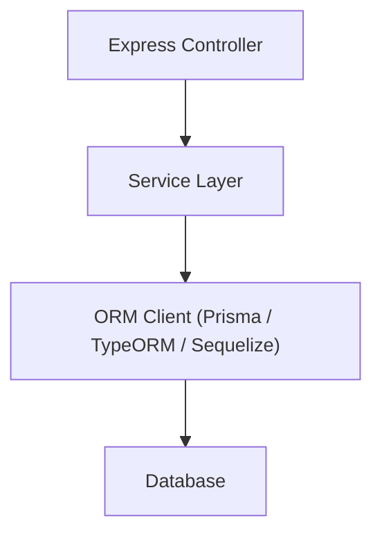

**version**  
Prisma 6.x / TypeORM 0.3.x / Sequelize 6.x

---

### 요약  
ORM(Object Relational Mapping)은 객체지향 언어의 데이터 구조를 관계형 데이터베이스의 테이블 구조에 매핑하여  
데이터를 코드 레벨에서 직관적으로 다룰 수 있게 하는 기술이다.  

ORM은 Express 애플리케이션에서 데이터베이스 접근을 단순화하고,
타입 안전성과 유지보수성을 높이는 핵심 구성 요소이다.
Prisma는 선언적이고 직관적이며, TypeORM은 구조화된 대규모 프로젝트에 적합하다.
Sequelize는 호환성이 높지만 최신 TS 환경에서는 다소 제한적이다.
ORM을 적절히 선택하고 계층 구조에 통합하면, Express 서버의 안정성과 생산성이 크게 향상된다.

핵심 내용은 다음과 같다.  
- ORM의 개념 및 작동 원리  
- Express 환경에서 ORM이 필요한 이유  
- Prisma / TypeORM / Sequelize의 특징과 차이  
- ORM 선택 기준과 프로젝트 적용 시 고려사항  

ORM은 SQL 쿼리를 직접 작성하지 않아도 안전하게 데이터를 다룰 수 있게 하며,  
비즈니스 로직과 데이터 접근 로직을 명확히 분리할 수 있다.  

---

##### 참고자료  
- [Prisma 공식 문서](https://www.prisma.io/docs)  
- [TypeORM 공식 문서](https://typeorm.io/)  
- [Sequelize 공식 문서](https://sequelize.org/)  

---

#### 1. ORM의 개념  

ORM은 **객체(Object)** 와 **데이터베이스 테이블(Row)** 간의 매핑(Mapping)을 자동화하는 기술이다.  
즉, 개발자는 데이터베이스의 구조(SQL)를 직접 다루지 않고,  
클래스와 객체로 데이터를 조회·수정·삭제할 수 있다.

| 구분 | 전통적 SQL 방식 | ORM 방식 |
|------|----------------|-----------|
| 데이터 접근 | SQL 쿼리 직접 작성 | 객체 메서드 사용 |
| 코드 유지보수 | SQL 분리 어려움 | 모델 단위 유지보수 용이 |
| 에러 발생 가능성 | 런타임 쿼리 오류 | 컴파일 단계에서 검증 가능 |
| 생산성 | 낮음 | 높음 |

---

#### 2. ORM이 필요한 이유  

Express 기반 백엔드에서는 API 요청마다 데이터베이스 접근이 이루어진다.  
이때 ORM을 사용하면 다음과 같은 이점을 얻을 수 있다.

- **생산성 향상**: SQL 작성 없이 CRUD를 빠르게 구현 가능  
- **타입 안전성**: TypeScript와 결합 시 컴파일 단계에서 데이터 타입 검증  
- **이식성 확보**: DB 엔진 변경(MySQL → PostgreSQL) 시 최소 수정으로 대응  
- **보안성 강화**: SQL Injection 방지 (Prepared Statement 기반)

---

#### 3. ORM의 작동 구조  

ORM은 애플리케이션 코드에서 호출된 ORM API를
Query Builder가 SQL로 변환하고,
DB 드라이버를 통해 실제 데이터베이스에 요청을 전달한다.

---

#### 4. 주요 ORM 비교

| 항목     | Prisma                 | TypeORM                   | Sequelize        |
| ------ | ---------------------- | ------------------------- | ---------------- |
| 언어 지원  | TypeScript 전용          | JS / TS 지원                | JS / TS 지원       |
| 모델 정의  | Schema 파일 기반           | Decorator 기반              | Class 기반         |
| 마이그레이션 | CLI 자동화                | 수동 / CLI 지원               | 별도 CLI 필요        |
| 쿼리 문법  | 선언적 (Prisma Client)    | ActiveRecord / DataMapper | 체이닝 기반           |
| 학습 난이도 | 낮음                     | 중간                        | 높음               |
| 커뮤니티   | 활발 (2020+)             | 오래됨 (2016+)               | 안정적 (2014+)      |
| 트랜잭션   | 기본 지원                  | 기본 지원                     | 지원               |
| 장점     | 타입 안정성 / 자동 생성 / 코드 단순 | 자유도 높음 / 구조화 용이           | 성숙한 생태계 / 호환성    |
| 단점     | SQL 제어 한계              | 설정 복잡                     | 구문冗長 / 타입 안정성 낮음 |

---

#### 5. ORM 선택 기준

Express 프로젝트에서 ORM을 선택할 때는 다음 요소를 고려해야 한다.

1. **프로젝트 규모**

   * 소규모 프로젝트: Prisma 권장 (자동화, 빠른 개발)
   * 중대형 서비스: TypeORM 권장 (명시적 제어, Repository 패턴)

2. **DB 변경 가능성**

   * 여러 DB 엔진을 고려한다면 TypeORM이 유리하다.

3. **팀의 숙련도**

   * SQL 친숙도, TypeScript 사용 경험, 기존 프로젝트 구조 등을 고려한다.

4. **운영 환경**

   * ORM은 CI/CD 환경에서 마이그레이션 자동화를 지원해야 한다.
   * Prisma의 경우 `prisma migrate deploy` 명령으로 자동 배포 가능하다.

---

#### 6. ORM 통합 구조 (Express 기준)

ORM은 Service 계층 내부에서 호출되어 데이터베이스 접근을 담당한다.
Controller에서는 ORM을 직접 호출하지 않고,
Service를 통해 간접적으로 접근하는 것이 권장된다.

---

#### 7. ORM 도입 시 주의사항

* **마이그레이션 관리**

  * DB 스키마 변경은 반드시 ORM CLI를 통해 수행해야 한다.
  * 수동 변경 시 ORM 모델과 실제 스키마가 불일치할 수 있다.

* **트랜잭션 제어**

  * ORM의 트랜잭션 API를 사용하여 데이터 일관성을 유지한다.
  * 복잡한 트랜잭션의 경우, ORM 내부 쿼리 빌더를 사용하는 것이 좋다.

* **성능 최적화**

  * 필요 이상의 JOIN이나 SELECT * 사용을 지양한다.
  * ORM 레벨에서 Lazy Loading보다는 명시적 Fetch를 선호한다.

---

