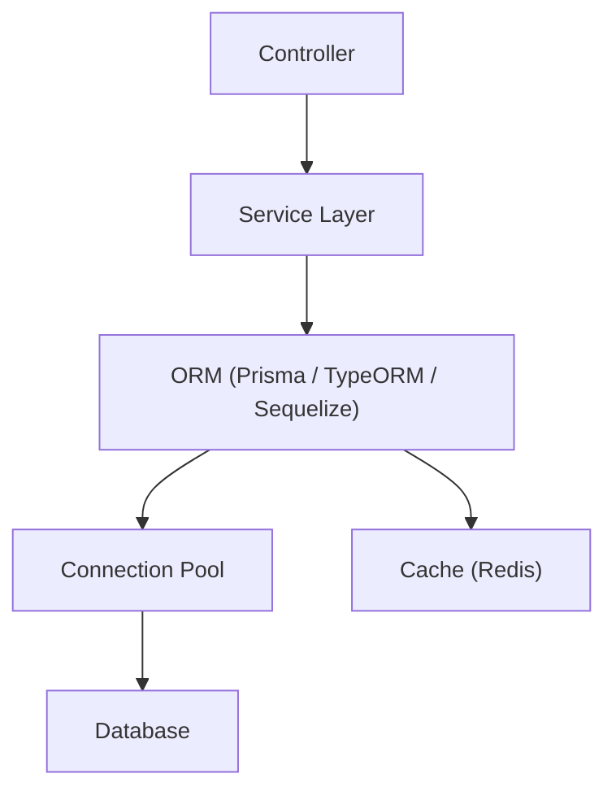

**version**  
Prisma 6.x / TypeORM 0.3.x / Sequelize 7.x

---

### 요약  
ORM(Object Relational Mapper)은 데이터 접근의 생산성과 유지보수성을 높이지만,  
적절한 설정과 쿼리 최적화가 이루어지지 않으면 성능 저하의 원인이 될 수 있다.  
이 문서는 Express 기반 프로젝트에서 ORM을 안정적으로 운영하기 위한  
성능 최적화, 트랜잭션 관리, 마이그레이션 전략, 보안 강화 방안을 설명한다.  

핵심 내용은 다음과 같다.  
- ORM 성능 병목 원인과 개선 전략  
- Lazy / Eager Loading 선택 기준  
- 캐싱 및 인덱싱 활용 방법  
- 트랜잭션 및 연결 풀 관리  
- 마이그레이션 및 스키마 일관성 유지 방안  

ORM은 데이터베이스 접근의 복잡도를 줄이는 도구이지만,  
운영 단계에서는 SQL 레벨의 이해와 함께 최적화가 병행되어야 한다.  

##### ORM 구조 요약



ORM은 데이터 접근을 추상화하지만,
실제 운영에서는 Connection Pool과 Cache가 함께 동작하며
성능 병목 구간을 최소화해야 한다.


---

##### 참고자료  
- [Prisma Query Performance Guide](https://www.prisma.io/docs/orm/prisma-client/queries/performance)  
- [TypeORM Performance Optimization](https://typeorm.io/#/performance)  
- [Sequelize Query Optimization](https://sequelize.org/docs/v7/other-topics/performance/)  

---

#### 1. ORM 성능 병목의 주요 원인  

ORM은 추상화 계층을 제공하지만, 다음과 같은 요인으로 병목이 발생할 수 있다.

| 원인 | 설명 | 개선 방법 |
|------|------|-----------|
| 과도한 Lazy Loading | 연관 데이터 반복 쿼리 발생 (N+1 문제) | 명시적 Eager Loading 또는 JOIN 사용 |
| SELECT * 쿼리 | 필요 없는 컬럼까지 조회 | 컬럼 명시적 지정 (`select` or `include`) |
| 불필요한 트랜잭션 | 단순 읽기 요청에도 트랜잭션 사용 | 읽기 전용 요청은 트랜잭션 제외 |
| 연결 풀 미설정 | 연결/해제 반복으로 오버헤드 발생 | Connection Pool 크기 명시 |
| 인덱스 누락 | WHERE / JOIN 대상 컬럼 인덱스 부재 | 주요 컬럼에 인덱스 생성 |

---

#### 2. Eager / Lazy Loading 전략  

관계형 ORM에서 데이터 로딩 방식은 성능에 큰 영향을 미친다.  

| 로딩 방식 | 특징 | 권장 사용 시점 |
|------------|------|----------------|
| **Lazy Loading** | 요청 시마다 연관 데이터를 개별 쿼리로 조회 | 간단한 관계, 트래픽 적은 API |
| **Eager Loading** | JOIN을 통해 한 번에 조회 | 고빈도 요청, 대용량 리스트 API |

Prisma의 `include`, TypeORM의 `relations`, Sequelize의 `include` 옵션은  
모두 Eager Loading을 명시적으로 수행할 수 있다.  

```typescript
// Prisma
const user = await prisma.user.findMany({ include: { posts: true } });

// TypeORM
const users = await userRepository.find({ relations: ["posts"] });

// Sequelize
const users = await User.findAll({ include: [Post] });
```

---

#### 3. Connection Pool 설정

DB 연결을 매 요청마다 생성하면 성능 저하가 발생한다.
ORM이 제공하는 Connection Pool을 명시적으로 구성해야 한다.

```typescript
// TypeORM 예시
export const AppDataSource = new DataSource({
  type: "postgres",
  host: "localhost",
  username: "user",
  password: "password",
  database: "mydb",
  poolSize: 10,
});

// Sequelize 예시
new Sequelize("mydb", "user", "password", {
  dialect: "postgres",
  pool: { max: 10, min: 2, idle: 10000 },
});
```

Connection Pool은 10~20개 수준에서 시작해,
실제 트래픽 및 DB 연결 제한에 맞게 조정한다.

---

#### 4. 캐싱 전략

ORM은 동일 쿼리를 반복 실행할 수 있다.
조회 빈도가 높은 데이터는 캐싱 계층(Redis 등)을 활용해 성능을 개선할 수 있다.

```typescript
// Redis 캐싱 예시
import Redis from "ioredis";
const redis = new Redis();

async function getUserCached(id: number) {
  const cacheKey = `user:${id}`;
  const cached = await redis.get(cacheKey);
  if (cached) return JSON.parse(cached);

  const user = await prisma.user.findUnique({ where: { id } });
  await redis.set(cacheKey, JSON.stringify(user), "EX", 60);
  return user;
}
```

캐시 만료 시간(`EX`)을 적절히 조정하여,
데이터 일관성과 성능을 균형 있게 유지한다.

---

#### 5. 트랜잭션 관리

ORM은 내부적으로 트랜잭션 API를 제공하지만,
모든 요청에 트랜잭션을 사용하는 것은 비효율적이다.

* **읽기 요청 (GET)** → 트랜잭션 불필요
* **쓰기 요청 (POST, PUT, DELETE)** → 트랜잭션 사용

트랜잭션 내에서 DB 접근은 단일 Connection Pool을 유지해야 하며,
다중 ORM 인스턴스 혼용은 피해야 한다.

```typescript
// Prisma
await prisma.$transaction(async (tx) => {
  await tx.user.create({ data: { email: "new@example.com" } });
});

// TypeORM
await AppDataSource.manager.transaction(async (manager) => {
  await manager.save(User, { email: "test@test.com" });
});

// Sequelize
await sequelize.transaction(async (t) => {
  await User.create({ email: "a@test.com" }, { transaction: t });
});
```

---

#### 6. 마이그레이션 관리 전략

데이터 스키마 변경은 반드시 마이그레이션 파일을 통해 수행한다.
운영 환경에서 직접 SQL을 실행하면 ORM 모델과 스키마가 불일치할 수 있다.

| ORM       | 명령                             | 설명               |
| --------- | ------------------------------ | ---------------- |
| Prisma    | `npx prisma migrate deploy`    | 스키마 변경 자동 반영     |
| TypeORM   | `npx typeorm migration:run`    | SQL 기반 마이그레이션 실행 |
| Sequelize | `npx sequelize-cli db:migrate` | CLI 마이그레이션 적용    |

마이그레이션 파일은 Git 버전 관리에 포함되어야 하며,
CI/CD 파이프라인에서 자동으로 실행되도록 설정한다.

---

#### 7. ORM 쿼리 로깅 및 분석

ORM은 쿼리 로깅 옵션을 제공하므로,
실제 SQL 문장을 확인하고 병목 구간을 분석할 수 있다.

```typescript
// Prisma
const prisma = new PrismaClient({ log: ["query", "info", "warn", "error"] });

// TypeORM
export const AppDataSource = new DataSource({
  logging: ["query", "error"],
});

// Sequelize
new Sequelize("mydb", "user", "pass", { logging: console.log });
```

쿼리 실행 시간을 측정하면, ORM 추상화로 인한 오버헤드를 쉽게 확인할 수 있다.

---

#### 8. 보안 및 트러블슈팅

1. **SQL Injection 방지**
   ORM은 내부적으로 Prepared Statement를 사용하지만,
   동적 쿼리 문자열(`queryRaw`, `queryBuilder`) 사용 시 파라미터 바인딩을 반드시 수행해야 한다.

2. **Deadlock / Race Condition 예방**

   * 트랜잭션 내 공유 리소스 접근 순서를 일관되게 유지한다.
   * 비동기 Promise.all() 내에서 DB 트랜잭션 병렬 실행은 피한다.

3. **오류 복구 전략**

   * 연결 실패 시 재시도 로직 추가 (`retry` 옵션 또는 재귀 호출)
   * Prisma의 `$disconnect()` 또는 Sequelize의 `sequelize.close()` 호출로 자원 누수 방지

---
