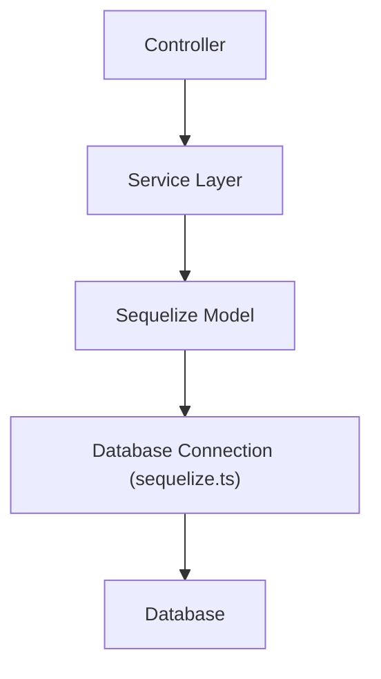

**version**  
Sequelize 7.x / Node.js 22.x / Express 5.x
---

### 요약  
Sequelize는 JavaScript와 TypeScript 환경에서 가장 널리 사용되는 ORM 중 하나로,  
MySQL, PostgreSQL, SQLite, MSSQL 등 다양한 데이터베이스를 지원한다.  

Sequelize는 다양한 데이터베이스를 지원하며,
체이닝 문법 기반의 강력한 쿼리 인터페이스를 제공하는 범용 ORM이다.
Express 환경에서는 모델, 서비스, 컨트롤러 구조를 분리해 사용하는 것이 이상적이다.
마이그레이션 CLI와 트랜잭션 기능을 적절히 활용하면
대규모 서비스에서도 안정적인 데이터 계층을 구축할 수 있다.


핵심 내용은 다음과 같다.  
- Sequelize 설치 및 초기 설정  
- 모델 정의 및 관계 구성  
- 마이그레이션 및 동기화  
- Express 서비스 계층과 통합  
- 트랜잭션 및 쿼리 사용 패턴  

Sequelize는 체이닝 기반 쿼리 문법과 풍부한 훅(Hook),  
다양한 DB 드라이버 호환성을 제공하며,  
대규모 프로젝트에서도 안정적인 ORM 계층을 구성할 수 있다.

---

##### 참고자료  
- [Sequelize 공식 문서](https://sequelize.org/docs/v7/)  
- [Sequelize CLI](https://sequelize.org/docs/v7/cli/)  
- [Sequelize TypeScript 가이드](https://sequelize.org/docs/v7/other-topics/typescript/)  

---

#### 1. Sequelize 설치 및 초기화  

```bash
pnpm add sequelize pg pg-hstore
pnpm add -D sequelize-cli typescript @types/express @types/node
npx sequelize-cli init
```

명령 실행 후 다음과 같은 기본 구조가 생성된다.

```
project-root/
 ├── src/
 │   ├── models/
 │   │   ├── index.ts
 │   │   ├── user.model.ts
 │   │   └── post.model.ts
 │   ├── services/
 │   ├── config/
 │   │   └── database.ts
 │   └── controllers/
 ├── migrations/
 ├── seeders/
 ├── .sequelizerc
 └── .env
```

`.env`에 데이터베이스 정보를 입력한다.

```bash
DB_HOST=localhost
DB_USER=user
DB_PASS=password
DB_NAME=mydb
DB_DIALECT=postgres
```

---

#### 2. 데이터베이스 연결 구성

Sequelize 인스턴스를 생성하여 DB와 연결한다.

```typescript
// src/config/database.ts
import { Sequelize } from "sequelize";

export const sequelize = new Sequelize(
  process.env.DB_NAME as string,
  process.env.DB_USER as string,
  process.env.DB_PASS as string,
  {
    host: process.env.DB_HOST,
    dialect: "postgres",
    logging: false,
  }
);

export const connectDB = async () => {
  try {
    await sequelize.authenticate();
    console.log("✅ Database connection established successfully.");
  } catch (error) {
    console.error("❌ Database connection failed:", error);
    process.exit(1);
  }
};
```

---

#### 3. 모델 정의

Sequelize는 모델 클래스를 정의하여 데이터베이스 테이블을 매핑한다.

```typescript
// src/models/user.model.ts
import { DataTypes, Model } from "sequelize";
import { sequelize } from "../config/database";

export class User extends Model {
  public id!: number;
  public email!: string;
  public name?: string;
}

User.init(
  {
    id: {
      type: DataTypes.INTEGER,
      primaryKey: true,
      autoIncrement: true,
    },
    email: {
      type: DataTypes.STRING,
      allowNull: false,
      unique: true,
    },
    name: {
      type: DataTypes.STRING,
      allowNull: true,
    },
  },
  {
    sequelize,
    modelName: "User",
    tableName: "users",
    timestamps: true,
  }
);
```

```typescript
// src/models/post.model.ts
import { DataTypes, Model } from "sequelize";
import { sequelize } from "../config/database";
import { User } from "./user.model";

export class Post extends Model {
  public id!: number;
  public title!: string;
  public content?: string;
  public userId!: number;
}

Post.init(
  {
    id: { type: DataTypes.INTEGER, autoIncrement: true, primaryKey: true },
    title: { type: DataTypes.STRING, allowNull: false },
    content: { type: DataTypes.TEXT },
    userId: { type: DataTypes.INTEGER, allowNull: false },
  },
  { sequelize, modelName: "Post", tableName: "posts", timestamps: true }
);

// 관계 설정
User.hasMany(Post, { foreignKey: "userId" });
Post.belongsTo(User, { foreignKey: "userId" });
```

---

#### 4. 마이그레이션 및 동기화

CLI를 사용해 마이그레이션을 생성하고 실행할 수 있다.

```bash
npx sequelize-cli migration:generate --name create-user-table
npx sequelize-cli db:migrate
```

개발 환경에서는 코드 변경 시 자동 동기화 기능을 사용할 수 있다.

```typescript
await sequelize.sync({ alter: true });
```

이 옵션은 스키마를 모델에 맞게 자동 업데이트하지만,
운영 환경에서는 CLI 마이그레이션을 사용하는 것이 안전하다.

---

#### 5. 서비스 계층 통합

Sequelize 모델을 Express 서비스 계층에 통합한다.

```typescript
// src/services/user.service.ts
import { User } from "../models/user.model";

export const UserService = {
  async getAll() {
    return await User.findAll();
  },

  async create(data: { email: string; name?: string }) {
    return await User.create(data);
  },

  async findByEmail(email: string) {
    return await User.findOne({ where: { email } });
  },
};
```

컨트롤러에서는 이 서비스 계층을 통해 데이터를 조회하거나 등록한다.

```typescript
// src/controllers/user.controller.ts
import { Request, Response } from "express";
import { UserService } from "../services/user.service";

export const getUsers = async (_: Request, res: Response) => {
  const users = await UserService.getAll();
  res.json(users);
};
```

---

#### 6. 트랜잭션 처리

Sequelize는 `sequelize.transaction()`을 통해 트랜잭션을 지원한다.

```typescript
import { sequelize } from "../config/database";
import { User } from "../models/user.model";
import { Post } from "../models/post.model";

await sequelize.transaction(async (t) => {
  const user = await User.create({ email: "example@test.com" }, { transaction: t });
  await Post.create(
    { title: "First Post", content: "Hello!", userId: user.id },
    { transaction: t }
  );
});
```

트랜잭션 내에서 오류가 발생하면 전체 작업이 롤백된다.

---

#### 7. Express + Sequelize 구조



이 구조는 Express의 계층화 패턴을 유지하면서,
Sequelize 모델을 데이터 접근 계층으로 분리한 형태이다.
`Service → Model → DB`의 일관된 흐름을 통해 유지보수가 용이하다.

---

#### 8. 모델 관계 및 Eager Loading

Sequelize는 관계 설정 후, `include` 옵션을 통해 Eager Loading을 지원한다.

```typescript
const users = await User.findAll({ include: [Post] });
```

이 쿼리는 사용자 정보와 함께 게시글(Post) 데이터를 동시에 불러온다.
관계가 깊어질 경우 Lazy Loading 대신 명시적 `include`를 사용하는 것이 효율적이다.

---
