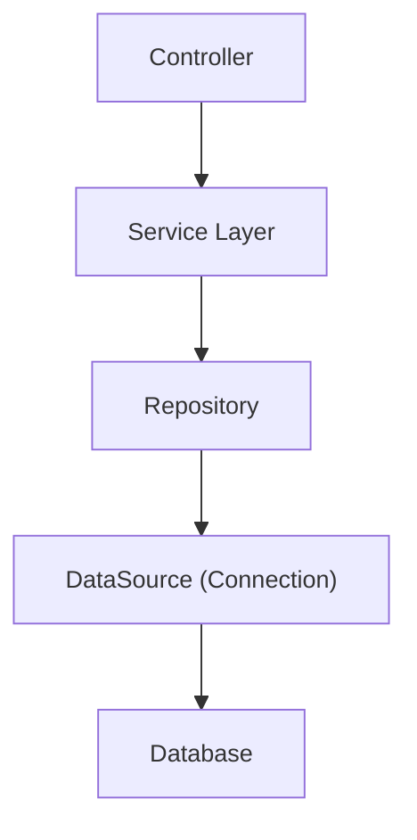

**version**  
TypeORM 0.3.x / Node.js 22.x / Express 5.x

---

### 요약  
TypeORM은 TypeScript와 완벽히 통합된 객체 관계형 매퍼(Object Relational Mapper)로,  
데코레이터 기반 모델 정의와 Repository 패턴을 지원한다.  
이 문서는 Express 환경에서 TypeORM을 설정하고 엔티티(Entity),  
데이터소스(DataSource), 리포지토리(Repository)를 구성하는 방법을 설명한다.  

TypeORM은 객체-테이블 매핑, 트랜잭션, 마이그레이션 기능을 모두 지원하는
완성도 높은 TypeScript ORM이다.
Express 환경에서는 DataSource를 초기화하고, Repository를 통해
Service 계층에서 데이터를 안전하게 관리할 수 있다.
명시적 제어가 가능하다는 점에서 대규모 시스템에 적합하며,
마이그레이션 자동화로 운영 안정성을 확보할 수 있다.

핵심 내용은 다음과 같다.  
- TypeORM 설치 및 환경 설정  
- 엔티티(Entity) 정의 및 관계 설정  
- DataSource 구성 및 연결 관리  
- Repository 패턴 기반 CRUD 구현  
- Express 서비스 계층과 통합  

TypeORM은 Prisma보다 SQL 접근 자유도가 높고,  
복잡한 트랜잭션이나 세밀한 쿼리 최적화가 필요한 프로젝트에 적합하다.  

---

##### 참고자료  
- [TypeORM 공식 문서](https://typeorm.io/)  
- [TypeORM Entity Reference](https://typeorm.io/entities)  
- [TypeORM DataSource 가이드](https://typeorm.io/data-source)  

---

#### 1. TypeORM 설치 및 초기 설정  

```bash
pnpm add typeorm reflect-metadata
pnpm add -D @types/node
```

`tsconfig.json`에 `emitDecoratorMetadata`와 `experimentalDecorators`를 활성화해야 한다.

```json
{
  "compilerOptions": {
    "target": "ES2022",
    "module": "commonjs",
    "strict": true,
    "esModuleInterop": true,
    "experimentalDecorators": true,
    "emitDecoratorMetadata": true
  }
}
```

---

#### 2. 데이터베이스 연결 구성

`DataSource`는 TypeORM의 핵심 객체로,
데이터베이스와 엔티티 간 연결 및 설정을 담당한다.

```typescript
// src/config/data-source.ts
import "reflect-metadata";
import { DataSource } from "typeorm";
import { User } from "../entities/user.entity";
import { Post } from "../entities/post.entity";

export const AppDataSource = new DataSource({
  type: "postgres",
  host: "localhost",
  port: 5432,
  username: "user",
  password: "password",
  database: "mydb",
  entities: [User, Post],
  synchronize: true, // 개발 환경에서만 사용
  logging: false,
});
```

`AppDataSource.initialize()`를 통해 실제 연결을 시작한다.

---

#### 3. 엔티티 정의

TypeORM은 데코레이터(`@Entity`, `@Column`, `@PrimaryGeneratedColumn`)를 사용하여
클래스와 데이터베이스 테이블을 매핑한다.

```typescript
// src/entities/user.entity.ts
import { Entity, PrimaryGeneratedColumn, Column, OneToMany } from "typeorm";
import { Post } from "./post.entity";

@Entity()
export class User {
  @PrimaryGeneratedColumn()
  id: number;

  @Column({ unique: true })
  email: string;

  @Column({ nullable: true })
  name: string;

  @OneToMany(() => Post, (post) => post.author)
  posts: Post[];
}
```

```typescript
// src/entities/post.entity.ts
import { Entity, PrimaryGeneratedColumn, Column, ManyToOne } from "typeorm";
import { User } from "./user.entity";

@Entity()
export class Post {
  @PrimaryGeneratedColumn()
  id: number;

  @Column()
  title: string;

  @Column({ nullable: true })
  content: string;

  @ManyToOne(() => User, (user) => user.posts)
  author: User;
}
```

---

#### 4. Repository 패턴 구성

Repository는 엔티티별 데이터 접근 로직을 담당한다.
각 엔티티는 자체 Repository를 통해 데이터베이스 연산을 수행한다.

```typescript
// src/repositories/user.repository.ts
import { AppDataSource } from "../config/data-source";
import { User } from "../entities/user.entity";

export const UserRepository = AppDataSource.getRepository(User);
```

서비스 계층에서는 Repository를 통해 데이터를 조작한다.

```typescript
// src/services/user.service.ts
import { UserRepository } from "../repositories/user.repository";

export const UserService = {
  async getAll() {
    return await UserRepository.find();
  },

  async create(data: { email: string; name?: string }) {
    const user = UserRepository.create(data);
    return await UserRepository.save(user);
  },
};
```

---

#### 5. Express와 통합

```typescript
// src/server.ts
import express from "express";
import { AppDataSource } from "./config/data-source";
import { UserService } from "./services/user.service";

const app = express();
app.use(express.json());

app.get("/users", async (_, res) => {
  const users = await UserService.getAll();
  res.json(users);
});

AppDataSource.initialize()
  .then(() => {
    app.listen(3000, () => console.log("🚀 Server running on port 3000"));
  })
  .catch((err) => console.error("DB connection failed:", err));
```

`AppDataSource.initialize()`가 완료된 후 서버가 실행되므로,
DB 연결 실패 시 서버가 비정상적으로 동작하지 않는다.

---

#### 6. 트랜잭션 처리

TypeORM은 `manager.transaction()` 메서드로 트랜잭션을 지원한다.

```typescript
import { AppDataSource } from "../config/data-source";
import { User } from "../entities/user.entity";
import { Post } from "../entities/post.entity";

await AppDataSource.manager.transaction(async (transactionalEntityManager) => {
  const user = transactionalEntityManager.create(User, { email: "new@example.com" });
  await transactionalEntityManager.save(user);

  const post = transactionalEntityManager.create(Post, {
    title: "Welcome Post",
    author: user,
  });
  await transactionalEntityManager.save(post);
});
```

트랜잭션 내에서 예외가 발생하면 모든 작업이 롤백된다.

---

#### 7. 마이그레이션 관리

TypeORM은 CLI를 통해 마이그레이션을 생성하고 실행할 수 있다.

```bash
npx typeorm migration:create src/migrations/CreateUserTable
npx typeorm migration:run
```

운영 환경에서는 `migration:run` 명령을 배포 파이프라인에서 자동화하여
DB 스키마를 일관되게 유지할 수 있다.

---

#### 8. Express + TypeORM 구조



TypeORM은 Repository 패턴을 중심으로 계층 구조를 분리하며,
서비스 계층이 데이터 접근을 직접 제어한다.
이는 대규모 프로젝트에서 유지보수를 쉽게 만든다.

---

