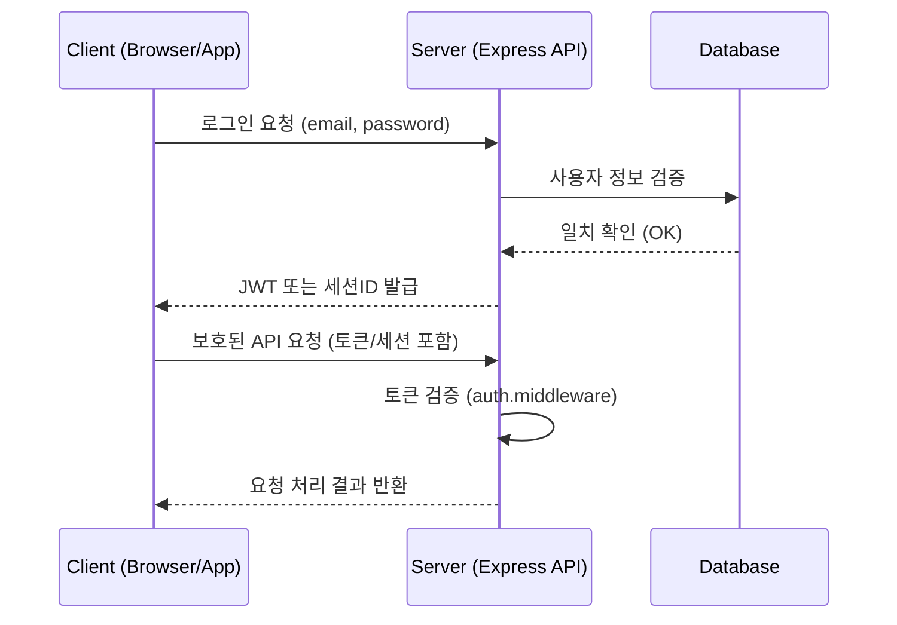

**version**  
Express 5.x / Node.js 22.x

---

### 요약  
인증(Authentication)은 사용자가 누구인지 식별하는 절차이며,  
권한 부여(Authorization)와 함께 애플리케이션 보안의 핵심 요소이다.  

인증(Authentication)은 사용자를 식별하는 절차로,
Express 환경에서는 주로 JWT, 세션, OAuth 방식으로 구현된다.
JWT는 확장성과 독립성이 뛰어나며,
세션은 서버 중심 관리에 유리하다.
OAuth는 외부 Provider를 통한 신뢰 기반 접근을 가능하게 한다.
애플리케이션 규모와 보안 요구사항에 따라
가장 적합한 인증 방식을 선택하는 것이 중요하다.


핵심 내용은 다음과 같다.  
- 인증(Authentication)과 인가(Authorization)의 개념 차이  
- Express 환경에서의 인증 구조  
- 주요 인증 방식: Session, JWT, OAuth2.0  
- 토큰 기반 인증의 작동 원리 및 장단점  
- 클라이언트–서버 간 인증 흐름 다이어그램  

Express는 미들웨어 기반 구조이므로, 인증 로직을 별도 계층으로 분리하여  
라우트 접근 제어와 사용자 세션 관리를 명확히 설계하는 것이 권장된다.

---

##### 참고자료  
- [MDN Web Docs – Authentication Overview](https://developer.mozilla.org/en-US/docs/Web/Security/Authentication)  
- [RFC 7519 – JSON Web Token (JWT)](https://datatracker.ietf.org/doc/html/rfc7519)  
- [OAuth 2.0 Framework – RFC 6749](https://datatracker.ietf.org/doc/html/rfc6749)  

---

#### 1. 인증과 인가의 구분  

| 개념 | 설명 | 예시 |
|------|------|------|
| **인증 (Authentication)** | 사용자의 신원을 확인하는 절차 | 로그인 (ID, 비밀번호 확인) |
| **인가 (Authorization)** | 인증된 사용자의 권한을 검증 | 관리자 페이지 접근 제한 |

Express 애플리케이션에서는 일반적으로  
인증 → 세션/토큰 발급 → 인가 미들웨어 순서로 처리된다.  

---

#### 2. Express 인증 구조  

Express는 라우팅과 미들웨어 계층이 분리되어 있으므로,  
인증 로직은 별도의 미들웨어(`auth.middleware.ts`)로 구현하는 것이 일반적이다.

```typescript
// src/middlewares/auth.middleware.ts
import { Request, Response, NextFunction } from "express";
import jwt from "jsonwebtoken";

export const authenticate = (req: Request, res: Response, next: NextFunction) => {
  const token = req.headers.authorization?.split(" ")[1];
  if (!token) return res.status(401).json({ message: "Unauthorized" });

  try {
    const decoded = jwt.verify(token, process.env.JWT_SECRET as string);
    (req as any).user = decoded;
    next();
  } catch {
    return res.status(403).json({ message: "Invalid token" });
  }
};
```

이 미들웨어를 사용하면 인증이 필요한 라우트에 쉽게 적용할 수 있다.

```typescript
app.get("/api/profile", authenticate, (req, res) => {
  res.json({ user: (req as any).user });
});
```

---

#### 3. 주요 인증 방식

##### ① 세션 기반 인증 (Session Authentication)

* **작동 방식**: 서버가 로그인 성공 시 세션 ID를 발급하고, 클라이언트는 쿠키에 저장한다.
* **특징**: 서버 메모리나 Redis에 세션 상태를 저장한다.
* **장점**: 세션 만료 제어가 쉬움.
* **단점**: 서버 확장 시 세션 동기화 필요 (로드밸런서 환경 불리).

##### ② JWT 기반 인증 (JSON Web Token)

* **작동 방식**: 로그인 성공 시 JWT 토큰을 발급하여 클라이언트가 저장 후 요청 시 전달.
* **특징**: 상태 비저장(Stateless), Base64 인코딩 구조.
* **장점**: 서버 간 세션 공유 불필요, 수평 확장 용이.
* **단점**: 토큰 폐기가 즉시 반영되지 않음.

##### ③ OAuth2.0 인증

* **작동 방식**: Google, GitHub, Facebook 등 외부 인증 제공자(Provider)로부터
  Access Token을 발급받아 사용자를 인증한다.
* **특징**: 소셜 로그인, 외부 리소스 접근에 활용.
* **장점**: 사용자 비밀번호를 직접 저장하지 않아도 됨.
* **단점**: 초기 설정 복잡, Redirect 흐름 관리 필요.

---

#### 4. JWT 구조

JWT는 `Header.Payload.Signature` 형식으로 구성된 문자열이다.

```
eyJhbGciOiJIUzI1NiIsInR5cCI6IkpXVCJ9.
eyJpZCI6MSwiZW1haWwiOiJ1c2VyQGV4YW1wbGUuY29tIn0.
Yk9Vf3c9z8bCZs8HKaGp5sOaQwupN7sDmpOMHhO2g8w
```

| 구성요소      | 내용                | 예시                                                                     |
| --------- | ----------------- | ---------------------------------------------------------------------- |
| Header    | 암호화 알고리즘 및 타입     | `{ "alg": "HS256", "typ": "JWT" }`                                     |
| Payload   | 실제 데이터(사용자 ID 등)  | `{ "id": 1, "email": "user@example.com" }`                             |
| Signature | 서명 (비밀키로 암호화된 해시) | `HMACSHA256(base64UrlEncode(header) + "." + base64UrlEncode(payload))` |

JWT는 일반적으로 `Authorization: Bearer <token>` 형태로 요청 헤더에 포함된다.

---

#### 5. 인증 흐름



이 흐름은 인증(로그인) 이후 모든 보호된 엔드포인트에
`auth.middleware`를 통해 인증을 거친 후 접근하는 구조이다.

---

#### 6. 인증 상태 관리

Express 서버에서는 인증 상태를 다음 두 가지 중 하나로 관리한다.

| 구분            | 방식      | 저장 위치                        |
| ------------- | ------- | ---------------------------- |
| **Stateless** | JWT     | 클라이언트( /쿠키/ LocalStorage / Header/) |
| **Stateful**  | Session | 서버 메모리 / Redis / DB          |

쿠키는 많이 사용한다. 특히 JWT/토큰을 안전하게 저장하고 전송하려면 HTTP-only Secure SameSite 쿠키가 권장

운영 환경에서는 보통 **JWT 기반 API 서버**와
**세션 기반 웹 서버(SSR)**를 분리하여 구성한다.

---

#### 7. 보안 고려사항

* JWT 서명 키(`JWT_SECRET`)는 `.env`에 저장하고 절대 노출하지 않는다.
* HTTPS 환경에서만 쿠키/토큰을 주고받도록 설정한다.
* 토큰 만료 시간(`exp`)을 명시하여 탈취 시 피해를 최소화한다.
* Refresh Token을 별도로 발급해 장기 세션을 관리한다.

---

