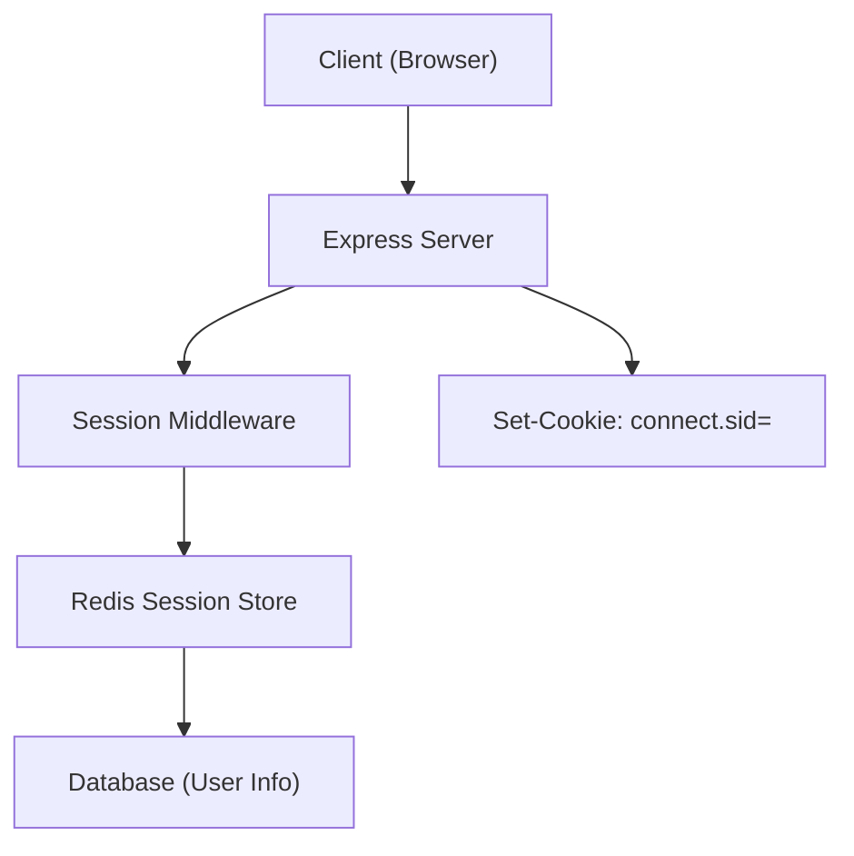

**version**  
Express 5.x / Node.js 22.x / express-session 1.17.x / connect-redis 8.x

---

### 요약  
세션(Session) 기반 인증은 서버가 사용자 로그인 상태를 직접 관리하는 방식으로,  
쿠키에 세션 ID(Session ID)를 저장하고 이를 통해 사용자 정보를 조회한다.  

세션 기반 인증은 서버가 로그인 상태를 직접 관리하는 방식으로,
쿠키와 Redis 세션 스토어를 통해 안정적인 인증 흐름을 유지할 수 있다.
Express에서 `express-session`과 `connect-redis`를 함께 사용하면
보안과 확장성을 모두 확보할 수 있다.
다만, 서버 수평 확장 시 반드시 외부 세션 저장소(예: Redis)를 사용해야 한다.


핵심 내용은 다음과 같다.  
- 세션 기반 인증의 구조 및 흐름  
- express-session 설정 및 미들웨어 구성  
- Redis를 이용한 세션 스토리지 구성  
- 세션 만료, 자동 로그아웃, 스케일링 대응 전략  

세션 방식은 상태 기반(Stateful) 인증으로,  
JWT보다 관리 비용은 높지만 만료 제어 및 서버 단위 통제가 용이하다.

---

##### 참고자료  
- [Express Session 공식 문서](https://www.npmjs.com/package/express-session)  
- [connect-redis GitHub](https://github.com/tj/connect-redis)  
- [Redis Persistence and Expiration](https://redis.io/docs/latest/operate/oss/performance/expiration/)  

---

#### 1. 세션 기반 인증의 개념  

세션 기반 인증은 서버가 사용자 상태를 직접 유지한다.  
사용자가 로그인하면 서버는 고유한 세션 ID를 발급하고,  
이 ID를 브라우저 쿠키에 저장한다.  

| 항목 | 설명 |
|------|------|
| **Session ID** | 서버가 발급한 임의의 고유 식별자 |
| **세션 저장소(Session Store)** | 세션 데이터를 유지하는 저장소 (메모리, Redis 등) |
| **쿠키(Cookie)** | 클라이언트에 저장된 세션 ID 전송용 매개체 |

---

#### 2. Express 세션 기본 설정  

```bash
pnpm add express-session
```

```typescript
// src/config/session.ts
import session from "express-session";

export const sessionConfig = session({
  secret: process.env.SESSION_SECRET as string,
  resave: false,
  saveUninitialized: false,
  cookie: {
    httpOnly: true, // 클라이언트 JS 접근 차단
    secure: process.env.NODE_ENV === "production",
    maxAge: 1000 * 60 * 30, // 30분
  },
});
```

이 미들웨어를 Express 애플리케이션에 등록한다.

```typescript
// src/server.ts
import express from "express";
import { sessionConfig } from "./config/session";

const app = express();
app.use(sessionConfig);
```

로그인 시 세션에 사용자 정보를 저장한다.

```typescript
// src/controllers/auth.controller.ts
export const login = async (req, res) => {
  const { email, password } = req.body;
  const user = await prisma.user.findUnique({ where: { email } });
  if (!user || user.password !== password)
    return res.status(401).json({ message: "Invalid credentials" });

  req.session.user = { id: user.id, email: user.email };
  res.json({ message: "Login successful" });
};
```

---

#### 3. 세션 검증 미들웨어

```typescript
// src/middlewares/session-auth.ts
import { Request, Response, NextFunction } from "express";

export const requireLogin = (req: Request, res: Response, next: NextFunction) => {
  if (!req.session.user) return res.status(401).json({ message: "Unauthorized" });
  next();
};
```

보호된 라우트에서는 `requireLogin` 미들웨어를 적용한다.

```typescript
app.get("/profile", requireLogin, (req, res) => {
  res.json({ user: req.session.user });
});
```

---

#### 4. Redis 세션 스토리지 구성

세션을 서버 메모리에 저장하면 서버 재시작 시 세션이 손실된다.
이를 방지하기 위해 Redis를 세션 저장소로 활용한다.

```bash
pnpm add connect-redis ioredis
```

```typescript
// src/config/redis-session.ts
import session from "express-session";
import connectRedis from "connect-redis";
import Redis from "ioredis";

const RedisStore = connectRedis(session);
const redisClient = new Redis({
  host: "localhost",
  port: 6379,
});

export const redisSession = session({
  store: new RedisStore({ client: redisClient }),
  secret: process.env.SESSION_SECRET as string,
  resave: false,
  saveUninitialized: false,
  cookie: {
    httpOnly: true,
    secure: process.env.NODE_ENV === "production",
    maxAge: 1000 * 60 * 60, // 1시간
  },
});
```

이 구성을 통해 Express는 Redis에 세션을 저장하고,
여러 서버 인스턴스 간에도 세션을 공유할 수 있다.

---

#### 5. 세션 만료 및 자동 로그아웃

Redis의 TTL(만료 시간)은 쿠키의 `maxAge`와 동기화된다.
세션이 만료되면 Redis에서 자동으로 삭제되며,
사용자는 다음 요청 시 401 응답을 받게 된다.

```typescript
// 로그아웃 처리
app.post("/logout", (req, res) => {
  req.session.destroy((err) => {
    if (err) return res.status(500).json({ message: "Logout failed" });
    res.clearCookie("connect.sid");
    res.json({ message: "Logged out successfully" });
  });
});
```

---

#### 6. Express + Redis 세션 구조



요청 시 브라우저는 `connect.sid` 쿠키를 포함하고,
서버는 Redis에서 해당 세션 ID로 사용자를 조회한다.

---

#### 7. 운영 환경 고려사항

* **보안 강화**

  * HTTPS 환경에서 `secure: true` 설정 필수
  * 세션 탈취 방지를 위해 IP / User-Agent 검증 추가

* **확장성**

  * 로드밸런서 환경에서는 Redis 같은 외부 세션 스토어를 사용해야 함
  * 서버 메모리 세션은 단일 인스턴스 운영에서만 권장

* **성능 최적화**

  * Redis 연결 풀 사용 (`maxRetriesPerRequest`, `connectionLimit` 조정)
  * TTL을 짧게 설정하여 불필요한 세션 데이터 축적 방지

---
