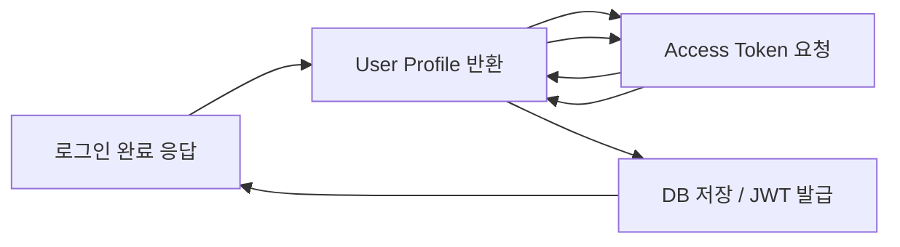
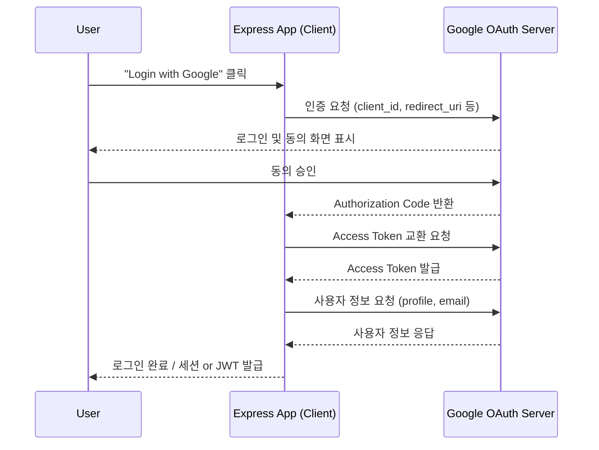

**version**  
Express 5.x / Node.js 22.x / passport 0.7.x / passport-google-oauth20 2.x / passport-github2 1.x
---

#### 9. 요약

OAuth 2.0은 인증 위임(Delegation)을 통해 외부 서비스 계정을 활용하는 표준 프로토콜이다.
Express 환경에서는 Passport.js를 이용하여 Google, GitHub 등 다양한 Provider와 쉽게 연동할 수 있다.
OAuth 인증 성공 후 자체 토큰(JWT) 발급을 결합하면,
보안성과 사용자 편의성을 동시에 확보할 수 있다.

OAuth 2.0은 외부 인증 제공자(Google, GitHub 등)를 통해  
사용자의 인증을 위임(Delegation)하는 표준 프로토콜이다.  


핵심 내용은 다음과 같다.  
- OAuth 2.0 인증 개념 및 흐름  
- Passport.js를 이용한 Google/GitHub OAuth 연동  
- 인증 후 사용자 정보 처리 및 토큰 발급  
- Redirect 및 콜백 라우팅 구조  
- 보안 설정 및 운영 시 고려사항  

OAuth는 서비스가 사용자 비밀번호를 직접 저장하지 않고,  
외부 인증 제공자에 위임함으로써 보안성과 편의성을 모두 확보할 수 있다.


##### Express + OAuth 구조


---

##### 참고자료  
- [OAuth 2.0 RFC 6749](https://datatracker.ietf.org/doc/html/rfc6749)  
- [Passport.js 공식 문서](https://www.passportjs.org/)  
- [Google OAuth 2.0 Docs](https://developers.google.com/identity/protocols/oauth2)  
- [GitHub OAuth Apps Docs](https://docs.github.com/en/apps/oauth-apps/building-oauth-apps)  

---

#### 1. OAuth 2.0 개념 요약  

OAuth는 **Access Token**을 기반으로 동작하며,  
사용자의 자격 증명을 제3자 서비스에 위임하는 구조이다.  

| 역할 | 설명 | 예시 |
|------|------|------|
| **Resource Owner** | 계정 소유자 | 사용자 |
| **Client** | OAuth 연동 애플리케이션 | Express 서버 |
| **Authorization Server** | 인증을 제공하는 외부 서비스 | Google, GitHub |
| **Resource Server** | 사용자 정보 API를 제공 | Google API, GitHub API |

---

#### 2. OAuth 인증 흐름  



---

#### 3. Passport.js 설치 및 초기화

```bash
pnpm add passport passport-google-oauth20 passport-github2 express-session
```

Passport는 전략(Strategy) 기반으로 동작하며,
각 OAuth 제공자에 맞는 Strategy를 등록한다.

```typescript
// src/config/passport.ts
import passport from "passport";
import { Strategy as GoogleStrategy } from "passport-google-oauth20";

passport.use(
  new GoogleStrategy(
    {
      clientID: process.env.GOOGLE_CLIENT_ID!,
      clientSecret: process.env.GOOGLE_CLIENT_SECRET!,
      callbackURL: "/auth/google/callback",
    },
    (accessToken, refreshToken, profile, done) => {
      const user = {
        provider: "google",
        id: profile.id,
        name: profile.displayName,
        email: profile.emails?.[0].value,
      };
      return done(null, user);
    }
  )
);

passport.serializeUser((user, done) => done(null, user));
passport.deserializeUser((obj, done) => done(null, obj));

export default passport;
```

---

#### 4. Express 앱 구성

```typescript
// src/server.ts
import express from "express";
import session from "express-session";
import passport from "./config/passport";

const app = express();

app.use(
  session({
    secret: process.env.SESSION_SECRET as string,
    resave: false,
    saveUninitialized: false,
  })
);

app.use(passport.initialize());
app.use(passport.session());

// Google OAuth 로그인 요청
app.get("/auth/google", passport.authenticate("google", { scope: ["profile", "email"] }));

// 콜백 처리
app.get(
  "/auth/google/callback",
  passport.authenticate("google", { failureRedirect: "/login" }),
  (req, res) => {
    res.redirect("/profile");
  }
);

// 로그인 후 프로필 페이지
app.get("/profile", (req, res) => {
  if (!req.isAuthenticated()) return res.redirect("/login");
  res.json({ user: req.user });
});

app.listen(3000, () => console.log("🚀 Server running on port 3000"));
```

이 구조는 **Google OAuth 2.0** 인증 후,
사용자 정보를 세션에 저장하는 기본 흐름을 따른다.

---

#### 5. GitHub OAuth 추가 구성

```typescript
// src/config/passport-github.ts
import passport from "passport";
import { Strategy as GitHubStrategy } from "passport-github2";

passport.use(
  new GitHubStrategy(
    {
      clientID: process.env.GITHUB_CLIENT_ID!,
      clientSecret: process.env.GITHUB_CLIENT_SECRET!,
      callbackURL: "/auth/github/callback",
    },
    (accessToken, refreshToken, profile, done) => {
      const user = {
        provider: "github",
        id: profile.id,
        name: profile.displayName,
        email: profile.emails?.[0].value,
      };
      return done(null, user);
    }
  )
);
```

라우터에 GitHub 엔드포인트를 추가한다.

```typescript
app.get("/auth/github", passport.authenticate("github", { scope: ["user:email"] }));
app.get(
  "/auth/github/callback",
  passport.authenticate("github", { failureRedirect: "/login" }),
  (req, res) => res.redirect("/profile")
);
```

---

#### 6. 인증 이후 처리

OAuth 인증 성공 후,
서버는 사용자의 프로필을 DB에 저장하거나 JWT를 발급할 수 있다.

```typescript
import { signAccessToken } from "../utils/jwt";

app.get("/auth/success", (req, res) => {
  const token = signAccessToken(req.user as object);
  res.json({ message: "Login successful", token });
});
```

이 방식을 통해 OAuth 인증 이후 JWT 기반 세션으로 전환할 수 있다.

---

#### 7. 보안 및 운영 고려사항

* 클라이언트 ID, Secret은 `.env`에 저장하고 절대 커밋하지 않는다.
* HTTPS 환경에서만 콜백을 허용한다.
* Redirect URL은 OAuth 제공자 콘솔(Google Cloud / GitHub Developer)에 등록해야 한다.
* Access Token은 서버 측에서만 관리하고, 클라이언트에 직접 노출하지 않는다.
* OAuth 로그인 후 반드시 자체 세션 또는 JWT 발급으로 인증을 완결한다.

---
