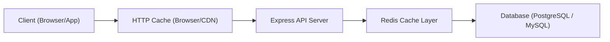

**version**  
Node.js 22.x / Express 5.x / Redis 8.x / TypeScript 5.x
---

### 요약  
캐싱(Caching)은 API 성능을 극적으로 향상시키는 핵심 기술이다.  
데이터를 일시적으로 저장하여 재요청 시 빠르게 응답함으로써  
서버 부하를 줄이고 응답 지연(Latency)을 최소화한다.  

캐싱은 API 성능 최적화의 핵심이며,
Redis를 활용하면 DB 접근 횟수를 줄여 응답 속도를 크게 향상시킬 수 있다.
TTL·무효화·계층 전략을 조합해 운영 환경에 맞는 캐시 정책을 설계하면
Express API의 확장성과 안정성을 동시에 확보할 수 있다.


핵심 내용은 다음과 같다.  
- 캐싱 계층 구조 및 동작 원리  
- HTTP 캐시 제어 헤더 (Cache-Control, ETag 등)  
- Redis를 활용한 서버 측 API 캐시  
- 캐시 무효화(Invalidation) 및 TTL 관리  
- 캐시 계층별 운영 전략  

---

##### 참고자료  
- [MDN Cache-Control Docs](https://developer.mozilla.org/en-US/docs/Web/HTTP/Headers/Cache-Control)  
- [Redis Caching Guide](https://redis.io/docs/latest/develop/use-cases/caching/)  
- [RFC 9111 – HTTP Caching](https://datatracker.ietf.org/doc/html/rfc9111)  

---

#### 1. 캐싱의 필요성  

| 문제 | 결과 | 개선 방안 |
|------|------|------------|
| 동일 요청 반복 발생 | DB 부하 증가 | 응답 데이터 캐싱 |
| 대용량 데이터 조회 | 응답 지연 발생 | TTL 기반 캐시 저장 |
| 외부 API 호출 빈번 | 네트워크 비용 증가 | 요청 결과 캐싱 및 재활용 |

Express API는 요청당 DB 조회가 빈번하므로  
**Redis 캐싱 계층**을 추가하면 응답 시간을 10배 이상 단축할 수 있다.  

---

#### 2. 캐싱 계층 구조  



요청은 상단(클라이언트) → 하단(데이터베이스) 순으로 흐르며,
상위 계층에서 캐시를 성공적으로 반환할수록 서버 부하는 감소한다.

---

#### 3. HTTP 캐시 제어

Express에서는 응답 헤더를 통해 브라우저 또는 프록시 캐시를 제어할 수 있다.

```typescript
res.set("Cache-Control", "public, max-age=60");
```

| 지시어          | 설명                 |
| ------------ | ------------------ |
| **public**   | 모든 중간 캐시 서버가 저장 가능 |
| **private**  | 브라우저 전용 캐시         |
| **no-cache** | 캐시된 응답 사용 전 재검증 필요 |
| **max-age**  | 캐시 유효 기간(초 단위)     |

ETag(엔터티 태그)를 사용하면 콘텐츠 변경 여부를 자동 검증할 수 있다.

```typescript
app.use((req, res, next) => {
  res.set("ETag", "v1.0.0");
  next();
});
```

---

#### 4. Redis 기반 서버 캐시

Redis는 메모리 기반 캐시로,
DB I/O 병목을 제거하고 응답 시간을 밀리초 단위로 단축한다.

```bash
pnpm add ioredis
```

```typescript
// src/config/redis.ts
import Redis from "ioredis";
export const redis = new Redis({ host: "localhost", port: 6379 });
```

```typescript
// src/middlewares/cache.middleware.ts
import { redis } from "../config/redis";
import { Request, Response, NextFunction } from "express";

export const cacheMiddleware = async (req: Request, res: Response, next: NextFunction) => {
  const key = `cache:${req.originalUrl}`;
  const cached = await redis.get(key);
  if (cached) {
    console.log(`Cache hit: ${key}`);
    return res.json(JSON.parse(cached));
  }
  res.sendResponse = res.json;
  res.json = (body: any) => {
    redis.set(key, JSON.stringify(body), "EX", 60); // TTL 60초
    res.sendResponse(body);
    return res;
  };
  next();
};
```

라우트에 적용:

```typescript
router.get("/users", cacheMiddleware, async (req, res) => {
  const users = await prisma.user.findMany();
  res.json({ success: true, data: users });
});
```

---

#### 5. 캐시 무효화(Invalidation)

캐시는 데이터 변경 시 반드시 무효화해야 한다.
대표적인 전략은 다음과 같다.

| 방식                | 설명                            |
| ----------------- | ----------------------------- |
| **Write-through** | 데이터 수정 시 즉시 캐시 갱신             |
| **Write-behind**  | 일정 시간 후 비동기 갱신                |
| **Cache-aside**   | 요청 시 캐시 미존재 시점에 DB 조회 및 캐시 저장 |

실무에서는 `cache-aside` 패턴이 가장 일반적이다.

```typescript
// Cache-aside 예시
const key = `user:${id}`;
let user = await redis.get(key);
if (!user) {
  user = await prisma.user.findUnique({ where: { id } });
  if (user) await redis.set(key, JSON.stringify(user), "EX", 300);
}
return JSON.parse(user);
```

---

#### 6. TTL (Time To Live) 관리

캐시의 TTL은 데이터 변동 주기에 따라 다르게 설정해야 한다.

| 데이터 유형  | TTL 권장값 | 설명         |
| ------- | ------- | ---------- |
| 사용자 프로필 | 10분     | 빈도 낮음      |
| 상품 목록   | 30초     | 변동 잦음      |
| 실시간 통계  | 5초      | 즉시성 중요     |
| 외부 API  | 5분      | 네트워크 비용 절약 |

TTL은 Redis의 `EXPIRE` 옵션 또는 자동 만료 정책으로 제어한다.

---

#### 7. 캐시 모니터링 및 통계

Redis는 캐시 사용량과 히트율을 모니터링할 수 있다.

```bash
redis-cli info stats | grep hit
# keyspace_hits: 3256
# keyspace_misses: 843
```

히트율(Hit Ratio)은 다음과 같이 계산된다.

```
Hit Ratio = hits / (hits + misses)
```

70% 이상이면 캐시 정책이 효율적으로 작동하는 것이다.

---

#### 8. 캐시 계층별 전략 요약

| 계층                    | 예시                     | TTL     | 역할        |
| --------------------- | ---------------------- | ------- | --------- |
| **브라우저**              | Cache-Control 헤더       | 수초~분    | 정적 자원     |
| **CDN/Reverse Proxy** | Cloudflare / Nginx     | 수초~분    | API 응답 캐시 |
| **서버 (Redis)**        | Express + Redis        | 10~300초 | DB 조회 캐시  |
| **DB 내부 캐시**          | PostgreSQL Query Cache | 즉시      | DB 성능 향상  |

---

#### 9. 보안 및 주의사항

* 민감 정보(Access Token, 개인정보)는 절대 캐시 금지
* 캐시 키에 사용자별 식별값(`userId`) 포함 시 주의
* TTL 만료와 데이터 삭제 이벤트를 정확히 로깅
* Redis 장애 대비 fallback 로직 필수

---


