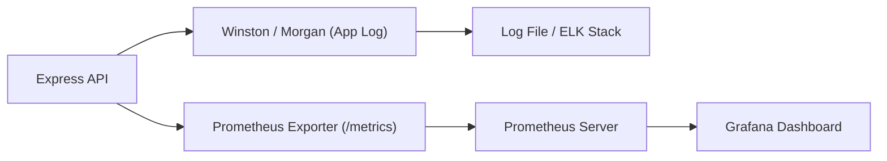

**version**  
Node.js 22.x / Express 5.x / Winston 3.x / Morgan 1.x / Prometheus 3.x / Grafana 10.x

---

### 요약  
로깅은 시스템의 “기억 장치”이며,  
모니터링은 시스템의 “감시 장치”이다.  

Express 애플리케이션에서는 로그를 표준화된 구조로 수집하고,  
Prometheus·Grafana 등으로 메트릭을 시각화하여  
장애 탐지, 성능 저하 진단, SLA 준수 검증 등을 수행할 수 있다.  

Express 애플리케이션의 안정적 운영을 위해서는
로그 수집과 모니터링 시스템을 통합적으로 설계해야 한다.
Winston + Morgan으로 구조화된 로그를 기록하고,
Prometheus + Grafana로 메트릭을 시각화하면
성능 저하나 장애를 조기에 탐지할 수 있다.
이 체계는 운영 환경에서 “가시성(Observability)”을 확보하는 핵심 요소이다.


핵심 내용은 다음과 같다.  
- Express 로깅 계층 구조  
- Winston + Morgan을 이용한 통합 로그 관리  
- 로그 포맷 및 저장소 구성  
- Prometheus 지표 수집 및 Grafana 연동  
- 실시간 모니터링 및 알림(Alerts) 구성  

---

##### 참고자료  
- [Winston Logger Docs](https://github.com/winstonjs/winston)  
- [Morgan Middleware](https://www.npmjs.com/package/morgan)  
- [Prometheus Node Exporter](https://prometheus.io/docs/guides/node-exporter/)  
- [Grafana Documentation](https://grafana.com/docs/)  

---

#### 1. Express 로깅 구조  

| 로그 계층 | 역할 | 예시 |
|------------|------|------|
| **Application Log** | 요청, 응답, 에러 기록 | Winston, Morgan |
| **System Metric Log** | CPU, Memory, Request rate 등 | Prometheus |
| **Access Log** | 사용자 접근 내역 | Nginx / API Gateway |
| **Audit Log** | 인증, 보안 이벤트 기록 | 별도 서비스 구성 |

---

#### 2. Winston 기반 로깅 설정  

```bash
pnpm add winston morgan
```

```typescript
// src/config/logger.ts
import winston from "winston";

export const logger = winston.createLogger({
  level: "info",
  format: winston.format.combine(
    winston.format.timestamp({ format: "YYYY-MM-DD HH:mm:ss" }),
    winston.format.json()
  ),
  transports: [
    new winston.transports.Console(),
    new winston.transports.File({ filename: "logs/app.log" }),
  ],
});
```

---

#### 3. HTTP 요청 로깅 (Morgan 연동)

```typescript
// src/middlewares/logger.middleware.ts
import morgan from "morgan";
import { logger } from "../config/logger";

const stream = {
  write: (message: string) => logger.info(message.trim()),
};

export const httpLogger = morgan(":method :url :status :response-time ms", { stream });
```

```typescript
// server.ts
import { httpLogger } from "./middlewares/logger.middleware";
app.use(httpLogger);
```

예시 로그 출력:

```
[INFO] 2025-10-24 15:00:12 GET /api/v1/users 200 34 ms
```

---

#### 4. 로그 구조 표준화

로그는 반드시 공통 필드를 포함해야 분석이 가능하다.

| 필드            | 설명                         |
| ------------- | -------------------------- |
| **timestamp** | 로그 발생 시각                   |
| **level**     | 로그 심각도 (info, warn, error) |
| **message**   | 로그 내용                      |
| **context**   | 서비스/모듈 명                   |
| **requestId** | 요청 단위 추적용 UUID             |
| **userId**    | 요청자 식별 정보 (Optional)       |

```typescript
logger.info({
  context: "UserController",
  message: "User created successfully",
  userId: 1,
});
```

---

#### 5. 에러 로그 분리 저장

운영 환경에서는 에러 로그를 별도 파일로 저장한다.

```typescript
new winston.transports.File({
  filename: "logs/error.log",
  level: "error",
});
```

```bash
logs/
├── app.log
└── error.log
```

이는 장애 추적 및 SLA 보고서 작성 시 유용하다.

---

#### 6. Prometheus + Grafana 모니터링 구성

Prometheus는 Express 서버의 메트릭을 수집하고,
Grafana는 이를 시각화한다.

```bash
pnpm add prom-client
```

```typescript
// src/monitoring/metrics.ts
import client from "prom-client";

const collectDefaultMetrics = client.collectDefaultMetrics;
collectDefaultMetrics({ prefix: "express_app_" });

export const httpRequestDuration = new client.Histogram({
  name: "http_request_duration_ms",
  help: "HTTP request duration in milliseconds",
  labelNames: ["method", "route", "status_code"],
});

export const register = client.register;
```

```typescript
// src/middlewares/metrics.middleware.ts
import { httpRequestDuration } from "../monitoring/metrics";

export const metricsMiddleware = (req, res, next) => {
  const start = Date.now();
  res.on("finish", () => {
    const duration = Date.now() - start;
    httpRequestDuration
      .labels(req.method, req.route?.path || req.url, res.statusCode.toString())
      .observe(duration);
  });
  next();
};
```

```typescript
// server.ts
import { register } from "./monitoring/metrics";
app.get("/metrics", async (req, res) => {
  res.set("Content-Type", register.contentType);
  res.end(await register.metrics());
});
```

Prometheus 설정 예시 (`prometheus.yml`):

```yaml
scrape_configs:
  - job_name: "express-app"
    static_configs:
      - targets: ["localhost:3000"]
```

Grafana 대시보드에서 `/metrics` 데이터를 시각화하면
응답 시간, 요청 빈도, 에러율 등을 실시간으로 추적할 수 있다.

---

#### 7. 로그 및 메트릭 통합 다이어그램



---

#### 8. 운영 시 권장 사항

* **로그 순환(Rotation)**

  * 로그 파일 크기 초과 시 자동 분할 (`winston-daily-rotate-file`)
* **분산 환경 로그 집계**

  * Elasticsearch, Loki, Fluentd 등 중앙 로그 서버 사용
* **보안 필드 마스킹**

  * 비밀번호·토큰·개인정보 로그 금지
* **지표 알림(Alerts)**

  * Grafana Alerting으로 SLA 임계값 초과 시 Slack/Email 알림

---

