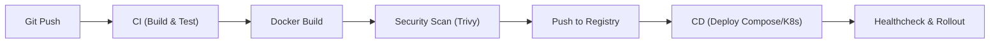

**version**  
Node.js 22.x / Express 5.x / Docker 26.x / Docker Compose v2

---

### 요약  
이 문서는 Express 애플리케이션을 Docker로 패키징하고 실행하는 방법을 설명한다.  
멀티 스테이지 빌드로 이미지 크기를 최소화하고, 런타임에 필요한 파일만 포함한다.  
헬스체크, 환경 변수 주입, 로그/포트/네트워크 설정까지 배포 운영에 필요한 구성을 정리한다.

Docker를 사용하면 Express 애플리케이션을 일관된 환경에서 실행할 수 있다.
멀티 스테이지 빌드로 이미지를 슬림하게 유지하고, 환경 변수는 런타임에 안전하게 주입한다.
헬스체크와 Graceful Shutdown을 구성하면 배포 안정성이 높아진다.
Compose는 로컬/스테이징에 적합하고, 프로덕션에서는 오케스트레이터와 연계해 운영 자동화를 완성한다.


핵심 내용은 다음과 같다.  
- 멀티 스테이지 Dockerfile 설계 (개발/빌드/런타임)  
- Docker Compose로 로컬·스테이징·프로덕션 구성  
- 환경 변수 관리와 보안 고려사항  
- Healthcheck, Graceful Shutdown, 로깅 전략  
- 이미지를 슬림하게 유지하는 최적화 기법

---

##### 참고자료  
- [Docker Docs – Best practices for Dockerfiles](https://docs.docker.com/develop/develop-images/dockerfile_best-practices/)  
- [Docker Compose Documentation](https://docs.docker.com/compose/)  
- [Node.js Docker Official Images](https://hub.docker.com/_/node)

---

#### 1. 멀티 스테이지 Dockerfile

아래 예시는 TypeScript 기반 Express 프로젝트를 기준으로 한다.

```dockerfile
# =========================
# 1) Base (공통 의존성)
# =========================
FROM node:22-alpine AS base
WORKDIR /app
ENV NODE_ENV=production
# pnpm 사용 시 필요 패키지 설치
RUN corepack enable && corepack prepare pnpm@latest --activate

# 공통 파일 복사
COPY package.json pnpm-lock.yaml* ./

# =========================
# 2) Dependencies (prod deps)
# =========================
FROM base AS deps
# 프로덕션 의존성만 설치
RUN pnpm install --frozen-lockfile --prod

# =========================
# 3) Build (dev deps 포함)
# =========================
FROM base AS build
# 개발 의존성 포함 설치
RUN pnpm install --frozen-lockfile
COPY tsconfig.json ./
COPY src ./src
# 빌드 산출물 생성
RUN pnpm run build

# =========================
# 4) Runtime (슬림 이미지)
# =========================
FROM node:22-alpine AS runtime
WORKDIR /app
ENV NODE_ENV=production
# 런타임에 필요한 파일만 복사
COPY --from=deps /app/node_modules ./node_modules
COPY package.json ./
COPY dist ./dist

# Healthcheck (앱이 /health 제공한다고 가정)
HEALTHCHECK --interval=30s --timeout=3s --retries=3 CMD wget -qO- http://localhost:3000/health || exit 1

EXPOSE 3000
CMD ["node", "dist/server.js"]
```

**설명**

* `deps` 단계에서 prod 의존성만 설치해 최종 이미지 크기를 줄인다.
* `build` 단계에서 TS → JS 빌드 후 `dist/`만 런타임에 복사한다.
* `runtime` 단계는 `node:22-alpine` 기반으로 슬림하며, 실행에 필요한 파일만 포함한다.
* `HEALTHCHECK`는 오케스트레이터(Kubernetes/Compose)가 컨테이너 상태를 판단하도록 돕는다.

---

#### 2. 서버 종료 및 헬스 엔드포인트

Graceful Shutdown을 위해 `SIGTERM` 수신 시 서버를 정상 종료하도록 구성한다.

```ts
// src/server.ts
import app from "./app";
const server = app.listen(process.env.PORT ?? 3000, () =>
  console.log(`🚀 listening ${process.env.PORT ?? 3000}`)
);

process.on("SIGTERM", () => {
  console.log("SIGTERM received. Closing server.");
  server.close(() => {
    console.log("HTTP server closed.");
    process.exit(0);
  });
});
```

헬스체크 라우트를 제공한다.

```ts
// src/routes/health.route.ts
import { Router } from "express";
const router = Router();
router.get("/health", (_, res) => res.status(200).json({ status: "ok" }));
export default router;
```

---

#### 3. Docker Compose 구성

로컬 개발 및 스테이징에 유용하다. Redis나 DB가 있으면 서비스로 함께 올린다.

```yaml
# docker-compose.yml
version: "3.9"
services:
  api:
    build:
      context: .
      dockerfile: Dockerfile
    container_name: express-api
    environment:
      - NODE_ENV=production
      - PORT=3000
      - DATABASE_URL=${DATABASE_URL}
    ports:
      - "3000:3000"
    healthcheck:
      test: ["CMD-SHELL", "wget -qO- http://localhost:3000/health || exit 1"]
      interval: 30s
      timeout: 3s
      retries: 3
    depends_on:
      - db
    restart: unless-stopped

  db:
    image: postgres:16-alpine
    container_name: postgres
    environment:
      - POSTGRES_USER=app
      - POSTGRES_PASSWORD=app
      - POSTGRES_DB=app
    ports:
      - "5432:5432"
    volumes:
      - dbdata:/var/lib/postgresql/data

volumes:
  dbdata:
```

**명령**

```bash
docker compose build
docker compose up -d
docker compose ps
docker compose logs -f api
```

---

#### 4. 환경 변수 관리

| 항목  | 권장 사항                                                  |
| --- | ------------------------------------------------------ |
| 비밀값 | `.env`는 로컬 전용, 프로덕션은 Secret Manager(KMS/SSM/Vault) 사용  |
| 구성  | `PORT`, `DATABASE_URL`, `LOG_LEVEL`, `JWT_SECRET` 등 명시 |
| 불변성 | 이미지에는 비밀을 포함하지 않는다. 런타임에 주입한다.                         |

Compose에서 `.env` 파일을 자동 로드하지만, 프로덕션에서는 오케스트레이터의 Secret/ConfigMap을 사용한다.

---

#### 5. 이미지 최적화 팁

* **멀티 스테이지**: dev deps를 최종 이미지에 포함하지 않는다.
* **알파인 베이스**: `node:22-alpine` 기반으로 크기 축소(단, 네이티브 모듈 빌드 시 build-base 필요).
* **.dockerignore 활용**: 불필요 파일 제외.

`.dockerignore` 예시:

```
node_modules
dist
.git
.vscode
Dockerfile*
docker-compose.yml
npm-debug.log
coverage
```

---

#### 6. 로깅과 표준 출력

컨테이너는 **표준 출력(stdout/stderr)** 로 로깅한다.
플랫폼(CloudWatch, Loki, ELK)은 표준 출력을 수집한다.

```ts
// src/config/logger.ts (간단 예시)
export const log = (...args: any[]) => console.log(JSON.stringify({ ts: new Date().toISOString(), msg: args.join(" ") }));
```

---

#### 7. 네트워크/보안 고려사항

| 항목         | 권장 설정                                  |
| ---------- | -------------------------------------- |
| 포트         | 외부 노출 최소화, LB/Ingress 뒤에 배치            |
| 사용자        | 루트 사용자 피하고, 런타임에서 `USER node` 사용 고려    |
| 업데이트       | 베이스 이미지 정기 업데이트/스캔(trivy, docker scan) |
| CORS/HTTPS | 앱 레벨 CORS 설정, TLS는 LB/Ingress에서 종단     |

런타임에서 비루트로 실행하려면 마지막 단계에 추가한다.

```dockerfile
RUN addgroup -S app && adduser -S app -G app
USER app
```

---

#### 8. 배포 파이프라인 개요



* CI에서 빌드·테스트 후 이미지를 레지스트리(ECR/GCR/Docker Hub)에 푸시한다.
* CD에서 Compose(스테이징) 또는 K8s(프로덕션)로 배포한다.
* Healthcheck 실패 시 롤백/재배포 정책을 적용한다.

---

#### 9. 실행/문제 해결 체크리스트

| 점검 항목  | 확인 포인트                               |
| ------ | ------------------------------------ |
| 포트 바인딩 | `EXPOSE 3000`과 `- "3000:3000"` 일치 여부 |
| 헬스체크   | `/health` 라우트 응답 200 보장              |
| 환경 변수  | `DATABASE_URL` 등 런타임에 주입되는지 확인       |
| 셧다운    | `SIGTERM` 처리로 정상 종료되는지 확인            |
| 이미지 크기 | 멀티 스테이지로 dev deps 제거되었는지             |
| 보안     | 루트 사용자 실행 여부, 비밀키 미포함 여부             |

---

