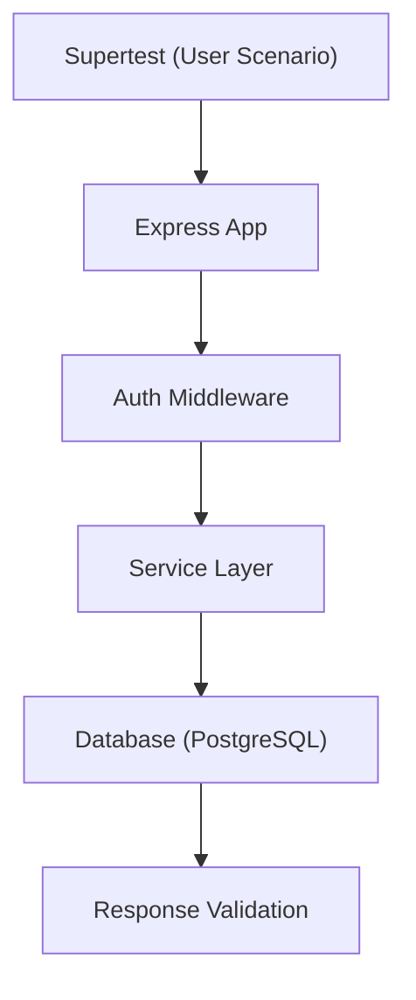

**version**  
Node.js 22.x / Express 5.x / Jest 29.x / Supertest 7.x / Docker Compose v2 / PostgreSQL 16.x

---

### 요약  
E2E(End-to-End) 테스트는 실제 사용자의 요청 시나리오를 완전한 환경에서 검증하는 단계이다.  
Express API 서버, 데이터베이스, 인증, 외부 연동 등 모든 컴포넌트를 통합하여  
서비스 전체의 동작 흐름이 기대한 결과를 내는지를 확인한다.  

E2E 테스트는 실제 사용자 플로우를 그대로 재현해
시스템 전체의 안정성을 검증하는 최종 단계다.
Supertest를 이용해 API 호출을 시뮬레이션하고,
Docker Compose 기반의 실제 DB 환경을 통해 테스트를 실행하면
배포 전 코드 품질과 기능 완전성을 확보할 수 있다.
CI 파이프라인에 통합하면 실시간 품질 보증 체계를 완성할 수 있다.

핵심 내용은 다음과 같다.  
- E2E 테스트의 개념 및 구조  
- Docker Compose를 활용한 테스트 환경 구성  
- 실제 DB 기반 시나리오 테스트 작성  
- 인증·권한 기반 테스트 흐름  
- 테스트 격리 및 자동화 전략  

##### 테스트 실행 다이어그램



##### 참고자료  
- [Supertest Docs](https://github.com/visionmedia/supertest)  
- [Jest Setup & Teardown](https://jestjs.io/docs/setup-teardown)  
- [Testing in Docker Compose](https://docs.docker.com/compose/how-tos/run-multiple-compose-files/)  

---

#### 1. E2E 테스트의 목적  

E2E 테스트는 단위 및 통합 테스트를 통과한 시스템이  
실제 배포 환경에서도 동일하게 작동하는지 확인하기 위한 최종 검증 단계이다.

| 구분 | 단위 | 통합 | E2E |
|------|------|------|------|
| **대상** | 함수 | 모듈 / API | 시스템 전체 |
| **환경** | Mock / Local | In-memory DB | 실제 DB / 네트워크 |
| **속도** | 빠름 | 중간 | 느림 |
| **검증 범위** | 로직 정확성 | API 흐름 | 사용자 시나리오 |

---

#### 2. 테스트 환경 구성  

E2E 테스트는 실제 DB가 필요하므로, Docker Compose 환경에서  
Express + PostgreSQL 조합으로 구동한다.

```yaml
# docker-compose.test.yml
version: "3.9"
services:
  api:
    build: .
    environment:
      - NODE_ENV=test
      - DATABASE_URL=postgres://user:pass@db:5432/testdb
    ports:
      - "4000:3000"
    depends_on:
      - db
  db:
    image: postgres:16-alpine
    environment:
      - POSTGRES_USER=user
      - POSTGRES_PASSWORD=pass
      - POSTGRES_DB=testdb
    ports:
      - "5432:5432"
```

실행:

```bash
docker compose -f docker-compose.test.yml up -d
```

---

#### 3. Express E2E 테스트 초기 설정

```typescript
// src/app.ts
import express from "express";
import userRouter from "./routes/user.route";
import authRouter from "./routes/auth.route";

const app = express();
app.use(express.json());
app.use("/api/v1/auth", authRouter);
app.use("/api/v1/users", userRouter);
export default app;
```

```typescript
// tests/e2e/setup.ts
import app from "../../src/app";
import request from "supertest";

export const api = request(app);
```

---

#### 4. 테스트 시나리오 설계

테스트 흐름:

1. `/api/v1/auth/signup` → 회원 가입
2. `/api/v1/auth/login` → JWT 발급
3. `/api/v1/users/me` → 인증 요청 검증
4. `/api/v1/users/:id` → 데이터 수정/삭제

```typescript
// tests/e2e/user.e2e.test.ts
import { api } from "./setup";

describe("E2E: User Flow", () => {
  let token: string;
  let userId: number;

  test("회원 가입", async () => {
    const res = await api.post("/api/v1/auth/signup").send({
      name: "Ingeun",
      email: "user@example.com",
      password: "1234",
    });
    expect(res.status).toBe(201);
    userId = res.body.data.id;
  });

  test("로그인 및 JWT 발급", async () => {
    const res = await api.post("/api/v1/auth/login").send({
      email: "user@example.com",
      password: "1234",
    });
    expect(res.status).toBe(200);
    token = res.body.token;
  });

  test("인증 요청 (GET /users/me)", async () => {
    const res = await api.get("/api/v1/users/me").set("Authorization", `Bearer ${token}`);
    expect(res.status).toBe(200);
    expect(res.body.data.email).toBe("user@example.com");
  });

  test("사용자 정보 수정", async () => {
    const res = await api
      .patch(`/api/v1/users/${userId}`)
      .set("Authorization", `Bearer ${token}`)
      .send({ name: "Updated" });
    expect(res.status).toBe(200);
  });

  test("사용자 삭제", async () => {
    const res = await api
      .delete(`/api/v1/users/${userId}`)
      .set("Authorization", `Bearer ${token}`);
    expect(res.status).toBe(204);
  });
});
```

---

#### 5. 인증 실패 / 예외 테스트

```typescript
test("인증 실패 시 401 반환", async () => {
  const res = await api.get("/api/v1/users/me");
  expect(res.status).toBe(401);
  expect(res.body.error.message).toMatch(/unauthorized/i);
});
```

---

#### 6. DB 정리 (Teardown)

E2E 테스트 후 DB를 초기화한다.

```typescript
// tests/e2e/teardown.ts
import { prisma } from "../../src/prisma/client";

afterAll(async () => {
  await prisma.user.deleteMany({});
  await prisma.$disconnect();
});
```

---

#### 7. 실행

```bash
pnpm test:e2e
```

`package.json`:

```json
"scripts": {
  "test:e2e": "NODE_ENV=test jest --runInBand --detectOpenHandles --testPathPattern=e2e"
}
```

---

