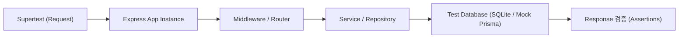

**version**  
Node.js 22.x / Express 5.x / Jest 29.x / Supertest 7.x / TypeScript 5.x

---

### 요약  
통합 테스트(Integration Test)는 애플리케이션의 여러 컴포넌트(라우터, 미들웨어, DB, 서비스)가  
실제 요청 흐름을 통해 올바르게 연동되는지 검증하는 과정이다.  
단위 테스트가 개별 함수 검증이라면, 통합 테스트는 **엔드포인트 단위 시나리오 검증**을 목표로 한다.  

통합 테스트는 단위 테스트의 확장으로, Express 서버 전체의 API 흐름을 실제 요청으로 검증한다.
Supertest를 이용하면 서버 포트를 열지 않고 요청을 시뮬레이션할 수 있으며,
JWT 인증, DB 연동, 미들웨어 검증까지 포함하여 완전한 시나리오 테스트를 수행할 수 있다.
테스트 자동화 파이프라인에 포함시키면, 코드 변경 시 회귀 오류를 사전에 차단할 수 있다.


핵심 내용은 다음과 같다.  
- Supertest 환경 구성 및 Express 인스턴스 주입  
- 라우터/미들웨어/DB 연동 테스트  
- Jest 환경 격리 (setup/teardown)  
- 인증 토큰·세션 기반 테스트 패턴  
- Mock DB 또는 SQLite 임시 DB 활용  

#### 통합 테스트 실행 다이어그램



##### 참고자료  
- [Supertest GitHub](https://github.com/visionmedia/supertest)  
- [Jest Setup & Teardown](https://jestjs.io/docs/setup-teardown)  
- [Express Testing Patterns](https://expressjs.com/en/advanced/best-practice-performance.html#testing)  

---

#### 1. 통합 테스트의 목적  

| 구분 | 단위 테스트 | 통합 테스트 |
|------|--------------|-------------|
| **테스트 단위** | 함수 / 메서드 | 전체 엔드포인트 |
| **목표** | 로직 정확성 검증 | 실제 API 흐름 검증 |
| **속도** | 빠름 (ms 단위) | 중간 (초 단위) |
| **환경** | Mock / Stub | 실제 서버 / 라우터 / DB |
| **대표 도구** | Jest | Supertest + Jest |

---

#### 2. Supertest 환경 구성  

```bash
pnpm add -D supertest jest ts-jest @types/jest @types/supertest
```

`jest.config.js` (단위 테스트와 동일):

```js
export default {
  preset: "ts-jest",
  testEnvironment: "node",
  roots: ["<rootDir>/tests"],
};
```

---

#### 3. Express 서버 임시 인스턴스 생성

```typescript
// src/app.ts
import express from "express";
import userRouter from "./routes/user.route";
const app = express();
app.use(express.json());
app.use("/api/v1/users", userRouter);
export default app;
```

테스트 시 서버 포트를 열지 않고 `app` 인스턴스를 직접 호출한다.

---

#### 4. 기본 테스트 예시

```typescript
// tests/integration/user.integration.test.ts
import request from "supertest";
import app from "../../src/app";

describe("User API Integration", () => {
  test("GET /api/v1/users → 200 OK", async () => {
    const res = await request(app).get("/api/v1/users");
    expect(res.status).toBe(200);
    expect(res.body).toHaveProperty("success", true);
    expect(Array.isArray(res.body.data)).toBe(true);
  });
});
```

`supertest(app)`은 실제 서버를 구동하지 않고 Express 핸들러를 직접 호출한다.

---

#### 5. POST 요청 테스트

```typescript
test("POST /api/v1/users → 201 Created", async () => {
  const payload = { name: "Ingeun", email: "user@example.com" };
  const res = await request(app).post("/api/v1/users").send(payload);
  expect(res.status).toBe(201);
  expect(res.body.data.name).toBe("Ingeun");
});
```

응답 검증 시 상태 코드, JSON 구조, 필수 필드를 함께 체크한다.

---

#### 6. 인증 토큰 기반 테스트

로그인 → JWT 발급 → 인증 헤더 테스트 패턴 예시:

```typescript
let token: string;

beforeAll(async () => {
  const res = await request(app)
    .post("/api/v1/auth/login")
    .send({ email: "user@example.com", password: "1234" });
  token = res.body.token;
});

test("GET /api/v1/profile (with token)", async () => {
  const res = await request(app)
    .get("/api/v1/profile")
    .set("Authorization", `Bearer ${token}`);
  expect(res.status).toBe(200);
  expect(res.body.data).toHaveProperty("email");
});
```

---

#### 7. DB 연동 테스트 (In-memory SQLite 예시)

테스트 환경에서는 실제 DB 대신 임시 SQLite 메모리 DB를 사용한다.

```typescript
// src/config/test-database.ts
import { PrismaClient } from "@prisma/client";
export const prisma = new PrismaClient({
  datasources: { db: { url: "file:./test.db?mode=memory&cache=shared" } },
});
```

테스트 시작 시 마이그레이션 및 초기화 수행:

```bash
npx prisma migrate deploy
```

---

#### 8. Setup / Teardown

테스트 실행 전후에 공통 설정을 적용한다.

```typescript
// tests/setup.ts
beforeAll(async () => {
  console.log("🚀 Integration tests starting...");
});

afterAll(async () => {
  console.log("🧹 Integration tests completed.");
});
```

`package.json`에 지정:

```json
"jest": {
  "globalSetup": "./tests/setup.ts"
}
```

---

#### 9. 커버리지 확인

```bash
pnpm jest --coverage
```

통합 테스트는 보통 **비즈니스 플로우 중심 커버리지**를 측정한다.
API 주요 시나리오(등록 → 조회 → 수정 → 삭제)를 최소 1회씩 검증해야 한다.

---

