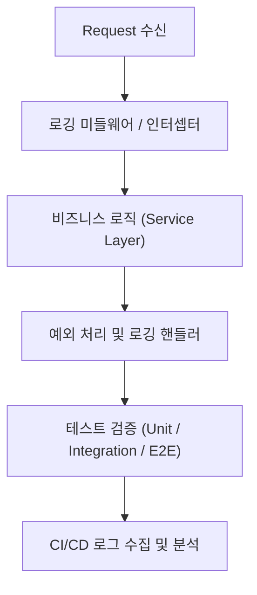
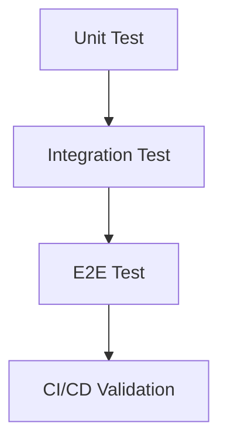

#### 요약

- 본 문서는 **백엔드 애플리케이션의 로깅(Logging)** 과 **테스트(Test)** 전략을  
  **개발 코드 레벨**에서 구현하는 방법을 다룬다.  
- Express, NestJS, Flask, Spring Boot, Spring Cloud 등  
  대표 프레임워크별로 **일관된 구조적 로그(JSON 기반)** 와  
  **단위·통합·E2E 테스트 전략**을 기술 문서 형태로 정리한다.  
- 운영 환경의 로깅 인프라(ELK, Loki, CloudWatch 등)는 제외하고,  
  **순수 코드 수준의 로깅 설계 및 테스트 자동화 패턴**에 집중한다.

**핵심 목표**
1. 로그 표준화 — JSON 기반 구조, 필드 통일, 로그 레벨 정책 수립  
2. 추적성 확보 — Trace ID / Span ID 기반 요청 단위 추적  
3. 테스트 자동화 — 로그 기반 유닛·통합·E2E 테스트 설계  
4. 보안 강화 — 로그 내 민감정보 마스킹 및 접근 제어

**정리 문단**  
> 본 문서는 로깅과 테스트를 "운영 효율성의 기반"으로 바라본다.  
> 코드 수준에서 로그가 설계되어야 관측성과 재현성이 확보되며,  
> 테스트 자동화는 그 결과의 일관성을 보장한다.

---

#### 1. 문서 목적

현대 백엔드 시스템은 단순한 `console.log()` 수준을 넘어  
**요청 단위의 전파 추적, 성능 지표 수집, 보안 로그 통제**까지 요구한다.  
본 문서는 이러한 복잡성을 **프레임워크 독립적인 로깅·테스트 설계 기준**으로 정리한다.

| 항목 | 설명 |
|------|------|
| **대상** | Express, NestJS, Flask, Spring Boot, Spring Cloud 기반 백엔드 서비스 |
| **목적** | 통합된 로깅/테스트 설계 체계 수립 |
| **범위** | 코드 레벨에서의 로그 구조, Trace 전파, 테스트 설계, 보안 처리 |
| **비대상** | ELK, Grafana, Loki 등 외부 수집 시스템 구성 |

---

#### 2. 로깅과 테스트의 역할



**로깅 흐름 요약**
1. 요청(Request) 수신 시 Trace ID 생성 및 컨텍스트에 주입  
2. 미들웨어·필터·AOP에서 요청/응답 로그를 구조화  
3. 예외 발생 시 에러 스택, 요청 컨텍스트를 JSON으로 기록  
4. 테스트 단계에서 MockLogger 또는 Log Capture를 통해 검증  

---

#### 3. 공통 로깅 설계 철학

| 설계 항목 | 설명 |
|------------|------|
| **구조적 로그(Structured Logging)** | JSON 포맷을 통한 필드 기반 검색 및 분석 |
| **Trace Propagation** | Trace ID / Span ID를 모든 요청 체인에 전파 |
| **Error Transparency** | 예외 발생 시 원인, 경로, 요청 ID를 함께 로깅 |
| **Masking Policy** | password, token, key 등 민감정보는 로그에 기록 금지 |
| **환경별 Level 구분** | dev=DEBUG, stage=INFO, prod=ERROR 이상만 출력 |

**예시 로그 구조 (JSON)**
```json
{
  "timestamp": "2025-10-26T09:45:12.347Z",
  "level": "INFO",
  "service": "orders-api",
  "traceId": "a1f3c2e9",
  "method": "POST",
  "path": "/api/orders",
  "status": 201,
  "latency_ms": 142,
  "userId": "u_1029",
  "message": "Order created successfully"
}
```

---

#### 4. 테스트 계층 정의

| 구분 | 목적 | 도구 / 예시 |
|------|------|-------------|
| **Unit Test** | 로그 호출 및 출력 검증 | Jest, Pytest, JUnit5 |
| **Integration Test** | 로그 + 서비스 흐름 검증 | Supertest, Testcontainers |
| **E2E Test** | 실제 API 호출 기반 전체 시나리오 검증 | REST Assured, Postman, HTTPX |
| **CI/CD Verification** | 로그 형식 / 레벨 / 마스킹 정책 자동 검사 | Jenkins, GitLab CI |



---