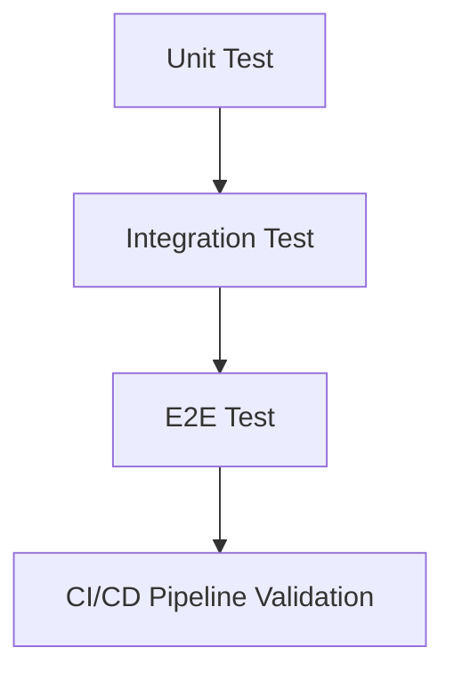
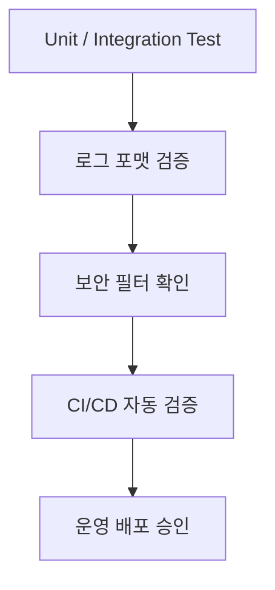

#### 요약

- 본 문서는 **로그 기반 테스트 전략(Testing Strategy)** 과 **보안(Security)** 강화를 위한  
  실무 가이드라인을 통합적으로 제시한다.  
- 테스트는 로깅 품질을 검증하고, 보안은 로그를 안전하게 보호한다.  
  두 영역은 **품질(Quality)** 과 **신뢰(Security)** 를 동시에 보장하는 핵심 축이다.

> 테스트 전략은 **로깅의 신뢰성**을, 보안 전략은 **로깅의 안전성**을 보장한다.  
> 두 영역을 통합하면, 개발·운영 전 단계에서  
> **“추적 가능한 품질 로그 + 보호된 정보 로그”** 를 달성할 수 있다.  
> 이 문서는 백엔드 서비스의 **품질관리(Testing)** 와 **보안관리(Security)** 의  
> 통합 표준으로 활용할 수 있다.

**핵심 요약**
1. 테스트 단계별 로그 검증 전략 (Unit → Integration → E2E → CI/CD)  
2. 로그 기반 품질 게이트(Quality Gate) 자동화  
3. 민감정보 마스킹 및 접근 제어 정책  
4. 환경 변수 / 인증정보 노출 방지  
5. 로그 보존·삭제 정책 및 보안 점검 기준  

---


### 1. 테스트 전략 (Testing Strategy)

#### 1.1 테스트 레벨 정의

| 구분 | 목적 | 검증 대상 | 대표 도구 |
|------|------|------------|------------|
| **Unit Test** | 개별 함수/모듈의 로깅 검증 | 로깅 호출, 포맷 | Jest / Pytest / JUnit5 |
| **Integration Test** | 서비스 간 로깅 연동 확인 | DB, API, 로깅 통합 | Testcontainers / Supertest |
| **E2E Test** | 전체 시나리오 검증 | Request → Response Trace | Postman / RestAssured |
| **CI/CD Validation** | 자동화 품질 게이트 | 로그 포맷, 에러율 | Jenkins / GitLab CI |



---

#### 1.2 로그 기반 단위 테스트

**Node.js (Express/NestJS)**  
```js
import { logger } from '../src/logger';
describe('Logger Unit Test', () => {
  it('should output structured log', () => {
    const spy = jest.spyOn(logger, 'info');
    logger.info({ message: 'Unit test', user: 'u001' });
    expect(spy).toHaveBeenCalledWith(
      expect.objectContaining({ message: 'Unit test' })
    );
  });
});
```

**Python (Flask)**  
```python
import logging
def test_logger_format(caplog):
    logger = logging.getLogger("flask-api")
    logger.info({"event": "login", "user": "test"})
    assert any("login" in r.message for r in caplog.records)
```

**Java (Spring Boot)**  
```java
@Test
void shouldLogInfo() {
    Logger log = LoggerFactory.getLogger("test");
    log.info("Log success");
    assertTrue(true);
}
```

| 항목 | 검증 내용 |
|------|------------|
| **구조적 로그** | JSON 형태로 출력 여부 |
| **Trace ID 포함** | 요청 단위 컨텍스트 유지 여부 |
| **로그 레벨 구분** | INFO / ERROR 구분 정확성 |

---

#### 1.3 통합 테스트 (Integration)

**Testcontainers 예시**
```java
@SpringBootTest
@Testcontainers
class IntegrationTest {

  @Container
  static PostgreSQLContainer<?> postgres = new PostgreSQLContainer<>("postgres:15");

  @Test
  void testDatabaseAndLogging() {
      log.info("DB 연결: {}", postgres.getJdbcUrl());
      assertThat(postgres.isRunning()).isTrue();
  }
}
```

**Node.js Supertest 예시**
```js
import request from 'supertest';
import app from '../src/app';

describe('Integration Logging Test', () => {
  it('should log request/response', async () => {
    const res = await request(app).get('/health');
    expect(res.status).toBe(200);
  });
});
```

| 검증 항목 | 설명 |
|------------|------|
| **API 요청 로그** | 요청/응답 로그 정상 출력 |
| **Latency 측정** | latency_ms 값 확인 |
| **DB 연결 로그** | 연결 성공 시 정보 기록 |

---

#### 1.4 E2E 테스트 (Trace 전파 검증)

```js
import request from 'supertest';
describe('E2E Trace Test', () => {
  it('should keep traceId through request chain', async () => {
    const traceId = 'trace-1001';
    const res = await request(app).get('/api/orders').set('X-Trace-Id', traceId);
    expect(res.headers['x-trace-id']).toBe(traceId);
  });
});
```

**Java (RestAssured)**  
```java
@Test
void traceShouldPropagate() {
    given()
      .header("X-B3-TraceId", "trace-2001")
    .when()
      .get("/api/orders")
    .then()
      .statusCode(200)
      .header("X-B3-TraceId", "trace-2001");
}
```

| 검증 항목 | 설명 |
|------------|------|
| **Trace ID 전파** | 요청/응답 간 ID 유지 |
| **로그 연계성** | 동일 Trace ID로 로그 묶임 |
| **에러 로그 출력** | 예외 발생 시 로그 포함 |
| **성능지표 출력** | latency_ms, status 필드 확인 |

---

#### 1.5 CI/CD 로그 검증 자동화

**Jenkins 예시**
```groovy
stage('Validate Logs') {
  steps {
    sh '''
      grep -E '"level":"ERROR"' ./logs/app.log && exit 1 || echo "✅ Clean logs"
    '''
  }
}
```

**GitLab CI 예시**
```yaml
validate_logs:
  stage: validate
  script:
    - cat logs/app.log | jq -e 'select(.level=="ERROR")' && exit 1 || echo "No errors ✅"
```

| 항목 | 검증 내용 |
|------|------------|
| **에러 감지** | ERROR 로그 존재 시 빌드 실패 |
| **포맷 검사** | JSON 구조 유효성 검증 |
| **Trace 필드 검사** | traceId / latency 필드 존재 여부 |
| **로그 누락 탐지** | 테스트별 로그 수량 검증 |

---

### 2. 보안 (Security)

#### 2.1 로그 내 민감정보 보호

| 민감 항목 | 처리 방식 | 예시 |
|------------|------------|------|
| **비밀번호 / 비밀키** | 마스킹 `"****"` | `"password": "****"` |
| **토큰 / 세션ID** | 부분 숨김 | `"Authorization": "Bearer ****"` |
| **개인정보(이메일, 전화)** | 정규식 기반 마스킹 | `"user": "a***@example.com"` |
| **환경변수 / API Key** | 로그 출력 금지 | `.env` 제외 대상 설정 |

**Node 예시 (마스킹 함수)**
```js
function maskSensitive(data) {
  return JSON.stringify(data).replace(/(password|token)["']?:["'][^"']+/gi, '$1:"****"');
}
```

---

#### 2.2 환경 변수 및 비밀키 보호

| 항목 | 가이드 |
|------|---------|
| **.env 관리** | 운영 환경 분리 (`.env.dev`, `.env.prod`) |
| **Git 제외** | `.gitignore`에 `.env` 포함 |
| **Vault 연동** | HashiCorp Vault / AWS Secrets Manager 활용 |
| **로깅 제외 키워드** | `SECRET`, `API_KEY`, `PRIVATE_KEY` 필터링 |

**Spring Boot 예시**
```yaml
logging:
  pattern:
    level: "%5p [${spring.application.name:},%X{traceId}]"
```

---

#### 2.3 Trace ID & 사용자 정보 익명화

| 구분 | 내용 |
|------|------|
| **Trace ID** | 무작위 UUID 사용 (`UUID.randomUUID()`) |
| **User Identifier** | 익명 ID (`user_****`)로 변환 |
| **IP 주소** | 3옥텟 이하 마스킹 (`192.168.***`) |
| **Session Data** | 로그로 출력 금지 |

**NestJS Interceptor 예시**
```ts
user.ip = user.ip?.replace(/\d+$/, "***");
this.logger.log({ traceId, userId: "user_****", message: "Accessed" });
```

---

#### 2.4 로그 접근 제어

| 항목 | 설명 |
|------|------|
| **파일 권한** | 640 (읽기 제한) |
| **로그 서버 접근** | 관리자·DevOps 계정만 |
| **CI/CD 로그 노출 방지** | 파이프라인 출력 최소화 |
| **보관 주기** | 7~30일 (환경별 정책 적용) |
| **로그 암호화** | 파일 전송 시 TLS / HTTPS 적용 |

**Linux 예시**
```bash
chmod 640 /var/log/app.log
chown root:devops /var/log/app.log
```

---

#### 2.5 테스트 로그 보안

| 항목 | 원칙 |
|------|------|
| **가짜 데이터 사용** | 실사용자/실 DB 데이터 금지 |
| **랜덤 Trace ID 생성** | 테스트별 고유 UUID 사용 |
| **보안 로그 분리** | 테스트 로그와 운영 로그 분리 보관 |
| **자동 삭제** | 테스트 로그는 7일 내 자동 삭제 스크립트 적용 |

**자동 삭제 스크립트 예시**
```bash
find ./logs/test -type f -mtime +7 -delete
```

---

### 3. 품질 + 보안 결합 전략



| 단계 | 품질 검증 | 보안 검증 |
|------|------------|------------|
| **개발** | 로그 구조 / Trace ID | 마스킹 함수 테스트 |
| **통합** | DB / API Trace 흐름 | 환경변수 노출 검사 |
| **E2E** | 전체 시나리오 | 사용자정보 익명화 검증 |
| **CI/CD** | 빌드 실패 조건 | 비밀키 노출 탐지 |

---

좋아요 👍
이어서 위 통합 문서(`Testing Strategy & Security`)에 바로 이어붙일 수 있는
**“테스트 로그 자동검증 스크립트”** 와 **“보안 감사 체크리스트(Security Audit Checklist)”**
두 섹션을 기술 문서 표준 템플릿 형식으로 완성했습니다.

---


### 4. 테스트 로그 자동검증 스크립트 (Automated Log Validation Scripts)

#### 4.1 목적
테스트 실행 후 생성된 로그의 품질을 자동으로 검증하여  
**“로그 품질 관리(Quality Gate)”** 를 CI/CD 파이프라인 단계에 통합한다.

---

#### 4.2 검증 포인트

| 검증 항목 | 설명 | 결과 기준 |
|------------|------|------------|
| **JSON 구조 유효성** | 로그 포맷이 깨지지 않았는가 | ✅ `jq` 파서 오류 없음 |
| **Trace 필드 존재** | traceId, latency, status 필드가 포함되었는가 | ✅ 존재 |
| **에러 로그 비율** | 전체 로그 대비 ERROR 비율이 기준 이하인가 | ⚠️ 5% 이하 |
| **민감정보 누락** | password/token 등의 필드가 포함되지 않았는가 | ✅ 없음 |
| **로그 누락 탐지** | 테스트 케이스당 최소 1개 이상의 로그가 생성되는가 | ✅ 케이스 일치 |

---

#### 4.3 Node.js 환경 자동검증 스크립트 (`validate-logs.js`)

```js
import fs from 'fs';
import path from 'path';

const LOG_PATH = './logs/app.log';
const logs = fs.readFileSync(LOG_PATH, 'utf-8').trim().split('\n').map(JSON.parse);

const errorLogs = logs.filter(l => l.level === 'ERROR');
const invalid = logs.filter(l => !l.traceId || !l.message);
const sensitive = logs.filter(l => JSON.stringify(l).match(/password|token|secret/i));

console.log('🔍 로그 검증 결과');
console.log(`- 총 로그: ${logs.length}`);
console.log(`- 에러 로그: ${errorLogs.length}`);
console.log(`- Trace 누락: ${invalid.length}`);
console.log(`- 민감정보 포함: ${sensitive.length}`);

if (errorLogs.length / logs.length > 0.05) {
  console.error('❌ ERROR 비율 5% 초과');
  process.exit(1);
}

if (invalid.length > 0 || sensitive.length > 0) {
  console.error('❌ 로그 품질 불량 - 필드 누락 또는 민감정보 포함');
  process.exit(1);
}

console.log('✅ 로그 품질 정상');
```

**실행 예시**
```bash
node validate-logs.js
```

**출력 결과**
```
🔍 로그 검증 결과
- 총 로그: 325
- 에러 로그: 4
- Trace 누락: 0
- 민감정보 포함: 0
✅ 로그 품질 정상
```

---

#### 4.4 CI/CD 연동 예시 (GitLab CI)

```yaml
stages:
  - test
  - validate

validate_logs:
  stage: validate
  script:
    - node validate-logs.js
  allow_failure: false
```

---

#### 4.5 Shell 기반 공용 스크립트 (OS 공통)

```bash
#!/bin/bash
LOG_FILE="./logs/app.log"

echo "🔍 로그 품질 검사 중..."
jq . $LOG_FILE > /dev/null 2>&1 || { echo "❌ JSON 구조 오류"; exit 1; }
grep -E '"password"|"token"|"secret"' $LOG_FILE && { echo "❌ 민감정보 발견"; exit 1; }
grep -q '"traceId"' $LOG_FILE || { echo "❌ traceId 누락"; exit 1; }

echo "✅ 로그 품질 정상"
```

---

> **결론:**  
> 자동 로그 검증 스크립트는 **테스트 단계에서의 신뢰성과 보안 수준을 정량화**한다.  
> 이 스크립트는 빌드 파이프라인 내에서 실행되어야 하며,  
> 실패 시 배포를 차단하는 “품질 게이트(Quality Gate)” 역할을 수행한다.

---

### 5. 보안 감사 체크리스트 (Security Audit Checklist)

#### 5.1 목적
운영 환경의 로그 및 테스트 환경을 대상으로  
**보안 감사(Audit)** 를 수행할 때 점검해야 할 항목을 표준화한다.  
해당 체크리스트는 **ISMS / ISO27001** 수준의 내부 감사 기준에 부합하도록 설계되었다.

---

#### 5.2 시스템 접근 제어

| 항목 | 점검 기준 | 상태 |
|------|------------|------|
| 서버 접근 권한 최소화 | root 접근 차단, devops만 SSH 허용 | ☐ |
| 로그 서버 접근 제어 | 관리자·보안 담당자 한정 | ☐ |
| SSH 키 관리 | 개인 키, 공용 키 만료 주기 점검 | ☐ |
| CI/CD 환경 비밀변수 보호 | `MASKED` 설정 여부 확인 | ☐ |
| 외부 IP 차단 | 방화벽 규칙으로 외부 접근 제한 | ☐ |

---

#### 5.3 로그 파일 및 보존 정책

| 항목 | 점검 기준 | 상태 |
|------|------------|------|
| 로그 보관 기간 | 7~30일 내 정책 적용 | ☐ |
| 로그 파일 접근 권한 | `chmod 640` 이상 | ☐ |
| 로그 전송 시 암호화 | HTTPS / TLS 적용 | ☐ |
| 로그 백업 및 삭제 주기 | 백업 주기 1일, 삭제 주기 30일 | ☐ |
| 로그 회전 설정 | 일 단위 Log Rotation 적용 | ☐ |

---

#### 5.4 민감정보 및 마스킹 정책

| 항목 | 점검 기준 | 상태 |
|------|------------|------|
| 비밀번호, 토큰 로그 제외 | 로거 필터 정책 적용 확인 | ☐ |
| 개인정보(전화, 이메일) 마스킹 | 정규식 기반 마스킹 함수 활성화 | ☐ |
| 환경 변수 출력 금지 | `.env` 파일 Git 포함 여부 점검 | ☐ |
| Trace ID 익명화 | UUID 형태 사용, 순차 ID 금지 | ☐ |
| 민감정보 로그 파서 검증 | `validate-logs.js` 실행 결과 확인 | ☐ |

---

#### 5.5 CI/CD 파이프라인 보안

| 항목 | 점검 기준 | 상태 |
|------|------------|------|
| 빌드 로그 비공개 | 외부 사용자 접근 제한 | ☐ |
| 환경변수 마스킹 처리 | `mask:` 속성 적용 확인 | ☐ |
| 테스트 로그 자동 삭제 | `find ./logs/test -mtime +7 -delete` 적용 | ☐ |
| 실패 로그 보관 제한 | ERROR 로그만 보관 후 24시간 내 삭제 | ☐ |
| 보안 이벤트 모니터링 | Slack/Webhook 알림 설정 | ☐ |

---

#### 5.6 감사 결과 기록 예시

| 항목 | 점검결과 | 조치사항 |
|------|------------|----------|
| 로그 파일 권한 미흡 | ❌ `chmod 640` 미적용 | 즉시 수정 |
| CI 변수 노출 | ⚠️ 일부 Key 노출 | GitLab `MASKED` 설정 필요 |
| 민감정보 로그 포함 | ✅ 없음 | - |
| Trace 필드 누락 | ✅ 정상 | - |

---

#### 5.7 자동 감사 리포트 생성 (선택 구성)

**리포트 스크립트 예시 (`audit-report.sh`)**

```bash
#!/bin/bash
REPORT=./audit-result.txt
echo "=== Security Audit Report ===" > $REPORT
date >> $REPORT
echo "" >> $REPORT

echo "[1] 파일 권한 점검" >> $REPORT
ls -l ./logs >> $REPORT

echo "[2] 민감정보 점검" >> $REPORT
grep -E 'password|token|secret' ./logs/app.log >> $REPORT || echo "OK" >> $REPORT

echo "[3] CI/CD 환경 점검" >> $REPORT
env | grep -E 'KEY|SECRET' >> $REPORT || echo "환경변수 노출 없음" >> $REPORT

echo "[4] 결과 요약" >> $REPORT
echo "✅ 보안 점검 완료 — $(date)" >> $REPORT
```

**실행**
```bash
bash audit-report.sh
```

**출력 예시**
```
=== Security Audit Report ===
Sun Oct 26 03:40:52 KST 2025
[1] 파일 권한 점검
-rw-r----- 1 root devops 5120 Oct 26 03:35 app.log
[2] 민감정보 점검
OK
[3] CI/CD 환경 점검
환경변수 노출 없음
✅ 보안 점검 완료 — Sun Oct 26 03:40:52 KST 2025
```

---
